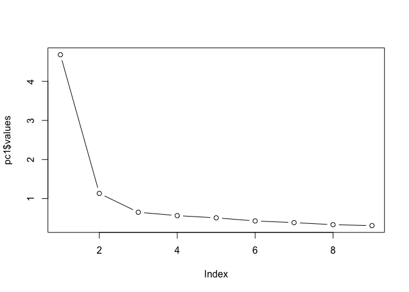

Factor Analysis
================

Installing and loading relevant packages:
=========================================

``` r
# install.packages('psych')

# install.packages('GPArotation')

# install.packages('corpcor')

library(psych)
library(GPArotation)
library(corpcor)
```

Loading Data
============

Let's first reduce the dataset to the variables that we wish to analyze using this method.

``` r
CourseEvaluationData <- read.csv("CourseEvaluationData.csv")
names(CourseEvaluationData)
```

    ##  [1] "facsex"   "facethn"  "facnat"   "facrank"  "employm"  "salary"  
    ##  [7] "yrsteach" "yrsut"    "degree"   "sample"   "remind"   "nstud"   
    ## [13] "studrank" "studsex"  "grade"    "gpa"      "satisfy"  "religion"
    ## [19] "psd"      "item13"   "item14"   "item15"   "item16"   "item17"  
    ## [25] "item18"   "item19"   "item20"   "item21"   "item22"   "item23"  
    ## [31] "item24"   "item26"   "Male"

``` r
ced_likerts_for_analysis <- CourseEvaluationData[, 20:28]
```

Then let's create a correlation matrix
======================================

Which we will need in order to run the determinant function.

``` r
ced_matrix <- cor(ced_likerts_for_analysis)
# make it a little more readable by reducing # of decimal places ced is an
# abbreviatioon of CourseEvaluationData
ced_matrix <- round(ced_matrix, 2)
ced_matrix
```

    ##        item13 item14 item15 item16 item17 item18 item19 item20 item21
    ## item13   1.00   0.66   0.56   0.53   0.52   0.38   0.26   0.31   0.44
    ## item14   0.66   1.00   0.63   0.49   0.53   0.41   0.31   0.31   0.42
    ## item15   0.56   0.63   1.00   0.51   0.57   0.46   0.37   0.35   0.48
    ## item16   0.53   0.49   0.51   1.00   0.57   0.40   0.32   0.33   0.42
    ## item17   0.52   0.53   0.57   0.57   1.00   0.57   0.45   0.39   0.57
    ## item18   0.38   0.41   0.46   0.40   0.57   1.00   0.63   0.46   0.54
    ## item19   0.26   0.31   0.37   0.32   0.45   0.63   1.00   0.41   0.48
    ## item20   0.31   0.31   0.35   0.33   0.39   0.46   0.41   1.00   0.39
    ## item21   0.44   0.42   0.48   0.42   0.57   0.54   0.48   0.39   1.00

1 Interpret:
============

The Kaiser-Meyer-Olkin measure of sampling adequacy, Bartlett’s test of Sphericity, and determinant in this case.
-----------------------------------------------------------------------------------------------------------------

What do these mean?
-------------------

``` r
## Kaiser-Meyer-Olkin
KMO(ced_likerts_for_analysis)
```

    ## Kaiser-Meyer-Olkin factor adequacy
    ## Call: KMO(r = ced_likerts_for_analysis)
    ## Overall MSA =  0.9
    ## MSA for each item = 
    ## item13 item14 item15 item16 item17 item18 item19 item20 item21 
    ##   0.88   0.87   0.92   0.92   0.92   0.88   0.86   0.95   0.93

``` r
## Bartlett's test of Sphericity
cortest.bartlett(ced_likerts_for_analysis)
```

    ## R was not square, finding R from data

    ## $chisq
    ## [1] 5791.492
    ## 
    ## $p.value
    ## [1] 0
    ## 
    ## $df
    ## [1] 36

``` r
## Determinant
det(ced_matrix)
```

    ## [1] 0.01708989

2 How many factors (components) should you choose? Why?
=======================================================

We will be using a varimax rotation.
------------------------------------

``` r
pc1 <- principal(ced_likerts_for_analysis, nfactors = 9, rotate = "varimax")
```

Print the output just by stating the name of the object we created. This will list the relevant information in the console.
---------------------------------------------------------------------------------------------------------------------------

``` r
print.psych(pc1, cut = 0.3, sort = TRUE)
```

    ## Principal Components Analysis
    ## Call: principal(r = ced_likerts_for_analysis, nfactors = 9, rotate = "varimax")
    ## Standardized loadings (pattern matrix) based upon correlation matrix
    ##        item  RC2  RC3  RC4  RC5  RC7  RC9  RC6  RC8  RC1 h2       u2 com
    ## item19    7 0.91                                          1  1.1e-16 1.4
    ## item20    8      0.94                                     1  5.6e-16 1.3
    ## item16    4           0.90                                1 -2.2e-16 1.5
    ## item21    9                0.89                           1  8.9e-16 1.6
    ## item13    1                     0.87                      1 -2.2e-16 1.7
    ## item14    2                          0.86                 1  3.3e-16 1.8
    ## item15    3                               0.86            1  1.1e-16 1.8
    ## item18    6 0.31                               0.85       1 -2.2e-16 1.9
    ## item17    5                                         0.83  1  5.6e-16 2.1
    ## 
    ##                        RC2  RC3  RC4  RC5  RC7  RC9  RC6  RC8  RC1
    ## SS loadings           1.06 1.05 1.05 1.02 1.00 0.99 0.98 0.94 0.91
    ## Proportion Var        0.12 0.12 0.12 0.11 0.11 0.11 0.11 0.10 0.10
    ## Cumulative Var        0.12 0.23 0.35 0.46 0.58 0.69 0.79 0.90 1.00
    ## Proportion Explained  0.12 0.12 0.12 0.11 0.11 0.11 0.11 0.10 0.10
    ## Cumulative Proportion 0.12 0.23 0.35 0.46 0.58 0.69 0.79 0.90 1.00
    ## 
    ## Mean item complexity =  1.7
    ## Test of the hypothesis that 9 components are sufficient.
    ## 
    ## The root mean square of the residuals (RMSR) is  0 
    ##  with the empirical chi square  0  with prob <  NA 
    ## 
    ## Fit based upon off diagonal values = 1

What about our eigenvalues?
---------------------------

``` r
print(pc1$values)
```

    ## [1] 4.6807858 1.1337227 0.6518315 0.5653547 0.5085899 0.4291354 0.3863387
    ## [8] 0.3339377 0.3103035

Plot of eigenvalues
-------------------

``` r
plot(pc1$values, type = "b")
```



Based on your interpretation of your eigenvalues, change the nfactors to the number of factors you wish to specify.
-------------------------------------------------------------------------------------------------------------------

Use a varimax rotation for your chosen number of factors, as demonstrated below.
--------------------------------------------------------------------------------

This is the syntax used to do this:
`pc2 <- principal(ced_likerts_for_analysis, nfactors = INSERT_NUMBER_OF_FACTORS_YOU_WANT_HERE, rotate = "varimax")`

``` r
pc2 <- principal(ced_likerts_for_analysis, nfactors = 3, rotate = "varimax", 
    scores = TRUE)
```

Print our results
-----------------

``` r
print.psych(pc2, cut = 0.4, sort = TRUE)
```

    ## Principal Components Analysis
    ## Call: principal(r = ced_likerts_for_analysis, nfactors = 3, rotate = "varimax", 
    ##     scores = TRUE)
    ## Standardized loadings (pattern matrix) based upon correlation matrix
    ##        item  RC1  RC2  RC3   h2     u2 com
    ## item13    1 0.84           0.73 0.2708 1.1
    ## item14    2 0.82           0.71 0.2853 1.1
    ## item15    3 0.74           0.66 0.3418 1.4
    ## item16    4 0.70           0.57 0.4286 1.3
    ## item17    5 0.61 0.54      0.68 0.3239 2.0
    ## item19    7      0.85      0.76 0.2358 1.1
    ## item18    6      0.79      0.75 0.2528 1.4
    ## item21    9 0.41 0.66      0.61 0.3866 1.7
    ## item20    8           0.93 0.99 0.0082 1.3
    ## 
    ##                        RC1  RC2  RC3
    ## SS loadings           3.08 2.36 1.02
    ## Proportion Var        0.34 0.26 0.11
    ## Cumulative Var        0.34 0.61 0.72
    ## Proportion Explained  0.48 0.37 0.16
    ## Cumulative Proportion 0.48 0.84 1.00
    ## 
    ## Mean item complexity =  1.4
    ## Test of the hypothesis that 3 components are sufficient.
    ## 
    ## The root mean square of the residuals (RMSR) is  0.06 
    ##  with the empirical chi square  414.67  with prob <  3e-81 
    ## 
    ## Fit based upon off diagonal values = 0.98

3 Do the communalities concern you for any of the variables?
============================================================

### Examine h2 in the output above.

4 What percentage of the variance does your factor solution explain?
====================================================================

### Examine second part of output.

5 Did the factors achieve simple structure? (no item cross load at .4 or more)
==============================================================================

### Interpret results.

``` r
print.psych(pc2, cut = 0.4, sort = TRUE)
```

    ## Principal Components Analysis
    ## Call: principal(r = ced_likerts_for_analysis, nfactors = 3, rotate = "varimax", 
    ##     scores = TRUE)
    ## Standardized loadings (pattern matrix) based upon correlation matrix
    ##        item  RC1  RC2  RC3   h2     u2 com
    ## item13    1 0.84           0.73 0.2708 1.1
    ## item14    2 0.82           0.71 0.2853 1.1
    ## item15    3 0.74           0.66 0.3418 1.4
    ## item16    4 0.70           0.57 0.4286 1.3
    ## item17    5 0.61 0.54      0.68 0.3239 2.0
    ## item19    7      0.85      0.76 0.2358 1.1
    ## item18    6      0.79      0.75 0.2528 1.4
    ## item21    9 0.41 0.66      0.61 0.3866 1.7
    ## item20    8           0.93 0.99 0.0082 1.3
    ## 
    ##                        RC1  RC2  RC3
    ## SS loadings           3.08 2.36 1.02
    ## Proportion Var        0.34 0.26 0.11
    ## Cumulative Var        0.34 0.61 0.72
    ## Proportion Explained  0.48 0.37 0.16
    ## Cumulative Proportion 0.48 0.84 1.00
    ## 
    ## Mean item complexity =  1.4
    ## Test of the hypothesis that 3 components are sufficient.
    ## 
    ## The root mean square of the residuals (RMSR) is  0.06 
    ##  with the empirical chi square  414.67  with prob <  3e-81 
    ## 
    ## Fit based upon off diagonal values = 0.98

6 Explain all three factors in plain English. Use the rotated factor solution in this determination. A paragraph will suffice.
==============================================================================================================================

### No R code

7 Do you have any concerns about reverse coding?
================================================

### No R code

8 Perform a reliability analysis (using Cronbach’s Alpha) for your factors that are composed of more than two variables
=======================================================================================================================

``` r
factor1 <- ced_likerts_for_analysis[, c(1, 2, 3, 4, 5)]
factor2 <- ced_likerts_for_analysis[, c(7, 6, 9)]

alpha(factor1)
```

    ## 
    ## Reliability analysis   
    ## Call: alpha(x = factor1)
    ## 
    ##   raw_alpha std.alpha G6(smc) average_r S/N    ase mean   sd median_r
    ##       0.86      0.86    0.84      0.56 6.3 0.0058  4.3 0.67     0.55
    ## 
    ##  lower alpha upper     95% confidence boundaries
    ## 0.85 0.86 0.87 
    ## 
    ##  Reliability if an item is dropped:
    ##        raw_alpha std.alpha G6(smc) average_r S/N alpha se   var.r med.r
    ## item13      0.83      0.83    0.79      0.55 4.9   0.0074 0.00241  0.55
    ## item14      0.83      0.83    0.79      0.55 4.8   0.0075 0.00073  0.55
    ## item15      0.83      0.83    0.80      0.55 4.9   0.0074 0.00355  0.53
    ## item16      0.84      0.85    0.81      0.58 5.5   0.0069 0.00291  0.57
    ## item17      0.83      0.84    0.80      0.56 5.2   0.0072 0.00444  0.55
    ## 
    ##  Item statistics 
    ##           n raw.r std.r r.cor r.drop mean   sd
    ## item13 1428  0.81  0.82  0.76   0.69  4.4 0.82
    ## item14 1428  0.81  0.82  0.77   0.71  4.5 0.75
    ## item15 1428  0.81  0.81  0.75   0.70  4.4 0.78
    ## item16 1428  0.78  0.77  0.69   0.64  4.2 0.90
    ## item17 1428  0.81  0.80  0.72   0.67  4.1 0.93
    ## 
    ## Non missing response frequency for each item
    ##           0    1    2    3    4    5 miss
    ## item13 0.01 0.01 0.02 0.06 0.35 0.56    0
    ## item14 0.00 0.00 0.02 0.06 0.31 0.61    0
    ## item15 0.00 0.01 0.02 0.07 0.35 0.56    0
    ## item16 0.01 0.01 0.04 0.08 0.41 0.45    0
    ## item17 0.00 0.01 0.05 0.13 0.39 0.41    0

``` r
alpha(factor2)
```

    ## 
    ## Reliability analysis   
    ## Call: alpha(x = factor2)
    ## 
    ##   raw_alpha std.alpha G6(smc) average_r S/N    ase mean   sd median_r
    ##       0.79      0.79    0.72      0.55 3.7 0.0098  3.9 0.86     0.54
    ## 
    ##  lower alpha upper     95% confidence boundaries
    ## 0.77 0.79 0.8 
    ## 
    ##  Reliability if an item is dropped:
    ##        raw_alpha std.alpha G6(smc) average_r S/N alpha se var.r med.r
    ## item19      0.70      0.70    0.54      0.54 2.3    0.016    NA  0.54
    ## item18      0.65      0.65    0.48      0.48 1.8    0.019    NA  0.48
    ## item21      0.77      0.77    0.63      0.63 3.4    0.012    NA  0.63
    ## 
    ##  Item statistics 
    ##           n raw.r std.r r.cor r.drop mean  sd
    ## item19 1428  0.84  0.84  0.72   0.63  4.0 1.0
    ## item18 1428  0.87  0.86  0.77   0.68  3.9 1.1
    ## item21 1428  0.80  0.80  0.63   0.56  3.8 1.0
    ## 
    ## Non missing response frequency for each item
    ##           0    1    2    3    4    5 miss
    ## item19 0.01 0.02 0.05 0.14 0.39 0.39    0
    ## item18 0.00 0.03 0.07 0.20 0.36 0.34    0
    ## item21 0.00 0.02 0.09 0.21 0.43 0.24    0

9 Advanced extenstion: regress each of the three factors (three regressions) on whether the professor was Male, salary, and years of experience. What do the results show?
==========================================================================================================================================================================

### Use previous regression instructions from assignment 1.

We need to add our factor scores to our original dataset. We can do this by running the following:
--------------------------------------------------------------------------------------------------

``` r
CourseEvaluationData <- cbind(CourseEvaluationData, pc2$scores)
```

Then we need to clean up some of the data.
------------------------------------------

### We will create a dummy variable for male:

``` r
# Create Dummy Variable for Male:
table(CourseEvaluationData$facsex)
```

    ## 
    ##   1   2 
    ## 849 579

``` r
CourseEvaluationData$male[CourseEvaluationData$facsex == 1] <- 1
CourseEvaluationData$male[CourseEvaluationData$facsex == 2] <- 0
table(CourseEvaluationData$male)
```

    ## 
    ##   0   1 
    ## 579 849

Regression for Factor 1:
------------------------

``` r
factor1_regression <- lm(RC1 ~ salary + yrsteach + male, data = CourseEvaluationData)
summary(factor1_regression)
```

    ## 
    ## Call:
    ## lm(formula = RC1 ~ salary + yrsteach + male, data = CourseEvaluationData)
    ## 
    ## Residuals:
    ##     Min      1Q  Median      3Q     Max 
    ## -6.7350 -0.5602  0.2493  0.6756  2.1633 
    ## 
    ## Coefficients:
    ##              Estimate Std. Error t value Pr(>|t|)  
    ## (Intercept) -0.217145   0.128502  -1.690   0.0913 .
    ## salary       0.003582   0.004313   0.831   0.4064  
    ## yrsteach     0.005556   0.003098   1.793   0.0731 .
    ## male         0.122642   0.054946   2.232   0.0258 *
    ## ---
    ## Signif. codes:  0 '***' 0.001 '**' 0.01 '*' 0.05 '.' 0.1 ' ' 1
    ## 
    ## Residual standard error: 0.9953 on 1424 degrees of freedom
    ## Multiple R-squared:  0.01148,    Adjusted R-squared:  0.009396 
    ## F-statistic: 5.512 on 3 and 1424 DF,  p-value: 0.0009188

Regression for Factor 2:
------------------------

``` r
factor2_regression <- lm(RC2 ~ salary + yrsteach + male, data = CourseEvaluationData)
summary(factor2_regression)
```

    ## 
    ## Call:
    ## lm(formula = RC2 ~ salary + yrsteach + male, data = CourseEvaluationData)
    ## 
    ## Residuals:
    ##     Min      1Q  Median      3Q     Max 
    ## -4.7342 -0.5336  0.1371  0.7672  5.0466 
    ## 
    ## Coefficients:
    ##              Estimate Std. Error t value Pr(>|t|)    
    ## (Intercept)  0.199575   0.128342   1.555   0.1202    
    ## salary      -0.006906   0.004308  -1.603   0.1091    
    ## yrsteach     0.013009   0.003094   4.204 2.78e-05 ***
    ## male        -0.097195   0.054877  -1.771   0.0768 .  
    ## ---
    ## Signif. codes:  0 '***' 0.001 '**' 0.01 '*' 0.05 '.' 0.1 ' ' 1
    ## 
    ## Residual standard error: 0.9941 on 1424 degrees of freedom
    ## Multiple R-squared:  0.01394,    Adjusted R-squared:  0.01186 
    ## F-statistic:  6.71 on 3 and 1424 DF,  p-value: 0.0001702

10 Write up your results in a page or less. Use Andy Field’s examples as a guide.
=================================================================================
