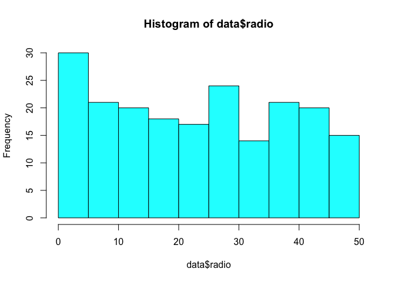
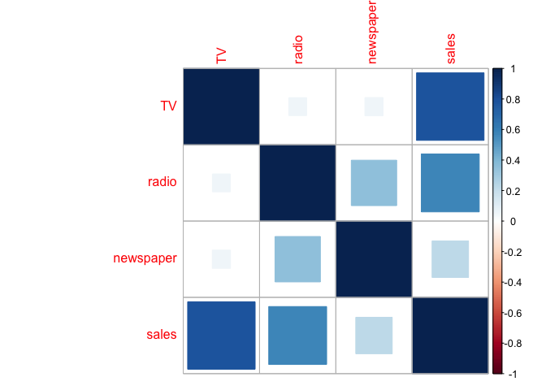
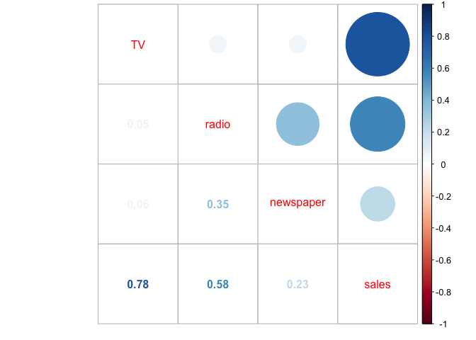

Download R and RStudio
----------------------

1.  Install R first:

<https://cran.cnr.berkeley.edu/>

2.  Then download R Studio:

<https://www.rstudio.com/products/rstudio/download/>

3.  Set your working directory:

<!-- -->

    setwd("~/Dropbox/NSSR/2019 Spring/Advanced Quant - TA")

Practicing with data
--------------------

1.  Install Advertising.csv from
    <http://www-bcf.usc.edu/~gareth/ISL/data.html>

Save it into your working directory.

2.  To load the data:

<!-- -->

    library(readr)

    data <- read_csv("~/Dropbox/NSSR/2019 Spring/Advanced Quant - TA/Labs/lab01/data/Advertising.csv", 
        col_types = cols(X1 = col_skip()))  # this is to remove the first column, since it is redundant. 
    # View(data)

3.  Installing relevant packages:

<!-- -->

    # install.packages('Hmisc', 'psych', 'stats', 'corrplot')
    library(Hmisc)
    library(psych)
    library(stats)
    library(corrplot)

Basic stats and data exploration
--------------------------------

    head(data)  ## Shows first 6 rows  

    summary(data)  ## gives you summary statistics for each column in the table.  
    describe(data)  ## gives summary statistics as well.  

    dim(data)  ## tells you how many rows and how many columns are in the datatable.  

    names(data)  ## Prints the names of each of the columns in the table.  

    sum(is.na(data))  ## to check how many NA values we have in our datatable. 

    cor(data)  ## correlation table of all the variables.
    cor(data$radio, data$sales)  ## correlation between radio and sales
    cor(data$TV, data$sales)  ## correlation between tv and sales

    rcorr(as.matrix(data))  ## correlation table of all the variables, but this also provides info on p-values of the relationships.

    regression <- lm(sales ~ TV + radio + newspaper, data = data)  ## regression.
    summary(regression)  ## regression results. 

You can also create plots, for example:

    plot(data$TV, data$sales)

    hist(data$radio, col = 13)  #col is for color. 

    ## Correlation plots:
    corr_plot = cor(data)
    corrplot(corr_plot, method = "square")  ## with squares representing direction and strength

    corrplot.mixed(corr_plot)  ## with mixed graphics to represent direction and strength

    ## -- Plotting regression -- ##
    attach((data))
    
    ## plots scatterplot
    plot(radio, sales, main="Scatterplot Example",
     xlab="Radio Advertising ", ylab="Sales", pch=19) 

    ## adding regression line:
    abline(lm(sales~radio), col="red") # regression line (y~x) 
