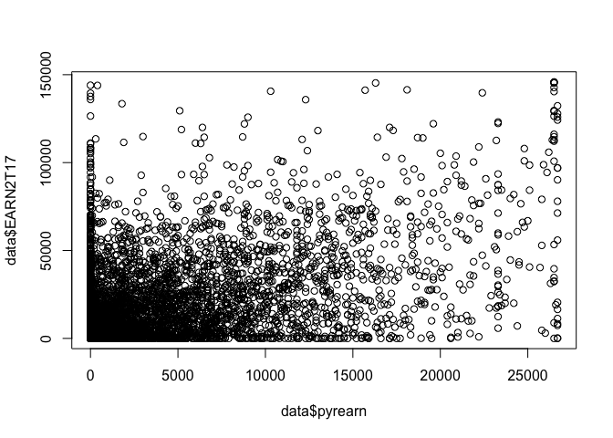
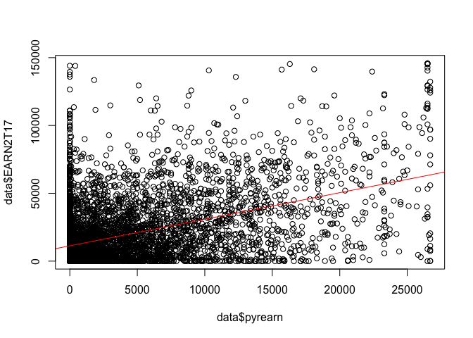
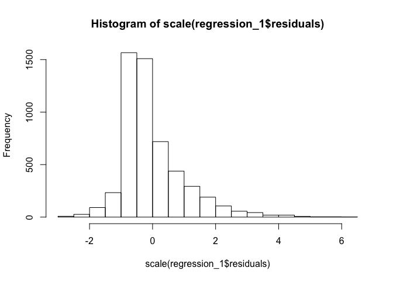
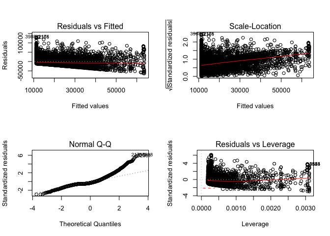
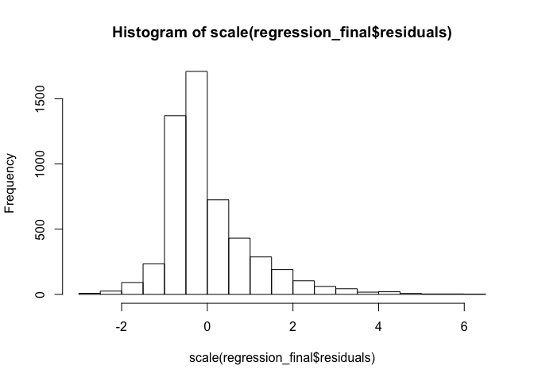
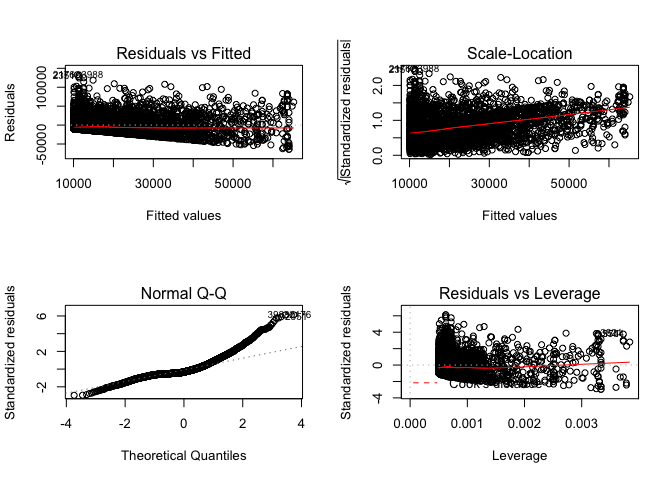
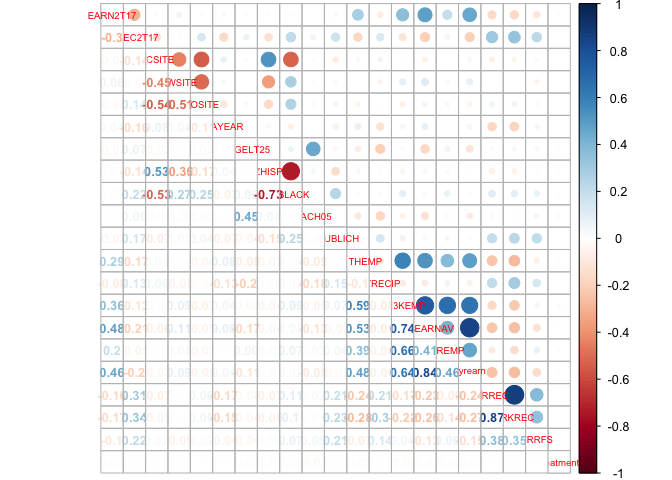
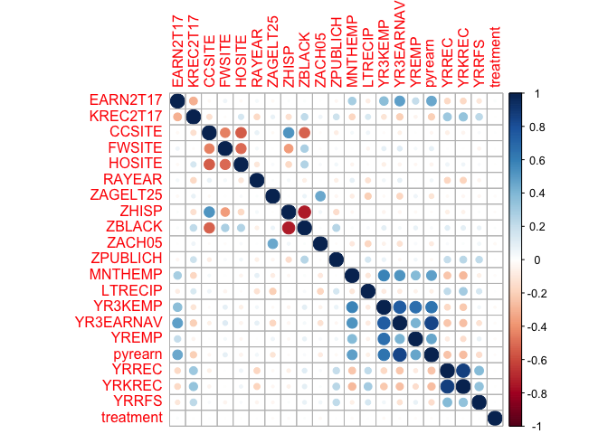
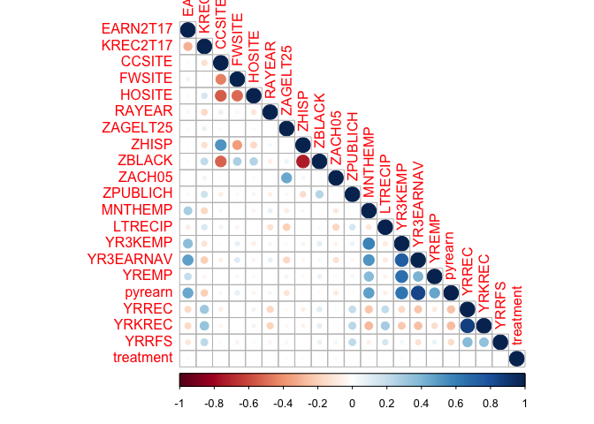

Lab 03 - Regression Assignment
================

Setting the working directory:
------------------------------

The first task when we open RStudio is to set our working directory:

-   As covered in labs, navigate in the files window (bottom right) to your folder for this class.
-   In "More", click "Set as Working Directory".

Loading the Data
----------------

Now let's load in the dataset. You can either open it from your `working directory` (if you've saved it there) or pull it up with the below command. **Change the file path to make sure it matches yours.**

``` r
data <- read.csv(file = "~/Dropbox/NSSR/2019 Spring/Advanced Quant - TA/data/data.csv")
```

If you run into any issues, you can load the dataset into R by clicking on the file itself (in the lower right window pane of RStudio), and then selecting "Import Dataset". Just be sure that you call the dataset, `data`. For a refresher on how to do this, you can find it in the uploaded video recording on Canvas.

Installing and/or loading the relevant packages
-----------------------------------------------

If you have never installed these packages, then please run this chunk first:

``` r
install.packages("car")
install.packages("psych")
install.packages("stats")
install.packages("corrplot")
install.packages("magrittr")
install.packages("dplyr")
```

If you run into issues installing the `car` package, then try this code:

``` r
install.packages("lme4")
packageurl <- "https://cran.r-project.org/src/contrib/Archive/pbkrtest/pbkrtest_0.4-4.tar.gz"
install.packages(packageurl, repos = NULL, type = "source")
install.packages("car")
```

After installing the packages, or if you already have the packages installed, run this chunk below:

``` r
library(car)
library(psych)
library(stats)
library(corrplot)
library(magrittr)
library(dplyr)
options(scipen = 999)
# the options function above allows us to see our numbers (particularly the
# p values) more clearly by removing scientific notation. We need to repeat
# this every time we open R.
```

Cleaning up the data for this assignment
----------------------------------------

As outlined assignment document, we are only going to use a handul of specific variables. To make sure that we only use the variables we care about, we are going to run the code below:

``` r
# Run this AS-IS.

variables <- c("CCSITE", "FWSITE", "HOSITE", "racode", "ZAGELT25", "ZHISP", 
    "ZBLACK", "ZACH05", "ZPUBLICH", "MNTHEMP", "LTRECIP", "YR3KEMP", "YR3EARNAV", 
    "YREMP", "pyrearn", "YRREC", "YRKREC", "YRRFS", "RAYEAR", "EARN2T17", "KREC2T17")

data <- data[, names(data) %in% variables]
```

Creating the `treatment` variable:
----------------------------------

``` r
# Run this AS-IS.

data$treatment <- 0
# Here, we are creating a new column called 'treatment.' And we're giving
# all the rows a value of zero.

data$treatment[data$racode == "P1"] <- 1
# Here, we are now giving a value of 1 to those who were part of the
# program.
```

Let's doublecheck that everything worked out, let's compare the new `treatment` variable with the `racode` variable:

``` r
table(data$treatment)
```

    ## 
    ##    0    1 
    ## 2668 2663

``` r
# you should see 2663 cases with a value of 1

table(data$racode)
```

    ## 
    ##    C   P1 
    ## 2668 2663

``` r
# which is the same as the 2663 cases with the values of P1.
```

STEP 1: no R code to complete this
----------------------------------

STEP 2: no R code to complete this
----------------------------------

STEP 3: no R code to complete this
----------------------------------

STEP 4: Perform basic checks of the candidate variables.
--------------------------------------------------------

Do you have any missing value or out of range data problems? If so, what did you do to resolve them, if anything?

First, let's look at plots to get a feel for the data. In R, we can just use "plot" to create a various plots of two variables.

We have to define those two items. Let's plot our dependent variable, EARN2T17, against some of the independent variables.

``` r
plot(data$pyrearn, data$EARN2T17)
```



It may be hard to actually "see" the trend. So a best fit line may come in handy:

``` r
plot(data$pyrearn, data$EARN2T17)
# adding fit line:
abline(lm(data$EARN2T17 ~ data$pyrearn), col = "red")
```



We can also use the `describe` function to get more information about our dataset. It tells us about missing values, ranges, measures of central tendency, and standard deviation.

``` r
psych::describe(data) 
```

We can see here that all our variables have an n of 5331. That means that we don't have any missing values.

Step 5
------

What did your check of the correlation matrix find? Did you add any variables to the end of you list based on it? Does it look like you need to worry about multicollinearity?

To create a correlation matrix, we can use R's base correlation function:

``` r
View(cor(data[-6]))
# I use '-6' here to exclude the 6th column from the correlation matrix,
# because it was the categorical variable, 'racode'.
```

Notice that we don't get info on the p-values of the correlation statistics. We can amend that by using the function below. It gives us not only our Pearson's Coefficients, but also gives us our p-values too!

First, run this chunk below to get the function installed in the R session:

``` r
# run the function below, as is.

corstars <- function(x) {
    require(Hmisc)
    x <- as.matrix(x)
    R <- rcorr(x)$r
    p <- rcorr(x)$P
    
    ## define notions for significance levels; spacing is important.
    mystars <- ifelse(p < 0.001, "***", ifelse(p < 0.01, "** ", ifelse(p < 0.05, 
        "* ", " ")))
    
    ## trunctuate the matrix that holds the correlations to two decimal
    R <- format(round(cbind(rep(-1.11, ncol(x)), R), 3))[, -1]
    
    ## build a new matrix that includes the correlations with their apropriate
    ## stars
    Rnew <- matrix(paste(R, mystars, sep = ""), ncol = ncol(x))
    diag(Rnew) <- paste(diag(R), " ", sep = "")
    rownames(Rnew) <- colnames(x)
    colnames(Rnew) <- paste(colnames(x), "", sep = "")
    
    ## remove upper triangle
    Rnew <- as.matrix(Rnew)
    Rnew[upper.tri(Rnew, diag = TRUE)] <- ""
    Rnew <- as.data.frame(Rnew)
    
    ## remove last column and return the matrix (which is now a data frame)
    Rnew <- cbind(Rnew[1:length(Rnew) - 1])
    return(Rnew)
}
```

Next, run corstars on your data:

``` r
correlation_table <- corstars(data[, -6])
# I put '-6' here to remove the racode column, since it is a categorical
# variable. Correlations only work with quantitative variables.
```

To see this correlation matrix:

``` r
View(correlation_table)
```

When looking at output generated by corstars, the p-values are represented by the stars.

-   \*\*\* means that the p-value is smaller than 0.001,
-   \*\* means that the p-value is smaller 0.01,
-   -   means that the p-value is smaller than 0.05,

-   and no stars means that the p-value is greater than 0.05.

You can save this table to your working directory with the following code:

``` r
write.csv(correlation_table, file = "Homework 02 - Correlation Matrix.csv")
```

Are there any noteworthy correlations that might help you build your model?

Which variables have the strongest relationships with EARN2T17?

Would these variables be good to include in a regression analysis?

STEP 6: no R code to complete this
----------------------------------

STEP 7: REGRESSION!
-------------------

Add your first independent variable. Show your bivariate / unadjusted model. Did it accord with your expectations?

Now we'll see a new command, `"lm"`. This will fit a simple regression model to the data.

The format for this code is `lm(y~x, data)` where y is the response (dependent variable), x is the predictor (independent variable), and the data is "data".

Give it a try with your first variable, but **YOU MUST CHANGE** the variable name where I have \[your first variable\]:

`regression_1 <- lm(EARN2T17 ~ [your first variable], data = data)`

This is what it would look like if "pyrearn" was your first variable

``` r
regression_1 <- lm(EARN2T17 ~ pyrearn, data = data)
```

Let's review the summary of this regression:

``` r
summary(regression_1)
```

This tells us the results of our regression. Is it in line with your expectations?

STEP 8: Check for regression violations for this bivariate mode.
----------------------------------------------------------------

Did you find any major violations?

To analyze residuals and test assumptions, we can explore some graphs. We'll start with a histogram of the residuals.

``` r
hist(scale(regression_1$residuals))
```



``` r
# Let's tell R to layout our graphs in a matrix so we can easily view 4
# graphs at once.  The plot() function graphs 4 helpful plots for us.

layout(matrix(c(1, 2, 3, 4), 2, 2))
plot(regression_1)
```



Clear your plot display to reset the layout when you're done with this step by running the code below:

``` r
dev.off()
```

What if we want standardized coefficients?

R is a little difficult in that it doesn't give them as part of the standard output.

By using `scale` in our `lm` function, we can standardize the unit of analysis to compare coefficients. Input your first variable:

`lm(scale(EARN2T17) ~ scale([your first variable]), data = data)`

Mine will look like this:

``` r
summary(lm(scale(EARN2T17) ~ scale(pyrearn), data = data))
```

    ## 
    ## Call:
    ## lm(formula = scale(EARN2T17) ~ scale(pyrearn), data = data)
    ## 
    ## Residuals:
    ##     Min      1Q  Median      3Q     Max 
    ## -2.6033 -0.4623 -0.2856  0.3193  5.4314 
    ## 
    ## Coefficients:
    ##                              Estimate             Std. Error t value
    ## (Intercept)    -0.0000000000000002009  0.0121734466544678854    0.00
    ## scale(pyrearn)  0.4584019910727006319  0.0121745885752671135   37.65
    ##                           Pr(>|t|)    
    ## (Intercept)                      1    
    ## scale(pyrearn) <0.0000000000000002 ***
    ## ---
    ## Signif. codes:  0 '***' 0.001 '**' 0.01 '*' 0.05 '.' 0.1 ' ' 1
    ## 
    ## Residual standard error: 0.8888 on 5329 degrees of freedom
    ## Multiple R-squared:  0.2101, Adjusted R-squared:   0.21 
    ## F-statistic:  1418 on 1 and 5329 DF,  p-value: < 0.00000000000000022

How can the standardized coefficient be interpreted?

How about standardized residuals?

We'll start by viewing all residuals.

R has a function `names()`, which we can use to learn more about what information is available. It gives us the column names in our regression\_1 model.

``` r
names(regression_1)
```

    ##  [1] "coefficients"  "residuals"     "effects"       "rank"         
    ##  [5] "fitted.values" "assign"        "qr"            "df.residual"  
    ##  [9] "xlevels"       "call"          "terms"         "model"

You can see that we have access to the coefficients and residuals of this regression.

This can be an easy way to look only at the relevant data.

``` r
coefficients(regression_1)
```

    ##  (Intercept)      pyrearn 
    ## 11295.091616     1.959206

``` r
# we can also run this:
regression_1$coefficients
```

    ##  (Intercept)      pyrearn 
    ## 11295.091616     1.959206

Next, we'll create a component of our regression to store our standardized residuals. We'll use the standardized residuals to determine if any have an absolute value greater than 2.

``` r
regression_1$standardized.residuals <- rstandard(regression_1)
regression_1$large_residual <- regression_1$standardized.residuals > 2 | regression_1$standardized.residuals < 
    -2
sum(regression_1$large_residual)
```

    ## [1] 292

What is your interpretation of the results?

Let's calculate the Durban-Watson statistic. How do you interpret your result?

``` r
dwt(regression_1)
```

    ##  lag Autocorrelation D-W Statistic p-value
    ##    1     -0.01885221      2.037311   0.176
    ##  Alternative hypothesis: rho != 0

STEP 9
------

Sequentially build up the model adding variables in the order you specified (don't check regression assumptions at each stage)

To build variables into your model, continue to use the `lm()` function, and add the variable on the end of the formual to the right of the "~".

You should update the name of the model so you can save each iteration in R. The form is below.

Don't forget to replace with your variables in the order that you defined.

``` r
regression_2 <- lm(EARN2T17 ~ YOUR_VARIABLE_1 + YOUR_VARIABLE_2, data = data)
summary(regression_2)

regression_3 <- lm(EARN2T17 ~ YOUR_VARIABLE_1 + YOUR_VARIABLE_2 + YOUR_VARIABLE_3, 
    data = data)
summary(regression_3)

regression_4 <- lm(EARN2T17 ~ YOUR_VARIABLE_1 + YOUR_VARIABLE_2 + YOUR_VARIABLE_3 + 
    YOUR_VARIABLE_4, data = data)
summary(regression_4)

regression_5 <- lm(EARN2T17 ~ YOUR_VARIABLE_1 + YOUR_VARIABLE_2 + YOUR_VARIABLE_3 + 
    YOUR_VARIABLE_4 + YOUR_VARIABLE_5, data = data)
summary(regression_5)

regression_final <- lm(EARN2T17 ~ YOUR_VARIABLE_1 + YOUR_VARIABLE_2 + YOUR_VARIABLE_3 + 
    YOUR_VARIABLE_4 + YOUR_VARIABLE_5 + YOUR_VARIABLE_6, data = data)

summary(regression_final)
```

As an example, this is the form:

``` r
regression_final <- lm(EARN2T17 ~ pyrearn + treatment + ZAGELT25, data = data)
summary(regression_final)
```

    ## 
    ## Call:
    ## lm(formula = EARN2T17 ~ pyrearn + treatment + ZAGELT25, data = data)
    ## 
    ## Residuals:
    ##    Min     1Q Median     3Q    Max 
    ## -64009 -11443  -7049   7841 132962 
    ## 
    ## Coefficients:
    ##                Estimate  Std. Error t value            Pr(>|t|)    
    ## (Intercept) 10149.18880   550.22301  18.446 <0.0000000000000002 ***
    ## pyrearn         1.97212     0.05235  37.674 <0.0000000000000002 ***
    ## treatment    1204.24454   594.68627   2.025              0.0429 *  
    ## ZAGELT25     1199.38158   608.63372   1.971              0.0488 *  
    ## ---
    ## Signif. codes:  0 '***' 0.001 '**' 0.01 '*' 0.05 '.' 0.1 ' ' 1
    ## 
    ## Residual standard error: 21700 on 5327 degrees of freedom
    ## Multiple R-squared:  0.2113, Adjusted R-squared:  0.2108 
    ## F-statistic: 475.7 on 3 and 5327 DF,  p-value: < 0.00000000000000022

STEP 10A: Recheck model assumptions
-----------------------------------

Once we have our final model, let's check assumptions through residual analysis as we did earlier.

``` r
hist(scale(regression_final$residuals))
```



``` r
# View all plots at once

layout(matrix(c(1, 2, 3, 4), 2, 2))
plot(regression_final)
```



Don't forget to clear your plot display to reset the layout.

``` r
dev.off()
```

    ## null device 
    ##           1

Standardized residual analysis (how many residuals are more than two deviations away)

``` r
regression_final$standardized.residuals <- rstandard(regression_final)
regression_final$large_residual <- regression_final$standardized.residuals > 
    2 | regression_final$standardized.residuals < -2
sum(regression_final$large_residual)
```

    ## [1] 293

To calculate the standardized coefficients as we did prior, run the chunk below but write down your independent variables in the same way you did for the final regression model:

``` r
summary(lm(scale(EARN2T17) ~ scale(YOUR_VARIABLE_1) + scale(YOUR_VARIABLE_2) + 
    scale(YOUR_VARIABLE_3) + scale(YOUR_VARIABLE_4) + scale(YOUR_VARIABLE_5) + 
    scale(YOUR_VARIABLE_6), data = data))
```

Mine will look like this:

``` r
summary(lm(scale(EARN2T17) ~ scale(pyrearn) + scale(treatment) + scale(ZAGELT25), 
    data = data))
```

    ## 
    ## Call:
    ## lm(formula = scale(EARN2T17) ~ scale(pyrearn) + scale(treatment) + 
    ##     scale(ZAGELT25), data = data)
    ## 
    ## Residuals:
    ##     Min      1Q  Median      3Q     Max 
    ## -2.6198 -0.4683 -0.2885  0.3209  5.4419 
    ## 
    ## Coefficients:
    ##                                Estimate             Std. Error t value
    ## (Intercept)      -0.0000000000000002249  0.0121667837234125352   0.000
    ## scale(pyrearn)    0.4614234617025630980  0.0122478495034654047  37.674
    ## scale(treatment)  0.0246460935875305702  0.0121708615603055310   2.025
    ## scale(ZAGELT25)   0.0241376727796440149  0.0122488138107546430   1.971
    ##                             Pr(>|t|)    
    ## (Intercept)                   1.0000    
    ## scale(pyrearn)   <0.0000000000000002 ***
    ## scale(treatment)              0.0429 *  
    ## scale(ZAGELT25)               0.0488 *  
    ## ---
    ## Signif. codes:  0 '***' 0.001 '**' 0.01 '*' 0.05 '.' 0.1 ' ' 1
    ## 
    ## Residual standard error: 0.8883 on 5327 degrees of freedom
    ## Multiple R-squared:  0.2113, Adjusted R-squared:  0.2108 
    ## F-statistic: 475.7 on 3 and 5327 DF,  p-value: < 0.00000000000000022

You may have more (or fewer) variables in your model in comparison to my examples and that is okay.
Just make sure all your variables in your final model are in standardized coefficients.

Now that we have multiple terms in the model, lets include the multicollinearity test as well as Durbin-Watson.

``` r
vif(regression_final)  # to check for multicollinearity
```

    ##   pyrearn treatment  ZAGELT25 
    ##  1.013180  1.000483  1.013340

``` r
dwt(regression_final)  # to check for autocorrelation
```

    ##  lag Autocorrelation D-W Statistic p-value
    ##    1      -0.0194276      2.038498    0.16
    ##  Alternative hypothesis: rho != 0

Step 10B: Rerun SAME model with KREC2T17 as outcome variable
------------------------------------------------------------

Using the same variables in your final regression model, replace the dependent variable, `EARN2T17`, with a new dependent variable, `KREC2T17`. But remember to keep the same independent variables you used.

Mine will look something like this:

``` r
regression_final_2 <- lm(KREC2T17 ~ pyrearn + treatment + ZAGELT25, data = data)
summary(regression_final_2)
```

    ## 
    ## Call:
    ## lm(formula = KREC2T17 ~ pyrearn + treatment + ZAGELT25, data = data)
    ## 
    ## Residuals:
    ##     Min      1Q  Median      3Q     Max 
    ## -16.095  -9.095  -3.249   6.739  42.263 
    ## 
    ## Coefficients:
    ##                Estimate  Std. Error t value             Pr(>|t|)    
    ## (Intercept) 14.85794249  0.30499848  48.715 < 0.0000000000000002 ***
    ## pyrearn     -0.00042032  0.00002902 -14.485 < 0.0000000000000002 ***
    ## treatment   -0.16224257  0.32964527  -0.492             0.622617    
    ## ZAGELT25     1.23748027  0.33737659   3.668             0.000247 ***
    ## ---
    ## Signif. codes:  0 '***' 0.001 '**' 0.01 '*' 0.05 '.' 0.1 ' ' 1
    ## 
    ## Residual standard error: 12.03 on 5327 degrees of freedom
    ## Multiple R-squared:  0.04286,    Adjusted R-squared:  0.04232 
    ## F-statistic: 79.52 on 3 and 5327 DF,  p-value: < 0.00000000000000022

Discuss these results in your report and/or technical appendix. Don't forget to include an advanced extension, in a different file.

Advanced Extensions (please try at least one of these)
======================================================

The below code are options for extension on the existing lab. These are outlined in the assignment.
These can only be completed once you have finished the intial assignment in R.

1. Visualization Extensions
---------------------------

Let's visualize the correlation table like we did in Lab 2.

``` r
corrmatrix <- cor(data[, -6], use = "complete.obs")

corrplot.mixed(corrmatrix, number.cex = 0.8, tl.cex = 0.6)
```



``` r
# number.cex changes the size of the number fonts. tl.cex changes the size
# of the labels
```

There are more iterations of this same graph as well. Is any version particularly clear to you?

``` r
corrplot(corrmatrix, method = "circle")
```



``` r
corrplot(corrmatrix, type = "lower")
```



What if we want to format our regression results? We will need to install some new packages.

Do this one by one to ensure they download completely before installing the next package:

``` r
install.packages("stargazer")
install.packages("lmtest")
install.packages("sjPlot")
```

Then load the packages:

``` r
library(stargazer)
library(lmtest)
library(sjPlot)
```

Stargazer will print two regression outputs results side by side in the console:

``` r
stargazer(regression_1, regression_final, title = "Regression Results", dep.var.labels = c("Academic Performance"), 
    type = "text")
```

    ## 
    ## Regression Results
    ## =========================================================================
    ##                                      Dependent variable:                 
    ##                     -----------------------------------------------------
    ##                                     Academic Performance                 
    ##                                 (1)                        (2)           
    ## -------------------------------------------------------------------------
    ## pyrearn                      1.959***                   1.972***         
    ##                               (0.052)                    (0.052)         
    ##                                                                          
    ## treatment                                              1,204.245**       
    ##                                                         (594.686)        
    ##                                                                          
    ## ZAGELT25                                               1,199.382**       
    ##                                                         (608.634)        
    ##                                                                          
    ## Constant                   11,295.090***              10,149.190***      
    ##                              (367.714)                  (550.223)        
    ##                                                                          
    ## -------------------------------------------------------------------------
    ## Observations                   5,331                      5,331          
    ## R2                             0.210                      0.211          
    ## Adjusted R2                    0.210                      0.211          
    ## Residual Std. Error   21,716.760 (df = 5329)     21,704.870 (df = 5327)  
    ## F Statistic         1,417.700*** (df = 1; 5329) 475.697*** (df = 3; 5327)
    ## =========================================================================
    ## Note:                                         *p<0.1; **p<0.05; ***p<0.01

sjPlot will format our regression details in a table including updated language for the variables, headers, and other customizable options. These will appear in the "viewer" tab.

To start, this is the first regression model (first model that only has one independent variable) output using `sjPlot`'s `tab_model` function.

``` r
tab_model(regression_1, show.est = TRUE, show.stat = TRUE, pred.labels = c("Intercept", 
    "Earnings in year prior to application"), dv.labels = "Total Earnings After Application", 
    string.pred = "Coeffcient", string.ci = "Conf. Int", string.p = "P-Value")
```

<table style="border-collapse:collapse; border:none;">
<tr>
<th style="border-top: double; text-align:center; font-style:normal; font-weight:bold; padding:0.2cm;  text-align:left; ">
 
</th>
<th colspan="4" style="border-top: double; text-align:center; font-style:normal; font-weight:bold; padding:0.2cm; ">
Total Earnings After Application
</th>
</tr>
<tr>
<td style=" text-align:center; border-bottom:1px solid; font-style:italic; font-weight:normal;  text-align:left; ">
Coeffcient
</td>
<td style=" text-align:center; border-bottom:1px solid; font-style:italic; font-weight:normal;  ">
Estimates
</td>
<td style=" text-align:center; border-bottom:1px solid; font-style:italic; font-weight:normal;  ">
Conf. Int
</td>
<td style=" text-align:center; border-bottom:1px solid; font-style:italic; font-weight:normal;  ">
Statistic
</td>
<td style=" text-align:center; border-bottom:1px solid; font-style:italic; font-weight:normal;  ">
P-Value
</td>
</tr>
<tr>
<td style=" padding:0.2cm; text-align:left; vertical-align:top; text-align:left; ">
Intercept
</td>
<td style=" padding:0.2cm; text-align:left; vertical-align:top; text-align:center;  ">
11295.09
</td>
<td style=" padding:0.2cm; text-align:left; vertical-align:top; text-align:center;  ">
10574.39 – 12015.80
</td>
<td style=" padding:0.2cm; text-align:left; vertical-align:top; text-align:center;  ">
30.72
</td>
<td style=" padding:0.2cm; text-align:left; vertical-align:top; text-align:center;  ">
<strong>&lt;0.001
</td>
</tr>
<tr>
<td style=" padding:0.2cm; text-align:left; vertical-align:top; text-align:left; ">
Earnings in year prior to application
</td>
<td style=" padding:0.2cm; text-align:left; vertical-align:top; text-align:center;  ">
1.96
</td>
<td style=" padding:0.2cm; text-align:left; vertical-align:top; text-align:center;  ">
1.86 – 2.06
</td>
<td style=" padding:0.2cm; text-align:left; vertical-align:top; text-align:center;  ">
37.65
</td>
<td style=" padding:0.2cm; text-align:left; vertical-align:top; text-align:center;  ">
<strong>&lt;0.001
</td>
</tr>
<tr>
<td style=" padding:0.2cm; text-align:left; vertical-align:top; text-align:left; padding-top:0.1cm; padding-bottom:0.1cm; border-top:1px solid;">
Observations
</td>
<td style=" padding:0.2cm; text-align:left; vertical-align:top; padding-top:0.1cm; padding-bottom:0.1cm; text-align:left; border-top:1px solid;" colspan="4">
5331
</td>
</tr>
<tr>
<td style=" padding:0.2cm; text-align:left; vertical-align:top; text-align:left; padding-top:0.1cm; padding-bottom:0.1cm;">
R<sup>2</sup> / adjusted R<sup>2</sup>
</td>
<td style=" padding:0.2cm; text-align:left; vertical-align:top; padding-top:0.1cm; padding-bottom:0.1cm; text-align:left;" colspan="4">
0.210 / 0.210
</td>
</tr>
</table>
This is the same as above, but for the final regression model output using the `tab_model` function. Change the `pred.labels` as you see fit, so that they are relevant to your model.

``` r
tab_model(regression_final, show.est = TRUE, show.stat = TRUE, pred.labels = c("Intercept", 
    "Earnings in year prior to application", "In program?", "Under 25 yrs old when applied for welfare?"), 
    dv.labels = "Total Earnings After Application", string.pred = "Coeffcient", 
    string.ci = "Conf. Int", string.p = "P-Value")
```

<table style="border-collapse:collapse; border:none;">
<tr>
<th style="border-top: double; text-align:center; font-style:normal; font-weight:bold; padding:0.2cm;  text-align:left; ">
 
</th>
<th colspan="4" style="border-top: double; text-align:center; font-style:normal; font-weight:bold; padding:0.2cm; ">
Total Earnings After Application
</th>
</tr>
<tr>
<td style=" text-align:center; border-bottom:1px solid; font-style:italic; font-weight:normal;  text-align:left; ">
Coeffcient
</td>
<td style=" text-align:center; border-bottom:1px solid; font-style:italic; font-weight:normal;  ">
Estimates
</td>
<td style=" text-align:center; border-bottom:1px solid; font-style:italic; font-weight:normal;  ">
Conf. Int
</td>
<td style=" text-align:center; border-bottom:1px solid; font-style:italic; font-weight:normal;  ">
Statistic
</td>
<td style=" text-align:center; border-bottom:1px solid; font-style:italic; font-weight:normal;  ">
P-Value
</td>
</tr>
<tr>
<td style=" padding:0.2cm; text-align:left; vertical-align:top; text-align:left; ">
Intercept
</td>
<td style=" padding:0.2cm; text-align:left; vertical-align:top; text-align:center;  ">
10149.19
</td>
<td style=" padding:0.2cm; text-align:left; vertical-align:top; text-align:center;  ">
9070.77 – 11227.61
</td>
<td style=" padding:0.2cm; text-align:left; vertical-align:top; text-align:center;  ">
18.45
</td>
<td style=" padding:0.2cm; text-align:left; vertical-align:top; text-align:center;  ">
<strong>&lt;0.001
</td>
</tr>
<tr>
<td style=" padding:0.2cm; text-align:left; vertical-align:top; text-align:left; ">
Earnings in year prior to application
</td>
<td style=" padding:0.2cm; text-align:left; vertical-align:top; text-align:center;  ">
1.97
</td>
<td style=" padding:0.2cm; text-align:left; vertical-align:top; text-align:center;  ">
1.87 – 2.07
</td>
<td style=" padding:0.2cm; text-align:left; vertical-align:top; text-align:center;  ">
37.67
</td>
<td style=" padding:0.2cm; text-align:left; vertical-align:top; text-align:center;  ">
<strong>&lt;0.001
</td>
</tr>
<tr>
<td style=" padding:0.2cm; text-align:left; vertical-align:top; text-align:left; ">
In program?
</td>
<td style=" padding:0.2cm; text-align:left; vertical-align:top; text-align:center;  ">
1204.24
</td>
<td style=" padding:0.2cm; text-align:left; vertical-align:top; text-align:center;  ">
38.68 – 2369.81
</td>
<td style=" padding:0.2cm; text-align:left; vertical-align:top; text-align:center;  ">
2.03
</td>
<td style=" padding:0.2cm; text-align:left; vertical-align:top; text-align:center;  ">
<strong>0.043</strong>
</td>
</tr>
<tr>
<td style=" padding:0.2cm; text-align:left; vertical-align:top; text-align:left; ">
Under 25 yrs old when applied for welfare?
</td>
<td style=" padding:0.2cm; text-align:left; vertical-align:top; text-align:center;  ">
1199.38
</td>
<td style=" padding:0.2cm; text-align:left; vertical-align:top; text-align:center;  ">
6.48 – 2392.28
</td>
<td style=" padding:0.2cm; text-align:left; vertical-align:top; text-align:center;  ">
1.97
</td>
<td style=" padding:0.2cm; text-align:left; vertical-align:top; text-align:center;  ">
<strong>0.049</strong>
</td>
</tr>
<tr>
<td style=" padding:0.2cm; text-align:left; vertical-align:top; text-align:left; padding-top:0.1cm; padding-bottom:0.1cm; border-top:1px solid;">
Observations
</td>
<td style=" padding:0.2cm; text-align:left; vertical-align:top; padding-top:0.1cm; padding-bottom:0.1cm; text-align:left; border-top:1px solid;" colspan="4">
5331
</td>
</tr>
<tr>
<td style=" padding:0.2cm; text-align:left; vertical-align:top; text-align:left; padding-top:0.1cm; padding-bottom:0.1cm;">
R<sup>2</sup> / adjusted R<sup>2</sup>
</td>
<td style=" padding:0.2cm; text-align:left; vertical-align:top; padding-top:0.1cm; padding-bottom:0.1cm; text-align:left;" colspan="4">
0.211 / 0.211
</td>
</tr>
</table>
We can also use sjPlot's `tab_model` to compare two regression models, again, change the pred.labels as you see fit:

``` r
tab_model(regression_1, regression_final, show.est = TRUE, show.se = TRUE, show.stat = TRUE, 
    pred.labels = c("Intercept", "Earnings in year prior to application", "In program?", 
        "Under 25 yrs old when applied for welfare?"), dv.labels = c("First Regression Model", 
        "Final regression Model"), string.pred = "Coeffcient", string.ci = "Conf. Int", 
    string.p = "P-Value")
```

<table style="border-collapse:collapse; border:none;">
<tr>
<th style="border-top: double; text-align:center; font-style:normal; font-weight:bold; padding:0.2cm;  text-align:left; ">
 
</th>
<th colspan="5" style="border-top: double; text-align:center; font-style:normal; font-weight:bold; padding:0.2cm; ">
First Regression Model
</th>
<th colspan="5" style="border-top: double; text-align:center; font-style:normal; font-weight:bold; padding:0.2cm; ">
Final regression Model
</th>
</tr>
<tr>
<td style=" text-align:center; border-bottom:1px solid; font-style:italic; font-weight:normal;  text-align:left; ">
Coeffcient
</td>
<td style=" text-align:center; border-bottom:1px solid; font-style:italic; font-weight:normal;  ">
Estimates
</td>
<td style=" text-align:center; border-bottom:1px solid; font-style:italic; font-weight:normal;  ">
std. Error
</td>
<td style=" text-align:center; border-bottom:1px solid; font-style:italic; font-weight:normal;  ">
Conf. Int
</td>
<td style=" text-align:center; border-bottom:1px solid; font-style:italic; font-weight:normal;  ">
Statistic
</td>
<td style=" text-align:center; border-bottom:1px solid; font-style:italic; font-weight:normal;  ">
P-Value
</td>
<td style=" text-align:center; border-bottom:1px solid; font-style:italic; font-weight:normal;  col7">
Estimates
</td>
<td style=" text-align:center; border-bottom:1px solid; font-style:italic; font-weight:normal;  col8">
std. Error
</td>
<td style=" text-align:center; border-bottom:1px solid; font-style:italic; font-weight:normal;  col9">
Conf. Int
</td>
<td style=" text-align:center; border-bottom:1px solid; font-style:italic; font-weight:normal;  0">
Statistic
</td>
<td style=" text-align:center; border-bottom:1px solid; font-style:italic; font-weight:normal;  1">
P-Value
</td>
</tr>
<tr>
<td style=" padding:0.2cm; text-align:left; vertical-align:top; text-align:left; ">
Intercept
</td>
<td style=" padding:0.2cm; text-align:left; vertical-align:top; text-align:center;  ">
11295.09
</td>
<td style=" padding:0.2cm; text-align:left; vertical-align:top; text-align:center;  ">
367.71
</td>
<td style=" padding:0.2cm; text-align:left; vertical-align:top; text-align:center;  ">
10574.39 – 12015.80
</td>
<td style=" padding:0.2cm; text-align:left; vertical-align:top; text-align:center;  ">
30.72
</td>
<td style=" padding:0.2cm; text-align:left; vertical-align:top; text-align:center;  ">
<strong>&lt;0.001
</td>
<td style=" padding:0.2cm; text-align:left; vertical-align:top; text-align:center;  col7">
10149.19
</td>
<td style=" padding:0.2cm; text-align:left; vertical-align:top; text-align:center;  col8">
550.22
</td>
<td style=" padding:0.2cm; text-align:left; vertical-align:top; text-align:center;  col9">
9070.77 – 11227.61
</td>
<td style=" padding:0.2cm; text-align:left; vertical-align:top; text-align:center;  0">
18.45
</td>
<td style=" padding:0.2cm; text-align:left; vertical-align:top; text-align:center;  1">
<strong>&lt;0.001
</td>
</tr>
<tr>
<td style=" padding:0.2cm; text-align:left; vertical-align:top; text-align:left; ">
Earnings in year prior to application
</td>
<td style=" padding:0.2cm; text-align:left; vertical-align:top; text-align:center;  ">
1.96
</td>
<td style=" padding:0.2cm; text-align:left; vertical-align:top; text-align:center;  ">
0.05
</td>
<td style=" padding:0.2cm; text-align:left; vertical-align:top; text-align:center;  ">
1.86 – 2.06
</td>
<td style=" padding:0.2cm; text-align:left; vertical-align:top; text-align:center;  ">
37.65
</td>
<td style=" padding:0.2cm; text-align:left; vertical-align:top; text-align:center;  ">
<strong>&lt;0.001
</td>
<td style=" padding:0.2cm; text-align:left; vertical-align:top; text-align:center;  col7">
1.97
</td>
<td style=" padding:0.2cm; text-align:left; vertical-align:top; text-align:center;  col8">
0.05
</td>
<td style=" padding:0.2cm; text-align:left; vertical-align:top; text-align:center;  col9">
1.87 – 2.07
</td>
<td style=" padding:0.2cm; text-align:left; vertical-align:top; text-align:center;  0">
37.67
</td>
<td style=" padding:0.2cm; text-align:left; vertical-align:top; text-align:center;  1">
<strong>&lt;0.001
</td>
</tr>
<tr>
<td style=" padding:0.2cm; text-align:left; vertical-align:top; text-align:left; ">
In program?
</td>
<td style=" padding:0.2cm; text-align:left; vertical-align:top; text-align:center;  ">
</td>
<td style=" padding:0.2cm; text-align:left; vertical-align:top; text-align:center;  ">
</td>
<td style=" padding:0.2cm; text-align:left; vertical-align:top; text-align:center;  ">
</td>
<td style=" padding:0.2cm; text-align:left; vertical-align:top; text-align:center;  ">
</td>
<td style=" padding:0.2cm; text-align:left; vertical-align:top; text-align:center;  ">
</td>
<td style=" padding:0.2cm; text-align:left; vertical-align:top; text-align:center;  col7">
1204.24
</td>
<td style=" padding:0.2cm; text-align:left; vertical-align:top; text-align:center;  col8">
594.69
</td>
<td style=" padding:0.2cm; text-align:left; vertical-align:top; text-align:center;  col9">
38.68 – 2369.81
</td>
<td style=" padding:0.2cm; text-align:left; vertical-align:top; text-align:center;  0">
2.03
</td>
<td style=" padding:0.2cm; text-align:left; vertical-align:top; text-align:center;  1">
<strong>0.043</strong>
</td>
</tr>
<tr>
<td style=" padding:0.2cm; text-align:left; vertical-align:top; text-align:left; ">
Under 25 yrs old when applied for welfare?
</td>
<td style=" padding:0.2cm; text-align:left; vertical-align:top; text-align:center;  ">
</td>
<td style=" padding:0.2cm; text-align:left; vertical-align:top; text-align:center;  ">
</td>
<td style=" padding:0.2cm; text-align:left; vertical-align:top; text-align:center;  ">
</td>
<td style=" padding:0.2cm; text-align:left; vertical-align:top; text-align:center;  ">
</td>
<td style=" padding:0.2cm; text-align:left; vertical-align:top; text-align:center;  ">
</td>
<td style=" padding:0.2cm; text-align:left; vertical-align:top; text-align:center;  col7">
1199.38
</td>
<td style=" padding:0.2cm; text-align:left; vertical-align:top; text-align:center;  col8">
608.63
</td>
<td style=" padding:0.2cm; text-align:left; vertical-align:top; text-align:center;  col9">
6.48 – 2392.28
</td>
<td style=" padding:0.2cm; text-align:left; vertical-align:top; text-align:center;  0">
1.97
</td>
<td style=" padding:0.2cm; text-align:left; vertical-align:top; text-align:center;  1">
<strong>0.049</strong>
</td>
</tr>
<tr>
<td style=" padding:0.2cm; text-align:left; vertical-align:top; text-align:left; padding-top:0.1cm; padding-bottom:0.1cm; border-top:1px solid;">
Observations
</td>
<td style=" padding:0.2cm; text-align:left; vertical-align:top; padding-top:0.1cm; padding-bottom:0.1cm; text-align:left; border-top:1px solid;" colspan="5">
5331
</td>
<td style=" padding:0.2cm; text-align:left; vertical-align:top; padding-top:0.1cm; padding-bottom:0.1cm; text-align:left; border-top:1px solid;" colspan="5">
5331
</td>
</tr>
<tr>
<td style=" padding:0.2cm; text-align:left; vertical-align:top; text-align:left; padding-top:0.1cm; padding-bottom:0.1cm;">
R<sup>2</sup> / adjusted R<sup>2</sup>
</td>
<td style=" padding:0.2cm; text-align:left; vertical-align:top; padding-top:0.1cm; padding-bottom:0.1cm; text-align:left;" colspan="5">
0.210 / 0.210
</td>
<td style=" padding:0.2cm; text-align:left; vertical-align:top; padding-top:0.1cm; padding-bottom:0.1cm; text-align:left;" colspan="5">
0.211 / 0.211
</td>
</tr>
</table>
2. Additional Diagnostics
-------------------------

A quick and effective test to compare two models is the analysis of variance function. Give it a try with two of your regression fits to help you find the best regression model:

``` r
anova(regression_1, regression_final)
```

    ## Analysis of Variance Table
    ## 
    ## Model 1: EARN2T17 ~ pyrearn
    ## Model 2: EARN2T17 ~ pyrearn + treatment + ZAGELT25
    ##   Res.Df           RSS Df  Sum of Sq      F  Pr(>F)  
    ## 1   5329 2513250636706                               
    ## 2   5327 2509558015650  2 3692621057 3.9191 0.01992 *
    ## ---
    ## Signif. codes:  0 '***' 0.001 '**' 0.01 '*' 0.05 '.' 0.1 ' ' 1

We could also report the confidence interval of this regression. That can be done using the confint() function.

``` r
confint(regression_final)
```

    ##                   2.5 %       97.5 %
    ## (Intercept) 9070.526438 11227.851156
    ## pyrearn        1.869498     2.074742
    ## treatment     38.415969  2370.073109
    ## ZAGELT25       6.210299  2392.552857

We can also use SSE (the sum of squared errors / residuals) and RMSE (root means squared error) to see whether the regression line / model is a good fit.

Compute the SSE and RMSE for final model and see how it changes from the first model. Does it get smaller?

``` r
SSE_1 = sum(regression_1$residuals^2)
SSE_1
```

    ## [1] 2513250636706

``` r
RMSE_1 = sqrt(SSE_1/nrow(data))
RMSE_1
```

    ## [1] 21712.69

``` r
SSE_f = sum(regression_final$residuals^2)
SSE_f
```

    ## [1] 2509558015650

``` r
RMSE_f = sqrt(SSE_f/nrow(data))
RMSE_f
```

    ## [1] 21696.73

3. Explore the use of logarithms of the dependent variable.
-----------------------------------------------------------

We'll add a column to our dataset called "log\_EARN2T17" and then run regression using the log as the dependent variable instead of EARN2T17.

Be sure to replace "pyrearn" with your variables from your final regression.

Since there are zeros in our dependent variable, if we tried running a log function, we would get errors. To work around that, we will first add 1 to all the values:

``` r
data$EARN2T17_plus_1 <- data$EARN2T17 + 1
```

Next, we will use those new values in our log function:

``` r
data$log_EARN2T17 <- log(data$EARN2T17_plus_1)
```

Now, we will run a regression with the log of EARN2T17:

``` r
regression_log <- lm(log_EARN2T17 ~ pyrearn, data = data)
summary(regression_log)
```

    ## 
    ## Call:
    ## lm(formula = log_EARN2T17 ~ pyrearn, data = data)
    ## 
    ## Residuals:
    ##      Min       1Q   Median       3Q      Max 
    ## -12.2100  -0.6195   1.1224   2.2103   4.7823 
    ## 
    ## Coefficients:
    ##                Estimate  Std. Error t value            Pr(>|t|)    
    ## (Intercept) 7.095235965 0.057148013  124.16 <0.0000000000000002 ***
    ## pyrearn     0.000191564 0.000008087   23.69 <0.0000000000000002 ***
    ## ---
    ## Signif. codes:  0 '***' 0.001 '**' 0.01 '*' 0.05 '.' 0.1 ' ' 1
    ## 
    ## Residual standard error: 3.375 on 5329 degrees of freedom
    ## Multiple R-squared:  0.09527,    Adjusted R-squared:  0.0951 
    ## F-statistic: 561.1 on 1 and 5329 DF,  p-value: < 0.00000000000000022

4. The treatment was most effective in one of the three cities.
---------------------------------------------------------------

Can you figure out which one?

To do this, we will create three different subsets of the data, each representing the different sites.
Then run a regression of treatment on our outcome.

To illustrate, I'll run through one subset.

To create a corpus christi subset:

``` r
cc_data <- data[data$CCSITE == 1, ]
# Here, we created a new data set involving just the rows that were part of
# CCSITE
```

To run a regression to see the effect of "treatment" on earnings for those who were in corpus christi:

``` r
cc_regression <- lm(EARN2T17 ~ treatment, data = cc_data)
summary(cc_regression)
```

    ## 
    ## Call:
    ## lm(formula = EARN2T17 ~ treatment, data = cc_data)
    ## 
    ## Residuals:
    ##    Min     1Q Median     3Q    Max 
    ## -19310 -16376  -8210   9174 103790 
    ## 
    ## Coefficients:
    ##             Estimate Std. Error t value            Pr(>|t|)    
    ## (Intercept)  17575.6      738.6  23.796 <0.0000000000000002 ***
    ## treatment     1734.7     1040.6   1.667              0.0957 .  
    ## ---
    ## Signif. codes:  0 '***' 0.001 '**' 0.01 '*' 0.05 '.' 0.1 ' ' 1
    ## 
    ## Residual standard error: 21620 on 1725 degrees of freedom
    ## Multiple R-squared:  0.001608,   Adjusted R-squared:  0.00103 
    ## F-statistic: 2.779 on 1 and 1725 DF,  p-value: 0.09569

Based on the output of this regression, how would you describe the effect of the program on CC participants?
How would the effect of the program compare/contrast across the three different sites?

5. Dummy Variables
------------------

Using pyrearn as an example, let's create a dummy variable for high earners. Let's differentiate those at and above the 75th percentile as high earners.

First, we need to see what the value of pyearn is at the 75th percentile (a.k.a 3rd quatile):

``` r
quantile(data$pyrearn, 0.75, na.rm = TRUE)
```

    ##  75% 
    ## 6300

We then use that number (6300) as a cutoff for our dummy variable.
The resulting new category (pyrearn\_cat) will be a dummy variable: 0 if the value is less than 6300, or 1 if it is above. It is best to do all these lines one by one.
I've received a warning "Unknown or uninitialised column", but my regression still worked, so keep going.

``` r
data$pyrearn_cat[data$pyrearn < 6300] <- 0
data$pyrearn_cat[data$pyrearn >= 6300] <- 1
data$pyrearn_cat <- factor(data$pyrearn_cat)
```

Now that we created our dummy variable, lets put it into a regression model:

``` r
regression_pyrearn_cat <- lm(EARN2T17 ~ pyrearn_cat, data = data)
summary(regression_pyrearn_cat)
```

    ## 
    ## Call:
    ## lm(formula = EARN2T17 ~ pyrearn_cat, data = data)
    ## 
    ## Residuals:
    ##    Min     1Q Median     3Q    Max 
    ## -35425 -13862  -7625   8538 129938 
    ## 
    ## Coefficients:
    ##              Estimate Std. Error t value            Pr(>|t|)    
    ## (Intercept)   14062.0      357.9   39.29 <0.0000000000000002 ***
    ## pyrearn_cat1  21363.2      713.6   29.94 <0.0000000000000002 ***
    ## ---
    ## Signif. codes:  0 '***' 0.001 '**' 0.01 '*' 0.05 '.' 0.1 ' ' 1
    ## 
    ## Residual standard error: 22610 on 5329 degrees of freedom
    ## Multiple R-squared:  0.144,  Adjusted R-squared:  0.1438 
    ## F-statistic: 896.2 on 1 and 5329 DF,  p-value: < 0.00000000000000022

Let's compare this model's performance with that of the same model, but where `pyrearn` was still continuous:

``` r
summary(regression_pyrearn_cat)
```

    ## 
    ## Call:
    ## lm(formula = EARN2T17 ~ pyrearn_cat, data = data)
    ## 
    ## Residuals:
    ##    Min     1Q Median     3Q    Max 
    ## -35425 -13862  -7625   8538 129938 
    ## 
    ## Coefficients:
    ##              Estimate Std. Error t value            Pr(>|t|)    
    ## (Intercept)   14062.0      357.9   39.29 <0.0000000000000002 ***
    ## pyrearn_cat1  21363.2      713.6   29.94 <0.0000000000000002 ***
    ## ---
    ## Signif. codes:  0 '***' 0.001 '**' 0.01 '*' 0.05 '.' 0.1 ' ' 1
    ## 
    ## Residual standard error: 22610 on 5329 degrees of freedom
    ## Multiple R-squared:  0.144,  Adjusted R-squared:  0.1438 
    ## F-statistic: 896.2 on 1 and 5329 DF,  p-value: < 0.00000000000000022

``` r
summary(regression_1)  # to compare with our original model, where pyrearn was still continuous. 
```

    ## 
    ## Call:
    ## lm(formula = EARN2T17 ~ pyrearn, data = data)
    ## 
    ## Residuals:
    ##    Min     1Q Median     3Q    Max 
    ## -63606 -11295  -6979   7802 132705 
    ## 
    ## Coefficients:
    ##                Estimate  Std. Error t value            Pr(>|t|)    
    ## (Intercept) 11295.09162   367.71390   30.72 <0.0000000000000002 ***
    ## pyrearn         1.95921     0.05203   37.65 <0.0000000000000002 ***
    ## ---
    ## Signif. codes:  0 '***' 0.001 '**' 0.01 '*' 0.05 '.' 0.1 ' ' 1
    ## 
    ## Residual standard error: 21720 on 5329 degrees of freedom
    ## Multiple R-squared:  0.2101, Adjusted R-squared:   0.21 
    ## F-statistic:  1418 on 1 and 5329 DF,  p-value: < 0.00000000000000022

6. Create an interaction variable of dummy variables
----------------------------------------------------

To include an interaction term in a regression, just multiply two dummy variable's together e.g `pyrearn_cat*treatment`. In this example, R will compare `pyrearn_cat`, `treatment`, and the interaction `pyrearn_cat:treatment`.

``` r
regression_interaction <- lm(EARN2T17 ~ pyrearn_cat * treatment, data = data)
summary(regression_interaction)
```

    ## 
    ## Call:
    ## lm(formula = EARN2T17 ~ pyrearn_cat * treatment, data = data)
    ## 
    ## Residuals:
    ##    Min     1Q Median     3Q    Max 
    ## -35772 -13431  -7587   8411 130469 
    ## 
    ## Coefficients:
    ##                        Estimate Std. Error t value            Pr(>|t|)    
    ## (Intercept)             13431.1      507.4  26.472 <0.0000000000000002 ***
    ## pyrearn_cat1            21660.4     1002.8  21.600 <0.0000000000000002 ***
    ## treatment                1255.5      715.7   1.754              0.0795 .  
    ## pyrearn_cat1:treatment   -575.4     1427.2  -0.403              0.6868    
    ## ---
    ## Signif. codes:  0 '***' 0.001 '**' 0.01 '*' 0.05 '.' 0.1 ' ' 1
    ## 
    ## Residual standard error: 22610 on 5327 degrees of freedom
    ## Multiple R-squared:  0.1445, Adjusted R-squared:  0.144 
    ## F-statistic: 299.9 on 3 and 5327 DF,  p-value: < 0.00000000000000022
