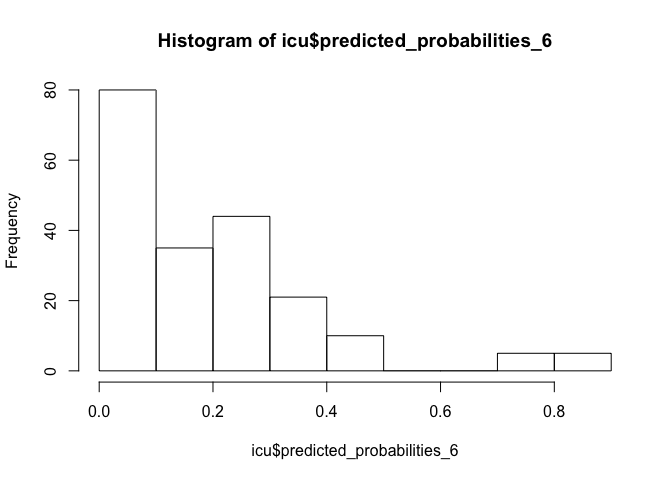
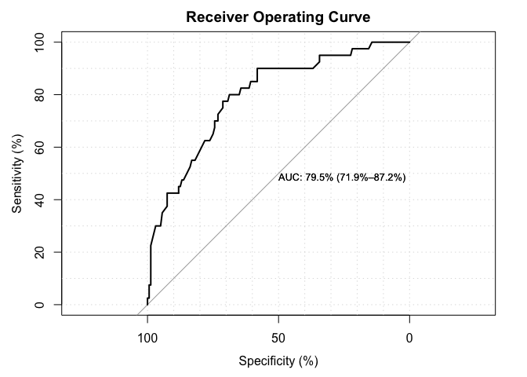

labb04\_markdown
================
Tima
3/14/2019

Logistic Regression Demo ICU script
===================================

packages being used (install only needs to be done once)
========================================================

install.packages("gmodels") install.packages("psych") \#should already have this one, so just in case. install.packages("SDMTools") install.packages("pROC") install.packages("LogisticDx") install.packages("car")

DO THESE EVERY TIME YOU CLOSE R.
================================

``` r
options(scipen=999) #need this one every time you close R removes scientific notation
library(psych)
library(gmodels)
library(SDMTools)
library(pROC)
```

    ## Type 'citation("pROC")' for a citation.

    ## 
    ## Attaching package: 'pROC'

    ## The following object is masked from 'package:SDMTools':
    ## 
    ##     auc

    ## The following object is masked from 'package:gmodels':
    ## 
    ##     ci

    ## The following objects are masked from 'package:stats':
    ## 
    ##     cov, smooth, var

``` r
library(LogisticDx)
library(car)
```

    ## Loading required package: carData

    ## 
    ## Attaching package: 'car'

    ## The following object is masked from 'package:psych':
    ## 
    ##     logit

we will also be using some functions. also enter these every time.
==================================================================

``` r
logisticPseudoR2s <- function(LogModel) {
  dev <- LogModel$deviance
  nullDev <- LogModel$null.deviance
  modelN <- length(LogModel$fitted.values)
  R.l <- 1 - dev / nullDev
  R.cs <- 1 - exp ( -(nullDev - dev) / modelN)
  R.n <- R.cs / (1 - ( exp (-(nullDev / modelN))))
  cat("Pseudo R^2 for Logistic Regression\n")
  cat("Hosmer and Lemeshow R^2 ", round(R.l, 3), "\n")
  cat("Cox and Snell R^2       ", round(R.cs, 3), "\n")
  cat("Nagelkerke R^2          ", round(R.n, 3),     "\n")
}


modelsig <- function(LogModel) {
  modelChi <- LogModel$null.deviance - LogModel$deviance
  chidf <- LogModel$df.null - LogModel$df.residual
  chisq.prob <- 1 - pchisq(modelChi, chidf)
  cat("Significance: ", round(chisq.prob, 5), "\n")
}
```

now import the analysis
=======================

``` r
icu <- read.csv("~/Dropbox/NSSR/2019 Spring/Advanced Quant - TA/Labs/lab04/lab04/icu.csv")
#View(icu) #your path will be different, import dataset.
```

Preliminary steps:
==================

1. Knowing our dataset and our sample
=====================================

a.
==

this creates a nice table for us to look at summary statistics.
===============================================================

here we can see missing values, ranges, measures of central tendency, and standard deviation.
=============================================================================================

``` r
summary_icu <- describe(icu)
#View(summary_icu)
```

b. Run frequencies and look at the following variables:
=======================================================

basic tables for categorical variables
======================================

``` r
table(icu$STA)
```

    ## 
    ##   0   1 
    ## 160  40

``` r
table(icu$TYP)
```

    ## 
    ##   0   1 
    ##  53 147

``` r
table(icu$LOC)
```

    ## 
    ##   0   1   2 
    ## 185   5  10

``` r
table(icu$CPR)
```

    ## 
    ##   0   1 
    ## 187  13

``` r
table(icu$INF)
```

    ## 
    ##   0   1 
    ## 116  84

describe() for continuous variables
===================================

``` r
describe(icu$AGE)
```

    ##    vars   n  mean    sd median trimmed   mad min max range  skew kurtosis
    ## X1    1 200 57.55 20.05     63   58.96 17.79  16  92    76 -0.63    -0.57
    ##      se
    ## X1 1.42

``` r
describe(icu$SYS)
```

    ##    vars   n   mean    sd median trimmed   mad min max range skew kurtosis
    ## X1    1 200 132.28 32.95    130  131.54 29.65  36 256   220 0.29     0.99
    ##      se
    ## X1 2.33

c. show how the various variables differ by levels of the STA variable. We use CrossTabble () to show the relationship between categorical variables.
=====================================================================================================================================================

``` r
CrossTable(icu$LOC, icu$STA, expected = TRUE, format="SPSS")
```

    ## Warning in chisq.test(t, correct = FALSE, ...): Chi-squared approximation
    ## may be incorrect

    ## 
    ##    Cell Contents
    ## |-------------------------|
    ## |                   Count |
    ## |         Expected Values |
    ## | Chi-square contribution |
    ## |             Row Percent |
    ## |          Column Percent |
    ## |           Total Percent |
    ## |-------------------------|
    ## 
    ## Total Observations in Table:  200 
    ## 
    ##              | icu$STA 
    ##      icu$LOC |        0  |        1  | Row Total | 
    ## -------------|-----------|-----------|-----------|
    ##            0 |      158  |       27  |      185  | 
    ##              |  148.000  |   37.000  |           | 
    ##              |    0.676  |    2.703  |           | 
    ##              |   85.405% |   14.595% |   92.500% | 
    ##              |   98.750% |   67.500% |           | 
    ##              |   79.000% |   13.500% |           | 
    ## -------------|-----------|-----------|-----------|
    ##            1 |        0  |        5  |        5  | 
    ##              |    4.000  |    1.000  |           | 
    ##              |    4.000  |   16.000  |           | 
    ##              |    0.000% |  100.000% |    2.500% | 
    ##              |    0.000% |   12.500% |           | 
    ##              |    0.000% |    2.500% |           | 
    ## -------------|-----------|-----------|-----------|
    ##            2 |        2  |        8  |       10  | 
    ##              |    8.000  |    2.000  |           | 
    ##              |    4.500  |   18.000  |           | 
    ##              |   20.000% |   80.000% |    5.000% | 
    ##              |    1.250% |   20.000% |           | 
    ##              |    1.000% |    4.000% |           | 
    ## -------------|-----------|-----------|-----------|
    ## Column Total |      160  |       40  |      200  | 
    ##              |   80.000% |   20.000% |           | 
    ## -------------|-----------|-----------|-----------|
    ## 
    ##  
    ## Statistics for All Table Factors
    ## 
    ## 
    ## Pearson's Chi-squared test 
    ## ------------------------------------------------------------
    ## Chi^2 =  45.87838     d.f. =  2     p =  0.0000000001090528 
    ## 
    ## 
    ##  
    ##        Minimum expected frequency: 1 
    ## Cells with Expected Frequency < 5: 3 of 6 (50%)

``` r
CrossTable(icu$TYP, icu$STA, expected = TRUE, format="SPSS")
```

    ## 
    ##    Cell Contents
    ## |-------------------------|
    ## |                   Count |
    ## |         Expected Values |
    ## | Chi-square contribution |
    ## |             Row Percent |
    ## |          Column Percent |
    ## |           Total Percent |
    ## |-------------------------|
    ## 
    ## Total Observations in Table:  200 
    ## 
    ##              | icu$STA 
    ##      icu$TYP |        0  |        1  | Row Total | 
    ## -------------|-----------|-----------|-----------|
    ##            0 |       51  |        2  |       53  | 
    ##              |   42.400  |   10.600  |           | 
    ##              |    1.744  |    6.977  |           | 
    ##              |   96.226% |    3.774% |   26.500% | 
    ##              |   31.875% |    5.000% |           | 
    ##              |   25.500% |    1.000% |           | 
    ## -------------|-----------|-----------|-----------|
    ##            1 |      109  |       38  |      147  | 
    ##              |  117.600  |   29.400  |           | 
    ##              |    0.629  |    2.516  |           | 
    ##              |   74.150% |   25.850% |   73.500% | 
    ##              |   68.125% |   95.000% |           | 
    ##              |   54.500% |   19.000% |           | 
    ## -------------|-----------|-----------|-----------|
    ## Column Total |      160  |       40  |      200  | 
    ##              |   80.000% |   20.000% |           | 
    ## -------------|-----------|-----------|-----------|
    ## 
    ##  
    ## Statistics for All Table Factors
    ## 
    ## 
    ## Pearson's Chi-squared test 
    ## ------------------------------------------------------------
    ## Chi^2 =  11.86626     d.f. =  1     p =  0.0005716021 
    ## 
    ## Pearson's Chi-squared test with Yates' continuity correction 
    ## ------------------------------------------------------------
    ## Chi^2 =  10.52657     d.f. =  1     p =  0.001176705 
    ## 
    ##  
    ##        Minimum expected frequency: 10.6

``` r
CrossTable(icu$CPR, icu$STA, expected = TRUE, format="SPSS")
```

    ## Warning in chisq.test(t, correct = TRUE, ...): Chi-squared approximation
    ## may be incorrect

    ## Warning in chisq.test(t, correct = TRUE, ...): Chi-squared approximation
    ## may be incorrect

    ## 
    ##    Cell Contents
    ## |-------------------------|
    ## |                   Count |
    ## |         Expected Values |
    ## | Chi-square contribution |
    ## |             Row Percent |
    ## |          Column Percent |
    ## |           Total Percent |
    ## |-------------------------|
    ## 
    ## Total Observations in Table:  200 
    ## 
    ##              | icu$STA 
    ##      icu$CPR |        0  |        1  | Row Total | 
    ## -------------|-----------|-----------|-----------|
    ##            0 |      154  |       33  |      187  | 
    ##              |  149.600  |   37.400  |           | 
    ##              |    0.129  |    0.518  |           | 
    ##              |   82.353% |   17.647% |   93.500% | 
    ##              |   96.250% |   82.500% |           | 
    ##              |   77.000% |   16.500% |           | 
    ## -------------|-----------|-----------|-----------|
    ##            1 |        6  |        7  |       13  | 
    ##              |   10.400  |    2.600  |           | 
    ##              |    1.862  |    7.446  |           | 
    ##              |   46.154% |   53.846% |    6.500% | 
    ##              |    3.750% |   17.500% |           | 
    ##              |    3.000% |    3.500% |           | 
    ## -------------|-----------|-----------|-----------|
    ## Column Total |      160  |       40  |      200  | 
    ##              |   80.000% |   20.000% |           | 
    ## -------------|-----------|-----------|-----------|
    ## 
    ##  
    ## Statistics for All Table Factors
    ## 
    ## 
    ## Pearson's Chi-squared test 
    ## ------------------------------------------------------------
    ## Chi^2 =  9.954751     d.f. =  1     p =  0.001604348 
    ## 
    ## Pearson's Chi-squared test with Yates' continuity correction 
    ## ------------------------------------------------------------
    ## Chi^2 =  7.820856     d.f. =  1     p =  0.005164674 
    ## 
    ##  
    ##        Minimum expected frequency: 2.6 
    ## Cells with Expected Frequency < 5: 1 of 4 (25%)

``` r
CrossTable(icu$INF, icu$STA, expected = TRUE, format="SPSS")
```

    ## 
    ##    Cell Contents
    ## |-------------------------|
    ## |                   Count |
    ## |         Expected Values |
    ## | Chi-square contribution |
    ## |             Row Percent |
    ## |          Column Percent |
    ## |           Total Percent |
    ## |-------------------------|
    ## 
    ## Total Observations in Table:  200 
    ## 
    ##              | icu$STA 
    ##      icu$INF |        0  |        1  | Row Total | 
    ## -------------|-----------|-----------|-----------|
    ##            0 |      100  |       16  |      116  | 
    ##              |   92.800  |   23.200  |           | 
    ##              |    0.559  |    2.234  |           | 
    ##              |   86.207% |   13.793% |   58.000% | 
    ##              |   62.500% |   40.000% |           | 
    ##              |   50.000% |    8.000% |           | 
    ## -------------|-----------|-----------|-----------|
    ##            1 |       60  |       24  |       84  | 
    ##              |   67.200  |   16.800  |           | 
    ##              |    0.771  |    3.086  |           | 
    ##              |   71.429% |   28.571% |   42.000% | 
    ##              |   37.500% |   60.000% |           | 
    ##              |   30.000% |   12.000% |           | 
    ## -------------|-----------|-----------|-----------|
    ## Column Total |      160  |       40  |      200  | 
    ##              |   80.000% |   20.000% |           | 
    ## -------------|-----------|-----------|-----------|
    ## 
    ##  
    ## Statistics for All Table Factors
    ## 
    ## 
    ## Pearson's Chi-squared test 
    ## ------------------------------------------------------------
    ## Chi^2 =  6.650246     d.f. =  1     p =  0.009914212 
    ## 
    ## Pearson's Chi-squared test with Yates' continuity correction 
    ## ------------------------------------------------------------
    ## Chi^2 =  5.758672     d.f. =  1     p =  0.01640747 
    ## 
    ##  
    ##        Minimum expected frequency: 16.8

look all the other categorical variables
========================================

Core Assignments
================

``` r
#we need our dependent variable to be a factor. Right now it is an integer, so we will change that.

icu$STA <- as.factor(icu$STA)

#we also need to make the Level of Consciousness (LOC) variable a dummy variable as opposed to categorical. 

icu$NORM <- ifelse(icu$LOC == 0, 1, 0)
icu$STUP <- ifelse(icu$LOC == 1, 1, 0)
icu$COMA <- ifelse(icu$LOC == 2, 1, 0)

# similarly for Race:

icu$WHITE <- 0
icu$WHITE[icu$RACE == 1] <- 1

icu$BLACK <- 0
icu$BLACK[icu$RACE == 2] <- 1

icu$OTHER <- 0
icu$OTHER[icu$RACE == 3] <- 1

# to double check that this worked:
table(icu$RACE)
```

    ## 
    ##   1   2   3 
    ## 175  15  10

``` r
table(icu$OTHER)
```

    ## 
    ##   0   1 
    ## 190  10

``` r
table(icu$BLACK)
```

    ## 
    ##   0   1 
    ## 185  15

``` r
table(icu$WHITE)
```

    ## 
    ##   0   1 
    ##  25 175

``` r
# Naive Model
icu_naive <- glm(STA ~ 1, data = icu, family = binomial())
icu$predicted_probabilities_naive <- fitted(icu_naive)
confusion.matrix(icu$STA, icu$predicted_probabilities_naive, threshold = 0.5)
```

    ##     obs
    ## pred   0  1
    ##    0 160 40
    ##    1   0  0
    ## attr(,"class")
    ## [1] "confusion.matrix"

``` r
quantile(icu$predicted_probabilities_naive)
```

    ##   0%  25%  50%  75% 100% 
    ##  0.2  0.2  0.2  0.2  0.2

``` r
# Build your model
icu_1 <- glm(STA ~ TYP, data = icu,family = binomial())
summary(icu_1)
```

    ## 
    ## Call:
    ## glm(formula = STA ~ TYP, family = binomial(), data = icu)
    ## 
    ## Deviance Residuals: 
    ##     Min       1Q   Median       3Q      Max  
    ## -0.7734  -0.7734  -0.7734  -0.2774   2.5601  
    ## 
    ## Coefficients:
    ##             Estimate Std. Error z value   Pr(>|z|)    
    ## (Intercept)  -3.2387     0.7206  -4.495 0.00000697 ***
    ## TYP           2.1849     0.7448   2.934    0.00335 ** 
    ## ---
    ## Signif. codes:  0 '***' 0.001 '**' 0.01 '*' 0.05 '.' 0.1 ' ' 1
    ## 
    ## (Dispersion parameter for binomial family taken to be 1)
    ## 
    ##     Null deviance: 200.16  on 199  degrees of freedom
    ## Residual deviance: 185.05  on 198  degrees of freedom
    ## AIC: 189.05
    ## 
    ## Number of Fisher Scoring iterations: 5

``` r
#odds ratios
exp(coef(icu_1)) # exponentiated coefficients
```

    ## (Intercept)         TYP 
    ##   0.0392157   8.8899054

``` r
#diagnostics
modelsig(icu_1)
```

    ## Significance:  0.0001

``` r
logisticPseudoR2s(icu_1)
```

    ## Pseudo R^2 for Logistic Regression
    ## Hosmer and Lemeshow R^2  0.075 
    ## Cox and Snell R^2        0.073 
    ## Nagelkerke R^2           0.115

``` r
#lets create the probability for each observation. 

icu$predicted_probabilities_1 <- fitted(icu_1)

#lets explore the distribution of that likelihood

quantile(icu$predicted_probabilities_1)
```

    ##         0%        25%        50%        75%       100% 
    ## 0.03773586 0.03773586 0.25850340 0.25850340 0.25850340

``` r
#lets see how the model predicted probabilities of death using a confusion matrix. This compares your predictions to the actual outcomes of the model. 

confusion.matrix(icu$STA, icu$predicted_probabilities_1, threshold = 0.5)
```

    ##     obs
    ## pred   0  1
    ##    0 160 40
    ##    1   0  0
    ## attr(,"class")
    ## [1] "confusion.matrix"

``` r
# Why is no one in Pred = 1? (lower the threshold to 0.25)

confusion.matrix(icu$STA, icu$predicted_probabilities_1, threshold = 0.25)
```

    ##     obs
    ## pred   0  1
    ##    0  51  2
    ##    1 109 38
    ## attr(,"class")
    ## [1] "confusion.matrix"

``` r
#look at whether there is good spread (at least 10 points) between quartiles of the probability. 

quantile(icu$predicted_probabilities_1)
```

    ##         0%        25%        50%        75%       100% 
    ## 0.03773586 0.03773586 0.25850340 0.25850340 0.25850340

let's continue to improve our model.
====================================

``` r
icu_2 <- glm(STA ~ TYP + STUP, data = icu, family = binomial())
summary(icu_2)
```

    ## 
    ## Call:
    ## glm(formula = STA ~ TYP + STUP, family = binomial(), data = icu)
    ## 
    ## Deviance Residuals: 
    ##     Min       1Q   Median       3Q      Max  
    ## -0.7369  -0.7369  -0.7369  -0.1971   2.8111  
    ## 
    ## Coefficients:
    ##             Estimate Std. Error z value  Pr(>|z|)    
    ## (Intercept)   -3.932      1.010  -3.894 0.0000987 ***
    ## TYP            2.767      1.029   2.690   0.00715 ** 
    ## STUP          18.908    968.830   0.020   0.98443    
    ## ---
    ## Signif. codes:  0 '***' 0.001 '**' 0.01 '*' 0.05 '.' 0.1 ' ' 1
    ## 
    ## (Dispersion parameter for binomial family taken to be 1)
    ## 
    ##     Null deviance: 200.16  on 199  degrees of freedom
    ## Residual deviance: 166.75  on 197  degrees of freedom
    ## AIC: 172.75
    ## 
    ## Number of Fisher Scoring iterations: 15

``` r
exp(coef(icu_2)) # exponentiated coefficients
```

    ##        (Intercept)                TYP               STUP 
    ##         0.01960784        15.90825688 162843375.00991204

``` r
icu_3 <- glm(STA ~ TYP + COMA, data = icu, family = binomial())
summary(icu_3)
```

    ## 
    ## Call:
    ## glm(formula = STA ~ TYP + COMA, family = binomial(), data = icu)
    ## 
    ## Deviance Residuals: 
    ##     Min       1Q   Median       3Q      Max  
    ## -1.7941  -0.7031  -0.7031  -0.2774   2.5601  
    ## 
    ## Coefficients:
    ##             Estimate Std. Error z value   Pr(>|z|)    
    ## (Intercept)  -3.2387     0.7206  -4.495 0.00000697 ***
    ## TYP           1.9670     0.7496   2.624    0.00869 ** 
    ## COMA          2.6579     0.8171   3.253    0.00114 ** 
    ## ---
    ## Signif. codes:  0 '***' 0.001 '**' 0.01 '*' 0.05 '.' 0.1 ' ' 1
    ## 
    ## (Dispersion parameter for binomial family taken to be 1)
    ## 
    ##     Null deviance: 200.16  on 199  degrees of freedom
    ## Residual deviance: 171.06  on 197  degrees of freedom
    ## AIC: 177.06
    ## 
    ## Number of Fisher Scoring iterations: 5

``` r
exp(coef(icu_3)) # exponentiated coefficients
```

    ## (Intercept)         TYP        COMA 
    ##   0.0392157   7.1495304  14.2666667

``` r
icu_4 <- glm(STA ~ TYP + COMA + AGE, data = icu, family = binomial())
summary(icu_4)
```

    ## 
    ## Call:
    ## glm(formula = STA ~ TYP + COMA + AGE, family = binomial(), data = icu)
    ## 
    ## Deviance Residuals: 
    ##     Min       1Q   Median       3Q      Max  
    ## -2.1430  -0.7104  -0.3915  -0.2298   2.5188  
    ## 
    ## Coefficients:
    ##             Estimate Std. Error z value    Pr(>|z|)    
    ## (Intercept) -5.38726    1.05807  -5.092 0.000000355 ***
    ## TYP          2.22784    0.75727   2.942     0.00326 ** 
    ## COMA         2.47897    0.82802   2.994     0.00275 ** 
    ## AGE          0.03225    0.01122   2.875     0.00404 ** 
    ## ---
    ## Signif. codes:  0 '***' 0.001 '**' 0.01 '*' 0.05 '.' 0.1 ' ' 1
    ## 
    ## (Dispersion parameter for binomial family taken to be 1)
    ## 
    ##     Null deviance: 200.16  on 199  degrees of freedom
    ## Residual deviance: 161.42  on 196  degrees of freedom
    ## AIC: 169.42
    ## 
    ## Number of Fisher Scoring iterations: 6

``` r
exp(coef(icu_4)) # exponentiated coefficients
```

    ##  (Intercept)          TYP         COMA          AGE 
    ##  0.004574491  9.279833818 11.928929132  1.032780526

``` r
icu_5 <- glm(STA ~ TYP + COMA + AGE + CPR, data = icu, family = binomial())
summary(icu_5)
```

    ## 
    ## Call:
    ## glm(formula = STA ~ TYP + COMA + AGE + CPR, family = binomial(), 
    ##     data = icu)
    ## 
    ## Deviance Residuals: 
    ##     Min       1Q   Median       3Q      Max  
    ## -2.0086  -0.7020  -0.3813  -0.2290   2.5186  
    ## 
    ## Coefficients:
    ##             Estimate Std. Error z value    Pr(>|z|)    
    ## (Intercept) -5.42134    1.06381  -5.096 0.000000347 ***
    ## TYP          2.18120    0.75927   2.873     0.00407 ** 
    ## COMA         2.19996    0.87137   2.525     0.01158 *  
    ## AGE          0.03275    0.01132   2.892     0.00383 ** 
    ## CPR          0.75114    0.73019   1.029     0.30363    
    ## ---
    ## Signif. codes:  0 '***' 0.001 '**' 0.01 '*' 0.05 '.' 0.1 ' ' 1
    ## 
    ## (Dispersion parameter for binomial family taken to be 1)
    ## 
    ##     Null deviance: 200.16  on 199  degrees of freedom
    ## Residual deviance: 160.42  on 195  degrees of freedom
    ## AIC: 170.42
    ## 
    ## Number of Fisher Scoring iterations: 6

``` r
exp(coef(icu_5)) # exponentiated coefficients
```

    ## (Intercept)         TYP        COMA         AGE         CPR 
    ## 0.004421227 8.856941688 9.024689140 1.033291404 2.119407335

``` r
# Final Model

icu_6 <- glm(STA ~ TYP + COMA + AGE + INF, data = icu, family = binomial())
summary(icu_6)
```

    ## 
    ## Call:
    ## glm(formula = STA ~ TYP + COMA + AGE + INF, family = binomial(), 
    ##     data = icu)
    ## 
    ## Deviance Residuals: 
    ##     Min       1Q   Median       3Q      Max  
    ## -1.9864  -0.6855  -0.3734  -0.2460   2.5714  
    ## 
    ## Coefficients:
    ##             Estimate Std. Error z value    Pr(>|z|)    
    ## (Intercept) -5.33474    1.05476  -5.058 0.000000424 ***
    ## TYP          2.08673    0.76488   2.728     0.00637 ** 
    ## COMA         2.44415    0.82463   2.964     0.00304 ** 
    ## AGE          0.02952    0.01151   2.565     0.01033 *  
    ## INF          0.47553    0.41185   1.155     0.24825    
    ## ---
    ## Signif. codes:  0 '***' 0.001 '**' 0.01 '*' 0.05 '.' 0.1 ' ' 1
    ## 
    ## (Dispersion parameter for binomial family taken to be 1)
    ## 
    ##     Null deviance: 200.16  on 199  degrees of freedom
    ## Residual deviance: 160.09  on 195  degrees of freedom
    ## AIC: 170.09
    ## 
    ## Number of Fisher Scoring iterations: 6

``` r
exp(coef(icu_6)) # exponentiated coefficients
```

    ##  (Intercept)          TYP         COMA          AGE          INF 
    ##  0.004821185  8.058527910 11.520789900  1.029955941  1.608865748

diagnostics
===========

``` r
modelsig(icu_6)
```

    ## Significance:  0

``` r
logisticPseudoR2s(icu_6)
```

    ## Pseudo R^2 for Logistic Regression
    ## Hosmer and Lemeshow R^2  0.2 
    ## Cox and Snell R^2        0.182 
    ## Nagelkerke R^2           0.287

``` r
#for this final model, let's check our hosmer lemeshow goodness of fit test in more detail.We are looking for a p-value that is not significant. 

gof(icu_6, g=10, plotROC = FALSE)
```

    ##        chiSq  df    pVal
    ## PrI  199.329 195 0.40079
    ## drI  160.087 195 0.96797
    ## PrG  101.103 118 0.86721
    ## drG   87.807 118 0.98296
    ## PrCT 101.103 118 0.86721
    ## drCT  87.807 118 0.98296
    ##                      val df    pVal
    ## HL chiSq         3.09476  8 0.92827
    ## mHL F            0.51680  9 0.85983
    ## OsRo Z                NA NA 0.38792
    ## SstPgeq0.5 Z     1.53993 NA 0.12358
    ## SstPl0.5 Z       0.31955 NA 0.74931
    ## SstBoth chiSq    2.47349  2 0.29033
    ## SllPgeq0.5 chiSq 2.17395  1 0.14037
    ## SllPl0.5 chiSq   0.10625  1 0.74445
    ## SllBoth chiSq    2.19383  2 0.33390

``` r
#also, create a variable out of the likelihood of death in the final model. 

icu$predicted_probabilities_6 <- fitted(icu_6)

confusion.matrix(icu$STA, icu$predicted_probabilities_6, threshold = 0.5)
```

    ##     obs
    ## pred   0  1
    ##    0 158 32
    ##    1   2  8
    ## attr(,"class")
    ## [1] "confusion.matrix"

``` r
#we want to see its distribution, so lets see the quantile (see below)

quantile(icu$predicted_probabilities_6)
```

    ##          0%         25%         50%         75%        100% 
    ## 0.008134711 0.058648855 0.152791991 0.274482516 0.868227860

``` r
#lets also plot our distribution of probability

hist(icu$predicted_probabilities_6)
```



``` r
# change the threshold to 0.25. 

confusion.matrix(icu$STA, icu$predicted_probabilities_6, threshold = 0.25)
```

    ##     obs
    ## pred   0  1
    ##    0 122 15
    ##    1  38 25
    ## attr(,"class")
    ## [1] "confusion.matrix"

Advanced Extension
==================

1. ROC curve analysis
=====================

roc curve analysis
==================

``` r
gof(icu_6, g=10, plotROC = TRUE)
```



    ##        chiSq  df    pVal
    ## PrI  199.329 195 0.40079
    ## drI  160.087 195 0.96797
    ## PrG  101.103 118 0.86721
    ## drG   87.807 118 0.98296
    ## PrCT 101.103 118 0.86721
    ## drCT  87.807 118 0.98296
    ##                      val df    pVal
    ## HL chiSq         3.09476  8 0.92827
    ## mHL F            0.51680  9 0.85983
    ## OsRo Z                NA NA 0.38792
    ## SstPgeq0.5 Z     1.53993 NA 0.12358
    ## SstPl0.5 Z       0.31955 NA 0.74931
    ## SstBoth chiSq    2.47349  2 0.29033
    ## SllPgeq0.5 chiSq 2.17395  1 0.14037
    ## SllPl0.5 chiSq   0.10625  1 0.74445
    ## SllBoth chiSq    2.19383  2 0.33390

2. Interaction effect
=====================

``` r
icu$inter_typ_inf = icu$INF * icu$TYP # create a new interaction variable 

icu_interaction_model <- glm(STA ~ COMA + AGE + inter_typ_inf, data = icu, family = binomial())
summary(icu_interaction_model)
```

    ## 
    ## Call:
    ## glm(formula = STA ~ COMA + AGE + inter_typ_inf, family = binomial(), 
    ##     data = icu)
    ## 
    ## Deviance Residuals: 
    ##     Min       1Q   Median       3Q      Max  
    ## -1.9697  -0.5706  -0.4866  -0.3066   2.4890  
    ## 
    ## Coefficients:
    ##               Estimate Std. Error z value Pr(>|z|)    
    ## (Intercept)   -3.48315    0.76953  -4.526 0.000006 ***
    ## COMA           2.74190    0.83160   3.297 0.000977 ***
    ## AGE            0.02273    0.01149   1.979 0.047866 *  
    ## inter_typ_inf  1.18499    0.39445   3.004 0.002663 ** 
    ## ---
    ## Signif. codes:  0 '***' 0.001 '**' 0.01 '*' 0.05 '.' 0.1 ' ' 1
    ## 
    ## (Dispersion parameter for binomial family taken to be 1)
    ## 
    ##     Null deviance: 200.16  on 199  degrees of freedom
    ## Residual deviance: 166.82  on 196  degrees of freedom
    ## AIC: 174.82
    ## 
    ## Number of Fisher Scoring iterations: 5

``` r
exp(coef(icu_interaction_model)) # exponentiated coefficients
```

    ##   (Intercept)          COMA           AGE inter_typ_inf 
    ##    0.03071039   15.51647458    1.02298989    3.27065761

``` r
#diagnostics
modelsig(icu_interaction_model)
```

    ## Significance:  0

``` r
logisticPseudoR2s(icu_interaction_model)
```

    ## Pseudo R^2 for Logistic Regression
    ## Hosmer and Lemeshow R^2  0.167 
    ## Cox and Snell R^2        0.154 
    ## Nagelkerke R^2           0.243

``` r
vif(icu_interaction_model)
```

    ##          COMA           AGE inter_typ_inf 
    ##      1.001717      1.007141      1.006652

3.
==

4. Test for threshold effects of interval variables.
====================================================

``` r
quantile(icu$AGE, 0.75, na.rm = TRUE) # find the threshold 
```

    ## 75% 
    ##  72

``` r
icu$AGECat[icu$AGE < 72] <- 0
icu$AGECat[icu$AGE >= 72] <- 1 # recode AGE to be a new ordinal variable AGECat

icu$AGECat <- as.factor(icu$AGECat) # make it a factor 

# create the dummy variable for new categorical variable AGECat

icu$high_AGECat <- ifelse(icu$AGECat == 1, 1, 0)
icu$low_AGECat <- ifelse(icu$AGECat == 0, 1, 0)

# check your work.

table(icu$AGECat) # distribution of new variable
```

    ## 
    ##   0   1 
    ## 148  52

``` r
tapply(icu$AGE, icu$AGECat, summary)
```

    ## $`0`
    ##    Min. 1st Qu.  Median    Mean 3rd Qu.    Max. 
    ##   16.00   39.00   55.00   50.05   65.00   71.00 
    ## 
    ## $`1`
    ##    Min. 1st Qu.  Median    Mean 3rd Qu.    Max. 
    ##   72.00   75.00   77.00   78.88   82.25   92.00

5. Analyze the false positive, false negative rate, the sensitivity and the specificity.
========================================================================================

6. Create the probability for each observation
==============================================

create a dummy variable for individuals that in the highest quartile (who are more likely to die)
=================================================================================================

``` r
icu$die[icu$predicted_probabilities_6 > 0.27] <- 1
icu$die[icu$predicted_probabilities_6 <= 0.27] <- 0

# how these individuals differ on the variables in the dataset?
individuals_die <- subset(icu, die == 1)
summary_individuals <- describe(individuals_die)
#View(summary_individuals)

table(individuals_die$RACE)
```

    ## 
    ##  1  3 
    ## 50  1

``` r
table(individuals_die$PRE)
```

    ## 
    ##  0  1 
    ## 43  8

``` r
describe(individuals_die$AGE)
```

    ##    vars  n  mean    sd median trimmed   mad min max range  skew kurtosis
    ## X1    1 51 73.69 10.65     75   73.85 11.86  41  92    51 -0.28     0.03
    ##      se
    ## X1 1.49
