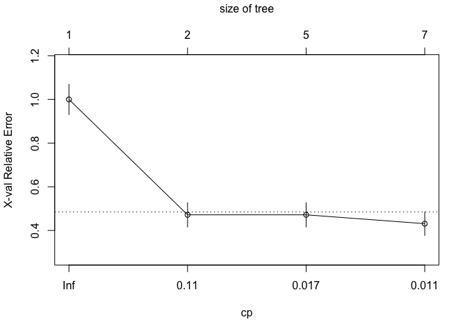
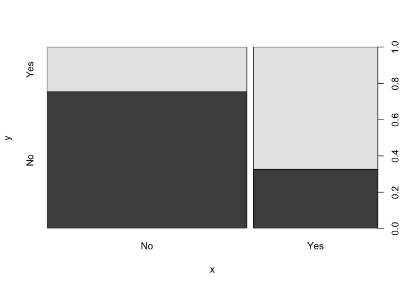

Lab 5: Random Forests Notebook
================
Tima Alqabandi
April 11, 2019

This is an [R Markdown](http://rmarkdown.rstudio.com) Notebook. The code is placed in "chunks" to allow clear delimination between text and code. When you execute code within the notebook, the results appear beneath the code. To execute a chunk, click the *Run* button within the chunk or by placing your cursor inside it and pressing *Ctrl+Shift+Enter*.

You can do your full assignment in this notebook. Then, please save it as an HTML file when you are done.

In this assignment, you will learn about the various Tree based models. As mentioned, Tree based models are a type of Machine Learning. They come to us from the field of computer science. They have some nice advantages:

-   They provide a (usually) simple and easy to interpret display of the results that mimics human decision making (think decision trees).
-   They are quite adept at detecting the optimum break points for nonlinear variables.
-   They are inherantly good at picking up multi layered "dependencies" that we call interaction terms.
-   Though the original tree is usually not very predictive, when trees are combined with boosting, bagging and decorrelation techniques they often are a top performing technique.

We are now in the world of predictive modelling. Our focus now is brute force prediction. In this world, even minor seeming improvements in predictive accuracy are important: they can translate into lives saved, millions earned, careers transformed. Every decimal counts for the person at the margin.

We will use the ICPSR data because you are now familar with it.

We are going to see if we can outdo logistic regression results. So we will start with logistic regression as our base model. But this is no "strawman." Logistic regression is a powerful technique that can often rise to the top. This method can be used for any problems that logistic regression takes on. You can use this method to predict any binary outcome.

So lets get started. First, lets load the required libraries and don't forget to set you working directory. To run this code, press the little arrow in the upper right corner. We'll load some tree packages as well as the caret package which is commonly used for cross validation.

``` r
library(Rcpp)
library(tree)
library(randomForest)
```

    ## randomForest 4.6-14

    ## Type rfNews() to see new features/changes/bug fixes.

``` r
library(e1071)
library(caret)
```

    ## Loading required package: lattice

    ## Loading required package: ggplot2

    ## 
    ## Attaching package: 'ggplot2'

    ## The following object is masked from 'package:randomForest':
    ## 
    ##     margin

``` r
library(pROC)
```

    ## Type 'citation("pROC")' for a citation.

    ## 
    ## Attaching package: 'pROC'

    ## The following objects are masked from 'package:stats':
    ## 
    ##     cov, smooth, var

``` r
library(rpart)
options(scipen=999)
library(rpart.plot)
library(rattle)
```

    ## Rattle: A free graphical interface for data science with R.
    ## Version 5.2.0 Copyright (c) 2006-2018 Togaware Pty Ltd.
    ## Type 'rattle()' to shake, rattle, and roll your data.

    ## 
    ## Attaching package: 'rattle'

    ## The following object is masked from 'package:randomForest':
    ## 
    ##     importance

Loading our data and splitting into a test and train set
========================================================

Before we do anything, let's set our working directory.

Next, let's load our data first. Once we do that, we are going to create our dependent variable, which we will call HighWelf. We will then split our data into train and test sets.

``` r
data <- read.csv("/Users/timaalqabandi/Dropbox/NSSR/2019 Spring/Advanced Quant - TA/data/full_data.csv")
```

Our definition of HighWelf is the top quartile. To do that, we are going to run the chunk below.

``` r
quantile(data$KREC2T17, 0.75, na.rm = TRUE)
```

    ## 75% 
    ##  21

We then use that number (21) as a cutoff for our dummy variable.

We are going to call this new dummy variable, `HighWelf`. If a person has a KREC2T17 value less than 21, they will be assigned a value of 0 in the new HighWelf column. If they have a value equal to or greather than 21, they will be assigned a value of 1 for HighWelf

It is best to do all these lines one by one.

``` r
data$HighWelf[data$KREC2T17 < 21] <- 0
data$HighWelf[data$KREC2T17 >= 21] <- 1
data$HighWelf <- factor(data$HighWelf)
```

### Splitting our full dataset into a train and test set.

Make sure that `library(caret)` worked when you ran it at the very beginning on this script. You will need it in order to run the chunk below.

Here, we will be splitting our data into train and test. And we will save it locally on your computer. This will make it easier to load it in whenever you want to continue working on the assignment. So you won't have to run these codes again.

``` r
set.seed(89879878)
trainIndex <- createDataPartition(data$HighWelf, p = 0.7, list = FALSE, times = 1)
train_data <- data[trainIndex, ]  # Creating our training set
test_data <- data[-trainIndex, ]  # creating our testing set
```

### Saving the dataset on your computer as a `.csv` file.

Next, we are going to save these datasets on your computer as a `.csv` file. That way, you'll have them prepared to load and reload for the assignment, without having to do all these steps over again.

-   We will use the function `write.csv` to save the data. But **do make sure that you write `.csv` at the end of the folder name**

-   If you've been working in your working directory, and you would like to save the file there, then all you have to run is this:

Run the code below, but remove the `#` first.

``` r
# write.csv(full_data, file='full_data.csv') write.csv(train_data,
# file='train_data.csv') write.csv(test_data, file='test_data.csv')
```

Once you have these steps done, you can start from the chunks below onwards.

Loading our data and creating our dependent variable.
=====================================================

1.  First, as always, set your working directory.

2.  Next, let's load our train and test data:

``` r
train <- read.csv("/Users/timaalqabandi/Dropbox/NSSR/2019 Spring/Advanced Quant - TA/data/train_data.csv")
test <- read.csv("/Users/timaalqabandi/Dropbox/NSSR/2019 Spring/Advanced Quant - TA/data/test_data.csv")

## We need to make sure that our dependent variable if a "factor" in both our train and test data
test$HighWelf = as.factor(test$HighWelf)
train$HighWelf = as.factor(train$HighWelf)
```

1.  Let's create an object, "HighWelf\_value" and merge it into our dataset.

``` r
HighWelf_value_train = ifelse(train$HighWelf == 0, "No", "Yes")
train = data.frame(train, HighWelf_value_train)

HighWelf_value_test = ifelse(test$HighWelf == 0, "No", "Yes")
test = data.frame(test, HighWelf_value_test)
```

Creating a logistic regression model using the same variables used in your linear regression homework and a few new variables. All are listed below.
====================================================================================================================================================

``` r
# Variables we are interested in -------------------------

## I am writing it here for easy of copying and pasting:
 #  CCSITE + FWSITE +  HOSITE +  racode +  ZAGELT25 + ZHISP +  ZBLACK +  ZACH05 +  ZPUBLICH +  MNTHEMP +LTRECIP +  YR3KEMP +  YR3EARNAV +  YREMP +  pyrearn + YRREC +  YRKREC +  YRRFS + RAYEAR   


# LOGISTIC MODEL -------------------------

# (1) Create Model using all the features from the last assignment

lgs_regression <- glm(HighWelf ~ CCSITE + FWSITE +  HOSITE +  racode +  ZAGELT25 + 
                        ZHISP +  ZBLACK +  ZACH05 +  ZPUBLICH +  MNTHEMP + LTRECIP +  
                        YR3KEMP +  YR3EARNAV +  YREMP +  pyrearn + YRREC +  YRKREC +  
                        YRRFS + RAYEAR , family=binomial, data=train)
summary(lgs_regression)
```

    ## 
    ## Call:
    ## glm(formula = HighWelf ~ CCSITE + FWSITE + HOSITE + racode + 
    ##     ZAGELT25 + ZHISP + ZBLACK + ZACH05 + ZPUBLICH + MNTHEMP + 
    ##     LTRECIP + YR3KEMP + YR3EARNAV + YREMP + pyrearn + YRREC + 
    ##     YRKREC + YRRFS + RAYEAR, family = binomial, data = train)
    ## 
    ## Deviance Residuals: 
    ##     Min       1Q   Median       3Q      Max  
    ## -1.6863  -0.7488  -0.5148   0.7757   2.9345  
    ## 
    ## Coefficients: (1 not defined because of singularities)
    ##                  Estimate    Std. Error z value        Pr(>|z|)    
    ## (Intercept) 1230.33693865  181.37663251   6.783 0.0000000000117 ***
    ## CCSITE        -0.49762369    0.11989395  -4.151 0.0000331703226 ***
    ## FWSITE        -0.36503841    0.09980525  -3.658        0.000255 ***
    ## HOSITE                 NA            NA      NA              NA    
    ## racodeP1      -0.03949083    0.08217523  -0.481        0.630823    
    ## ZAGELT25       0.36237460    0.09678024   3.744        0.000181 ***
    ## ZHISP          0.21527856    0.15237828   1.413        0.157717    
    ## ZBLACK         0.86168898    0.14397442   5.985 0.0000000021637 ***
    ## ZACH05        -0.10576676    0.10601797  -0.998        0.318459    
    ## ZPUBLICH       0.15379133    0.10112741   1.521        0.128318    
    ## MNTHEMP       -0.08994660    0.03819454  -2.355        0.018525 *  
    ## LTRECIP        0.18388098    0.11131602   1.652        0.098559 .  
    ## YR3KEMP        0.01232424    0.02068612   0.596        0.551326    
    ## YR3EARNAV     -0.00003639    0.00002191  -1.661        0.096784 .  
    ## YREMP          0.14224802    0.12271116   1.159        0.246371    
    ## pyrearn       -0.00003562    0.00001621  -2.197        0.027995 *  
    ## YRREC          0.04508784    0.16541467   0.273        0.785180    
    ## YRKREC         0.05993465    0.01800145   3.329        0.000870 ***
    ## YRRFS          0.63272231    0.11631018   5.440 0.0000000532937 ***
    ## RAYEAR        -0.61567455    0.09063029  -6.793 0.0000000000110 ***
    ## ---
    ## Signif. codes:  0 '***' 0.001 '**' 0.01 '*' 0.05 '.' 0.1 ' ' 1
    ## 
    ## (Dispersion parameter for binomial family taken to be 1)
    ## 
    ##     Null deviance: 4210.4  on 3731  degrees of freedom
    ## Residual deviance: 3643.5  on 3713  degrees of freedom
    ## AIC: 3681.5
    ## 
    ## Number of Fisher Scoring iterations: 5

``` r
# (2) Run Diagnostics

exp(coef(lgs_regression))
```

    ## (Intercept)      CCSITE      FWSITE      HOSITE    racodeP1    ZAGELT25 
    ##         Inf   0.6079737   0.6941700          NA   0.9612788   1.4367370 
    ##       ZHISP      ZBLACK      ZACH05    ZPUBLICH     MNTHEMP     LTRECIP 
    ##   1.2402073   2.3671554   0.8996345   1.1662475   0.9139800   1.2018728 
    ##     YR3KEMP   YR3EARNAV       YREMP     pyrearn       YRREC      YRKREC 
    ##   1.0124005   0.9999636   1.1528625   0.9999644   1.0461197   1.0617672 
    ##       YRRFS      RAYEAR 
    ##   1.8827290   0.5402763

``` r
#logisticPseudoR2s(lgs_regression)

# (3) Insert model probability into our dataset

prob_final = predict(lgs_regression,type="response")
train$prob_final <- prob_final

quantile(train$prob_final)
```

    ##          0%         25%         50%         75%        100% 
    ## 0.009824049 0.117726952 0.213511625 0.354817676 0.783198086

``` r
# (4) Predict "HighWelf" or "Not" based on model

pred_final = rep(0, 3732) # Creates a vector of 544 "not highwelf" elements. 544 is the number of rows that are present in the dataset. The code below will lable those with probabilities of more than 0.5 as being in HighWelf

pred_final[train$prob_final>0.5] = 1 # Changes the "Not" elements to "yes" in terms of "HighWelf" if probability is above 0.5. This is known as the threshold. Feel free to change this if you'd like!

pred_final[1:40] ## This will show us the predictions for the first 40 rows
```

    ##  [1] 0 1 0 0 0 1 0 0 0 0 0 0 0 0 0 0 0 1 1 1 0 0 0 0 0 0 0 1 0 0 0 0 0 1 0
    ## [36] 0 0 0 0 0

``` r
train$pred_final <- pred_final

table(train$pred_final)
```

    ## 
    ##    0    1 
    ## 3328  404

``` r
table(pred_final,train$HighWelf) # Confusion table that compares our prediction to the Survived that was reality
```

    ##           
    ## pred_final    0    1
    ##          0 2631  697
    ##          1  162  242

``` r
## we see that our model predicted that no one was in HighWelf. That has to do with the 0.5 threshold.

# Accuracy
table <- table(pred_final,train$HighWelf)
Accuracy <- sum(diag(table)/sum(table))
print(paste('Accuracy: ', Accuracy))
```

    ## [1] "Accuracy:  0.769828510182208"

``` r
# Calculate AUC and plot ROC curve
prob_log = predict(lgs_regression, type ='response')
auc(train$HighWelf, prob_log)
```

    ## Area under the curve: 0.7494

``` r
plot(roc(train$HighWelf, prob_log))
```

 \*In this space below (before the next code block), report the accuracy of this model and the area under the curve. These are two different criteria. Explain what they tell you. This will be your baseline that we'll try to improve with the tree models. Also, please describe the coeffecients in the model (what significant and what is the nature of the relationships?)

Insert Answer in the space above. Then, lets now move on to the next step.

One of the flaws of "entry level" decision trees, that is, a decision tree based on a whole dataset, is that they tend to "overfit" the data. At an extreme, they can memorize your dataset. So in order to properly evaluate the performance of a classification tree on these data, we must estimate the *test error* rather than simply computing the training error. That is why we created train and test datasets in lab 5a.

We need to make sure that we build our trees using only the training set. Which we will then evaluate by running on our unseen test data. This is how we can generalize our models to the outside world.

One way to build even better models is by creating a **validation dataset**. Think of this as a pseudo "test" dataset. It is pseudo because before we go on to test our final model on our test data, we will run it on our validation set first. To do this, we will need to split our **train** data one more time: This time into a validation set and a smaller training set.

These steps play out below. As usual, we'll set a "seed" value. This is a way of drawing a random sample but ensuring that we get the same result every time. We do that so that we can replicate our results. We will define a train sample, where we will build our tree. But, critically, we will test the tree on a validation sample, before we test it on unseen "fresh" test data. This is the fundamental takeway from "out of sample prediction" which is one of key key contributions of modern data science. So we'll pull a sample of 80% in the training sample. The remainder will be in the validation sample.

``` r
# Split train/validation
set.seed(100)
trainIndex <- createDataPartition(train$HighWelf, p = .8, list = FALSE, times = 1)
train_data <- train[ trainIndex,] # Creating our training set
val_data  <- train[-trainIndex,] # creating our testing set
```

Running our base model
======================

We are going to run the same logisitic regression as above, but we will test it against our validation data. We want to compare our trees and random forests to this logistic model's performance.

``` r
# LOGISTIC MODEL -------------------------

# (1) Create Model using all the features from the last assignment

lgs_regression2 <- glm(HighWelf ~ CCSITE + FWSITE +  HOSITE +  racode +  ZAGELT25 + 
                        ZHISP +  ZBLACK +  ZACH05 +  ZPUBLICH +  MNTHEMP + LTRECIP +  
                        YR3KEMP +  YR3EARNAV +  YREMP +  pyrearn + YRREC +  YRKREC +  
                        YRRFS + RAYEAR , family=binomial, data=train_data)
summary(lgs_regression2)
```

    ## 
    ## Call:
    ## glm(formula = HighWelf ~ CCSITE + FWSITE + HOSITE + racode + 
    ##     ZAGELT25 + ZHISP + ZBLACK + ZACH05 + ZPUBLICH + MNTHEMP + 
    ##     LTRECIP + YR3KEMP + YR3EARNAV + YREMP + pyrearn + YRREC + 
    ##     YRKREC + YRRFS + RAYEAR, family = binomial, data = train_data)
    ## 
    ## Deviance Residuals: 
    ##     Min       1Q   Median       3Q      Max  
    ## -1.7358  -0.7475  -0.5105   0.7517   2.8982  
    ## 
    ## Coefficients: (1 not defined because of singularities)
    ##                  Estimate    Std. Error z value      Pr(>|z|)    
    ## (Intercept) 1248.54894647  204.99932806   6.091 0.00000000113 ***
    ## CCSITE        -0.45318177    0.13474989  -3.363      0.000771 ***
    ## FWSITE        -0.35183683    0.11166540  -3.151      0.001628 ** 
    ## HOSITE                 NA            NA      NA            NA    
    ## racodeP1      -0.09115703    0.09205340  -0.990      0.322046    
    ## ZAGELT25       0.38728034    0.10758452   3.600      0.000318 ***
    ## ZHISP          0.14575769    0.17171639   0.849      0.395977    
    ## ZBLACK         0.85908504    0.16108800   5.333 0.00000009659 ***
    ## ZACH05        -0.07925876    0.11853170  -0.669      0.503705    
    ## ZPUBLICH       0.13112694    0.11299223   1.160      0.245847    
    ## MNTHEMP       -0.12737192    0.04274331  -2.980      0.002883 ** 
    ## LTRECIP        0.21366870    0.12424920   1.720      0.085491 .  
    ## YR3KEMP        0.00531753    0.02301676   0.231      0.817293    
    ## YR3EARNAV     -0.00002808    0.00002395  -1.172      0.241095    
    ## YREMP          0.12480533    0.13735925   0.909      0.363559    
    ## pyrearn       -0.00003258    0.00001795  -1.815      0.069483 .  
    ## YRREC          0.01810113    0.18514589   0.098      0.922117    
    ## YRKREC         0.05823266    0.02021985   2.880      0.003977 ** 
    ## YRRFS          0.60680306    0.12784808   4.746 0.00000207190 ***
    ## RAYEAR        -0.62469029    0.10243406  -6.098 0.00000000107 ***
    ## ---
    ## Signif. codes:  0 '***' 0.001 '**' 0.01 '*' 0.05 '.' 0.1 ' ' 1
    ## 
    ## (Dispersion parameter for binomial family taken to be 1)
    ## 
    ##     Null deviance: 3370.9  on 2986  degrees of freedom
    ## Residual deviance: 2914.3  on 2968  degrees of freedom
    ## AIC: 2952.3
    ## 
    ## Number of Fisher Scoring iterations: 5

``` r
# (2) Run Diagnostics

exp(coef(lgs_regression2))
```

    ## (Intercept)      CCSITE      FWSITE      HOSITE    racodeP1    ZAGELT25 
    ##         Inf   0.6356026   0.7033949          NA   0.9128744   1.4729694 
    ##       ZHISP      ZBLACK      ZACH05    ZPUBLICH     MNTHEMP     LTRECIP 
    ##   1.1569158   2.3609995   0.9238009   1.1401125   0.8804062   1.2382124 
    ##     YR3KEMP   YR3EARNAV       YREMP     pyrearn       YRREC      YRKREC 
    ##   1.0053317   0.9999719   1.1329279   0.9999674   1.0182659   1.0599616 
    ##       YRRFS      RAYEAR 
    ##   1.8345571   0.5354272

``` r
#logisticPseudoR2s(lgs_regression)

# (3) Insert model probability into our dataset

prob_final = predict(lgs_regression2, val_data, type="response")
```

    ## Warning in predict.lm(object, newdata, se.fit, scale = 1, type =
    ## ifelse(type == : prediction from a rank-deficient fit may be misleading

``` r
val_data$prob_final <- prob_final

quantile(val_data$prob_final)
```

    ##         0%        25%        50%        75%       100% 
    ## 0.01175855 0.12234739 0.20616050 0.35280768 0.73941848

``` r
# (4) Predict "HighWelf" or "Not" based on model

pred_final = rep(0, 745) # Creates a vector of 108 "not highwelf" elements. 108 is the number of rows that are present in the dataset. The code below will lable those with probabilities of more than 0.5 as being in HighWelf

pred_final[val_data$prob_final>0.5] = 1 # Changes the "Not" elements to "yes" in terms of "HighWelf" if probability is above 0.5. This is known as the threshold. Feel free to change this if you'd like!

pred_final[1:40] ## This will show us the predictions for the first 40 rows
```

    ##  [1] 1 0 0 0 0 1 0 0 0 1 0 0 0 0 0 0 0 0 0 0 0 0 0 0 0 0 0 0 0 0 0 0 0 0 0
    ## [36] 0 0 0 1 0

``` r
val_data$pred_final <- pred_final

table(val_data$pred_final)
```

    ## 
    ##   0   1 
    ## 664  81

``` r
table(pred_final,val_data$HighWelf) # Confusion table that compares our prediction to the Survived that was reality
```

    ##           
    ## pred_final   0   1
    ##          0 525 139
    ##          1  33  48

``` r
## we see that our model predicted that no one was in HighWelf. That has to do with the 0.5 threshold.

# Accuracy
table <- table(pred_final,val_data$HighWelf)
Accuracy <- sum(diag(table)/sum(table))
print(paste('Accuracy: ', Accuracy))
```

    ## [1] "Accuracy:  0.769127516778523"

``` r
# Calculate AUC and plot ROC curve
prob_log = predict(lgs_regression2, val_data, type ='response')
```

    ## Warning in predict.lm(object, newdata, se.fit, scale = 1, type =
    ## ifelse(type == : prediction from a rank-deficient fit may be misleading

``` r
auc(val_data$HighWelf, prob_log)
```

    ## Area under the curve: 0.7413

``` r
plot(roc(val_data$HighWelf, prob_log))
```


Building our first tree.
========================

``` r
# TREE GROWTH -------------------------

# (1) Starter train Tree 
# Let's create a tree using the variables from the linear regression assignemt, just to get our feet wet. 
# We will test this tree against our test data, which is "unseen" by the model, to see how well it could predict those who would be HighWelf

tree_train = rpart(HighWelf ~ CCSITE + FWSITE +  HOSITE +  racode +  ZAGELT25 + 
                        ZHISP +  ZBLACK +  ZACH05 +  ZPUBLICH +  MNTHEMP + LTRECIP +  
                        YR3KEMP +  YR3EARNAV +  YREMP +  pyrearn + YRREC +  YRKREC +  
                        YRRFS + RAYEAR , data=train_data, method="class")
summary(tree_train)
```

    ## Call:
    ## rpart(formula = HighWelf ~ CCSITE + FWSITE + HOSITE + racode + 
    ##     ZAGELT25 + ZHISP + ZBLACK + ZACH05 + ZPUBLICH + MNTHEMP + 
    ##     LTRECIP + YR3KEMP + YR3EARNAV + YREMP + pyrearn + YRREC + 
    ##     YRKREC + YRRFS + RAYEAR, data = train_data, method = "class")
    ##   n= 2987 
    ## 
    ##           CP nsplit rel error    xerror       xstd
    ## 1 0.02526596      0 1.0000000 1.0000000 0.03154367
    ## 2 0.01000000      3 0.9175532 0.9481383 0.03098165
    ## 
    ## Variable importance
    ##    YRKREC     YRREC    ZBLACK     ZHISP    CCSITE YR3EARNAV   YR3KEMP 
    ##        40        21        11         8         5         4         3 
    ##    HOSITE  ZPUBLICH   pyrearn   MNTHEMP 
    ##         3         2         1         1 
    ## 
    ## Node number 1: 2987 observations,    complexity param=0.02526596
    ##   predicted class=0  expected loss=0.2517576  P(node) =1
    ##     class counts:  2235   752
    ##    probabilities: 0.748 0.252 
    ##   left son=2 (2269 obs) right son=3 (718 obs)
    ##   Primary splits:
    ##       YRKREC    < 5.5    to the left,  improve=69.06456, (0 missing)
    ##       YRREC     < 0.5    to the left,  improve=59.17511, (0 missing)
    ##       ZBLACK    < 0.5    to the left,  improve=49.70297, (0 missing)
    ##       RAYEAR    < 2001.5 to the right, improve=34.09191, (0 missing)
    ##       YR3EARNAV < 4250   to the right, improve=31.92079, (0 missing)
    ##   Surrogate splits:
    ##       YRREC < 0.5    to the left,  agree=0.889, adj=0.539, (0 split)
    ## 
    ## Node number 2: 2269 observations
    ##   predicted class=0  expected loss=0.1912737  P(node) =0.759625
    ##     class counts:  1835   434
    ##    probabilities: 0.809 0.191 
    ## 
    ## Node number 3: 718 observations,    complexity param=0.02526596
    ##   predicted class=0  expected loss=0.4428969  P(node) =0.240375
    ##     class counts:   400   318
    ##    probabilities: 0.557 0.443 
    ##   left son=6 (318 obs) right son=7 (400 obs)
    ##   Primary splits:
    ##       ZBLACK    < 0.5    to the left,  improve=19.764060, (0 missing)
    ##       HOSITE    < 0.5    to the left,  improve=13.113690, (0 missing)
    ##       ZHISP     < 0.5    to the right, improve=11.761670, (0 missing)
    ##       RAYEAR    < 2001.5 to the right, improve= 9.810486, (0 missing)
    ##       YR3EARNAV < 4250   to the right, improve= 8.663453, (0 missing)
    ##   Surrogate splits:
    ##       ZHISP    < 0.5    to the right, agree=0.886, adj=0.742, (0 split)
    ##       CCSITE   < 0.5    to the right, agree=0.770, adj=0.481, (0 split)
    ##       HOSITE   < 0.5    to the left,  agree=0.667, adj=0.248, (0 split)
    ##       ZPUBLICH < 0.5    to the left,  agree=0.625, adj=0.154, (0 split)
    ##       YR3KEMP  < 0.5    to the left,  agree=0.589, adj=0.072, (0 split)
    ## 
    ## Node number 6: 318 observations
    ##   predicted class=0  expected loss=0.3113208  P(node) =0.1064613
    ##     class counts:   219    99
    ##    probabilities: 0.689 0.311 
    ## 
    ## Node number 7: 400 observations,    complexity param=0.02526596
    ##   predicted class=1  expected loss=0.4525  P(node) =0.1339136
    ##     class counts:   181   219
    ##    probabilities: 0.452 0.547 
    ##   left son=14 (114 obs) right son=15 (286 obs)
    ##   Primary splits:
    ##       YR3EARNAV < 2450   to the right, improve=7.441596, (0 missing)
    ##       YR3KEMP   < 6.5    to the right, improve=6.723205, (0 missing)
    ##       pyrearn   < 3550   to the right, improve=6.561405, (0 missing)
    ##       HOSITE    < 0.5    to the left,  improve=5.551686, (0 missing)
    ##       RAYEAR    < 2001.5 to the right, improve=3.976571, (0 missing)
    ##   Surrogate splits:
    ##       YR3KEMP < 8.5    to the right, agree=0.865, adj=0.526, (0 split)
    ##       pyrearn < 2950   to the right, agree=0.798, adj=0.289, (0 split)
    ##       MNTHEMP < 4.5    to the right, agree=0.758, adj=0.149, (0 split)
    ## 
    ## Node number 14: 114 observations
    ##   predicted class=0  expected loss=0.3947368  P(node) =0.03816538
    ##     class counts:    69    45
    ##    probabilities: 0.605 0.395 
    ## 
    ## Node number 15: 286 observations
    ##   predicted class=1  expected loss=0.3916084  P(node) =0.09574824
    ##     class counts:   112   174
    ##    probabilities: 0.392 0.608

``` r
# How many terminal nodes does this tree have? What does the misclassification error mean?
fancyRpartPlot(tree_train)
```


``` r
# Evaluate performance on new data ('val')

train_pred = predict(tree_train, val_data, type="class")
confusionMatrix(train_pred, val_data$HighWelf, positive="1")
```

    ## Confusion Matrix and Statistics
    ## 
    ##           Reference
    ## Prediction   0   1
    ##          0 531 155
    ##          1  27  32
    ##                                              
    ##                Accuracy : 0.7557             
    ##                  95% CI : (0.7232, 0.7862)   
    ##     No Information Rate : 0.749              
    ##     P-Value [Acc > NIR] : 0.3541             
    ##                                              
    ##                   Kappa : 0.1589             
    ##  Mcnemar's Test P-Value : <0.0000000000000002
    ##                                              
    ##             Sensitivity : 0.17112            
    ##             Specificity : 0.95161            
    ##          Pos Pred Value : 0.54237            
    ##          Neg Pred Value : 0.77405            
    ##              Prevalence : 0.25101            
    ##          Detection Rate : 0.04295            
    ##    Detection Prevalence : 0.07919            
    ##       Balanced Accuracy : 0.56137            
    ##                                              
    ##        'Positive' Class : 1                  
    ## 

##### Using the lecture notes and the text, please explain what just happened. How does the tree work? How is it deciding which variables to split on and where to split. Please explain what is happening statistically. What is the significance (if any) of "YRRFS" being the first split variable? For two of the leaves, describe the pathway of who ended up in the leaf. Open the output above in the "R console" view. Try to figure out how to interpret it. Which terminal node had the highest HighWelf rate? Does it make sense based on what you know about the data? Which terminal node had the lowest HighWelf rate?

Answer the question in the space above.

##### Now, comment on the overall accuracy of this starter tree? How does it compare to the logistic regression? Comment on some of the other diagnostics. What does the "sensitivity" mean? What about "specificity"? Google to remind your self what these terms mean. See <https://www.theanalysisfactor.com/sensitivity-and-specificity/> or <https://www.med.emory.edu/EMAC/curriculum/diagnosis/sensand.htm>

Answer above

Pruning the tree
================

Notice the tree that was produced above. There are many branches and leaves. This is what we'd call a "bushy" tree. It is likely still overfitting the data. Let us therefore "prune" the tree to get a more reliable results.

Although you may think more nodes is better, that often means overfitting, leading to poor test performance. A smaller tree with fewer splits could lead to better test results. This is achieved by pruning the tree.

To prune this tree, we will use the function printcp() and will look at the `xerror` column specifically. We want the smallest xerror value (which stands for cross-validated error.)

``` r
printcp(tree_train)
```

    ## 
    ## Classification tree:
    ## rpart(formula = HighWelf ~ CCSITE + FWSITE + HOSITE + racode + 
    ##     ZAGELT25 + ZHISP + ZBLACK + ZACH05 + ZPUBLICH + MNTHEMP + 
    ##     LTRECIP + YR3KEMP + YR3EARNAV + YREMP + pyrearn + YRREC + 
    ##     YRKREC + YRRFS + RAYEAR, data = train_data, method = "class")
    ## 
    ## Variables actually used in tree construction:
    ## [1] YR3EARNAV YRKREC    ZBLACK   
    ## 
    ## Root node error: 752/2987 = 0.25176
    ## 
    ## n= 2987 
    ## 
    ##         CP nsplit rel error  xerror     xstd
    ## 1 0.025266      0   1.00000 1.00000 0.031544
    ## 2 0.010000      3   0.91755 0.94814 0.030982

The plot below shows us that error rises as we split the data. And the function below that gives us the number of splits for the smallest xerror.

``` r
plotcp(tree_train)
```



``` r
tree_train$cptable[which.min(tree_train$cptable[,"xerror"]),"CP"]
```

    ## [1] 0.01

It just so happens, with our dataset and our dependent variable, that the smallest xerror happens to involve 0.0508 splits, which is closer to "no pruning."

With that said, however, for learning purposes, I will show you what you would do to prune the tree using the smallest xerror. Running this may not work, so don't worry if you get an error when you run the plot() function.

``` r
prune_tree_train <- prune(tree_train, 
                      cp=tree_train$cptable[which.min(tree_train$cptable[,"xerror"]),"CP"])

plot(prune_tree_train, main="Pruned Classification Tree")
```


After pruning a tree, we would check to see if it performed better than the unpruned version. To do this, we would create predictions based on the pruned tree and compare the confusion matrix to the one we created above. (Again, this will not output anything, or if it does, the performance will be really poor, because the original tree performed best with *no pruning*. I just wanted to give you the code in case you wanted to do some exploring.

``` r
# Evaluate pruned performance on some "new"" data ('val_data')

pruned_train_pred = predict(prune_tree_train, val_data, type="class")
confusionMatrix(pruned_train_pred, val_data$HighWelf, positive="1")
```

    ## Confusion Matrix and Statistics
    ## 
    ##           Reference
    ## Prediction   0   1
    ##          0 531 155
    ##          1  27  32
    ##                                              
    ##                Accuracy : 0.7557             
    ##                  95% CI : (0.7232, 0.7862)   
    ##     No Information Rate : 0.749              
    ##     P-Value [Acc > NIR] : 0.3541             
    ##                                              
    ##                   Kappa : 0.1589             
    ##  Mcnemar's Test P-Value : <0.0000000000000002
    ##                                              
    ##             Sensitivity : 0.17112            
    ##             Specificity : 0.95161            
    ##          Pos Pred Value : 0.54237            
    ##          Neg Pred Value : 0.77405            
    ##              Prevalence : 0.25101            
    ##          Detection Rate : 0.04295            
    ##    Detection Prevalence : 0.07919            
    ##       Balanced Accuracy : 0.56137            
    ##                                              
    ##        'Positive' Class : 1                  
    ## 

When you use the new variables, tell us whether the pruning improved the error? How about the accuracy? Looking at your text, the notes or the web explain some of the pruning options that we choose above and explain how pruning works.

Write above.

At this point, you are more likely to see only minor improvements. The concepts of bagging, boosting, and random forests are designed to turn trees from mediocre predictors into top rate algorithms.

BAGGING -------------------------
=================================

Bagging is our introduction to the concept of random forests. To apply bagging to classification/regression trees, we bootstrap the training sets and average the resulting predictions. The code looks very similar to random forests, but we set `mtry` to the number of actual predictors, instead of a subset of predictors (which is what we do in random forests).

We will be using the `caret` package for this. Caret is a really cool easy-to-understand machine learning package on R. You can read more about it here: <http://topepo.github.io/caret/>.

In order to create a bagged model (and for the rest of the ensemble methods to follow), we need to set some parameters to run. One of those is cross-validation. This will help us get better prediction results.

``` r
fitControl <- trainControl(## 5-fold CV
                           method = "repeatedcv",
                           number = 5,
                           ## repeated 3 times
                           repeats = 3)
```

Next, we need to define our X and our Y.

Defining X:

``` r
predictors = c("CCSITE", "FWSITE", "HOSITE", "racode", "ZAGELT25",

               "ZHISP", "ZBLACK", "ZACH05", "ZPUBLICH", "MNTHEMP",

               "LTRECIP", "YR3KEMP", "YR3EARNAV", "YREMP", "pyrearn",

          "YRREC", "YRKREC", "YRRFS", "RAYEAR") 
x <- train_data[, (names(train_data) %in% predictors)]
y = train_data$HighWelf
```

``` r
set.seed(825)
bag_model <- caret::train(x, y, 
                          method = "rf",
                          trControl = fitControl,
                          tuneGrid=expand.grid(mtry=19) # The total number of predictors we put into our model
                          )
bag_model
```

    ## Random Forest 
    ## 
    ## 2987 samples
    ##   19 predictor
    ##    2 classes: '0', '1' 
    ## 
    ## No pre-processing
    ## Resampling: Cross-Validated (5 fold, repeated 3 times) 
    ## Summary of sample sizes: 2390, 2390, 2390, 2389, 2389, 2390, ... 
    ## Resampling results:
    ## 
    ##   Accuracy   Kappa    
    ##   0.7531563  0.2401338
    ## 
    ## Tuning parameter 'mtry' was held constant at a value of 19

``` r
# Let's make predictions with the val set of data.
pred_bag = predict(bag_model, newdata = val_data)
confusionMatrix(pred_bag, val_data$HighWelf, positive="1")
```

    ## Confusion Matrix and Statistics
    ## 
    ##           Reference
    ## Prediction   0   1
    ##          0 497 138
    ##          1  61  49
    ##                                           
    ##                Accuracy : 0.7329          
    ##                  95% CI : (0.6996, 0.7644)
    ##     No Information Rate : 0.749           
    ##     P-Value [Acc > NIR] : 0.8544          
    ##                                           
    ##                   Kappa : 0.1769          
    ##  Mcnemar's Test P-Value : 0.00000007145   
    ##                                           
    ##             Sensitivity : 0.26203         
    ##             Specificity : 0.89068         
    ##          Pos Pred Value : 0.44545         
    ##          Neg Pred Value : 0.78268         
    ##              Prevalence : 0.25101         
    ##          Detection Rate : 0.06577         
    ##    Detection Prevalence : 0.14765         
    ##       Balanced Accuracy : 0.57636         
    ##                                           
    ##        'Positive' Class : 1               
    ## 

``` r
# notice that we aren't predicting all that well. To adjust the threshold, we will run:
library(pROC)
probsROC <- predict(bag_model, val_data, type = "prob")
rocCurve   <- roc(response = val_data$HighWelf,
                      predictor = probsROC[, "1"],
                      levels = rev(levels(val_data$HighWelf)))
plot(rocCurve, print.thres = "best") # this is the best threshold, where best means highest combined specificity and sensitivity. So let's adjust accordingly with our predictions on the validation set.
```


``` r
# But you feel free to adjust the threshold however you want when you're building your mdoel. 

## Now, let's rerun the codes in lines 443 and 444 with this new threshold in mind:  

pred_bag = predict(bag_model, newdata = val_data, type = "prob")
threshold <- 0.253 # we got this number from the plot.
bagpred      <- factor( ifelse(pred_bag[, "1"] > threshold, "1", "0") )
bagpred      <- relevel(bagpred, "1")   # you may or may not need this; I did
confusionMatrix(bagpred, val_data$HighWelf, positive="1")
```

    ## Warning in confusionMatrix.default(bagpred, val_data$HighWelf, positive =
    ## "1"): Levels are not in the same order for reference and data. Refactoring
    ## data to match.

    ## Confusion Matrix and Statistics
    ## 
    ##           Reference
    ## Prediction   0   1
    ##          0 364  62
    ##          1 194 125
    ##                                                
    ##                Accuracy : 0.6564               
    ##                  95% CI : (0.621, 0.6905)      
    ##     No Information Rate : 0.749                
    ##     P-Value [Acc > NIR] : 1                    
    ##                                                
    ##                   Kappa : 0.2598               
    ##  Mcnemar's Test P-Value : 0.0000000000000002667
    ##                                                
    ##             Sensitivity : 0.6684               
    ##             Specificity : 0.6523               
    ##          Pos Pred Value : 0.3918               
    ##          Neg Pred Value : 0.8545               
    ##              Prevalence : 0.2510               
    ##          Detection Rate : 0.1678               
    ##    Detection Prevalence : 0.4282               
    ##       Balanced Accuracy : 0.6604               
    ##                                                
    ##        'Positive' Class : 1                    
    ## 

``` r
#dev.off(); 
plot(bagpred, val_data$HighWelf)
```


``` r
# Accuracy
table <- table(bagpred,val_data$HighWelf)
Accuracy <- sum(diag(table)/sum(table))
print(paste('Accuracy: ', Accuracy))
```

    ## [1] "Accuracy:  0.343624161073825"

``` r
# Plotting ROC curve
prob_bag = predict(bag_model, newdata = val_data, type ='prob')
auc(val_data$HighWelf, prob_bag[,2])
```

    ## Area under the curve: 0.7024

``` r
plot(roc(val_data$HighWelf, prob_bag[,2]))
```


``` r
# Did bagging improve the accuracy?
```

Did bagging improve the accuracy? If not, are you still okay with the results? Why or why not? If it did improve accuracy, are you happy with the results? Why or why not? Do you prefer other performance metrics than just accuracy (i.e. True positive rate, True Negative rate etc)? What if you ran lines 327 and 328 once more and then jumped straight to lines 342 onwards-- what results do you get then? Do you prefer those better? Why or why not? Feel free to adjust the threshold as you please.

Answer above

To really get a boost, we will run a random forest. The key insight of random forests is similar to the key insight of portfolio diversification theory in finance. By "decorrelating" the decision trees we have a better chance of having a better solution. To accomplish this, random forests combining bagging (that is running lots of trees on bootstrap samples) with a decorrelation. At each branch, a typical random forest will only consider the square root of the variable set. For example, if you have 36 predictors, at each node, the procedure will consider only 6 of the variables for the optimal split. Lets see how this goes:

``` r
# RANDOM FOREST ------------------------- 
# Now we will limit the number of predictors allowed using mtry
# Let's set it to sqrt(34) predictors and examine our results. 

set.seed(825)
rf_model <- caret::train(x, y, 
                          method = "rf",
                          trControl = fitControl,
                          tuneGrid=expand.grid(mtry=sqrt(19)) # The total number of predictors we put into our model
                          )
rf_model
```

    ## Random Forest 
    ## 
    ## 2987 samples
    ##   19 predictor
    ##    2 classes: '0', '1' 
    ## 
    ## No pre-processing
    ## Resampling: Cross-Validated (5 fold, repeated 3 times) 
    ## Summary of sample sizes: 2390, 2390, 2390, 2389, 2389, 2390, ... 
    ## Resampling results:
    ## 
    ##   Accuracy   Kappa    
    ##   0.7654286  0.2474912
    ## 
    ## Tuning parameter 'mtry' was held constant at a value of 4.358899

``` r
# Let's make predictions with the validation set of data.
pred_rf = predict(rf_model, newdata = val_data)
confusionMatrix(pred_rf, val_data$HighWelf, positive="1")
```

    ## Confusion Matrix and Statistics
    ## 
    ##           Reference
    ## Prediction   0   1
    ##          0 516 146
    ##          1  42  41
    ##                                              
    ##                Accuracy : 0.7477             
    ##                  95% CI : (0.7148, 0.7785)   
    ##     No Information Rate : 0.749              
    ##     P-Value [Acc > NIR] : 0.5532             
    ##                                              
    ##                   Kappa : 0.1766             
    ##  Mcnemar's Test P-Value : 0.00000000000005821
    ##                                              
    ##             Sensitivity : 0.21925            
    ##             Specificity : 0.92473            
    ##          Pos Pred Value : 0.49398            
    ##          Neg Pred Value : 0.77946            
    ##              Prevalence : 0.25101            
    ##          Detection Rate : 0.05503            
    ##    Detection Prevalence : 0.11141            
    ##       Balanced Accuracy : 0.57199            
    ##                                              
    ##        'Positive' Class : 1                  
    ## 

``` r
# notice that we aren't predicting all that well. To adjust the threshold, we will run:
library(pROC)
probsROC <- predict(rf_model, val_data, type = "prob")
rocCurve   <- roc(response = val_data$HighWelf,
                      predictor = probsROC[, "1"],
                      levels = rev(levels(val_data$HighWelf)))
plot(rocCurve, print.thres = "best") # this is the best threshold, where best means highest combined specificity and sensitivity. So let's adjust accordingly with our predictions on the validation set.
```


``` r
# But you feel free to adjust the threshold however you want when you're building your mdoel. 

## Now, let's rerun the codes in lines 391 and 392 with this new threshold in mind:  

pred_rf = predict(rf_model, newdata = val_data, type = "prob")
threshold <- 0.247
rfpred      <- factor( ifelse(pred_rf[, "1"] > threshold, "1", "0") )
# rfpred      <- relevel(rfpred, "1")   # you may or may not need this; I did
confusionMatrix(rfpred, val_data$HighWelf, positive="1")
```

    ## Confusion Matrix and Statistics
    ## 
    ##           Reference
    ## Prediction   0   1
    ##          0 371  61
    ##          1 187 126
    ##                                               
    ##                Accuracy : 0.6671              
    ##                  95% CI : (0.632, 0.7009)     
    ##     No Information Rate : 0.749               
    ##     P-Value [Acc > NIR] : 1                   
    ##                                               
    ##                   Kappa : 0.2767              
    ##  Mcnemar's Test P-Value : 0.000000000000002063
    ##                                               
    ##             Sensitivity : 0.6738              
    ##             Specificity : 0.6649              
    ##          Pos Pred Value : 0.4026              
    ##          Neg Pred Value : 0.8588              
    ##              Prevalence : 0.2510              
    ##          Detection Rate : 0.1691              
    ##    Detection Prevalence : 0.4201              
    ##       Balanced Accuracy : 0.6693              
    ##                                               
    ##        'Positive' Class : 1                   
    ## 

``` r
#dev.off(); 
plot(rfpred, val_data$HighWelf)
```


``` r
# Accuracy
table <- table(rfpred,val_data$HighWelf)
Accuracy <- sum(diag(table)/sum(table))
print(paste('Accuracy: ', Accuracy))
```

    ## [1] "Accuracy:  0.667114093959732"

``` r
# Plotting ROC curve
prob_rf = predict(rf_model, newdata = val_data, type ='prob')
auc(val_data$HighWelf, prob_rf[,2])
```

    ## Area under the curve: 0.7243

``` r
plot(roc(val_data$HighWelf, prob_rf[,2]))
```


Did the accuracy improve? How did it change as you adjusted the threshold (feel free to change the threshold to what ever number makes the most sense to you, like we did in the bagging chunk above.) Please explain how bagging, boosting and random forests improve prediction. Use the text and your notes to explain.

Answer above.

We are now into the world of "black box" machine learning algorithms. We get a good prediction, but we are now using hundreds of trees on random subsets of variables to get this improvement. This is the price we pay for better predictions, but it is a big deal. Again, better predictions means fewer children with lead poisoning, fewer people unjustifiably incarcerated or misdiagnosed. But random forests do come with a nice tool for understanding what is driving the predictions. This is called the variable importance measure. We'll run it below.

``` r
# Examine the importance of each variable. What is your analysis?
varImp(bag_model)
```

    ## rf variable importance
    ## 
    ##            Overall
    ## YR3EARNAV 100.0000
    ## pyrearn    81.3964
    ## YRKREC     55.8715
    ## YR3KEMP    47.9786
    ## MNTHEMP    36.5497
    ## ZBLACK     15.5353
    ## racode     14.1630
    ## RAYEAR     13.5743
    ## ZACH05     12.4957
    ## ZAGELT25   12.3342
    ## ZPUBLICH   10.7868
    ## HOSITE      9.0777
    ## YRRFS       8.8240
    ## LTRECIP     8.6235
    ## FWSITE      4.8290
    ## CCSITE      3.7797
    ## ZHISP       2.4026
    ## YREMP       0.5492
    ## YRREC       0.0000

``` r
varImp(rf_model)
```

    ## rf variable importance
    ## 
    ##           Overall
    ## YR3EARNAV 100.000
    ## pyrearn    84.124
    ## YR3KEMP    59.710
    ## YRKREC     48.458
    ## MNTHEMP    39.705
    ## RAYEAR     15.543
    ## ZBLACK     15.021
    ## racode     13.646
    ## ZAGELT25   10.862
    ## ZPUBLICH    8.797
    ## ZACH05      8.642
    ## YRRFS       7.411
    ## YRREC       6.922
    ## LTRECIP     6.165
    ## HOSITE      6.074
    ## FWSITE      1.701
    ## ZHISP       1.456
    ## CCSITE      1.108
    ## YREMP       0.000

Interpret the output above. Any surprises? Do the results seem intuitive? using the book as a guide, explain how the variable importance statisics are derived.

Answer above.

Choose your "best" model and run on the Test data
=================================================

Choose whichever model you prefer best. Note that the term "best" here is used loosely, so feel free to determine how to define it and explain your reasons below.

To illustrate, I will choose the random forest model.

``` r
test_pred_rf = predict(rf_model, newdata = test, type = "prob")
threshold <- 0.247
test_rfpred      <- factor( ifelse(test_pred_rf[, "1"] > threshold, "1", "0") )
#test_rfpred      <- relevel(test_rfpred, "1")   # you may or may not need this; I did
confusionMatrix(test_rfpred, test$HighWelf, positive="1")
```

    ## Confusion Matrix and Statistics
    ## 
    ##           Reference
    ## Prediction   0   1
    ##          0 835 132
    ##          1 362 270
    ##                                              
    ##                Accuracy : 0.6911             
    ##                  95% CI : (0.6678, 0.7136)   
    ##     No Information Rate : 0.7486             
    ##     P-Value [Acc > NIR] : 1                  
    ##                                              
    ##                   Kappa : 0.3103             
    ##  Mcnemar's Test P-Value : <0.0000000000000002
    ##                                              
    ##             Sensitivity : 0.6716             
    ##             Specificity : 0.6976             
    ##          Pos Pred Value : 0.4272             
    ##          Neg Pred Value : 0.8635             
    ##              Prevalence : 0.2514             
    ##          Detection Rate : 0.1689             
    ##    Detection Prevalence : 0.3952             
    ##       Balanced Accuracy : 0.6846             
    ##                                              
    ##        'Positive' Class : 1                  
    ## 

``` r
#dev.off(); 
plot(test_rfpred, test$HighWelf)
```


``` r
# Accuracy
table <- table(test_rfpred,test$HighWelf)
Accuracy <- sum(diag(table)/sum(table))
print(paste('Accuracy: ', Accuracy))
```

    ## [1] "Accuracy:  0.691056910569106"

``` r
# Plotting ROC curve
prob_rf = predict(rf_model, newdata = test, type ='prob')
auc(test$HighWelf, prob_rf[,2])
```

    ## Area under the curve: 0.743

``` r
plot(roc(test$HighWelf, prob_rf[,2]))
```


Explain your results.

Write answer above.

ADVANCED EXTENSIONS -------------------------
=============================================

1.  In the bagging model (code is in the chunk below), change the \# of trees using ntree. First run with 2 trees, then with 25, then with 2500 trees then with 250,000 trees (this will take a few minutes to run depending on the power of your system). What happens to the accuracy at each step?

Report your findings above.

``` r
bag_ext = randomForest(HighWelf ~ CCSITE + FWSITE +  HOSITE +  racode +  ZAGELT25 + 
                        ZHISP +  ZBLACK +  ZACH05 +  ZPUBLICH +  MNTHEMP + LTRECIP +  
                        YR3KEMP +  YR3EARNAV +  YREMP +  pyrearn + YRREC +  YRKREC +  
                        YRRFS + RAYEAR, data=train_data, mtry=34, ntree=2500) # Adjust this last parameter.
```

    ## Warning in randomForest.default(m, y, ...): invalid mtry: reset to within
    ## valid range

``` r
pred_ext_bag = predict(bag_ext, newdata = test)
confusionMatrix(pred_ext_bag, test$HighWelf, positive = "1")
```

    ## Confusion Matrix and Statistics
    ## 
    ##           Reference
    ## Prediction    0    1
    ##          0 1075  278
    ##          1  122  124
    ##                                               
    ##                Accuracy : 0.7498              
    ##                  95% CI : (0.7279, 0.7709)    
    ##     No Information Rate : 0.7486              
    ##     P-Value [Acc > NIR] : 0.4674              
    ##                                               
    ##                   Kappa : 0.2371              
    ##  Mcnemar's Test P-Value : 0.000000000000009189
    ##                                               
    ##             Sensitivity : 0.30846             
    ##             Specificity : 0.89808             
    ##          Pos Pred Value : 0.50407             
    ##          Neg Pred Value : 0.79453             
    ##              Prevalence : 0.25141             
    ##          Detection Rate : 0.07755             
    ##    Detection Prevalence : 0.15385             
    ##       Balanced Accuracy : 0.60327             
    ##                                               
    ##        'Positive' Class : 1                   
    ## 

``` r
#dev.off(); 
plot(pred_ext_bag, test$HighWelf)
```


1.  Change the number of predictors allowed in the random forest growth. Report on whether it changed the prediction accuracy. First use Mtry=4, then 6. Why do you think the accuracy is actually better when you try fewer variables? (think about the concept of decorrelation)

Report on your results above

``` r
# How are the results different when mtry is 4?
set.seed(825)
rf_model_4 <- caret::train(x, y, 
                          method = "rf",
                          trControl = fitControl,
                          tuneGrid=expand.grid(mtry=4) # The total number of predictors we put into our model
                          )
rf_model_4
```

    ## Random Forest 
    ## 
    ## 2987 samples
    ##   19 predictor
    ##    2 classes: '0', '1' 
    ## 
    ## No pre-processing
    ## Resampling: Cross-Validated (5 fold, repeated 3 times) 
    ## Summary of sample sizes: 2390, 2390, 2390, 2389, 2389, 2390, ... 
    ## Resampling results:
    ## 
    ##   Accuracy   Kappa    
    ##   0.7654286  0.2474912
    ## 
    ## Tuning parameter 'mtry' was held constant at a value of 4

``` r
pred_rf_4 = predict(rf_model_4, newdata = test)
confusionMatrix(pred_rf_4, test$HighWelf, positive = "1")
```

    ## Confusion Matrix and Statistics
    ## 
    ##           Reference
    ## Prediction    0    1
    ##          0 1111  292
    ##          1   86  110
    ##                                              
    ##                Accuracy : 0.7636             
    ##                  95% CI : (0.742, 0.7842)    
    ##     No Information Rate : 0.7486             
    ##     P-Value [Acc > NIR] : 0.0871             
    ##                                              
    ##                   Kappa : 0.2432             
    ##  Mcnemar's Test P-Value : <0.0000000000000002
    ##                                              
    ##             Sensitivity : 0.27363            
    ##             Specificity : 0.92815            
    ##          Pos Pred Value : 0.56122            
    ##          Neg Pred Value : 0.79187            
    ##              Prevalence : 0.25141            
    ##          Detection Rate : 0.06879            
    ##    Detection Prevalence : 0.12258            
    ##       Balanced Accuracy : 0.60089            
    ##                                              
    ##        'Positive' Class : 1                  
    ## 

``` r
table <- table(pred_rf_4,test$HighWelf)
Accuracy <- sum(diag(table)/sum(table))
print(paste('Accuracy: ', Accuracy))
```

    ## [1] "Accuracy:  0.763602251407129"

``` r
varImp(rf_model_4)
```

    ## rf variable importance
    ## 
    ##           Overall
    ## YR3EARNAV 100.000
    ## pyrearn    84.124
    ## YR3KEMP    59.710
    ## YRKREC     48.458
    ## MNTHEMP    39.705
    ## RAYEAR     15.543
    ## ZBLACK     15.021
    ## racode     13.646
    ## ZAGELT25   10.862
    ## ZPUBLICH    8.797
    ## ZACH05      8.642
    ## YRRFS       7.411
    ## YRREC       6.922
    ## LTRECIP     6.165
    ## HOSITE      6.074
    ## FWSITE      1.701
    ## ZHISP       1.456
    ## CCSITE      1.108
    ## YREMP       0.000

``` r
# How are the results different when mtry is 6?
set.seed(825)
rf_model_6 <- caret::train(x, y, 
                          method = "rf",
                          trControl = fitControl,
                          tuneGrid=expand.grid(mtry=6) # The total number of predictors we put into our model
                          )
rf_model_6
```

    ## Random Forest 
    ## 
    ## 2987 samples
    ##   19 predictor
    ##    2 classes: '0', '1' 
    ## 
    ## No pre-processing
    ## Resampling: Cross-Validated (5 fold, repeated 3 times) 
    ## Summary of sample sizes: 2390, 2390, 2390, 2389, 2389, 2390, ... 
    ## Resampling results:
    ## 
    ##   Accuracy   Kappa    
    ##   0.7631991  0.2575002
    ## 
    ## Tuning parameter 'mtry' was held constant at a value of 6

``` r
pred_rf_6 = predict(rf_model_6, newdata = test)
confusionMatrix(pred_rf_6, test$HighWelf, positive = "1")
```

    ## Confusion Matrix and Statistics
    ## 
    ##           Reference
    ## Prediction    0    1
    ##          0 1100  288
    ##          1   97  114
    ##                                              
    ##                Accuracy : 0.7592             
    ##                  95% CI : (0.7375, 0.78)     
    ##     No Information Rate : 0.7486             
    ##     P-Value [Acc > NIR] : 0.1709             
    ##                                              
    ##                   Kappa : 0.2405             
    ##  Mcnemar's Test P-Value : <0.0000000000000002
    ##                                              
    ##             Sensitivity : 0.28358            
    ##             Specificity : 0.91896            
    ##          Pos Pred Value : 0.54028            
    ##          Neg Pred Value : 0.79251            
    ##              Prevalence : 0.25141            
    ##          Detection Rate : 0.07129            
    ##    Detection Prevalence : 0.13196            
    ##       Balanced Accuracy : 0.60127            
    ##                                              
    ##        'Positive' Class : 1                  
    ## 

``` r
table <- table(pred_rf_6,test$HighWelf)
Accuracy <- sum(diag(table)/sum(table))
print(paste('Accuracy: ', Accuracy))
```

    ## [1] "Accuracy:  0.759224515322076"

``` r
varImp(rf_model_6)
```

    ## rf variable importance
    ## 
    ##           Overall
    ## YR3EARNAV 100.000
    ## pyrearn    86.448
    ## YR3KEMP    56.883
    ## YRKREC     45.836
    ## MNTHEMP    38.743
    ## ZBLACK     14.433
    ## RAYEAR     14.324
    ## racode     13.718
    ## ZAGELT25   11.996
    ## ZPUBLICH   10.074
    ## ZACH05     10.037
    ## YRRFS       7.279
    ## LTRECIP     7.113
    ## HOSITE      7.050
    ## YRREC       6.739
    ## FWSITE      3.006
    ## CCSITE      1.821
    ## ZHISP       1.666
    ## YREMP       0.000

1.  We will now try an advanced method called boosting. This is a sequential process where the model slowly "hones in" on cases that it is having trouble predicting. Look at the notes and the text and first note if boosting improved things and then explain a little more about how it works. Interpret all of the output.

Summarize above.

``` r
# (3) Boosting

# install.packages('gbm')
library(gbm)
```

    ## Loaded gbm 2.1.4

``` r
set.seed(1)

boost_model = caret::train(x, y, 
                          method = "gbm",
                          trControl = fitControl,
                          tuneGrid=expand.grid(interaction.depth = 3, n.minobsinnode = 10, n.trees = 5000, shrinkage = 0.001)
                          )
```

    ## Iter   TrainDeviance   ValidDeviance   StepSize   Improve
    ##      1        1.1279             nan     0.0010    0.0001
    ##      2        1.1277             nan     0.0010    0.0001
    ##      3        1.1275             nan     0.0010    0.0001
    ##      4        1.1273             nan     0.0010    0.0001
    ##      5        1.1271             nan     0.0010    0.0001
    ##      6        1.1269             nan     0.0010    0.0001
    ##      7        1.1267             nan     0.0010    0.0001
    ##      8        1.1265             nan     0.0010    0.0001
    ##      9        1.1263             nan     0.0010    0.0001
    ##     10        1.1261             nan     0.0010    0.0001
    ##     20        1.1242             nan     0.0010    0.0001
    ##     40        1.1202             nan     0.0010    0.0001
    ##     60        1.1164             nan     0.0010    0.0001
    ##     80        1.1129             nan     0.0010    0.0001
    ##    100        1.1093             nan     0.0010    0.0001
    ##    120        1.1059             nan     0.0010    0.0001
    ##    140        1.1027             nan     0.0010    0.0001
    ##    160        1.0995             nan     0.0010    0.0001
    ##    180        1.0965             nan     0.0010    0.0001
    ##    200        1.0934             nan     0.0010    0.0001
    ##    220        1.0906             nan     0.0010    0.0001
    ##    240        1.0879             nan     0.0010    0.0001
    ##    260        1.0853             nan     0.0010    0.0001
    ##    280        1.0826             nan     0.0010    0.0000
    ##    300        1.0800             nan     0.0010    0.0001
    ##    320        1.0775             nan     0.0010    0.0001
    ##    340        1.0750             nan     0.0010    0.0000
    ##    360        1.0728             nan     0.0010    0.0000
    ##    380        1.0705             nan     0.0010    0.0000
    ##    400        1.0683             nan     0.0010    0.0001
    ##    420        1.0661             nan     0.0010    0.0000
    ##    440        1.0640             nan     0.0010    0.0000
    ##    460        1.0620             nan     0.0010    0.0000
    ##    480        1.0600             nan     0.0010    0.0000
    ##    500        1.0580             nan     0.0010    0.0000
    ##    520        1.0560             nan     0.0010    0.0000
    ##    540        1.0540             nan     0.0010    0.0000
    ##    560        1.0521             nan     0.0010    0.0000
    ##    580        1.0504             nan     0.0010    0.0000
    ##    600        1.0486             nan     0.0010    0.0000
    ##    620        1.0468             nan     0.0010    0.0000
    ##    640        1.0451             nan     0.0010    0.0000
    ##    660        1.0434             nan     0.0010    0.0000
    ##    680        1.0418             nan     0.0010    0.0000
    ##    700        1.0401             nan     0.0010    0.0000
    ##    720        1.0386             nan     0.0010    0.0000
    ##    740        1.0371             nan     0.0010    0.0000
    ##    760        1.0356             nan     0.0010    0.0000
    ##    780        1.0340             nan     0.0010    0.0000
    ##    800        1.0326             nan     0.0010    0.0000
    ##    820        1.0311             nan     0.0010    0.0000
    ##    840        1.0298             nan     0.0010    0.0000
    ##    860        1.0285             nan     0.0010    0.0000
    ##    880        1.0271             nan     0.0010    0.0000
    ##    900        1.0258             nan     0.0010    0.0000
    ##    920        1.0244             nan     0.0010    0.0000
    ##    940        1.0230             nan     0.0010    0.0000
    ##    960        1.0218             nan     0.0010    0.0000
    ##    980        1.0205             nan     0.0010    0.0000
    ##   1000        1.0193             nan     0.0010    0.0000
    ##   1020        1.0181             nan     0.0010    0.0000
    ##   1040        1.0169             nan     0.0010    0.0000
    ##   1060        1.0157             nan     0.0010    0.0000
    ##   1080        1.0145             nan     0.0010    0.0000
    ##   1100        1.0133             nan     0.0010    0.0000
    ##   1120        1.0122             nan     0.0010    0.0000
    ##   1140        1.0112             nan     0.0010    0.0000
    ##   1160        1.0101             nan     0.0010    0.0000
    ##   1180        1.0092             nan     0.0010    0.0000
    ##   1200        1.0080             nan     0.0010    0.0000
    ##   1220        1.0071             nan     0.0010    0.0000
    ##   1240        1.0061             nan     0.0010    0.0000
    ##   1260        1.0051             nan     0.0010    0.0000
    ##   1280        1.0042             nan     0.0010    0.0000
    ##   1300        1.0033             nan     0.0010    0.0000
    ##   1320        1.0024             nan     0.0010    0.0000
    ##   1340        1.0014             nan     0.0010    0.0000
    ##   1360        1.0005             nan     0.0010    0.0000
    ##   1380        0.9996             nan     0.0010    0.0000
    ##   1400        0.9987             nan     0.0010   -0.0000
    ##   1420        0.9979             nan     0.0010    0.0000
    ##   1440        0.9970             nan     0.0010    0.0000
    ##   1460        0.9961             nan     0.0010    0.0000
    ##   1480        0.9952             nan     0.0010    0.0000
    ##   1500        0.9945             nan     0.0010    0.0000
    ##   1520        0.9936             nan     0.0010    0.0000
    ##   1540        0.9929             nan     0.0010    0.0000
    ##   1560        0.9921             nan     0.0010    0.0000
    ##   1580        0.9912             nan     0.0010    0.0000
    ##   1600        0.9904             nan     0.0010    0.0000
    ##   1620        0.9897             nan     0.0010    0.0000
    ##   1640        0.9889             nan     0.0010    0.0000
    ##   1660        0.9882             nan     0.0010    0.0000
    ##   1680        0.9875             nan     0.0010    0.0000
    ##   1700        0.9868             nan     0.0010    0.0000
    ##   1720        0.9861             nan     0.0010    0.0000
    ##   1740        0.9854             nan     0.0010    0.0000
    ##   1760        0.9847             nan     0.0010    0.0000
    ##   1780        0.9841             nan     0.0010    0.0000
    ##   1800        0.9835             nan     0.0010    0.0000
    ##   1820        0.9828             nan     0.0010    0.0000
    ##   1840        0.9822             nan     0.0010    0.0000
    ##   1860        0.9816             nan     0.0010    0.0000
    ##   1880        0.9810             nan     0.0010    0.0000
    ##   1900        0.9804             nan     0.0010    0.0000
    ##   1920        0.9798             nan     0.0010    0.0000
    ##   1940        0.9792             nan     0.0010    0.0000
    ##   1960        0.9787             nan     0.0010    0.0000
    ##   1980        0.9781             nan     0.0010    0.0000
    ##   2000        0.9775             nan     0.0010    0.0000
    ##   2020        0.9769             nan     0.0010    0.0000
    ##   2040        0.9764             nan     0.0010    0.0000
    ##   2060        0.9759             nan     0.0010    0.0000
    ##   2080        0.9753             nan     0.0010    0.0000
    ##   2100        0.9748             nan     0.0010    0.0000
    ##   2120        0.9743             nan     0.0010    0.0000
    ##   2140        0.9739             nan     0.0010   -0.0000
    ##   2160        0.9734             nan     0.0010    0.0000
    ##   2180        0.9729             nan     0.0010    0.0000
    ##   2200        0.9724             nan     0.0010    0.0000
    ##   2220        0.9719             nan     0.0010    0.0000
    ##   2240        0.9715             nan     0.0010    0.0000
    ##   2260        0.9710             nan     0.0010    0.0000
    ##   2280        0.9705             nan     0.0010    0.0000
    ##   2300        0.9701             nan     0.0010    0.0000
    ##   2320        0.9697             nan     0.0010    0.0000
    ##   2340        0.9692             nan     0.0010    0.0000
    ##   2360        0.9688             nan     0.0010   -0.0000
    ##   2380        0.9683             nan     0.0010   -0.0000
    ##   2400        0.9679             nan     0.0010    0.0000
    ##   2420        0.9674             nan     0.0010    0.0000
    ##   2440        0.9670             nan     0.0010   -0.0000
    ##   2460        0.9666             nan     0.0010    0.0000
    ##   2480        0.9661             nan     0.0010    0.0000
    ##   2500        0.9658             nan     0.0010    0.0000
    ##   2520        0.9654             nan     0.0010    0.0000
    ##   2540        0.9650             nan     0.0010    0.0000
    ##   2560        0.9646             nan     0.0010   -0.0000
    ##   2580        0.9642             nan     0.0010    0.0000
    ##   2600        0.9638             nan     0.0010    0.0000
    ##   2620        0.9634             nan     0.0010   -0.0000
    ##   2640        0.9630             nan     0.0010    0.0000
    ##   2660        0.9626             nan     0.0010    0.0000
    ##   2680        0.9622             nan     0.0010    0.0000
    ##   2700        0.9618             nan     0.0010   -0.0000
    ##   2720        0.9615             nan     0.0010    0.0000
    ##   2740        0.9612             nan     0.0010   -0.0000
    ##   2760        0.9608             nan     0.0010    0.0000
    ##   2780        0.9605             nan     0.0010    0.0000
    ##   2800        0.9601             nan     0.0010   -0.0000
    ##   2820        0.9597             nan     0.0010    0.0000
    ##   2840        0.9594             nan     0.0010   -0.0000
    ##   2860        0.9591             nan     0.0010   -0.0000
    ##   2880        0.9588             nan     0.0010   -0.0000
    ##   2900        0.9584             nan     0.0010    0.0000
    ##   2920        0.9581             nan     0.0010   -0.0000
    ##   2940        0.9578             nan     0.0010    0.0000
    ##   2960        0.9574             nan     0.0010    0.0000
    ##   2980        0.9571             nan     0.0010   -0.0000
    ##   3000        0.9568             nan     0.0010   -0.0000
    ##   3020        0.9564             nan     0.0010   -0.0000
    ##   3040        0.9561             nan     0.0010    0.0000
    ##   3060        0.9558             nan     0.0010   -0.0000
    ##   3080        0.9555             nan     0.0010    0.0000
    ##   3100        0.9552             nan     0.0010   -0.0000
    ##   3120        0.9549             nan     0.0010   -0.0000
    ##   3140        0.9546             nan     0.0010   -0.0000
    ##   3160        0.9543             nan     0.0010    0.0000
    ##   3180        0.9540             nan     0.0010   -0.0000
    ##   3200        0.9537             nan     0.0010   -0.0000
    ##   3220        0.9535             nan     0.0010   -0.0000
    ##   3240        0.9532             nan     0.0010   -0.0000
    ##   3260        0.9528             nan     0.0010   -0.0000
    ##   3280        0.9525             nan     0.0010   -0.0000
    ##   3300        0.9522             nan     0.0010    0.0000
    ##   3320        0.9520             nan     0.0010   -0.0000
    ##   3340        0.9517             nan     0.0010   -0.0000
    ##   3360        0.9514             nan     0.0010    0.0000
    ##   3380        0.9512             nan     0.0010    0.0000
    ##   3400        0.9509             nan     0.0010   -0.0000
    ##   3420        0.9506             nan     0.0010    0.0000
    ##   3440        0.9504             nan     0.0010    0.0000
    ##   3460        0.9501             nan     0.0010    0.0000
    ##   3480        0.9498             nan     0.0010   -0.0000
    ##   3500        0.9496             nan     0.0010   -0.0000
    ##   3520        0.9493             nan     0.0010    0.0000
    ##   3540        0.9490             nan     0.0010   -0.0000
    ##   3560        0.9488             nan     0.0010   -0.0000
    ##   3580        0.9485             nan     0.0010   -0.0000
    ##   3600        0.9482             nan     0.0010   -0.0000
    ##   3620        0.9480             nan     0.0010    0.0000
    ##   3640        0.9477             nan     0.0010    0.0000
    ##   3660        0.9475             nan     0.0010   -0.0000
    ##   3680        0.9472             nan     0.0010   -0.0000
    ##   3700        0.9469             nan     0.0010   -0.0000
    ##   3720        0.9467             nan     0.0010    0.0000
    ##   3740        0.9464             nan     0.0010   -0.0000
    ##   3760        0.9462             nan     0.0010   -0.0000
    ##   3780        0.9459             nan     0.0010    0.0000
    ##   3800        0.9457             nan     0.0010    0.0000
    ##   3820        0.9454             nan     0.0010    0.0000
    ##   3840        0.9452             nan     0.0010   -0.0000
    ##   3860        0.9449             nan     0.0010    0.0000
    ##   3880        0.9447             nan     0.0010   -0.0000
    ##   3900        0.9444             nan     0.0010   -0.0000
    ##   3920        0.9442             nan     0.0010   -0.0000
    ##   3940        0.9439             nan     0.0010   -0.0000
    ##   3960        0.9437             nan     0.0010    0.0000
    ##   3980        0.9435             nan     0.0010   -0.0000
    ##   4000        0.9432             nan     0.0010   -0.0000
    ##   4020        0.9430             nan     0.0010   -0.0000
    ##   4040        0.9428             nan     0.0010   -0.0000
    ##   4060        0.9425             nan     0.0010   -0.0000
    ##   4080        0.9423             nan     0.0010    0.0000
    ##   4100        0.9421             nan     0.0010   -0.0000
    ##   4120        0.9419             nan     0.0010   -0.0000
    ##   4140        0.9416             nan     0.0010   -0.0000
    ##   4160        0.9414             nan     0.0010   -0.0000
    ##   4180        0.9412             nan     0.0010   -0.0000
    ##   4200        0.9410             nan     0.0010    0.0000
    ##   4220        0.9407             nan     0.0010   -0.0000
    ##   4240        0.9405             nan     0.0010   -0.0000
    ##   4260        0.9403             nan     0.0010   -0.0000
    ##   4280        0.9401             nan     0.0010   -0.0000
    ##   4300        0.9399             nan     0.0010   -0.0000
    ##   4320        0.9397             nan     0.0010   -0.0000
    ##   4340        0.9395             nan     0.0010    0.0000
    ##   4360        0.9393             nan     0.0010   -0.0000
    ##   4380        0.9390             nan     0.0010    0.0000
    ##   4400        0.9388             nan     0.0010   -0.0000
    ##   4420        0.9386             nan     0.0010   -0.0000
    ##   4440        0.9384             nan     0.0010    0.0000
    ##   4460        0.9381             nan     0.0010    0.0000
    ##   4480        0.9379             nan     0.0010    0.0000
    ##   4500        0.9377             nan     0.0010   -0.0000
    ##   4520        0.9375             nan     0.0010   -0.0000
    ##   4540        0.9373             nan     0.0010   -0.0000
    ##   4560        0.9371             nan     0.0010   -0.0000
    ##   4580        0.9368             nan     0.0010   -0.0000
    ##   4600        0.9366             nan     0.0010   -0.0000
    ##   4620        0.9364             nan     0.0010   -0.0000
    ##   4640        0.9363             nan     0.0010   -0.0000
    ##   4660        0.9361             nan     0.0010   -0.0000
    ##   4680        0.9359             nan     0.0010   -0.0000
    ##   4700        0.9357             nan     0.0010   -0.0000
    ##   4720        0.9354             nan     0.0010   -0.0000
    ##   4740        0.9352             nan     0.0010   -0.0000
    ##   4760        0.9350             nan     0.0010   -0.0000
    ##   4780        0.9348             nan     0.0010   -0.0000
    ##   4800        0.9347             nan     0.0010   -0.0000
    ##   4820        0.9344             nan     0.0010   -0.0000
    ##   4840        0.9342             nan     0.0010    0.0000
    ##   4860        0.9340             nan     0.0010   -0.0000
    ##   4880        0.9338             nan     0.0010    0.0000
    ##   4900        0.9336             nan     0.0010   -0.0000
    ##   4920        0.9334             nan     0.0010   -0.0000
    ##   4940        0.9332             nan     0.0010   -0.0000
    ##   4960        0.9330             nan     0.0010   -0.0000
    ##   4980        0.9328             nan     0.0010   -0.0000
    ##   5000        0.9326             nan     0.0010   -0.0000
    ## 
    ## Iter   TrainDeviance   ValidDeviance   StepSize   Improve
    ##      1        1.1279             nan     0.0010    0.0001
    ##      2        1.1277             nan     0.0010    0.0001
    ##      3        1.1275             nan     0.0010    0.0001
    ##      4        1.1273             nan     0.0010    0.0001
    ##      5        1.1271             nan     0.0010    0.0001
    ##      6        1.1269             nan     0.0010    0.0001
    ##      7        1.1267             nan     0.0010    0.0001
    ##      8        1.1265             nan     0.0010    0.0001
    ##      9        1.1263             nan     0.0010    0.0001
    ##     10        1.1261             nan     0.0010    0.0001
    ##     20        1.1241             nan     0.0010    0.0001
    ##     40        1.1203             nan     0.0010    0.0001
    ##     60        1.1165             nan     0.0010    0.0001
    ##     80        1.1131             nan     0.0010    0.0001
    ##    100        1.1097             nan     0.0010    0.0001
    ##    120        1.1065             nan     0.0010    0.0001
    ##    140        1.1034             nan     0.0010    0.0001
    ##    160        1.1003             nan     0.0010    0.0001
    ##    180        1.0973             nan     0.0010    0.0001
    ##    200        1.0944             nan     0.0010    0.0001
    ##    220        1.0916             nan     0.0010    0.0001
    ##    240        1.0889             nan     0.0010    0.0001
    ##    260        1.0862             nan     0.0010    0.0001
    ##    280        1.0837             nan     0.0010    0.0001
    ##    300        1.0812             nan     0.0010    0.0001
    ##    320        1.0788             nan     0.0010    0.0000
    ##    340        1.0765             nan     0.0010    0.0000
    ##    360        1.0742             nan     0.0010    0.0000
    ##    380        1.0719             nan     0.0010    0.0001
    ##    400        1.0698             nan     0.0010    0.0000
    ##    420        1.0677             nan     0.0010    0.0000
    ##    440        1.0655             nan     0.0010    0.0000
    ##    460        1.0634             nan     0.0010    0.0000
    ##    480        1.0613             nan     0.0010    0.0000
    ##    500        1.0594             nan     0.0010    0.0000
    ##    520        1.0575             nan     0.0010    0.0000
    ##    540        1.0555             nan     0.0010    0.0000
    ##    560        1.0536             nan     0.0010    0.0000
    ##    580        1.0519             nan     0.0010    0.0000
    ##    600        1.0501             nan     0.0010    0.0000
    ##    620        1.0484             nan     0.0010    0.0000
    ##    640        1.0466             nan     0.0010    0.0000
    ##    660        1.0450             nan     0.0010    0.0000
    ##    680        1.0434             nan     0.0010    0.0000
    ##    700        1.0418             nan     0.0010    0.0000
    ##    720        1.0401             nan     0.0010    0.0000
    ##    740        1.0386             nan     0.0010    0.0000
    ##    760        1.0371             nan     0.0010    0.0000
    ##    780        1.0356             nan     0.0010    0.0000
    ##    800        1.0340             nan     0.0010    0.0000
    ##    820        1.0325             nan     0.0010    0.0000
    ##    840        1.0310             nan     0.0010    0.0000
    ##    860        1.0295             nan     0.0010    0.0000
    ##    880        1.0282             nan     0.0010    0.0000
    ##    900        1.0269             nan     0.0010    0.0000
    ##    920        1.0255             nan     0.0010    0.0000
    ##    940        1.0242             nan     0.0010    0.0000
    ##    960        1.0230             nan     0.0010    0.0000
    ##    980        1.0217             nan     0.0010    0.0000
    ##   1000        1.0205             nan     0.0010    0.0000
    ##   1020        1.0193             nan     0.0010    0.0000
    ##   1040        1.0181             nan     0.0010    0.0000
    ##   1060        1.0169             nan     0.0010    0.0000
    ##   1080        1.0156             nan     0.0010    0.0000
    ##   1100        1.0145             nan     0.0010    0.0000
    ##   1120        1.0133             nan     0.0010    0.0000
    ##   1140        1.0122             nan     0.0010    0.0000
    ##   1160        1.0112             nan     0.0010    0.0000
    ##   1180        1.0101             nan     0.0010    0.0000
    ##   1200        1.0090             nan     0.0010    0.0000
    ##   1220        1.0080             nan     0.0010    0.0000
    ##   1240        1.0070             nan     0.0010    0.0000
    ##   1260        1.0060             nan     0.0010    0.0000
    ##   1280        1.0051             nan     0.0010    0.0000
    ##   1300        1.0041             nan     0.0010    0.0000
    ##   1320        1.0031             nan     0.0010    0.0000
    ##   1340        1.0022             nan     0.0010    0.0000
    ##   1360        1.0013             nan     0.0010    0.0000
    ##   1380        1.0004             nan     0.0010    0.0000
    ##   1400        0.9995             nan     0.0010    0.0000
    ##   1420        0.9987             nan     0.0010    0.0000
    ##   1440        0.9978             nan     0.0010    0.0000
    ##   1460        0.9970             nan     0.0010    0.0000
    ##   1480        0.9962             nan     0.0010    0.0000
    ##   1500        0.9954             nan     0.0010    0.0000
    ##   1520        0.9946             nan     0.0010    0.0000
    ##   1540        0.9938             nan     0.0010    0.0000
    ##   1560        0.9930             nan     0.0010    0.0000
    ##   1580        0.9923             nan     0.0010    0.0000
    ##   1600        0.9916             nan     0.0010    0.0000
    ##   1620        0.9908             nan     0.0010    0.0000
    ##   1640        0.9901             nan     0.0010    0.0000
    ##   1660        0.9894             nan     0.0010    0.0000
    ##   1680        0.9886             nan     0.0010    0.0000
    ##   1700        0.9879             nan     0.0010    0.0000
    ##   1720        0.9873             nan     0.0010    0.0000
    ##   1740        0.9866             nan     0.0010    0.0000
    ##   1760        0.9859             nan     0.0010    0.0000
    ##   1780        0.9851             nan     0.0010    0.0000
    ##   1800        0.9845             nan     0.0010    0.0000
    ##   1820        0.9839             nan     0.0010    0.0000
    ##   1840        0.9832             nan     0.0010    0.0000
    ##   1860        0.9826             nan     0.0010    0.0000
    ##   1880        0.9820             nan     0.0010    0.0000
    ##   1900        0.9814             nan     0.0010    0.0000
    ##   1920        0.9808             nan     0.0010    0.0000
    ##   1940        0.9802             nan     0.0010   -0.0000
    ##   1960        0.9796             nan     0.0010    0.0000
    ##   1980        0.9791             nan     0.0010    0.0000
    ##   2000        0.9786             nan     0.0010    0.0000
    ##   2020        0.9780             nan     0.0010    0.0000
    ##   2040        0.9774             nan     0.0010    0.0000
    ##   2060        0.9769             nan     0.0010    0.0000
    ##   2080        0.9763             nan     0.0010    0.0000
    ##   2100        0.9758             nan     0.0010    0.0000
    ##   2120        0.9752             nan     0.0010    0.0000
    ##   2140        0.9747             nan     0.0010    0.0000
    ##   2160        0.9742             nan     0.0010    0.0000
    ##   2180        0.9737             nan     0.0010    0.0000
    ##   2200        0.9732             nan     0.0010   -0.0000
    ##   2220        0.9727             nan     0.0010    0.0000
    ##   2240        0.9723             nan     0.0010    0.0000
    ##   2260        0.9718             nan     0.0010    0.0000
    ##   2280        0.9713             nan     0.0010   -0.0000
    ##   2300        0.9708             nan     0.0010    0.0000
    ##   2320        0.9704             nan     0.0010    0.0000
    ##   2340        0.9699             nan     0.0010   -0.0000
    ##   2360        0.9695             nan     0.0010   -0.0000
    ##   2380        0.9690             nan     0.0010    0.0000
    ##   2400        0.9686             nan     0.0010    0.0000
    ##   2420        0.9682             nan     0.0010   -0.0000
    ##   2440        0.9677             nan     0.0010    0.0000
    ##   2460        0.9673             nan     0.0010    0.0000
    ##   2480        0.9669             nan     0.0010    0.0000
    ##   2500        0.9665             nan     0.0010    0.0000
    ##   2520        0.9660             nan     0.0010    0.0000
    ##   2540        0.9656             nan     0.0010    0.0000
    ##   2560        0.9652             nan     0.0010    0.0000
    ##   2580        0.9648             nan     0.0010    0.0000
    ##   2600        0.9644             nan     0.0010    0.0000
    ##   2620        0.9641             nan     0.0010    0.0000
    ##   2640        0.9637             nan     0.0010    0.0000
    ##   2660        0.9633             nan     0.0010    0.0000
    ##   2680        0.9629             nan     0.0010   -0.0000
    ##   2700        0.9625             nan     0.0010    0.0000
    ##   2720        0.9622             nan     0.0010   -0.0000
    ##   2740        0.9618             nan     0.0010    0.0000
    ##   2760        0.9615             nan     0.0010   -0.0000
    ##   2780        0.9611             nan     0.0010   -0.0000
    ##   2800        0.9608             nan     0.0010    0.0000
    ##   2820        0.9604             nan     0.0010   -0.0000
    ##   2840        0.9600             nan     0.0010    0.0000
    ##   2860        0.9597             nan     0.0010    0.0000
    ##   2880        0.9593             nan     0.0010   -0.0000
    ##   2900        0.9590             nan     0.0010   -0.0000
    ##   2920        0.9587             nan     0.0010    0.0000
    ##   2940        0.9583             nan     0.0010    0.0000
    ##   2960        0.9580             nan     0.0010   -0.0000
    ##   2980        0.9576             nan     0.0010    0.0000
    ##   3000        0.9573             nan     0.0010    0.0000
    ##   3020        0.9570             nan     0.0010   -0.0000
    ##   3040        0.9567             nan     0.0010   -0.0000
    ##   3060        0.9563             nan     0.0010   -0.0000
    ##   3080        0.9560             nan     0.0010   -0.0000
    ##   3100        0.9557             nan     0.0010    0.0000
    ##   3120        0.9554             nan     0.0010    0.0000
    ##   3140        0.9551             nan     0.0010    0.0000
    ##   3160        0.9547             nan     0.0010    0.0000
    ##   3180        0.9545             nan     0.0010   -0.0000
    ##   3200        0.9542             nan     0.0010    0.0000
    ##   3220        0.9539             nan     0.0010    0.0000
    ##   3240        0.9536             nan     0.0010    0.0000
    ##   3260        0.9532             nan     0.0010    0.0000
    ##   3280        0.9530             nan     0.0010    0.0000
    ##   3300        0.9527             nan     0.0010    0.0000
    ##   3320        0.9524             nan     0.0010   -0.0000
    ##   3340        0.9521             nan     0.0010   -0.0000
    ##   3360        0.9519             nan     0.0010    0.0000
    ##   3380        0.9516             nan     0.0010   -0.0000
    ##   3400        0.9513             nan     0.0010    0.0000
    ##   3420        0.9510             nan     0.0010    0.0000
    ##   3440        0.9507             nan     0.0010    0.0000
    ##   3460        0.9504             nan     0.0010    0.0000
    ##   3480        0.9502             nan     0.0010    0.0000
    ##   3500        0.9499             nan     0.0010   -0.0000
    ##   3520        0.9496             nan     0.0010   -0.0000
    ##   3540        0.9494             nan     0.0010   -0.0000
    ##   3560        0.9491             nan     0.0010   -0.0000
    ##   3580        0.9488             nan     0.0010   -0.0000
    ##   3600        0.9486             nan     0.0010   -0.0000
    ##   3620        0.9483             nan     0.0010    0.0000
    ##   3640        0.9480             nan     0.0010    0.0000
    ##   3660        0.9478             nan     0.0010   -0.0000
    ##   3680        0.9475             nan     0.0010   -0.0000
    ##   3700        0.9473             nan     0.0010   -0.0000
    ##   3720        0.9470             nan     0.0010   -0.0000
    ##   3740        0.9467             nan     0.0010   -0.0000
    ##   3760        0.9465             nan     0.0010   -0.0000
    ##   3780        0.9462             nan     0.0010   -0.0000
    ##   3800        0.9460             nan     0.0010    0.0000
    ##   3820        0.9457             nan     0.0010    0.0000
    ##   3840        0.9454             nan     0.0010   -0.0000
    ##   3860        0.9452             nan     0.0010   -0.0000
    ##   3880        0.9450             nan     0.0010   -0.0000
    ##   3900        0.9447             nan     0.0010   -0.0000
    ##   3920        0.9445             nan     0.0010   -0.0000
    ##   3940        0.9442             nan     0.0010   -0.0000
    ##   3960        0.9440             nan     0.0010   -0.0000
    ##   3980        0.9438             nan     0.0010   -0.0000
    ##   4000        0.9435             nan     0.0010   -0.0000
    ##   4020        0.9433             nan     0.0010    0.0000
    ##   4040        0.9431             nan     0.0010   -0.0000
    ##   4060        0.9428             nan     0.0010    0.0000
    ##   4080        0.9426             nan     0.0010   -0.0000
    ##   4100        0.9423             nan     0.0010   -0.0000
    ##   4120        0.9421             nan     0.0010   -0.0000
    ##   4140        0.9419             nan     0.0010    0.0000
    ##   4160        0.9416             nan     0.0010   -0.0000
    ##   4180        0.9414             nan     0.0010   -0.0000
    ##   4200        0.9412             nan     0.0010    0.0000
    ##   4220        0.9410             nan     0.0010   -0.0000
    ##   4240        0.9407             nan     0.0010   -0.0000
    ##   4260        0.9405             nan     0.0010    0.0000
    ##   4280        0.9403             nan     0.0010    0.0000
    ##   4300        0.9401             nan     0.0010    0.0000
    ##   4320        0.9399             nan     0.0010    0.0000
    ##   4340        0.9396             nan     0.0010   -0.0000
    ##   4360        0.9394             nan     0.0010   -0.0000
    ##   4380        0.9392             nan     0.0010   -0.0000
    ##   4400        0.9390             nan     0.0010   -0.0000
    ##   4420        0.9387             nan     0.0010   -0.0000
    ##   4440        0.9385             nan     0.0010   -0.0000
    ##   4460        0.9383             nan     0.0010   -0.0000
    ##   4480        0.9381             nan     0.0010   -0.0000
    ##   4500        0.9379             nan     0.0010   -0.0000
    ##   4520        0.9376             nan     0.0010    0.0000
    ##   4540        0.9374             nan     0.0010    0.0000
    ##   4560        0.9372             nan     0.0010   -0.0000
    ##   4580        0.9370             nan     0.0010   -0.0000
    ##   4600        0.9368             nan     0.0010   -0.0000
    ##   4620        0.9366             nan     0.0010   -0.0000
    ##   4640        0.9363             nan     0.0010   -0.0000
    ##   4660        0.9361             nan     0.0010   -0.0000
    ##   4680        0.9359             nan     0.0010   -0.0000
    ##   4700        0.9357             nan     0.0010   -0.0000
    ##   4720        0.9355             nan     0.0010   -0.0000
    ##   4740        0.9353             nan     0.0010   -0.0000
    ##   4760        0.9351             nan     0.0010   -0.0000
    ##   4780        0.9349             nan     0.0010   -0.0000
    ##   4800        0.9347             nan     0.0010   -0.0000
    ##   4820        0.9345             nan     0.0010   -0.0000
    ##   4840        0.9343             nan     0.0010   -0.0000
    ##   4860        0.9341             nan     0.0010   -0.0000
    ##   4880        0.9339             nan     0.0010   -0.0000
    ##   4900        0.9337             nan     0.0010   -0.0000
    ##   4920        0.9335             nan     0.0010   -0.0000
    ##   4940        0.9333             nan     0.0010   -0.0000
    ##   4960        0.9331             nan     0.0010   -0.0000
    ##   4980        0.9329             nan     0.0010    0.0000
    ##   5000        0.9326             nan     0.0010   -0.0000
    ## 
    ## Iter   TrainDeviance   ValidDeviance   StepSize   Improve
    ##      1        1.1286             nan     0.0010    0.0001
    ##      2        1.1284             nan     0.0010    0.0001
    ##      3        1.1282             nan     0.0010    0.0001
    ##      4        1.1280             nan     0.0010    0.0001
    ##      5        1.1278             nan     0.0010    0.0001
    ##      6        1.1276             nan     0.0010    0.0001
    ##      7        1.1274             nan     0.0010    0.0001
    ##      8        1.1273             nan     0.0010    0.0001
    ##      9        1.1271             nan     0.0010    0.0001
    ##     10        1.1269             nan     0.0010    0.0001
    ##     20        1.1251             nan     0.0010    0.0001
    ##     40        1.1214             nan     0.0010    0.0001
    ##     60        1.1181             nan     0.0010    0.0001
    ##     80        1.1147             nan     0.0010    0.0001
    ##    100        1.1115             nan     0.0010    0.0001
    ##    120        1.1084             nan     0.0010    0.0001
    ##    140        1.1053             nan     0.0010    0.0001
    ##    160        1.1024             nan     0.0010    0.0001
    ##    180        1.0996             nan     0.0010    0.0001
    ##    200        1.0968             nan     0.0010    0.0001
    ##    220        1.0941             nan     0.0010    0.0001
    ##    240        1.0915             nan     0.0010    0.0001
    ##    260        1.0890             nan     0.0010    0.0001
    ##    280        1.0865             nan     0.0010    0.0000
    ##    300        1.0841             nan     0.0010    0.0001
    ##    320        1.0818             nan     0.0010    0.0001
    ##    340        1.0795             nan     0.0010    0.0000
    ##    360        1.0773             nan     0.0010    0.0000
    ##    380        1.0751             nan     0.0010    0.0000
    ##    400        1.0729             nan     0.0010    0.0000
    ##    420        1.0709             nan     0.0010    0.0000
    ##    440        1.0688             nan     0.0010    0.0000
    ##    460        1.0668             nan     0.0010    0.0000
    ##    480        1.0648             nan     0.0010    0.0000
    ##    500        1.0628             nan     0.0010    0.0000
    ##    520        1.0608             nan     0.0010    0.0000
    ##    540        1.0590             nan     0.0010    0.0000
    ##    560        1.0572             nan     0.0010    0.0000
    ##    580        1.0554             nan     0.0010    0.0000
    ##    600        1.0537             nan     0.0010    0.0000
    ##    620        1.0519             nan     0.0010    0.0000
    ##    640        1.0503             nan     0.0010    0.0000
    ##    660        1.0486             nan     0.0010    0.0000
    ##    680        1.0471             nan     0.0010    0.0000
    ##    700        1.0455             nan     0.0010    0.0000
    ##    720        1.0439             nan     0.0010    0.0000
    ##    740        1.0424             nan     0.0010    0.0000
    ##    760        1.0408             nan     0.0010    0.0000
    ##    780        1.0394             nan     0.0010    0.0000
    ##    800        1.0379             nan     0.0010    0.0000
    ##    820        1.0365             nan     0.0010    0.0000
    ##    840        1.0352             nan     0.0010    0.0000
    ##    860        1.0338             nan     0.0010    0.0000
    ##    880        1.0324             nan     0.0010    0.0000
    ##    900        1.0310             nan     0.0010    0.0000
    ##    920        1.0297             nan     0.0010    0.0000
    ##    940        1.0283             nan     0.0010    0.0000
    ##    960        1.0270             nan     0.0010    0.0000
    ##    980        1.0257             nan     0.0010    0.0000
    ##   1000        1.0245             nan     0.0010    0.0000
    ##   1020        1.0233             nan     0.0010    0.0000
    ##   1040        1.0221             nan     0.0010    0.0000
    ##   1060        1.0209             nan     0.0010    0.0000
    ##   1080        1.0197             nan     0.0010    0.0000
    ##   1100        1.0186             nan     0.0010    0.0000
    ##   1120        1.0175             nan     0.0010    0.0000
    ##   1140        1.0165             nan     0.0010    0.0000
    ##   1160        1.0154             nan     0.0010    0.0000
    ##   1180        1.0144             nan     0.0010    0.0000
    ##   1200        1.0134             nan     0.0010    0.0000
    ##   1220        1.0124             nan     0.0010    0.0000
    ##   1240        1.0114             nan     0.0010    0.0000
    ##   1260        1.0104             nan     0.0010    0.0000
    ##   1280        1.0094             nan     0.0010    0.0000
    ##   1300        1.0085             nan     0.0010    0.0000
    ##   1320        1.0075             nan     0.0010    0.0000
    ##   1340        1.0066             nan     0.0010    0.0000
    ##   1360        1.0057             nan     0.0010    0.0000
    ##   1380        1.0048             nan     0.0010    0.0000
    ##   1400        1.0040             nan     0.0010    0.0000
    ##   1420        1.0030             nan     0.0010    0.0000
    ##   1440        1.0022             nan     0.0010    0.0000
    ##   1460        1.0013             nan     0.0010    0.0000
    ##   1480        1.0005             nan     0.0010    0.0000
    ##   1500        0.9997             nan     0.0010    0.0000
    ##   1520        0.9989             nan     0.0010    0.0000
    ##   1540        0.9982             nan     0.0010    0.0000
    ##   1560        0.9974             nan     0.0010    0.0000
    ##   1580        0.9966             nan     0.0010    0.0000
    ##   1600        0.9959             nan     0.0010   -0.0000
    ##   1620        0.9951             nan     0.0010    0.0000
    ##   1640        0.9944             nan     0.0010    0.0000
    ##   1660        0.9937             nan     0.0010    0.0000
    ##   1680        0.9930             nan     0.0010    0.0000
    ##   1700        0.9923             nan     0.0010    0.0000
    ##   1720        0.9916             nan     0.0010    0.0000
    ##   1740        0.9910             nan     0.0010    0.0000
    ##   1760        0.9903             nan     0.0010    0.0000
    ##   1780        0.9897             nan     0.0010   -0.0000
    ##   1800        0.9891             nan     0.0010    0.0000
    ##   1820        0.9884             nan     0.0010    0.0000
    ##   1840        0.9878             nan     0.0010    0.0000
    ##   1860        0.9871             nan     0.0010    0.0000
    ##   1880        0.9866             nan     0.0010    0.0000
    ##   1900        0.9860             nan     0.0010    0.0000
    ##   1920        0.9854             nan     0.0010    0.0000
    ##   1940        0.9848             nan     0.0010    0.0000
    ##   1960        0.9842             nan     0.0010    0.0000
    ##   1980        0.9837             nan     0.0010    0.0000
    ##   2000        0.9831             nan     0.0010    0.0000
    ##   2020        0.9825             nan     0.0010   -0.0000
    ##   2040        0.9820             nan     0.0010   -0.0000
    ##   2060        0.9815             nan     0.0010    0.0000
    ##   2080        0.9810             nan     0.0010   -0.0000
    ##   2100        0.9805             nan     0.0010   -0.0000
    ##   2120        0.9800             nan     0.0010    0.0000
    ##   2140        0.9795             nan     0.0010    0.0000
    ##   2160        0.9790             nan     0.0010    0.0000
    ##   2180        0.9785             nan     0.0010    0.0000
    ##   2200        0.9780             nan     0.0010    0.0000
    ##   2220        0.9775             nan     0.0010    0.0000
    ##   2240        0.9771             nan     0.0010    0.0000
    ##   2260        0.9766             nan     0.0010   -0.0000
    ##   2280        0.9762             nan     0.0010    0.0000
    ##   2300        0.9757             nan     0.0010   -0.0000
    ##   2320        0.9752             nan     0.0010    0.0000
    ##   2340        0.9748             nan     0.0010    0.0000
    ##   2360        0.9743             nan     0.0010   -0.0000
    ##   2380        0.9738             nan     0.0010    0.0000
    ##   2400        0.9734             nan     0.0010   -0.0000
    ##   2420        0.9730             nan     0.0010    0.0000
    ##   2440        0.9726             nan     0.0010   -0.0000
    ##   2460        0.9722             nan     0.0010    0.0000
    ##   2480        0.9718             nan     0.0010    0.0000
    ##   2500        0.9714             nan     0.0010   -0.0000
    ##   2520        0.9710             nan     0.0010    0.0000
    ##   2540        0.9706             nan     0.0010    0.0000
    ##   2560        0.9702             nan     0.0010    0.0000
    ##   2580        0.9698             nan     0.0010   -0.0000
    ##   2600        0.9694             nan     0.0010   -0.0000
    ##   2620        0.9690             nan     0.0010   -0.0000
    ##   2640        0.9686             nan     0.0010    0.0000
    ##   2660        0.9683             nan     0.0010   -0.0000
    ##   2680        0.9679             nan     0.0010    0.0000
    ##   2700        0.9675             nan     0.0010   -0.0000
    ##   2720        0.9671             nan     0.0010    0.0000
    ##   2740        0.9667             nan     0.0010    0.0000
    ##   2760        0.9663             nan     0.0010   -0.0000
    ##   2780        0.9660             nan     0.0010   -0.0000
    ##   2800        0.9656             nan     0.0010    0.0000
    ##   2820        0.9653             nan     0.0010    0.0000
    ##   2840        0.9649             nan     0.0010   -0.0000
    ##   2860        0.9646             nan     0.0010   -0.0000
    ##   2880        0.9642             nan     0.0010   -0.0000
    ##   2900        0.9639             nan     0.0010   -0.0000
    ##   2920        0.9636             nan     0.0010    0.0000
    ##   2940        0.9633             nan     0.0010   -0.0000
    ##   2960        0.9629             nan     0.0010   -0.0000
    ##   2980        0.9626             nan     0.0010    0.0000
    ##   3000        0.9623             nan     0.0010    0.0000
    ##   3020        0.9619             nan     0.0010    0.0000
    ##   3040        0.9616             nan     0.0010   -0.0000
    ##   3060        0.9613             nan     0.0010   -0.0000
    ##   3080        0.9609             nan     0.0010    0.0000
    ##   3100        0.9606             nan     0.0010    0.0000
    ##   3120        0.9603             nan     0.0010   -0.0000
    ##   3140        0.9600             nan     0.0010    0.0000
    ##   3160        0.9597             nan     0.0010    0.0000
    ##   3180        0.9594             nan     0.0010    0.0000
    ##   3200        0.9591             nan     0.0010    0.0000
    ##   3220        0.9588             nan     0.0010    0.0000
    ##   3240        0.9585             nan     0.0010    0.0000
    ##   3260        0.9582             nan     0.0010    0.0000
    ##   3280        0.9579             nan     0.0010    0.0000
    ##   3300        0.9576             nan     0.0010   -0.0000
    ##   3320        0.9573             nan     0.0010   -0.0000
    ##   3340        0.9570             nan     0.0010   -0.0000
    ##   3360        0.9567             nan     0.0010   -0.0000
    ##   3380        0.9564             nan     0.0010    0.0000
    ##   3400        0.9562             nan     0.0010    0.0000
    ##   3420        0.9559             nan     0.0010    0.0000
    ##   3440        0.9556             nan     0.0010   -0.0000
    ##   3460        0.9553             nan     0.0010   -0.0000
    ##   3480        0.9550             nan     0.0010    0.0000
    ##   3500        0.9548             nan     0.0010   -0.0000
    ##   3520        0.9545             nan     0.0010   -0.0000
    ##   3540        0.9542             nan     0.0010   -0.0000
    ##   3560        0.9539             nan     0.0010    0.0000
    ##   3580        0.9537             nan     0.0010   -0.0000
    ##   3600        0.9534             nan     0.0010   -0.0000
    ##   3620        0.9531             nan     0.0010   -0.0000
    ##   3640        0.9529             nan     0.0010   -0.0000
    ##   3660        0.9526             nan     0.0010    0.0000
    ##   3680        0.9523             nan     0.0010   -0.0000
    ##   3700        0.9520             nan     0.0010   -0.0000
    ##   3720        0.9518             nan     0.0010    0.0000
    ##   3740        0.9515             nan     0.0010   -0.0000
    ##   3760        0.9513             nan     0.0010   -0.0000
    ##   3780        0.9510             nan     0.0010    0.0000
    ##   3800        0.9508             nan     0.0010    0.0000
    ##   3820        0.9505             nan     0.0010   -0.0000
    ##   3840        0.9503             nan     0.0010   -0.0000
    ##   3860        0.9500             nan     0.0010   -0.0000
    ##   3880        0.9498             nan     0.0010    0.0000
    ##   3900        0.9495             nan     0.0010    0.0000
    ##   3920        0.9493             nan     0.0010    0.0000
    ##   3940        0.9491             nan     0.0010   -0.0000
    ##   3960        0.9488             nan     0.0010   -0.0000
    ##   3980        0.9486             nan     0.0010   -0.0000
    ##   4000        0.9484             nan     0.0010   -0.0000
    ##   4020        0.9481             nan     0.0010   -0.0000
    ##   4040        0.9479             nan     0.0010   -0.0000
    ##   4060        0.9477             nan     0.0010    0.0000
    ##   4080        0.9474             nan     0.0010    0.0000
    ##   4100        0.9472             nan     0.0010   -0.0000
    ##   4120        0.9470             nan     0.0010   -0.0000
    ##   4140        0.9468             nan     0.0010   -0.0000
    ##   4160        0.9465             nan     0.0010   -0.0000
    ##   4180        0.9463             nan     0.0010   -0.0000
    ##   4200        0.9461             nan     0.0010   -0.0000
    ##   4220        0.9459             nan     0.0010   -0.0000
    ##   4240        0.9457             nan     0.0010   -0.0000
    ##   4260        0.9454             nan     0.0010   -0.0000
    ##   4280        0.9452             nan     0.0010    0.0000
    ##   4300        0.9450             nan     0.0010   -0.0000
    ##   4320        0.9448             nan     0.0010   -0.0000
    ##   4340        0.9445             nan     0.0010   -0.0000
    ##   4360        0.9443             nan     0.0010   -0.0000
    ##   4380        0.9442             nan     0.0010   -0.0000
    ##   4400        0.9439             nan     0.0010   -0.0000
    ##   4420        0.9437             nan     0.0010   -0.0000
    ##   4440        0.9435             nan     0.0010   -0.0000
    ##   4460        0.9433             nan     0.0010   -0.0000
    ##   4480        0.9431             nan     0.0010   -0.0000
    ##   4500        0.9429             nan     0.0010    0.0000
    ##   4520        0.9427             nan     0.0010   -0.0000
    ##   4540        0.9424             nan     0.0010   -0.0000
    ##   4560        0.9422             nan     0.0010    0.0000
    ##   4580        0.9420             nan     0.0010   -0.0000
    ##   4600        0.9418             nan     0.0010   -0.0000
    ##   4620        0.9416             nan     0.0010    0.0000
    ##   4640        0.9414             nan     0.0010   -0.0000
    ##   4660        0.9412             nan     0.0010   -0.0000
    ##   4680        0.9410             nan     0.0010   -0.0000
    ##   4700        0.9408             nan     0.0010    0.0000
    ##   4720        0.9405             nan     0.0010   -0.0000
    ##   4740        0.9403             nan     0.0010   -0.0000
    ##   4760        0.9401             nan     0.0010   -0.0000
    ##   4780        0.9399             nan     0.0010   -0.0000
    ##   4800        0.9397             nan     0.0010   -0.0000
    ##   4820        0.9396             nan     0.0010   -0.0000
    ##   4840        0.9394             nan     0.0010    0.0000
    ##   4860        0.9392             nan     0.0010   -0.0000
    ##   4880        0.9389             nan     0.0010    0.0000
    ##   4900        0.9387             nan     0.0010   -0.0000
    ##   4920        0.9385             nan     0.0010   -0.0000
    ##   4940        0.9383             nan     0.0010   -0.0000
    ##   4960        0.9381             nan     0.0010   -0.0000
    ##   4980        0.9379             nan     0.0010   -0.0000
    ##   5000        0.9377             nan     0.0010   -0.0000
    ## 
    ## Iter   TrainDeviance   ValidDeviance   StepSize   Improve
    ##      1        1.1286             nan     0.0010    0.0001
    ##      2        1.1284             nan     0.0010    0.0001
    ##      3        1.1282             nan     0.0010    0.0001
    ##      4        1.1280             nan     0.0010    0.0001
    ##      5        1.1278             nan     0.0010    0.0001
    ##      6        1.1276             nan     0.0010    0.0001
    ##      7        1.1274             nan     0.0010    0.0001
    ##      8        1.1272             nan     0.0010    0.0001
    ##      9        1.1270             nan     0.0010    0.0001
    ##     10        1.1269             nan     0.0010    0.0001
    ##     20        1.1250             nan     0.0010    0.0001
    ##     40        1.1212             nan     0.0010    0.0001
    ##     60        1.1178             nan     0.0010    0.0001
    ##     80        1.1144             nan     0.0010    0.0001
    ##    100        1.1111             nan     0.0010    0.0001
    ##    120        1.1079             nan     0.0010    0.0001
    ##    140        1.1049             nan     0.0010    0.0001
    ##    160        1.1018             nan     0.0010    0.0001
    ##    180        1.0989             nan     0.0010    0.0000
    ##    200        1.0960             nan     0.0010    0.0001
    ##    220        1.0934             nan     0.0010    0.0001
    ##    240        1.0908             nan     0.0010    0.0001
    ##    260        1.0883             nan     0.0010    0.0001
    ##    280        1.0859             nan     0.0010    0.0001
    ##    300        1.0833             nan     0.0010    0.0000
    ##    320        1.0811             nan     0.0010    0.0001
    ##    340        1.0788             nan     0.0010    0.0000
    ##    360        1.0766             nan     0.0010    0.0000
    ##    380        1.0744             nan     0.0010    0.0000
    ##    400        1.0722             nan     0.0010    0.0000
    ##    420        1.0701             nan     0.0010    0.0000
    ##    440        1.0681             nan     0.0010    0.0000
    ##    460        1.0660             nan     0.0010    0.0000
    ##    480        1.0642             nan     0.0010    0.0000
    ##    500        1.0623             nan     0.0010    0.0000
    ##    520        1.0605             nan     0.0010    0.0000
    ##    540        1.0586             nan     0.0010    0.0000
    ##    560        1.0568             nan     0.0010    0.0000
    ##    580        1.0550             nan     0.0010    0.0000
    ##    600        1.0534             nan     0.0010    0.0000
    ##    620        1.0517             nan     0.0010    0.0000
    ##    640        1.0500             nan     0.0010    0.0000
    ##    660        1.0483             nan     0.0010    0.0000
    ##    680        1.0467             nan     0.0010    0.0000
    ##    700        1.0451             nan     0.0010    0.0000
    ##    720        1.0435             nan     0.0010    0.0000
    ##    740        1.0421             nan     0.0010    0.0000
    ##    760        1.0406             nan     0.0010    0.0000
    ##    780        1.0392             nan     0.0010    0.0000
    ##    800        1.0378             nan     0.0010    0.0000
    ##    820        1.0363             nan     0.0010    0.0000
    ##    840        1.0350             nan     0.0010    0.0000
    ##    860        1.0336             nan     0.0010    0.0000
    ##    880        1.0323             nan     0.0010    0.0000
    ##    900        1.0311             nan     0.0010    0.0000
    ##    920        1.0298             nan     0.0010    0.0000
    ##    940        1.0285             nan     0.0010    0.0000
    ##    960        1.0272             nan     0.0010    0.0000
    ##    980        1.0260             nan     0.0010    0.0000
    ##   1000        1.0248             nan     0.0010    0.0000
    ##   1020        1.0236             nan     0.0010    0.0000
    ##   1040        1.0224             nan     0.0010    0.0000
    ##   1060        1.0212             nan     0.0010    0.0000
    ##   1080        1.0201             nan     0.0010    0.0000
    ##   1100        1.0190             nan     0.0010    0.0000
    ##   1120        1.0179             nan     0.0010    0.0000
    ##   1140        1.0168             nan     0.0010    0.0000
    ##   1160        1.0158             nan     0.0010    0.0000
    ##   1180        1.0147             nan     0.0010    0.0000
    ##   1200        1.0137             nan     0.0010    0.0000
    ##   1220        1.0128             nan     0.0010    0.0000
    ##   1240        1.0119             nan     0.0010    0.0000
    ##   1260        1.0109             nan     0.0010    0.0000
    ##   1280        1.0099             nan     0.0010    0.0000
    ##   1300        1.0090             nan     0.0010    0.0000
    ##   1320        1.0081             nan     0.0010    0.0000
    ##   1340        1.0072             nan     0.0010    0.0000
    ##   1360        1.0063             nan     0.0010    0.0000
    ##   1380        1.0055             nan     0.0010    0.0000
    ##   1400        1.0047             nan     0.0010    0.0000
    ##   1420        1.0037             nan     0.0010    0.0000
    ##   1440        1.0029             nan     0.0010    0.0000
    ##   1460        1.0021             nan     0.0010    0.0000
    ##   1480        1.0012             nan     0.0010    0.0000
    ##   1500        1.0005             nan     0.0010    0.0000
    ##   1520        0.9997             nan     0.0010    0.0000
    ##   1540        0.9989             nan     0.0010    0.0000
    ##   1560        0.9982             nan     0.0010    0.0000
    ##   1580        0.9974             nan     0.0010    0.0000
    ##   1600        0.9967             nan     0.0010    0.0000
    ##   1620        0.9960             nan     0.0010    0.0000
    ##   1640        0.9953             nan     0.0010    0.0000
    ##   1660        0.9946             nan     0.0010    0.0000
    ##   1680        0.9939             nan     0.0010    0.0000
    ##   1700        0.9933             nan     0.0010    0.0000
    ##   1720        0.9925             nan     0.0010    0.0000
    ##   1740        0.9919             nan     0.0010    0.0000
    ##   1760        0.9913             nan     0.0010    0.0000
    ##   1780        0.9906             nan     0.0010    0.0000
    ##   1800        0.9900             nan     0.0010    0.0000
    ##   1820        0.9893             nan     0.0010    0.0000
    ##   1840        0.9887             nan     0.0010    0.0000
    ##   1860        0.9881             nan     0.0010    0.0000
    ##   1880        0.9875             nan     0.0010    0.0000
    ##   1900        0.9869             nan     0.0010    0.0000
    ##   1920        0.9864             nan     0.0010    0.0000
    ##   1940        0.9858             nan     0.0010    0.0000
    ##   1960        0.9852             nan     0.0010    0.0000
    ##   1980        0.9846             nan     0.0010   -0.0000
    ##   2000        0.9841             nan     0.0010    0.0000
    ##   2020        0.9835             nan     0.0010    0.0000
    ##   2040        0.9830             nan     0.0010    0.0000
    ##   2060        0.9825             nan     0.0010    0.0000
    ##   2080        0.9819             nan     0.0010    0.0000
    ##   2100        0.9814             nan     0.0010    0.0000
    ##   2120        0.9809             nan     0.0010    0.0000
    ##   2140        0.9804             nan     0.0010    0.0000
    ##   2160        0.9799             nan     0.0010    0.0000
    ##   2180        0.9794             nan     0.0010    0.0000
    ##   2200        0.9790             nan     0.0010    0.0000
    ##   2220        0.9785             nan     0.0010    0.0000
    ##   2240        0.9780             nan     0.0010    0.0000
    ##   2260        0.9776             nan     0.0010    0.0000
    ##   2280        0.9771             nan     0.0010    0.0000
    ##   2300        0.9767             nan     0.0010    0.0000
    ##   2320        0.9762             nan     0.0010    0.0000
    ##   2340        0.9758             nan     0.0010    0.0000
    ##   2360        0.9754             nan     0.0010   -0.0000
    ##   2380        0.9749             nan     0.0010    0.0000
    ##   2400        0.9744             nan     0.0010    0.0000
    ##   2420        0.9740             nan     0.0010    0.0000
    ##   2440        0.9736             nan     0.0010    0.0000
    ##   2460        0.9732             nan     0.0010    0.0000
    ##   2480        0.9728             nan     0.0010   -0.0000
    ##   2500        0.9724             nan     0.0010    0.0000
    ##   2520        0.9719             nan     0.0010    0.0000
    ##   2540        0.9716             nan     0.0010    0.0000
    ##   2560        0.9711             nan     0.0010    0.0000
    ##   2580        0.9708             nan     0.0010    0.0000
    ##   2600        0.9704             nan     0.0010    0.0000
    ##   2620        0.9700             nan     0.0010    0.0000
    ##   2640        0.9696             nan     0.0010    0.0000
    ##   2660        0.9692             nan     0.0010    0.0000
    ##   2680        0.9688             nan     0.0010   -0.0000
    ##   2700        0.9684             nan     0.0010    0.0000
    ##   2720        0.9681             nan     0.0010    0.0000
    ##   2740        0.9677             nan     0.0010    0.0000
    ##   2760        0.9673             nan     0.0010   -0.0000
    ##   2780        0.9670             nan     0.0010    0.0000
    ##   2800        0.9666             nan     0.0010   -0.0000
    ##   2820        0.9663             nan     0.0010    0.0000
    ##   2840        0.9659             nan     0.0010    0.0000
    ##   2860        0.9656             nan     0.0010    0.0000
    ##   2880        0.9652             nan     0.0010   -0.0000
    ##   2900        0.9649             nan     0.0010   -0.0000
    ##   2920        0.9645             nan     0.0010    0.0000
    ##   2940        0.9642             nan     0.0010    0.0000
    ##   2960        0.9639             nan     0.0010   -0.0000
    ##   2980        0.9635             nan     0.0010    0.0000
    ##   3000        0.9632             nan     0.0010   -0.0000
    ##   3020        0.9629             nan     0.0010    0.0000
    ##   3040        0.9626             nan     0.0010    0.0000
    ##   3060        0.9623             nan     0.0010   -0.0000
    ##   3080        0.9619             nan     0.0010    0.0000
    ##   3100        0.9616             nan     0.0010    0.0000
    ##   3120        0.9613             nan     0.0010    0.0000
    ##   3140        0.9610             nan     0.0010   -0.0000
    ##   3160        0.9606             nan     0.0010    0.0000
    ##   3180        0.9603             nan     0.0010    0.0000
    ##   3200        0.9600             nan     0.0010   -0.0000
    ##   3220        0.9597             nan     0.0010    0.0000
    ##   3240        0.9594             nan     0.0010    0.0000
    ##   3260        0.9591             nan     0.0010   -0.0000
    ##   3280        0.9589             nan     0.0010   -0.0000
    ##   3300        0.9586             nan     0.0010    0.0000
    ##   3320        0.9583             nan     0.0010    0.0000
    ##   3340        0.9580             nan     0.0010    0.0000
    ##   3360        0.9577             nan     0.0010    0.0000
    ##   3380        0.9574             nan     0.0010   -0.0000
    ##   3400        0.9572             nan     0.0010   -0.0000
    ##   3420        0.9569             nan     0.0010    0.0000
    ##   3440        0.9566             nan     0.0010   -0.0000
    ##   3460        0.9564             nan     0.0010   -0.0000
    ##   3480        0.9561             nan     0.0010   -0.0000
    ##   3500        0.9558             nan     0.0010   -0.0000
    ##   3520        0.9556             nan     0.0010   -0.0000
    ##   3540        0.9552             nan     0.0010   -0.0000
    ##   3560        0.9550             nan     0.0010    0.0000
    ##   3580        0.9547             nan     0.0010   -0.0000
    ##   3600        0.9545             nan     0.0010    0.0000
    ##   3620        0.9542             nan     0.0010   -0.0000
    ##   3640        0.9540             nan     0.0010    0.0000
    ##   3660        0.9537             nan     0.0010   -0.0000
    ##   3680        0.9535             nan     0.0010    0.0000
    ##   3700        0.9532             nan     0.0010    0.0000
    ##   3720        0.9530             nan     0.0010   -0.0000
    ##   3740        0.9527             nan     0.0010   -0.0000
    ##   3760        0.9525             nan     0.0010    0.0000
    ##   3780        0.9522             nan     0.0010    0.0000
    ##   3800        0.9520             nan     0.0010   -0.0000
    ##   3820        0.9517             nan     0.0010    0.0000
    ##   3840        0.9515             nan     0.0010   -0.0000
    ##   3860        0.9512             nan     0.0010   -0.0000
    ##   3880        0.9510             nan     0.0010    0.0000
    ##   3900        0.9507             nan     0.0010    0.0000
    ##   3920        0.9505             nan     0.0010   -0.0000
    ##   3940        0.9502             nan     0.0010    0.0000
    ##   3960        0.9500             nan     0.0010   -0.0000
    ##   3980        0.9498             nan     0.0010   -0.0000
    ##   4000        0.9495             nan     0.0010   -0.0000
    ##   4020        0.9493             nan     0.0010   -0.0000
    ##   4040        0.9491             nan     0.0010   -0.0000
    ##   4060        0.9488             nan     0.0010    0.0000
    ##   4080        0.9486             nan     0.0010    0.0000
    ##   4100        0.9484             nan     0.0010   -0.0000
    ##   4120        0.9482             nan     0.0010   -0.0000
    ##   4140        0.9480             nan     0.0010   -0.0000
    ##   4160        0.9478             nan     0.0010   -0.0000
    ##   4180        0.9475             nan     0.0010   -0.0000
    ##   4200        0.9473             nan     0.0010   -0.0000
    ##   4220        0.9471             nan     0.0010   -0.0000
    ##   4240        0.9468             nan     0.0010   -0.0000
    ##   4260        0.9466             nan     0.0010   -0.0000
    ##   4280        0.9463             nan     0.0010   -0.0000
    ##   4300        0.9461             nan     0.0010    0.0000
    ##   4320        0.9459             nan     0.0010   -0.0000
    ##   4340        0.9457             nan     0.0010   -0.0000
    ##   4360        0.9455             nan     0.0010   -0.0000
    ##   4380        0.9453             nan     0.0010   -0.0000
    ##   4400        0.9451             nan     0.0010   -0.0000
    ##   4420        0.9448             nan     0.0010   -0.0000
    ##   4440        0.9446             nan     0.0010   -0.0000
    ##   4460        0.9444             nan     0.0010   -0.0000
    ##   4480        0.9441             nan     0.0010    0.0000
    ##   4500        0.9440             nan     0.0010    0.0000
    ##   4520        0.9437             nan     0.0010   -0.0000
    ##   4540        0.9435             nan     0.0010   -0.0000
    ##   4560        0.9433             nan     0.0010   -0.0000
    ##   4580        0.9431             nan     0.0010   -0.0000
    ##   4600        0.9429             nan     0.0010   -0.0000
    ##   4620        0.9427             nan     0.0010   -0.0000
    ##   4640        0.9425             nan     0.0010   -0.0000
    ##   4660        0.9423             nan     0.0010   -0.0000
    ##   4680        0.9421             nan     0.0010   -0.0000
    ##   4700        0.9419             nan     0.0010   -0.0000
    ##   4720        0.9417             nan     0.0010   -0.0000
    ##   4740        0.9415             nan     0.0010   -0.0000
    ##   4760        0.9413             nan     0.0010   -0.0000
    ##   4780        0.9411             nan     0.0010    0.0000
    ##   4800        0.9409             nan     0.0010   -0.0000
    ##   4820        0.9407             nan     0.0010   -0.0000
    ##   4840        0.9405             nan     0.0010   -0.0000
    ##   4860        0.9403             nan     0.0010   -0.0000
    ##   4880        0.9401             nan     0.0010   -0.0000
    ##   4900        0.9399             nan     0.0010    0.0000
    ##   4920        0.9397             nan     0.0010   -0.0000
    ##   4940        0.9395             nan     0.0010   -0.0000
    ##   4960        0.9393             nan     0.0010   -0.0000
    ##   4980        0.9392             nan     0.0010   -0.0000
    ##   5000        0.9390             nan     0.0010   -0.0000
    ## 
    ## Iter   TrainDeviance   ValidDeviance   StepSize   Improve
    ##      1        1.1286             nan     0.0010    0.0001
    ##      2        1.1284             nan     0.0010    0.0001
    ##      3        1.1282             nan     0.0010    0.0001
    ##      4        1.1280             nan     0.0010    0.0001
    ##      5        1.1278             nan     0.0010    0.0001
    ##      6        1.1277             nan     0.0010    0.0001
    ##      7        1.1275             nan     0.0010    0.0001
    ##      8        1.1273             nan     0.0010    0.0001
    ##      9        1.1271             nan     0.0010    0.0001
    ##     10        1.1269             nan     0.0010    0.0001
    ##     20        1.1251             nan     0.0010    0.0001
    ##     40        1.1215             nan     0.0010    0.0001
    ##     60        1.1181             nan     0.0010    0.0001
    ##     80        1.1149             nan     0.0010    0.0001
    ##    100        1.1117             nan     0.0010    0.0001
    ##    120        1.1086             nan     0.0010    0.0001
    ##    140        1.1057             nan     0.0010    0.0001
    ##    160        1.1029             nan     0.0010    0.0001
    ##    180        1.1002             nan     0.0010    0.0001
    ##    200        1.0975             nan     0.0010    0.0001
    ##    220        1.0948             nan     0.0010    0.0000
    ##    240        1.0923             nan     0.0010    0.0000
    ##    260        1.0898             nan     0.0010    0.0001
    ##    280        1.0875             nan     0.0010    0.0001
    ##    300        1.0852             nan     0.0010    0.0000
    ##    320        1.0829             nan     0.0010    0.0000
    ##    340        1.0807             nan     0.0010    0.0001
    ##    360        1.0785             nan     0.0010    0.0000
    ##    380        1.0763             nan     0.0010    0.0000
    ##    400        1.0743             nan     0.0010    0.0000
    ##    420        1.0723             nan     0.0010    0.0000
    ##    440        1.0703             nan     0.0010    0.0000
    ##    460        1.0683             nan     0.0010    0.0000
    ##    480        1.0664             nan     0.0010    0.0000
    ##    500        1.0645             nan     0.0010    0.0000
    ##    520        1.0627             nan     0.0010    0.0000
    ##    540        1.0610             nan     0.0010    0.0000
    ##    560        1.0592             nan     0.0010    0.0000
    ##    580        1.0574             nan     0.0010    0.0000
    ##    600        1.0558             nan     0.0010    0.0000
    ##    620        1.0542             nan     0.0010    0.0000
    ##    640        1.0524             nan     0.0010    0.0000
    ##    660        1.0508             nan     0.0010    0.0000
    ##    680        1.0493             nan     0.0010    0.0000
    ##    700        1.0478             nan     0.0010    0.0000
    ##    720        1.0462             nan     0.0010    0.0000
    ##    740        1.0447             nan     0.0010    0.0000
    ##    760        1.0432             nan     0.0010    0.0000
    ##    780        1.0419             nan     0.0010    0.0000
    ##    800        1.0405             nan     0.0010    0.0000
    ##    820        1.0391             nan     0.0010    0.0000
    ##    840        1.0376             nan     0.0010    0.0000
    ##    860        1.0363             nan     0.0010    0.0000
    ##    880        1.0350             nan     0.0010    0.0000
    ##    900        1.0336             nan     0.0010    0.0000
    ##    920        1.0323             nan     0.0010    0.0000
    ##    940        1.0310             nan     0.0010    0.0000
    ##    960        1.0297             nan     0.0010    0.0000
    ##    980        1.0285             nan     0.0010    0.0000
    ##   1000        1.0273             nan     0.0010    0.0000
    ##   1020        1.0261             nan     0.0010    0.0000
    ##   1040        1.0249             nan     0.0010    0.0000
    ##   1060        1.0237             nan     0.0010    0.0000
    ##   1080        1.0227             nan     0.0010    0.0000
    ##   1100        1.0216             nan     0.0010    0.0000
    ##   1120        1.0205             nan     0.0010    0.0000
    ##   1140        1.0195             nan     0.0010    0.0000
    ##   1160        1.0184             nan     0.0010    0.0000
    ##   1180        1.0174             nan     0.0010    0.0000
    ##   1200        1.0164             nan     0.0010    0.0000
    ##   1220        1.0153             nan     0.0010    0.0000
    ##   1240        1.0144             nan     0.0010    0.0000
    ##   1260        1.0134             nan     0.0010    0.0000
    ##   1280        1.0124             nan     0.0010    0.0000
    ##   1300        1.0115             nan     0.0010    0.0000
    ##   1320        1.0106             nan     0.0010    0.0000
    ##   1340        1.0097             nan     0.0010    0.0000
    ##   1360        1.0087             nan     0.0010    0.0000
    ##   1380        1.0079             nan     0.0010    0.0000
    ##   1400        1.0070             nan     0.0010    0.0000
    ##   1420        1.0061             nan     0.0010    0.0000
    ##   1440        1.0053             nan     0.0010    0.0000
    ##   1460        1.0044             nan     0.0010    0.0000
    ##   1480        1.0036             nan     0.0010    0.0000
    ##   1500        1.0028             nan     0.0010    0.0000
    ##   1520        1.0020             nan     0.0010    0.0000
    ##   1540        1.0012             nan     0.0010    0.0000
    ##   1560        1.0004             nan     0.0010    0.0000
    ##   1580        0.9997             nan     0.0010    0.0000
    ##   1600        0.9989             nan     0.0010    0.0000
    ##   1620        0.9982             nan     0.0010    0.0000
    ##   1640        0.9975             nan     0.0010    0.0000
    ##   1660        0.9968             nan     0.0010    0.0000
    ##   1680        0.9961             nan     0.0010    0.0000
    ##   1700        0.9954             nan     0.0010    0.0000
    ##   1720        0.9947             nan     0.0010    0.0000
    ##   1740        0.9940             nan     0.0010    0.0000
    ##   1760        0.9933             nan     0.0010    0.0000
    ##   1780        0.9927             nan     0.0010    0.0000
    ##   1800        0.9921             nan     0.0010    0.0000
    ##   1820        0.9914             nan     0.0010    0.0000
    ##   1840        0.9909             nan     0.0010    0.0000
    ##   1860        0.9902             nan     0.0010    0.0000
    ##   1880        0.9897             nan     0.0010    0.0000
    ##   1900        0.9890             nan     0.0010    0.0000
    ##   1920        0.9884             nan     0.0010    0.0000
    ##   1940        0.9878             nan     0.0010    0.0000
    ##   1960        0.9872             nan     0.0010    0.0000
    ##   1980        0.9867             nan     0.0010    0.0000
    ##   2000        0.9861             nan     0.0010    0.0000
    ##   2020        0.9855             nan     0.0010    0.0000
    ##   2040        0.9850             nan     0.0010    0.0000
    ##   2060        0.9844             nan     0.0010    0.0000
    ##   2080        0.9839             nan     0.0010    0.0000
    ##   2100        0.9834             nan     0.0010    0.0000
    ##   2120        0.9829             nan     0.0010    0.0000
    ##   2140        0.9823             nan     0.0010    0.0000
    ##   2160        0.9818             nan     0.0010    0.0000
    ##   2180        0.9813             nan     0.0010    0.0000
    ##   2200        0.9808             nan     0.0010    0.0000
    ##   2220        0.9803             nan     0.0010    0.0000
    ##   2240        0.9798             nan     0.0010    0.0000
    ##   2260        0.9794             nan     0.0010    0.0000
    ##   2280        0.9789             nan     0.0010   -0.0000
    ##   2300        0.9784             nan     0.0010    0.0000
    ##   2320        0.9780             nan     0.0010    0.0000
    ##   2340        0.9775             nan     0.0010    0.0000
    ##   2360        0.9771             nan     0.0010   -0.0000
    ##   2380        0.9766             nan     0.0010    0.0000
    ##   2400        0.9761             nan     0.0010    0.0000
    ##   2420        0.9757             nan     0.0010    0.0000
    ##   2440        0.9753             nan     0.0010    0.0000
    ##   2460        0.9748             nan     0.0010   -0.0000
    ##   2480        0.9744             nan     0.0010   -0.0000
    ##   2500        0.9740             nan     0.0010    0.0000
    ##   2520        0.9736             nan     0.0010    0.0000
    ##   2540        0.9732             nan     0.0010    0.0000
    ##   2560        0.9729             nan     0.0010    0.0000
    ##   2580        0.9725             nan     0.0010    0.0000
    ##   2600        0.9720             nan     0.0010   -0.0000
    ##   2620        0.9716             nan     0.0010    0.0000
    ##   2640        0.9713             nan     0.0010   -0.0000
    ##   2660        0.9709             nan     0.0010    0.0000
    ##   2680        0.9705             nan     0.0010   -0.0000
    ##   2700        0.9702             nan     0.0010   -0.0000
    ##   2720        0.9698             nan     0.0010    0.0000
    ##   2740        0.9694             nan     0.0010    0.0000
    ##   2760        0.9691             nan     0.0010    0.0000
    ##   2780        0.9687             nan     0.0010    0.0000
    ##   2800        0.9683             nan     0.0010    0.0000
    ##   2820        0.9680             nan     0.0010   -0.0000
    ##   2840        0.9676             nan     0.0010    0.0000
    ##   2860        0.9673             nan     0.0010    0.0000
    ##   2880        0.9670             nan     0.0010   -0.0000
    ##   2900        0.9666             nan     0.0010    0.0000
    ##   2920        0.9663             nan     0.0010    0.0000
    ##   2940        0.9659             nan     0.0010    0.0000
    ##   2960        0.9655             nan     0.0010   -0.0000
    ##   2980        0.9652             nan     0.0010   -0.0000
    ##   3000        0.9649             nan     0.0010    0.0000
    ##   3020        0.9646             nan     0.0010   -0.0000
    ##   3040        0.9642             nan     0.0010   -0.0000
    ##   3060        0.9639             nan     0.0010    0.0000
    ##   3080        0.9636             nan     0.0010   -0.0000
    ##   3100        0.9633             nan     0.0010   -0.0000
    ##   3120        0.9630             nan     0.0010    0.0000
    ##   3140        0.9627             nan     0.0010   -0.0000
    ##   3160        0.9623             nan     0.0010    0.0000
    ##   3180        0.9621             nan     0.0010   -0.0000
    ##   3200        0.9617             nan     0.0010    0.0000
    ##   3220        0.9614             nan     0.0010    0.0000
    ##   3240        0.9611             nan     0.0010   -0.0000
    ##   3260        0.9608             nan     0.0010   -0.0000
    ##   3280        0.9605             nan     0.0010    0.0000
    ##   3300        0.9602             nan     0.0010   -0.0000
    ##   3320        0.9599             nan     0.0010    0.0000
    ##   3340        0.9595             nan     0.0010   -0.0000
    ##   3360        0.9593             nan     0.0010   -0.0000
    ##   3380        0.9590             nan     0.0010   -0.0000
    ##   3400        0.9587             nan     0.0010    0.0000
    ##   3420        0.9584             nan     0.0010    0.0000
    ##   3440        0.9581             nan     0.0010   -0.0000
    ##   3460        0.9579             nan     0.0010   -0.0000
    ##   3480        0.9576             nan     0.0010    0.0000
    ##   3500        0.9573             nan     0.0010    0.0000
    ##   3520        0.9570             nan     0.0010    0.0000
    ##   3540        0.9568             nan     0.0010   -0.0000
    ##   3560        0.9565             nan     0.0010    0.0000
    ##   3580        0.9562             nan     0.0010   -0.0000
    ##   3600        0.9559             nan     0.0010   -0.0000
    ##   3620        0.9557             nan     0.0010    0.0000
    ##   3640        0.9554             nan     0.0010   -0.0000
    ##   3660        0.9551             nan     0.0010    0.0000
    ##   3680        0.9549             nan     0.0010   -0.0000
    ##   3700        0.9547             nan     0.0010   -0.0000
    ##   3720        0.9544             nan     0.0010   -0.0000
    ##   3740        0.9542             nan     0.0010   -0.0000
    ##   3760        0.9539             nan     0.0010   -0.0000
    ##   3780        0.9537             nan     0.0010   -0.0000
    ##   3800        0.9534             nan     0.0010   -0.0000
    ##   3820        0.9532             nan     0.0010   -0.0000
    ##   3840        0.9529             nan     0.0010   -0.0000
    ##   3860        0.9526             nan     0.0010   -0.0000
    ##   3880        0.9524             nan     0.0010    0.0000
    ##   3900        0.9521             nan     0.0010   -0.0000
    ##   3920        0.9519             nan     0.0010    0.0000
    ##   3940        0.9516             nan     0.0010   -0.0000
    ##   3960        0.9514             nan     0.0010   -0.0000
    ##   3980        0.9512             nan     0.0010   -0.0000
    ##   4000        0.9509             nan     0.0010   -0.0000
    ##   4020        0.9507             nan     0.0010   -0.0000
    ##   4040        0.9505             nan     0.0010   -0.0000
    ##   4060        0.9503             nan     0.0010   -0.0000
    ##   4080        0.9500             nan     0.0010    0.0000
    ##   4100        0.9498             nan     0.0010   -0.0000
    ##   4120        0.9495             nan     0.0010    0.0000
    ##   4140        0.9493             nan     0.0010   -0.0000
    ##   4160        0.9491             nan     0.0010   -0.0000
    ##   4180        0.9489             nan     0.0010    0.0000
    ##   4200        0.9486             nan     0.0010    0.0000
    ##   4220        0.9484             nan     0.0010   -0.0000
    ##   4240        0.9482             nan     0.0010   -0.0000
    ##   4260        0.9480             nan     0.0010   -0.0000
    ##   4280        0.9477             nan     0.0010    0.0000
    ##   4300        0.9475             nan     0.0010   -0.0000
    ##   4320        0.9473             nan     0.0010   -0.0000
    ##   4340        0.9471             nan     0.0010   -0.0000
    ##   4360        0.9469             nan     0.0010   -0.0000
    ##   4380        0.9466             nan     0.0010   -0.0000
    ##   4400        0.9464             nan     0.0010   -0.0000
    ##   4420        0.9462             nan     0.0010   -0.0000
    ##   4440        0.9459             nan     0.0010   -0.0000
    ##   4460        0.9457             nan     0.0010    0.0000
    ##   4480        0.9455             nan     0.0010   -0.0000
    ##   4500        0.9453             nan     0.0010    0.0000
    ##   4520        0.9451             nan     0.0010   -0.0000
    ##   4540        0.9449             nan     0.0010   -0.0000
    ##   4560        0.9447             nan     0.0010   -0.0000
    ##   4580        0.9445             nan     0.0010   -0.0000
    ##   4600        0.9442             nan     0.0010   -0.0000
    ##   4620        0.9440             nan     0.0010   -0.0000
    ##   4640        0.9438             nan     0.0010   -0.0000
    ##   4660        0.9436             nan     0.0010   -0.0000
    ##   4680        0.9434             nan     0.0010   -0.0000
    ##   4700        0.9432             nan     0.0010   -0.0000
    ##   4720        0.9430             nan     0.0010   -0.0000
    ##   4740        0.9428             nan     0.0010   -0.0000
    ##   4760        0.9426             nan     0.0010   -0.0000
    ##   4780        0.9424             nan     0.0010   -0.0000
    ##   4800        0.9421             nan     0.0010   -0.0000
    ##   4820        0.9419             nan     0.0010   -0.0000
    ##   4840        0.9417             nan     0.0010   -0.0000
    ##   4860        0.9415             nan     0.0010   -0.0000
    ##   4880        0.9413             nan     0.0010   -0.0000
    ##   4900        0.9411             nan     0.0010   -0.0000
    ##   4920        0.9409             nan     0.0010   -0.0000
    ##   4940        0.9407             nan     0.0010   -0.0000
    ##   4960        0.9405             nan     0.0010   -0.0000
    ##   4980        0.9404             nan     0.0010   -0.0000
    ##   5000        0.9402             nan     0.0010   -0.0000
    ## 
    ## Iter   TrainDeviance   ValidDeviance   StepSize   Improve
    ##      1        1.1286             nan     0.0010    0.0001
    ##      2        1.1284             nan     0.0010    0.0001
    ##      3        1.1282             nan     0.0010    0.0001
    ##      4        1.1280             nan     0.0010    0.0001
    ##      5        1.1277             nan     0.0010    0.0001
    ##      6        1.1275             nan     0.0010    0.0001
    ##      7        1.1273             nan     0.0010    0.0001
    ##      8        1.1271             nan     0.0010    0.0001
    ##      9        1.1269             nan     0.0010    0.0001
    ##     10        1.1267             nan     0.0010    0.0001
    ##     20        1.1248             nan     0.0010    0.0001
    ##     40        1.1210             nan     0.0010    0.0001
    ##     60        1.1173             nan     0.0010    0.0001
    ##     80        1.1138             nan     0.0010    0.0001
    ##    100        1.1103             nan     0.0010    0.0001
    ##    120        1.1070             nan     0.0010    0.0001
    ##    140        1.1039             nan     0.0010    0.0001
    ##    160        1.1009             nan     0.0010    0.0001
    ##    180        1.0979             nan     0.0010    0.0001
    ##    200        1.0951             nan     0.0010    0.0001
    ##    220        1.0923             nan     0.0010    0.0000
    ##    240        1.0896             nan     0.0010    0.0000
    ##    260        1.0870             nan     0.0010    0.0001
    ##    280        1.0844             nan     0.0010    0.0001
    ##    300        1.0818             nan     0.0010    0.0001
    ##    320        1.0793             nan     0.0010    0.0001
    ##    340        1.0769             nan     0.0010    0.0001
    ##    360        1.0746             nan     0.0010    0.0000
    ##    380        1.0723             nan     0.0010    0.0000
    ##    400        1.0701             nan     0.0010    0.0000
    ##    420        1.0680             nan     0.0010    0.0000
    ##    440        1.0659             nan     0.0010    0.0000
    ##    460        1.0638             nan     0.0010    0.0000
    ##    480        1.0618             nan     0.0010    0.0000
    ##    500        1.0598             nan     0.0010    0.0000
    ##    520        1.0578             nan     0.0010    0.0000
    ##    540        1.0559             nan     0.0010    0.0000
    ##    560        1.0541             nan     0.0010    0.0000
    ##    580        1.0523             nan     0.0010    0.0000
    ##    600        1.0507             nan     0.0010    0.0000
    ##    620        1.0489             nan     0.0010    0.0000
    ##    640        1.0472             nan     0.0010    0.0000
    ##    660        1.0454             nan     0.0010    0.0000
    ##    680        1.0438             nan     0.0010    0.0000
    ##    700        1.0422             nan     0.0010    0.0000
    ##    720        1.0407             nan     0.0010    0.0000
    ##    740        1.0391             nan     0.0010    0.0000
    ##    760        1.0376             nan     0.0010    0.0000
    ##    780        1.0362             nan     0.0010    0.0000
    ##    800        1.0348             nan     0.0010    0.0000
    ##    820        1.0334             nan     0.0010    0.0000
    ##    840        1.0320             nan     0.0010    0.0000
    ##    860        1.0307             nan     0.0010    0.0000
    ##    880        1.0293             nan     0.0010    0.0000
    ##    900        1.0280             nan     0.0010    0.0000
    ##    920        1.0266             nan     0.0010    0.0000
    ##    940        1.0253             nan     0.0010    0.0000
    ##    960        1.0241             nan     0.0010    0.0000
    ##    980        1.0229             nan     0.0010    0.0000
    ##   1000        1.0217             nan     0.0010    0.0000
    ##   1020        1.0205             nan     0.0010    0.0000
    ##   1040        1.0193             nan     0.0010    0.0000
    ##   1060        1.0182             nan     0.0010    0.0000
    ##   1080        1.0171             nan     0.0010    0.0000
    ##   1100        1.0159             nan     0.0010    0.0000
    ##   1120        1.0149             nan     0.0010    0.0000
    ##   1140        1.0139             nan     0.0010    0.0000
    ##   1160        1.0128             nan     0.0010    0.0000
    ##   1180        1.0118             nan     0.0010    0.0000
    ##   1200        1.0107             nan     0.0010    0.0000
    ##   1220        1.0096             nan     0.0010    0.0000
    ##   1240        1.0087             nan     0.0010    0.0000
    ##   1260        1.0077             nan     0.0010    0.0000
    ##   1280        1.0067             nan     0.0010    0.0000
    ##   1300        1.0057             nan     0.0010    0.0000
    ##   1320        1.0047             nan     0.0010    0.0000
    ##   1340        1.0038             nan     0.0010    0.0000
    ##   1360        1.0030             nan     0.0010    0.0000
    ##   1380        1.0021             nan     0.0010    0.0000
    ##   1400        1.0012             nan     0.0010    0.0000
    ##   1420        1.0003             nan     0.0010    0.0000
    ##   1440        0.9995             nan     0.0010    0.0000
    ##   1460        0.9987             nan     0.0010    0.0000
    ##   1480        0.9978             nan     0.0010    0.0000
    ##   1500        0.9970             nan     0.0010    0.0000
    ##   1520        0.9962             nan     0.0010    0.0000
    ##   1540        0.9955             nan     0.0010    0.0000
    ##   1560        0.9947             nan     0.0010    0.0000
    ##   1580        0.9940             nan     0.0010    0.0000
    ##   1600        0.9933             nan     0.0010    0.0000
    ##   1620        0.9926             nan     0.0010    0.0000
    ##   1640        0.9919             nan     0.0010    0.0000
    ##   1660        0.9912             nan     0.0010    0.0000
    ##   1680        0.9905             nan     0.0010    0.0000
    ##   1700        0.9898             nan     0.0010    0.0000
    ##   1720        0.9891             nan     0.0010    0.0000
    ##   1740        0.9884             nan     0.0010    0.0000
    ##   1760        0.9878             nan     0.0010    0.0000
    ##   1780        0.9872             nan     0.0010    0.0000
    ##   1800        0.9866             nan     0.0010    0.0000
    ##   1820        0.9859             nan     0.0010    0.0000
    ##   1840        0.9852             nan     0.0010    0.0000
    ##   1860        0.9847             nan     0.0010    0.0000
    ##   1880        0.9841             nan     0.0010    0.0000
    ##   1900        0.9835             nan     0.0010    0.0000
    ##   1920        0.9829             nan     0.0010    0.0000
    ##   1940        0.9823             nan     0.0010    0.0000
    ##   1960        0.9817             nan     0.0010    0.0000
    ##   1980        0.9812             nan     0.0010    0.0000
    ##   2000        0.9806             nan     0.0010    0.0000
    ##   2020        0.9801             nan     0.0010    0.0000
    ##   2040        0.9795             nan     0.0010    0.0000
    ##   2060        0.9790             nan     0.0010    0.0000
    ##   2080        0.9785             nan     0.0010    0.0000
    ##   2100        0.9780             nan     0.0010    0.0000
    ##   2120        0.9775             nan     0.0010    0.0000
    ##   2140        0.9769             nan     0.0010    0.0000
    ##   2160        0.9765             nan     0.0010    0.0000
    ##   2180        0.9760             nan     0.0010    0.0000
    ##   2200        0.9755             nan     0.0010    0.0000
    ##   2220        0.9750             nan     0.0010    0.0000
    ##   2240        0.9746             nan     0.0010   -0.0000
    ##   2260        0.9741             nan     0.0010    0.0000
    ##   2280        0.9736             nan     0.0010    0.0000
    ##   2300        0.9732             nan     0.0010    0.0000
    ##   2320        0.9727             nan     0.0010    0.0000
    ##   2340        0.9723             nan     0.0010    0.0000
    ##   2360        0.9718             nan     0.0010   -0.0000
    ##   2380        0.9714             nan     0.0010    0.0000
    ##   2400        0.9710             nan     0.0010    0.0000
    ##   2420        0.9706             nan     0.0010    0.0000
    ##   2440        0.9702             nan     0.0010    0.0000
    ##   2460        0.9698             nan     0.0010   -0.0000
    ##   2480        0.9693             nan     0.0010    0.0000
    ##   2500        0.9689             nan     0.0010    0.0000
    ##   2520        0.9685             nan     0.0010    0.0000
    ##   2540        0.9681             nan     0.0010    0.0000
    ##   2560        0.9677             nan     0.0010   -0.0000
    ##   2580        0.9673             nan     0.0010    0.0000
    ##   2600        0.9670             nan     0.0010    0.0000
    ##   2620        0.9666             nan     0.0010    0.0000
    ##   2640        0.9662             nan     0.0010    0.0000
    ##   2660        0.9659             nan     0.0010   -0.0000
    ##   2680        0.9655             nan     0.0010    0.0000
    ##   2700        0.9651             nan     0.0010    0.0000
    ##   2720        0.9647             nan     0.0010   -0.0000
    ##   2740        0.9644             nan     0.0010    0.0000
    ##   2760        0.9640             nan     0.0010    0.0000
    ##   2780        0.9637             nan     0.0010   -0.0000
    ##   2800        0.9633             nan     0.0010   -0.0000
    ##   2820        0.9630             nan     0.0010   -0.0000
    ##   2840        0.9626             nan     0.0010    0.0000
    ##   2860        0.9623             nan     0.0010    0.0000
    ##   2880        0.9619             nan     0.0010   -0.0000
    ##   2900        0.9616             nan     0.0010   -0.0000
    ##   2920        0.9613             nan     0.0010    0.0000
    ##   2940        0.9610             nan     0.0010    0.0000
    ##   2960        0.9607             nan     0.0010    0.0000
    ##   2980        0.9603             nan     0.0010    0.0000
    ##   3000        0.9600             nan     0.0010   -0.0000
    ##   3020        0.9597             nan     0.0010   -0.0000
    ##   3040        0.9594             nan     0.0010   -0.0000
    ##   3060        0.9590             nan     0.0010    0.0000
    ##   3080        0.9587             nan     0.0010   -0.0000
    ##   3100        0.9584             nan     0.0010    0.0000
    ##   3120        0.9581             nan     0.0010    0.0000
    ##   3140        0.9578             nan     0.0010   -0.0000
    ##   3160        0.9575             nan     0.0010    0.0000
    ##   3180        0.9572             nan     0.0010   -0.0000
    ##   3200        0.9569             nan     0.0010    0.0000
    ##   3220        0.9566             nan     0.0010    0.0000
    ##   3240        0.9563             nan     0.0010    0.0000
    ##   3260        0.9560             nan     0.0010    0.0000
    ##   3280        0.9557             nan     0.0010    0.0000
    ##   3300        0.9554             nan     0.0010    0.0000
    ##   3320        0.9551             nan     0.0010   -0.0000
    ##   3340        0.9548             nan     0.0010    0.0000
    ##   3360        0.9545             nan     0.0010    0.0000
    ##   3380        0.9542             nan     0.0010    0.0000
    ##   3400        0.9539             nan     0.0010    0.0000
    ##   3420        0.9536             nan     0.0010    0.0000
    ##   3440        0.9533             nan     0.0010    0.0000
    ##   3460        0.9530             nan     0.0010   -0.0000
    ##   3480        0.9528             nan     0.0010    0.0000
    ##   3500        0.9525             nan     0.0010   -0.0000
    ##   3520        0.9522             nan     0.0010   -0.0000
    ##   3540        0.9519             nan     0.0010    0.0000
    ##   3560        0.9517             nan     0.0010   -0.0000
    ##   3580        0.9514             nan     0.0010    0.0000
    ##   3600        0.9511             nan     0.0010    0.0000
    ##   3620        0.9508             nan     0.0010   -0.0000
    ##   3640        0.9506             nan     0.0010   -0.0000
    ##   3660        0.9503             nan     0.0010    0.0000
    ##   3680        0.9500             nan     0.0010    0.0000
    ##   3700        0.9498             nan     0.0010   -0.0000
    ##   3720        0.9495             nan     0.0010    0.0000
    ##   3740        0.9493             nan     0.0010    0.0000
    ##   3760        0.9490             nan     0.0010   -0.0000
    ##   3780        0.9488             nan     0.0010   -0.0000
    ##   3800        0.9485             nan     0.0010    0.0000
    ##   3820        0.9482             nan     0.0010   -0.0000
    ##   3840        0.9480             nan     0.0010   -0.0000
    ##   3860        0.9477             nan     0.0010   -0.0000
    ##   3880        0.9475             nan     0.0010   -0.0000
    ##   3900        0.9473             nan     0.0010   -0.0000
    ##   3920        0.9470             nan     0.0010   -0.0000
    ##   3940        0.9467             nan     0.0010   -0.0000
    ##   3960        0.9465             nan     0.0010   -0.0000
    ##   3980        0.9463             nan     0.0010    0.0000
    ##   4000        0.9460             nan     0.0010   -0.0000
    ##   4020        0.9458             nan     0.0010   -0.0000
    ##   4040        0.9455             nan     0.0010   -0.0000
    ##   4060        0.9452             nan     0.0010   -0.0000
    ##   4080        0.9450             nan     0.0010   -0.0000
    ##   4100        0.9447             nan     0.0010   -0.0000
    ##   4120        0.9444             nan     0.0010    0.0000
    ##   4140        0.9442             nan     0.0010   -0.0000
    ##   4160        0.9440             nan     0.0010   -0.0000
    ##   4180        0.9437             nan     0.0010   -0.0000
    ##   4200        0.9435             nan     0.0010    0.0000
    ##   4220        0.9433             nan     0.0010   -0.0000
    ##   4240        0.9430             nan     0.0010   -0.0000
    ##   4260        0.9428             nan     0.0010    0.0000
    ##   4280        0.9426             nan     0.0010   -0.0000
    ##   4300        0.9424             nan     0.0010   -0.0000
    ##   4320        0.9421             nan     0.0010   -0.0000
    ##   4340        0.9419             nan     0.0010    0.0000
    ##   4360        0.9416             nan     0.0010   -0.0000
    ##   4380        0.9414             nan     0.0010   -0.0000
    ##   4400        0.9412             nan     0.0010   -0.0000
    ##   4420        0.9410             nan     0.0010   -0.0000
    ##   4440        0.9408             nan     0.0010   -0.0000
    ##   4460        0.9405             nan     0.0010   -0.0000
    ##   4480        0.9403             nan     0.0010    0.0000
    ##   4500        0.9401             nan     0.0010   -0.0000
    ##   4520        0.9399             nan     0.0010    0.0000
    ##   4540        0.9396             nan     0.0010    0.0000
    ##   4560        0.9394             nan     0.0010   -0.0000
    ##   4580        0.9392             nan     0.0010   -0.0000
    ##   4600        0.9390             nan     0.0010   -0.0000
    ##   4620        0.9387             nan     0.0010   -0.0000
    ##   4640        0.9385             nan     0.0010   -0.0000
    ##   4660        0.9383             nan     0.0010   -0.0000
    ##   4680        0.9381             nan     0.0010   -0.0000
    ##   4700        0.9379             nan     0.0010   -0.0000
    ##   4720        0.9377             nan     0.0010   -0.0000
    ##   4740        0.9375             nan     0.0010   -0.0000
    ##   4760        0.9372             nan     0.0010   -0.0000
    ##   4780        0.9370             nan     0.0010   -0.0000
    ##   4800        0.9368             nan     0.0010   -0.0000
    ##   4820        0.9366             nan     0.0010    0.0000
    ##   4840        0.9364             nan     0.0010    0.0000
    ##   4860        0.9362             nan     0.0010   -0.0000
    ##   4880        0.9360             nan     0.0010   -0.0000
    ##   4900        0.9358             nan     0.0010   -0.0000
    ##   4920        0.9355             nan     0.0010   -0.0000
    ##   4940        0.9354             nan     0.0010   -0.0000
    ##   4960        0.9352             nan     0.0010    0.0000
    ##   4980        0.9350             nan     0.0010   -0.0000
    ##   5000        0.9348             nan     0.0010   -0.0000
    ## 
    ## Iter   TrainDeviance   ValidDeviance   StepSize   Improve
    ##      1        1.1286             nan     0.0010    0.0001
    ##      2        1.1284             nan     0.0010    0.0001
    ##      3        1.1282             nan     0.0010    0.0001
    ##      4        1.1281             nan     0.0010    0.0001
    ##      5        1.1279             nan     0.0010    0.0001
    ##      6        1.1277             nan     0.0010    0.0001
    ##      7        1.1275             nan     0.0010    0.0001
    ##      8        1.1273             nan     0.0010    0.0001
    ##      9        1.1271             nan     0.0010    0.0001
    ##     10        1.1270             nan     0.0010    0.0001
    ##     20        1.1251             nan     0.0010    0.0001
    ##     40        1.1216             nan     0.0010    0.0001
    ##     60        1.1182             nan     0.0010    0.0001
    ##     80        1.1148             nan     0.0010    0.0001
    ##    100        1.1116             nan     0.0010    0.0001
    ##    120        1.1086             nan     0.0010    0.0001
    ##    140        1.1055             nan     0.0010    0.0001
    ##    160        1.1027             nan     0.0010    0.0001
    ##    180        1.0998             nan     0.0010    0.0001
    ##    200        1.0971             nan     0.0010    0.0000
    ##    220        1.0945             nan     0.0010    0.0001
    ##    240        1.0919             nan     0.0010    0.0000
    ##    260        1.0893             nan     0.0010    0.0001
    ##    280        1.0869             nan     0.0010    0.0001
    ##    300        1.0846             nan     0.0010    0.0001
    ##    320        1.0822             nan     0.0010    0.0000
    ##    340        1.0800             nan     0.0010    0.0000
    ##    360        1.0778             nan     0.0010    0.0000
    ##    380        1.0756             nan     0.0010    0.0000
    ##    400        1.0735             nan     0.0010    0.0000
    ##    420        1.0714             nan     0.0010    0.0001
    ##    440        1.0693             nan     0.0010    0.0000
    ##    460        1.0673             nan     0.0010    0.0000
    ##    480        1.0653             nan     0.0010    0.0000
    ##    500        1.0634             nan     0.0010    0.0000
    ##    520        1.0614             nan     0.0010    0.0000
    ##    540        1.0596             nan     0.0010    0.0000
    ##    560        1.0578             nan     0.0010    0.0000
    ##    580        1.0559             nan     0.0010    0.0000
    ##    600        1.0541             nan     0.0010    0.0000
    ##    620        1.0524             nan     0.0010    0.0000
    ##    640        1.0506             nan     0.0010    0.0000
    ##    660        1.0489             nan     0.0010    0.0000
    ##    680        1.0473             nan     0.0010    0.0000
    ##    700        1.0457             nan     0.0010    0.0000
    ##    720        1.0441             nan     0.0010    0.0000
    ##    740        1.0425             nan     0.0010    0.0000
    ##    760        1.0410             nan     0.0010    0.0000
    ##    780        1.0395             nan     0.0010    0.0000
    ##    800        1.0380             nan     0.0010    0.0000
    ##    820        1.0365             nan     0.0010    0.0000
    ##    840        1.0350             nan     0.0010    0.0000
    ##    860        1.0337             nan     0.0010    0.0000
    ##    880        1.0323             nan     0.0010    0.0000
    ##    900        1.0310             nan     0.0010    0.0000
    ##    920        1.0297             nan     0.0010    0.0000
    ##    940        1.0284             nan     0.0010    0.0000
    ##    960        1.0271             nan     0.0010    0.0000
    ##    980        1.0259             nan     0.0010    0.0000
    ##   1000        1.0247             nan     0.0010    0.0000
    ##   1020        1.0235             nan     0.0010    0.0000
    ##   1040        1.0223             nan     0.0010    0.0000
    ##   1060        1.0211             nan     0.0010    0.0000
    ##   1080        1.0200             nan     0.0010    0.0000
    ##   1100        1.0189             nan     0.0010    0.0000
    ##   1120        1.0178             nan     0.0010    0.0000
    ##   1140        1.0167             nan     0.0010    0.0000
    ##   1160        1.0156             nan     0.0010    0.0000
    ##   1180        1.0146             nan     0.0010    0.0000
    ##   1200        1.0135             nan     0.0010    0.0000
    ##   1220        1.0125             nan     0.0010    0.0000
    ##   1240        1.0115             nan     0.0010    0.0000
    ##   1260        1.0105             nan     0.0010    0.0000
    ##   1280        1.0095             nan     0.0010    0.0000
    ##   1300        1.0085             nan     0.0010    0.0000
    ##   1320        1.0076             nan     0.0010    0.0000
    ##   1340        1.0065             nan     0.0010    0.0000
    ##   1360        1.0056             nan     0.0010    0.0000
    ##   1380        1.0047             nan     0.0010    0.0000
    ##   1400        1.0038             nan     0.0010    0.0000
    ##   1420        1.0030             nan     0.0010    0.0000
    ##   1440        1.0021             nan     0.0010    0.0000
    ##   1460        1.0013             nan     0.0010    0.0000
    ##   1480        1.0005             nan     0.0010    0.0000
    ##   1500        0.9997             nan     0.0010    0.0000
    ##   1520        0.9989             nan     0.0010    0.0000
    ##   1540        0.9981             nan     0.0010    0.0000
    ##   1560        0.9974             nan     0.0010    0.0000
    ##   1580        0.9966             nan     0.0010    0.0000
    ##   1600        0.9958             nan     0.0010    0.0000
    ##   1620        0.9951             nan     0.0010    0.0000
    ##   1640        0.9944             nan     0.0010    0.0000
    ##   1660        0.9937             nan     0.0010    0.0000
    ##   1680        0.9931             nan     0.0010    0.0000
    ##   1700        0.9923             nan     0.0010    0.0000
    ##   1720        0.9916             nan     0.0010    0.0000
    ##   1740        0.9909             nan     0.0010    0.0000
    ##   1760        0.9902             nan     0.0010    0.0000
    ##   1780        0.9895             nan     0.0010    0.0000
    ##   1800        0.9889             nan     0.0010    0.0000
    ##   1820        0.9883             nan     0.0010    0.0000
    ##   1840        0.9877             nan     0.0010    0.0000
    ##   1860        0.9871             nan     0.0010    0.0000
    ##   1880        0.9865             nan     0.0010    0.0000
    ##   1900        0.9859             nan     0.0010    0.0000
    ##   1920        0.9853             nan     0.0010    0.0000
    ##   1940        0.9847             nan     0.0010    0.0000
    ##   1960        0.9841             nan     0.0010    0.0000
    ##   1980        0.9836             nan     0.0010    0.0000
    ##   2000        0.9830             nan     0.0010    0.0000
    ##   2020        0.9825             nan     0.0010    0.0000
    ##   2040        0.9819             nan     0.0010    0.0000
    ##   2060        0.9813             nan     0.0010    0.0000
    ##   2080        0.9808             nan     0.0010    0.0000
    ##   2100        0.9803             nan     0.0010    0.0000
    ##   2120        0.9798             nan     0.0010    0.0000
    ##   2140        0.9793             nan     0.0010    0.0000
    ##   2160        0.9787             nan     0.0010    0.0000
    ##   2180        0.9782             nan     0.0010    0.0000
    ##   2200        0.9777             nan     0.0010    0.0000
    ##   2220        0.9773             nan     0.0010    0.0000
    ##   2240        0.9768             nan     0.0010   -0.0000
    ##   2260        0.9763             nan     0.0010    0.0000
    ##   2280        0.9759             nan     0.0010    0.0000
    ##   2300        0.9754             nan     0.0010    0.0000
    ##   2320        0.9749             nan     0.0010    0.0000
    ##   2340        0.9745             nan     0.0010    0.0000
    ##   2360        0.9740             nan     0.0010    0.0000
    ##   2380        0.9736             nan     0.0010    0.0000
    ##   2400        0.9732             nan     0.0010    0.0000
    ##   2420        0.9728             nan     0.0010    0.0000
    ##   2440        0.9724             nan     0.0010   -0.0000
    ##   2460        0.9720             nan     0.0010    0.0000
    ##   2480        0.9716             nan     0.0010   -0.0000
    ##   2500        0.9712             nan     0.0010   -0.0000
    ##   2520        0.9708             nan     0.0010   -0.0000
    ##   2540        0.9704             nan     0.0010    0.0000
    ##   2560        0.9700             nan     0.0010    0.0000
    ##   2580        0.9696             nan     0.0010    0.0000
    ##   2600        0.9692             nan     0.0010    0.0000
    ##   2620        0.9688             nan     0.0010    0.0000
    ##   2640        0.9685             nan     0.0010    0.0000
    ##   2660        0.9681             nan     0.0010   -0.0000
    ##   2680        0.9677             nan     0.0010    0.0000
    ##   2700        0.9674             nan     0.0010   -0.0000
    ##   2720        0.9670             nan     0.0010   -0.0000
    ##   2740        0.9666             nan     0.0010    0.0000
    ##   2760        0.9662             nan     0.0010    0.0000
    ##   2780        0.9659             nan     0.0010    0.0000
    ##   2800        0.9656             nan     0.0010   -0.0000
    ##   2820        0.9652             nan     0.0010   -0.0000
    ##   2840        0.9649             nan     0.0010   -0.0000
    ##   2860        0.9645             nan     0.0010    0.0000
    ##   2880        0.9642             nan     0.0010    0.0000
    ##   2900        0.9639             nan     0.0010   -0.0000
    ##   2920        0.9635             nan     0.0010   -0.0000
    ##   2940        0.9632             nan     0.0010    0.0000
    ##   2960        0.9629             nan     0.0010    0.0000
    ##   2980        0.9626             nan     0.0010   -0.0000
    ##   3000        0.9622             nan     0.0010    0.0000
    ##   3020        0.9619             nan     0.0010    0.0000
    ##   3040        0.9616             nan     0.0010   -0.0000
    ##   3060        0.9613             nan     0.0010    0.0000
    ##   3080        0.9610             nan     0.0010    0.0000
    ##   3100        0.9607             nan     0.0010   -0.0000
    ##   3120        0.9604             nan     0.0010   -0.0000
    ##   3140        0.9601             nan     0.0010   -0.0000
    ##   3160        0.9598             nan     0.0010    0.0000
    ##   3180        0.9595             nan     0.0010   -0.0000
    ##   3200        0.9592             nan     0.0010    0.0000
    ##   3220        0.9590             nan     0.0010    0.0000
    ##   3240        0.9587             nan     0.0010    0.0000
    ##   3260        0.9584             nan     0.0010    0.0000
    ##   3280        0.9581             nan     0.0010    0.0000
    ##   3300        0.9578             nan     0.0010   -0.0000
    ##   3320        0.9575             nan     0.0010   -0.0000
    ##   3340        0.9573             nan     0.0010   -0.0000
    ##   3360        0.9570             nan     0.0010    0.0000
    ##   3380        0.9567             nan     0.0010   -0.0000
    ##   3400        0.9565             nan     0.0010   -0.0000
    ##   3420        0.9563             nan     0.0010   -0.0000
    ##   3440        0.9560             nan     0.0010    0.0000
    ##   3460        0.9557             nan     0.0010   -0.0000
    ##   3480        0.9555             nan     0.0010    0.0000
    ##   3500        0.9552             nan     0.0010    0.0000
    ##   3520        0.9549             nan     0.0010   -0.0000
    ##   3540        0.9547             nan     0.0010    0.0000
    ##   3560        0.9544             nan     0.0010   -0.0000
    ##   3580        0.9541             nan     0.0010   -0.0000
    ##   3600        0.9539             nan     0.0010   -0.0000
    ##   3620        0.9536             nan     0.0010   -0.0000
    ##   3640        0.9534             nan     0.0010    0.0000
    ##   3660        0.9532             nan     0.0010   -0.0000
    ##   3680        0.9529             nan     0.0010   -0.0000
    ##   3700        0.9527             nan     0.0010    0.0000
    ##   3720        0.9524             nan     0.0010   -0.0000
    ##   3740        0.9521             nan     0.0010    0.0000
    ##   3760        0.9519             nan     0.0010    0.0000
    ##   3780        0.9517             nan     0.0010   -0.0000
    ##   3800        0.9515             nan     0.0010   -0.0000
    ##   3820        0.9512             nan     0.0010   -0.0000
    ##   3840        0.9510             nan     0.0010   -0.0000
    ##   3860        0.9508             nan     0.0010    0.0000
    ##   3880        0.9506             nan     0.0010    0.0000
    ##   3900        0.9503             nan     0.0010   -0.0000
    ##   3920        0.9501             nan     0.0010   -0.0000
    ##   3940        0.9499             nan     0.0010   -0.0000
    ##   3960        0.9497             nan     0.0010   -0.0000
    ##   3980        0.9494             nan     0.0010   -0.0000
    ##   4000        0.9492             nan     0.0010   -0.0000
    ##   4020        0.9490             nan     0.0010   -0.0000
    ##   4040        0.9488             nan     0.0010   -0.0000
    ##   4060        0.9486             nan     0.0010   -0.0000
    ##   4080        0.9484             nan     0.0010   -0.0000
    ##   4100        0.9481             nan     0.0010   -0.0000
    ##   4120        0.9479             nan     0.0010   -0.0000
    ##   4140        0.9477             nan     0.0010   -0.0000
    ##   4160        0.9475             nan     0.0010    0.0000
    ##   4180        0.9473             nan     0.0010   -0.0000
    ##   4200        0.9471             nan     0.0010   -0.0000
    ##   4220        0.9469             nan     0.0010   -0.0000
    ##   4240        0.9467             nan     0.0010   -0.0000
    ##   4260        0.9465             nan     0.0010   -0.0000
    ##   4280        0.9463             nan     0.0010   -0.0000
    ##   4300        0.9460             nan     0.0010   -0.0000
    ##   4320        0.9458             nan     0.0010   -0.0000
    ##   4340        0.9456             nan     0.0010   -0.0000
    ##   4360        0.9454             nan     0.0010   -0.0000
    ##   4380        0.9452             nan     0.0010   -0.0000
    ##   4400        0.9450             nan     0.0010   -0.0000
    ##   4420        0.9448             nan     0.0010    0.0000
    ##   4440        0.9446             nan     0.0010   -0.0000
    ##   4460        0.9444             nan     0.0010   -0.0000
    ##   4480        0.9441             nan     0.0010    0.0000
    ##   4500        0.9440             nan     0.0010   -0.0000
    ##   4520        0.9438             nan     0.0010   -0.0000
    ##   4540        0.9436             nan     0.0010    0.0000
    ##   4560        0.9434             nan     0.0010   -0.0000
    ##   4580        0.9432             nan     0.0010   -0.0000
    ##   4600        0.9430             nan     0.0010   -0.0000
    ##   4620        0.9428             nan     0.0010   -0.0000
    ##   4640        0.9425             nan     0.0010   -0.0000
    ##   4660        0.9423             nan     0.0010   -0.0000
    ##   4680        0.9421             nan     0.0010   -0.0000
    ##   4700        0.9419             nan     0.0010   -0.0000
    ##   4720        0.9417             nan     0.0010   -0.0000
    ##   4740        0.9415             nan     0.0010   -0.0000
    ##   4760        0.9413             nan     0.0010   -0.0000
    ##   4780        0.9411             nan     0.0010   -0.0000
    ##   4800        0.9409             nan     0.0010   -0.0000
    ##   4820        0.9407             nan     0.0010    0.0000
    ##   4840        0.9405             nan     0.0010   -0.0000
    ##   4860        0.9404             nan     0.0010   -0.0000
    ##   4880        0.9402             nan     0.0010   -0.0000
    ##   4900        0.9400             nan     0.0010   -0.0000
    ##   4920        0.9398             nan     0.0010    0.0000
    ##   4940        0.9396             nan     0.0010   -0.0000
    ##   4960        0.9394             nan     0.0010   -0.0000
    ##   4980        0.9392             nan     0.0010    0.0000
    ##   5000        0.9390             nan     0.0010   -0.0000
    ## 
    ## Iter   TrainDeviance   ValidDeviance   StepSize   Improve
    ##      1        1.1279             nan     0.0010    0.0001
    ##      2        1.1277             nan     0.0010    0.0001
    ##      3        1.1275             nan     0.0010    0.0001
    ##      4        1.1273             nan     0.0010    0.0001
    ##      5        1.1272             nan     0.0010    0.0001
    ##      6        1.1270             nan     0.0010    0.0001
    ##      7        1.1268             nan     0.0010    0.0001
    ##      8        1.1266             nan     0.0010    0.0001
    ##      9        1.1264             nan     0.0010    0.0001
    ##     10        1.1262             nan     0.0010    0.0001
    ##     20        1.1241             nan     0.0010    0.0001
    ##     40        1.1204             nan     0.0010    0.0001
    ##     60        1.1168             nan     0.0010    0.0001
    ##     80        1.1134             nan     0.0010    0.0001
    ##    100        1.1099             nan     0.0010    0.0001
    ##    120        1.1066             nan     0.0010    0.0001
    ##    140        1.1034             nan     0.0010    0.0001
    ##    160        1.1003             nan     0.0010    0.0001
    ##    180        1.0973             nan     0.0010    0.0001
    ##    200        1.0945             nan     0.0010    0.0001
    ##    220        1.0916             nan     0.0010    0.0001
    ##    240        1.0887             nan     0.0010    0.0001
    ##    260        1.0861             nan     0.0010    0.0001
    ##    280        1.0835             nan     0.0010    0.0001
    ##    300        1.0810             nan     0.0010    0.0001
    ##    320        1.0785             nan     0.0010    0.0001
    ##    340        1.0762             nan     0.0010    0.0001
    ##    360        1.0739             nan     0.0010    0.0001
    ##    380        1.0716             nan     0.0010    0.0001
    ##    400        1.0694             nan     0.0010    0.0000
    ##    420        1.0672             nan     0.0010    0.0001
    ##    440        1.0650             nan     0.0010    0.0000
    ##    460        1.0630             nan     0.0010    0.0000
    ##    480        1.0608             nan     0.0010    0.0000
    ##    500        1.0587             nan     0.0010    0.0000
    ##    520        1.0565             nan     0.0010    0.0001
    ##    540        1.0545             nan     0.0010    0.0000
    ##    560        1.0526             nan     0.0010    0.0000
    ##    580        1.0507             nan     0.0010    0.0000
    ##    600        1.0488             nan     0.0010    0.0000
    ##    620        1.0470             nan     0.0010    0.0000
    ##    640        1.0451             nan     0.0010    0.0000
    ##    660        1.0434             nan     0.0010    0.0000
    ##    680        1.0418             nan     0.0010    0.0000
    ##    700        1.0401             nan     0.0010    0.0000
    ##    720        1.0384             nan     0.0010    0.0000
    ##    740        1.0368             nan     0.0010    0.0000
    ##    760        1.0351             nan     0.0010    0.0000
    ##    780        1.0336             nan     0.0010    0.0000
    ##    800        1.0320             nan     0.0010    0.0000
    ##    820        1.0306             nan     0.0010    0.0000
    ##    840        1.0291             nan     0.0010    0.0000
    ##    860        1.0276             nan     0.0010    0.0000
    ##    880        1.0261             nan     0.0010    0.0000
    ##    900        1.0247             nan     0.0010    0.0000
    ##    920        1.0233             nan     0.0010    0.0000
    ##    940        1.0219             nan     0.0010    0.0000
    ##    960        1.0206             nan     0.0010    0.0000
    ##    980        1.0193             nan     0.0010    0.0000
    ##   1000        1.0181             nan     0.0010    0.0000
    ##   1020        1.0168             nan     0.0010    0.0000
    ##   1040        1.0156             nan     0.0010    0.0000
    ##   1060        1.0144             nan     0.0010    0.0000
    ##   1080        1.0133             nan     0.0010    0.0000
    ##   1100        1.0121             nan     0.0010    0.0000
    ##   1120        1.0110             nan     0.0010    0.0000
    ##   1140        1.0099             nan     0.0010    0.0000
    ##   1160        1.0088             nan     0.0010    0.0000
    ##   1180        1.0076             nan     0.0010    0.0000
    ##   1200        1.0065             nan     0.0010    0.0000
    ##   1220        1.0055             nan     0.0010    0.0000
    ##   1240        1.0044             nan     0.0010    0.0000
    ##   1260        1.0035             nan     0.0010    0.0000
    ##   1280        1.0024             nan     0.0010    0.0000
    ##   1300        1.0014             nan     0.0010    0.0000
    ##   1320        1.0004             nan     0.0010    0.0000
    ##   1340        0.9994             nan     0.0010    0.0000
    ##   1360        0.9984             nan     0.0010    0.0000
    ##   1380        0.9975             nan     0.0010    0.0000
    ##   1400        0.9966             nan     0.0010    0.0000
    ##   1420        0.9956             nan     0.0010    0.0000
    ##   1440        0.9948             nan     0.0010    0.0000
    ##   1460        0.9939             nan     0.0010    0.0000
    ##   1480        0.9930             nan     0.0010    0.0000
    ##   1500        0.9922             nan     0.0010    0.0000
    ##   1520        0.9914             nan     0.0010    0.0000
    ##   1540        0.9906             nan     0.0010    0.0000
    ##   1560        0.9898             nan     0.0010    0.0000
    ##   1580        0.9891             nan     0.0010    0.0000
    ##   1600        0.9884             nan     0.0010    0.0000
    ##   1620        0.9876             nan     0.0010    0.0000
    ##   1640        0.9869             nan     0.0010    0.0000
    ##   1660        0.9861             nan     0.0010    0.0000
    ##   1680        0.9853             nan     0.0010    0.0000
    ##   1700        0.9846             nan     0.0010    0.0000
    ##   1720        0.9839             nan     0.0010    0.0000
    ##   1740        0.9832             nan     0.0010    0.0000
    ##   1760        0.9825             nan     0.0010    0.0000
    ##   1780        0.9818             nan     0.0010    0.0000
    ##   1800        0.9812             nan     0.0010    0.0000
    ##   1820        0.9805             nan     0.0010    0.0000
    ##   1840        0.9798             nan     0.0010    0.0000
    ##   1860        0.9791             nan     0.0010    0.0000
    ##   1880        0.9785             nan     0.0010    0.0000
    ##   1900        0.9779             nan     0.0010   -0.0000
    ##   1920        0.9773             nan     0.0010    0.0000
    ##   1940        0.9767             nan     0.0010   -0.0000
    ##   1960        0.9761             nan     0.0010    0.0000
    ##   1980        0.9755             nan     0.0010    0.0000
    ##   2000        0.9749             nan     0.0010    0.0000
    ##   2020        0.9744             nan     0.0010    0.0000
    ##   2040        0.9739             nan     0.0010    0.0000
    ##   2060        0.9734             nan     0.0010    0.0000
    ##   2080        0.9728             nan     0.0010    0.0000
    ##   2100        0.9723             nan     0.0010    0.0000
    ##   2120        0.9718             nan     0.0010   -0.0000
    ##   2140        0.9712             nan     0.0010    0.0000
    ##   2160        0.9707             nan     0.0010    0.0000
    ##   2180        0.9702             nan     0.0010    0.0000
    ##   2200        0.9697             nan     0.0010    0.0000
    ##   2220        0.9692             nan     0.0010    0.0000
    ##   2240        0.9688             nan     0.0010    0.0000
    ##   2260        0.9682             nan     0.0010    0.0000
    ##   2280        0.9678             nan     0.0010    0.0000
    ##   2300        0.9672             nan     0.0010    0.0000
    ##   2320        0.9668             nan     0.0010    0.0000
    ##   2340        0.9663             nan     0.0010    0.0000
    ##   2360        0.9658             nan     0.0010    0.0000
    ##   2380        0.9654             nan     0.0010    0.0000
    ##   2400        0.9650             nan     0.0010    0.0000
    ##   2420        0.9646             nan     0.0010    0.0000
    ##   2440        0.9641             nan     0.0010    0.0000
    ##   2460        0.9637             nan     0.0010    0.0000
    ##   2480        0.9632             nan     0.0010    0.0000
    ##   2500        0.9628             nan     0.0010    0.0000
    ##   2520        0.9624             nan     0.0010    0.0000
    ##   2540        0.9620             nan     0.0010   -0.0000
    ##   2560        0.9616             nan     0.0010    0.0000
    ##   2580        0.9611             nan     0.0010    0.0000
    ##   2600        0.9608             nan     0.0010    0.0000
    ##   2620        0.9604             nan     0.0010    0.0000
    ##   2640        0.9601             nan     0.0010    0.0000
    ##   2660        0.9597             nan     0.0010    0.0000
    ##   2680        0.9593             nan     0.0010    0.0000
    ##   2700        0.9589             nan     0.0010    0.0000
    ##   2720        0.9585             nan     0.0010    0.0000
    ##   2740        0.9582             nan     0.0010   -0.0000
    ##   2760        0.9578             nan     0.0010    0.0000
    ##   2780        0.9574             nan     0.0010   -0.0000
    ##   2800        0.9571             nan     0.0010    0.0000
    ##   2820        0.9567             nan     0.0010    0.0000
    ##   2840        0.9563             nan     0.0010    0.0000
    ##   2860        0.9560             nan     0.0010    0.0000
    ##   2880        0.9556             nan     0.0010   -0.0000
    ##   2900        0.9552             nan     0.0010   -0.0000
    ##   2920        0.9549             nan     0.0010   -0.0000
    ##   2940        0.9546             nan     0.0010   -0.0000
    ##   2960        0.9542             nan     0.0010    0.0000
    ##   2980        0.9539             nan     0.0010   -0.0000
    ##   3000        0.9536             nan     0.0010    0.0000
    ##   3020        0.9532             nan     0.0010    0.0000
    ##   3040        0.9529             nan     0.0010    0.0000
    ##   3060        0.9526             nan     0.0010   -0.0000
    ##   3080        0.9523             nan     0.0010    0.0000
    ##   3100        0.9520             nan     0.0010    0.0000
    ##   3120        0.9517             nan     0.0010   -0.0000
    ##   3140        0.9514             nan     0.0010    0.0000
    ##   3160        0.9511             nan     0.0010   -0.0000
    ##   3180        0.9508             nan     0.0010   -0.0000
    ##   3200        0.9505             nan     0.0010    0.0000
    ##   3220        0.9502             nan     0.0010   -0.0000
    ##   3240        0.9499             nan     0.0010    0.0000
    ##   3260        0.9496             nan     0.0010   -0.0000
    ##   3280        0.9493             nan     0.0010   -0.0000
    ##   3300        0.9490             nan     0.0010    0.0000
    ##   3320        0.9487             nan     0.0010   -0.0000
    ##   3340        0.9484             nan     0.0010   -0.0000
    ##   3360        0.9481             nan     0.0010    0.0000
    ##   3380        0.9478             nan     0.0010   -0.0000
    ##   3400        0.9476             nan     0.0010   -0.0000
    ##   3420        0.9473             nan     0.0010   -0.0000
    ##   3440        0.9470             nan     0.0010    0.0000
    ##   3460        0.9467             nan     0.0010   -0.0000
    ##   3480        0.9464             nan     0.0010   -0.0000
    ##   3500        0.9462             nan     0.0010   -0.0000
    ##   3520        0.9459             nan     0.0010   -0.0000
    ##   3540        0.9456             nan     0.0010    0.0000
    ##   3560        0.9454             nan     0.0010   -0.0000
    ##   3580        0.9451             nan     0.0010   -0.0000
    ##   3600        0.9449             nan     0.0010   -0.0000
    ##   3620        0.9446             nan     0.0010    0.0000
    ##   3640        0.9444             nan     0.0010    0.0000
    ##   3660        0.9441             nan     0.0010    0.0000
    ##   3680        0.9439             nan     0.0010    0.0000
    ##   3700        0.9436             nan     0.0010   -0.0000
    ##   3720        0.9434             nan     0.0010    0.0000
    ##   3740        0.9431             nan     0.0010   -0.0000
    ##   3760        0.9428             nan     0.0010    0.0000
    ##   3780        0.9426             nan     0.0010   -0.0000
    ##   3800        0.9424             nan     0.0010   -0.0000
    ##   3820        0.9421             nan     0.0010    0.0000
    ##   3840        0.9419             nan     0.0010    0.0000
    ##   3860        0.9417             nan     0.0010   -0.0000
    ##   3880        0.9415             nan     0.0010   -0.0000
    ##   3900        0.9412             nan     0.0010   -0.0000
    ##   3920        0.9410             nan     0.0010    0.0000
    ##   3940        0.9408             nan     0.0010   -0.0000
    ##   3960        0.9406             nan     0.0010   -0.0000
    ##   3980        0.9403             nan     0.0010   -0.0000
    ##   4000        0.9401             nan     0.0010   -0.0000
    ##   4020        0.9399             nan     0.0010    0.0000
    ##   4040        0.9397             nan     0.0010    0.0000
    ##   4060        0.9394             nan     0.0010    0.0000
    ##   4080        0.9392             nan     0.0010   -0.0000
    ##   4100        0.9389             nan     0.0010   -0.0000
    ##   4120        0.9387             nan     0.0010   -0.0000
    ##   4140        0.9385             nan     0.0010    0.0000
    ##   4160        0.9383             nan     0.0010   -0.0000
    ##   4180        0.9380             nan     0.0010   -0.0000
    ##   4200        0.9378             nan     0.0010   -0.0000
    ##   4220        0.9376             nan     0.0010   -0.0000
    ##   4240        0.9374             nan     0.0010   -0.0000
    ##   4260        0.9372             nan     0.0010   -0.0000
    ##   4280        0.9370             nan     0.0010   -0.0000
    ##   4300        0.9367             nan     0.0010   -0.0000
    ##   4320        0.9365             nan     0.0010   -0.0000
    ##   4340        0.9363             nan     0.0010   -0.0000
    ##   4360        0.9361             nan     0.0010   -0.0000
    ##   4380        0.9359             nan     0.0010   -0.0000
    ##   4400        0.9357             nan     0.0010   -0.0000
    ##   4420        0.9355             nan     0.0010   -0.0000
    ##   4440        0.9353             nan     0.0010    0.0000
    ##   4460        0.9351             nan     0.0010   -0.0000
    ##   4480        0.9349             nan     0.0010   -0.0000
    ##   4500        0.9347             nan     0.0010   -0.0000
    ##   4520        0.9345             nan     0.0010   -0.0000
    ##   4540        0.9342             nan     0.0010   -0.0000
    ##   4560        0.9340             nan     0.0010   -0.0000
    ##   4580        0.9338             nan     0.0010   -0.0000
    ##   4600        0.9336             nan     0.0010   -0.0000
    ##   4620        0.9334             nan     0.0010    0.0000
    ##   4640        0.9332             nan     0.0010   -0.0000
    ##   4660        0.9330             nan     0.0010   -0.0000
    ##   4680        0.9328             nan     0.0010   -0.0000
    ##   4700        0.9326             nan     0.0010   -0.0000
    ##   4720        0.9324             nan     0.0010   -0.0000
    ##   4740        0.9322             nan     0.0010   -0.0000
    ##   4760        0.9320             nan     0.0010    0.0000
    ##   4780        0.9318             nan     0.0010   -0.0000
    ##   4800        0.9316             nan     0.0010   -0.0000
    ##   4820        0.9314             nan     0.0010   -0.0000
    ##   4840        0.9312             nan     0.0010   -0.0000
    ##   4860        0.9310             nan     0.0010   -0.0000
    ##   4880        0.9308             nan     0.0010   -0.0000
    ##   4900        0.9306             nan     0.0010   -0.0000
    ##   4920        0.9304             nan     0.0010   -0.0000
    ##   4940        0.9302             nan     0.0010   -0.0000
    ##   4960        0.9300             nan     0.0010   -0.0000
    ##   4980        0.9298             nan     0.0010   -0.0000
    ##   5000        0.9296             nan     0.0010   -0.0000
    ## 
    ## Iter   TrainDeviance   ValidDeviance   StepSize   Improve
    ##      1        1.1286             nan     0.0010    0.0001
    ##      2        1.1284             nan     0.0010    0.0001
    ##      3        1.1282             nan     0.0010    0.0001
    ##      4        1.1280             nan     0.0010    0.0001
    ##      5        1.1278             nan     0.0010    0.0001
    ##      6        1.1276             nan     0.0010    0.0001
    ##      7        1.1274             nan     0.0010    0.0001
    ##      8        1.1272             nan     0.0010    0.0001
    ##      9        1.1270             nan     0.0010    0.0001
    ##     10        1.1268             nan     0.0010    0.0001
    ##     20        1.1249             nan     0.0010    0.0001
    ##     40        1.1211             nan     0.0010    0.0001
    ##     60        1.1176             nan     0.0010    0.0001
    ##     80        1.1142             nan     0.0010    0.0001
    ##    100        1.1107             nan     0.0010    0.0001
    ##    120        1.1075             nan     0.0010    0.0001
    ##    140        1.1044             nan     0.0010    0.0001
    ##    160        1.1014             nan     0.0010    0.0001
    ##    180        1.0985             nan     0.0010    0.0001
    ##    200        1.0957             nan     0.0010    0.0001
    ##    220        1.0930             nan     0.0010    0.0001
    ##    240        1.0904             nan     0.0010    0.0001
    ##    260        1.0878             nan     0.0010    0.0001
    ##    280        1.0853             nan     0.0010    0.0000
    ##    300        1.0829             nan     0.0010    0.0000
    ##    320        1.0804             nan     0.0010    0.0000
    ##    340        1.0781             nan     0.0010    0.0000
    ##    360        1.0759             nan     0.0010    0.0000
    ##    380        1.0737             nan     0.0010    0.0000
    ##    400        1.0717             nan     0.0010    0.0000
    ##    420        1.0696             nan     0.0010    0.0000
    ##    440        1.0675             nan     0.0010    0.0000
    ##    460        1.0656             nan     0.0010    0.0000
    ##    480        1.0637             nan     0.0010    0.0000
    ##    500        1.0617             nan     0.0010    0.0000
    ##    520        1.0599             nan     0.0010    0.0000
    ##    540        1.0581             nan     0.0010    0.0000
    ##    560        1.0564             nan     0.0010    0.0000
    ##    580        1.0546             nan     0.0010    0.0000
    ##    600        1.0529             nan     0.0010    0.0000
    ##    620        1.0513             nan     0.0010    0.0000
    ##    640        1.0497             nan     0.0010    0.0000
    ##    660        1.0482             nan     0.0010    0.0000
    ##    680        1.0467             nan     0.0010    0.0000
    ##    700        1.0452             nan     0.0010    0.0000
    ##    720        1.0436             nan     0.0010    0.0000
    ##    740        1.0421             nan     0.0010    0.0000
    ##    760        1.0407             nan     0.0010    0.0000
    ##    780        1.0393             nan     0.0010    0.0000
    ##    800        1.0379             nan     0.0010    0.0000
    ##    820        1.0365             nan     0.0010    0.0000
    ##    840        1.0351             nan     0.0010    0.0000
    ##    860        1.0337             nan     0.0010    0.0000
    ##    880        1.0324             nan     0.0010    0.0000
    ##    900        1.0311             nan     0.0010    0.0000
    ##    920        1.0297             nan     0.0010    0.0000
    ##    940        1.0285             nan     0.0010    0.0000
    ##    960        1.0272             nan     0.0010    0.0000
    ##    980        1.0260             nan     0.0010    0.0000
    ##   1000        1.0248             nan     0.0010    0.0000
    ##   1020        1.0237             nan     0.0010    0.0000
    ##   1040        1.0225             nan     0.0010    0.0000
    ##   1060        1.0214             nan     0.0010    0.0000
    ##   1080        1.0203             nan     0.0010    0.0000
    ##   1100        1.0191             nan     0.0010    0.0000
    ##   1120        1.0180             nan     0.0010    0.0000
    ##   1140        1.0169             nan     0.0010    0.0000
    ##   1160        1.0158             nan     0.0010    0.0000
    ##   1180        1.0147             nan     0.0010    0.0000
    ##   1200        1.0137             nan     0.0010    0.0000
    ##   1220        1.0127             nan     0.0010    0.0000
    ##   1240        1.0117             nan     0.0010    0.0000
    ##   1260        1.0107             nan     0.0010    0.0000
    ##   1280        1.0097             nan     0.0010    0.0000
    ##   1300        1.0089             nan     0.0010    0.0000
    ##   1320        1.0079             nan     0.0010    0.0000
    ##   1340        1.0070             nan     0.0010    0.0000
    ##   1360        1.0061             nan     0.0010    0.0000
    ##   1380        1.0052             nan     0.0010    0.0000
    ##   1400        1.0043             nan     0.0010    0.0000
    ##   1420        1.0035             nan     0.0010    0.0000
    ##   1440        1.0027             nan     0.0010    0.0000
    ##   1460        1.0019             nan     0.0010    0.0000
    ##   1480        1.0010             nan     0.0010    0.0000
    ##   1500        1.0002             nan     0.0010   -0.0000
    ##   1520        0.9994             nan     0.0010    0.0000
    ##   1540        0.9986             nan     0.0010    0.0000
    ##   1560        0.9979             nan     0.0010    0.0000
    ##   1580        0.9971             nan     0.0010    0.0000
    ##   1600        0.9963             nan     0.0010    0.0000
    ##   1620        0.9956             nan     0.0010    0.0000
    ##   1640        0.9949             nan     0.0010    0.0000
    ##   1660        0.9942             nan     0.0010    0.0000
    ##   1680        0.9935             nan     0.0010    0.0000
    ##   1700        0.9927             nan     0.0010    0.0000
    ##   1720        0.9921             nan     0.0010    0.0000
    ##   1740        0.9914             nan     0.0010    0.0000
    ##   1760        0.9907             nan     0.0010    0.0000
    ##   1780        0.9901             nan     0.0010    0.0000
    ##   1800        0.9895             nan     0.0010    0.0000
    ##   1820        0.9888             nan     0.0010   -0.0000
    ##   1840        0.9882             nan     0.0010    0.0000
    ##   1860        0.9876             nan     0.0010    0.0000
    ##   1880        0.9871             nan     0.0010    0.0000
    ##   1900        0.9865             nan     0.0010    0.0000
    ##   1920        0.9859             nan     0.0010   -0.0000
    ##   1940        0.9854             nan     0.0010    0.0000
    ##   1960        0.9848             nan     0.0010    0.0000
    ##   1980        0.9843             nan     0.0010    0.0000
    ##   2000        0.9837             nan     0.0010    0.0000
    ##   2020        0.9832             nan     0.0010    0.0000
    ##   2040        0.9826             nan     0.0010    0.0000
    ##   2060        0.9821             nan     0.0010    0.0000
    ##   2080        0.9815             nan     0.0010    0.0000
    ##   2100        0.9810             nan     0.0010    0.0000
    ##   2120        0.9805             nan     0.0010    0.0000
    ##   2140        0.9800             nan     0.0010    0.0000
    ##   2160        0.9795             nan     0.0010   -0.0000
    ##   2180        0.9790             nan     0.0010    0.0000
    ##   2200        0.9785             nan     0.0010   -0.0000
    ##   2220        0.9780             nan     0.0010    0.0000
    ##   2240        0.9775             nan     0.0010    0.0000
    ##   2260        0.9770             nan     0.0010    0.0000
    ##   2280        0.9766             nan     0.0010    0.0000
    ##   2300        0.9761             nan     0.0010    0.0000
    ##   2320        0.9756             nan     0.0010    0.0000
    ##   2340        0.9751             nan     0.0010    0.0000
    ##   2360        0.9747             nan     0.0010    0.0000
    ##   2380        0.9743             nan     0.0010   -0.0000
    ##   2400        0.9738             nan     0.0010    0.0000
    ##   2420        0.9734             nan     0.0010    0.0000
    ##   2440        0.9730             nan     0.0010    0.0000
    ##   2460        0.9725             nan     0.0010    0.0000
    ##   2480        0.9721             nan     0.0010    0.0000
    ##   2500        0.9717             nan     0.0010    0.0000
    ##   2520        0.9713             nan     0.0010    0.0000
    ##   2540        0.9709             nan     0.0010    0.0000
    ##   2560        0.9705             nan     0.0010    0.0000
    ##   2580        0.9701             nan     0.0010   -0.0000
    ##   2600        0.9697             nan     0.0010    0.0000
    ##   2620        0.9693             nan     0.0010    0.0000
    ##   2640        0.9689             nan     0.0010    0.0000
    ##   2660        0.9685             nan     0.0010    0.0000
    ##   2680        0.9682             nan     0.0010   -0.0000
    ##   2700        0.9678             nan     0.0010   -0.0000
    ##   2720        0.9674             nan     0.0010    0.0000
    ##   2740        0.9670             nan     0.0010    0.0000
    ##   2760        0.9667             nan     0.0010   -0.0000
    ##   2780        0.9663             nan     0.0010    0.0000
    ##   2800        0.9660             nan     0.0010   -0.0000
    ##   2820        0.9656             nan     0.0010   -0.0000
    ##   2840        0.9653             nan     0.0010    0.0000
    ##   2860        0.9650             nan     0.0010   -0.0000
    ##   2880        0.9646             nan     0.0010    0.0000
    ##   2900        0.9643             nan     0.0010   -0.0000
    ##   2920        0.9639             nan     0.0010    0.0000
    ##   2940        0.9636             nan     0.0010    0.0000
    ##   2960        0.9632             nan     0.0010    0.0000
    ##   2980        0.9629             nan     0.0010    0.0000
    ##   3000        0.9625             nan     0.0010   -0.0000
    ##   3020        0.9622             nan     0.0010    0.0000
    ##   3040        0.9619             nan     0.0010    0.0000
    ##   3060        0.9616             nan     0.0010   -0.0000
    ##   3080        0.9613             nan     0.0010    0.0000
    ##   3100        0.9610             nan     0.0010   -0.0000
    ##   3120        0.9607             nan     0.0010   -0.0000
    ##   3140        0.9604             nan     0.0010   -0.0000
    ##   3160        0.9601             nan     0.0010    0.0000
    ##   3180        0.9597             nan     0.0010   -0.0000
    ##   3200        0.9594             nan     0.0010   -0.0000
    ##   3220        0.9591             nan     0.0010    0.0000
    ##   3240        0.9588             nan     0.0010    0.0000
    ##   3260        0.9585             nan     0.0010   -0.0000
    ##   3280        0.9582             nan     0.0010   -0.0000
    ##   3300        0.9579             nan     0.0010   -0.0000
    ##   3320        0.9577             nan     0.0010   -0.0000
    ##   3340        0.9574             nan     0.0010   -0.0000
    ##   3360        0.9571             nan     0.0010   -0.0000
    ##   3380        0.9568             nan     0.0010   -0.0000
    ##   3400        0.9566             nan     0.0010   -0.0000
    ##   3420        0.9563             nan     0.0010   -0.0000
    ##   3440        0.9560             nan     0.0010   -0.0000
    ##   3460        0.9557             nan     0.0010   -0.0000
    ##   3480        0.9555             nan     0.0010    0.0000
    ##   3500        0.9552             nan     0.0010   -0.0000
    ##   3520        0.9550             nan     0.0010   -0.0000
    ##   3540        0.9547             nan     0.0010   -0.0000
    ##   3560        0.9545             nan     0.0010   -0.0000
    ##   3580        0.9542             nan     0.0010    0.0000
    ##   3600        0.9539             nan     0.0010   -0.0000
    ##   3620        0.9537             nan     0.0010   -0.0000
    ##   3640        0.9534             nan     0.0010   -0.0000
    ##   3660        0.9532             nan     0.0010    0.0000
    ##   3680        0.9529             nan     0.0010    0.0000
    ##   3700        0.9527             nan     0.0010   -0.0000
    ##   3720        0.9524             nan     0.0010    0.0000
    ##   3740        0.9522             nan     0.0010   -0.0000
    ##   3760        0.9519             nan     0.0010   -0.0000
    ##   3780        0.9517             nan     0.0010   -0.0000
    ##   3800        0.9514             nan     0.0010   -0.0000
    ##   3820        0.9512             nan     0.0010    0.0000
    ##   3840        0.9510             nan     0.0010   -0.0000
    ##   3860        0.9507             nan     0.0010   -0.0000
    ##   3880        0.9505             nan     0.0010    0.0000
    ##   3900        0.9502             nan     0.0010   -0.0000
    ##   3920        0.9500             nan     0.0010   -0.0000
    ##   3940        0.9498             nan     0.0010    0.0000
    ##   3960        0.9495             nan     0.0010   -0.0000
    ##   3980        0.9493             nan     0.0010   -0.0000
    ##   4000        0.9491             nan     0.0010   -0.0000
    ##   4020        0.9488             nan     0.0010   -0.0000
    ##   4040        0.9486             nan     0.0010    0.0000
    ##   4060        0.9484             nan     0.0010   -0.0000
    ##   4080        0.9482             nan     0.0010    0.0000
    ##   4100        0.9480             nan     0.0010   -0.0000
    ##   4120        0.9477             nan     0.0010   -0.0000
    ##   4140        0.9475             nan     0.0010    0.0000
    ##   4160        0.9473             nan     0.0010   -0.0000
    ##   4180        0.9470             nan     0.0010    0.0000
    ##   4200        0.9468             nan     0.0010   -0.0000
    ##   4220        0.9466             nan     0.0010   -0.0000
    ##   4240        0.9464             nan     0.0010   -0.0000
    ##   4260        0.9461             nan     0.0010   -0.0000
    ##   4280        0.9460             nan     0.0010   -0.0000
    ##   4300        0.9457             nan     0.0010   -0.0000
    ##   4320        0.9455             nan     0.0010   -0.0000
    ##   4340        0.9453             nan     0.0010    0.0000
    ##   4360        0.9450             nan     0.0010   -0.0000
    ##   4380        0.9448             nan     0.0010   -0.0000
    ##   4400        0.9446             nan     0.0010   -0.0000
    ##   4420        0.9444             nan     0.0010   -0.0000
    ##   4440        0.9442             nan     0.0010   -0.0000
    ##   4460        0.9439             nan     0.0010   -0.0000
    ##   4480        0.9437             nan     0.0010   -0.0000
    ##   4500        0.9435             nan     0.0010   -0.0000
    ##   4520        0.9433             nan     0.0010   -0.0000
    ##   4540        0.9431             nan     0.0010   -0.0000
    ##   4560        0.9429             nan     0.0010   -0.0000
    ##   4580        0.9427             nan     0.0010   -0.0000
    ##   4600        0.9425             nan     0.0010    0.0000
    ##   4620        0.9423             nan     0.0010   -0.0000
    ##   4640        0.9421             nan     0.0010   -0.0000
    ##   4660        0.9419             nan     0.0010   -0.0000
    ##   4680        0.9417             nan     0.0010   -0.0000
    ##   4700        0.9415             nan     0.0010   -0.0000
    ##   4720        0.9413             nan     0.0010   -0.0000
    ##   4740        0.9411             nan     0.0010   -0.0000
    ##   4760        0.9409             nan     0.0010   -0.0000
    ##   4780        0.9407             nan     0.0010   -0.0000
    ##   4800        0.9405             nan     0.0010   -0.0000
    ##   4820        0.9403             nan     0.0010   -0.0000
    ##   4840        0.9401             nan     0.0010   -0.0000
    ##   4860        0.9399             nan     0.0010   -0.0000
    ##   4880        0.9397             nan     0.0010   -0.0000
    ##   4900        0.9395             nan     0.0010   -0.0000
    ##   4920        0.9393             nan     0.0010   -0.0000
    ##   4940        0.9391             nan     0.0010   -0.0000
    ##   4960        0.9389             nan     0.0010   -0.0000
    ##   4980        0.9387             nan     0.0010    0.0000
    ##   5000        0.9385             nan     0.0010   -0.0000
    ## 
    ## Iter   TrainDeviance   ValidDeviance   StepSize   Improve
    ##      1        1.1279             nan     0.0010    0.0001
    ##      2        1.1277             nan     0.0010    0.0001
    ##      3        1.1275             nan     0.0010    0.0001
    ##      4        1.1273             nan     0.0010    0.0001
    ##      5        1.1271             nan     0.0010    0.0001
    ##      6        1.1269             nan     0.0010    0.0001
    ##      7        1.1267             nan     0.0010    0.0001
    ##      8        1.1265             nan     0.0010    0.0001
    ##      9        1.1263             nan     0.0010    0.0001
    ##     10        1.1261             nan     0.0010    0.0001
    ##     20        1.1242             nan     0.0010    0.0001
    ##     40        1.1204             nan     0.0010    0.0001
    ##     60        1.1169             nan     0.0010    0.0001
    ##     80        1.1134             nan     0.0010    0.0001
    ##    100        1.1100             nan     0.0010    0.0001
    ##    120        1.1069             nan     0.0010    0.0001
    ##    140        1.1037             nan     0.0010    0.0001
    ##    160        1.1008             nan     0.0010    0.0001
    ##    180        1.0980             nan     0.0010    0.0001
    ##    200        1.0953             nan     0.0010    0.0001
    ##    220        1.0926             nan     0.0010    0.0001
    ##    240        1.0900             nan     0.0010    0.0001
    ##    260        1.0875             nan     0.0010    0.0001
    ##    280        1.0850             nan     0.0010    0.0001
    ##    300        1.0826             nan     0.0010    0.0000
    ##    320        1.0802             nan     0.0010    0.0000
    ##    340        1.0780             nan     0.0010    0.0000
    ##    360        1.0758             nan     0.0010    0.0001
    ##    380        1.0737             nan     0.0010    0.0000
    ##    400        1.0717             nan     0.0010    0.0000
    ##    420        1.0697             nan     0.0010    0.0000
    ##    440        1.0677             nan     0.0010    0.0000
    ##    460        1.0658             nan     0.0010    0.0000
    ##    480        1.0639             nan     0.0010    0.0001
    ##    500        1.0621             nan     0.0010    0.0000
    ##    520        1.0603             nan     0.0010    0.0000
    ##    540        1.0585             nan     0.0010    0.0000
    ##    560        1.0568             nan     0.0010    0.0000
    ##    580        1.0550             nan     0.0010    0.0000
    ##    600        1.0533             nan     0.0010    0.0000
    ##    620        1.0517             nan     0.0010    0.0000
    ##    640        1.0501             nan     0.0010    0.0000
    ##    660        1.0486             nan     0.0010    0.0000
    ##    680        1.0471             nan     0.0010    0.0000
    ##    700        1.0456             nan     0.0010    0.0000
    ##    720        1.0442             nan     0.0010    0.0000
    ##    740        1.0427             nan     0.0010    0.0000
    ##    760        1.0412             nan     0.0010    0.0000
    ##    780        1.0398             nan     0.0010    0.0000
    ##    800        1.0384             nan     0.0010    0.0000
    ##    820        1.0371             nan     0.0010    0.0000
    ##    840        1.0357             nan     0.0010    0.0000
    ##    860        1.0344             nan     0.0010    0.0000
    ##    880        1.0331             nan     0.0010    0.0000
    ##    900        1.0319             nan     0.0010    0.0000
    ##    920        1.0307             nan     0.0010    0.0000
    ##    940        1.0294             nan     0.0010    0.0000
    ##    960        1.0282             nan     0.0010    0.0000
    ##    980        1.0270             nan     0.0010    0.0000
    ##   1000        1.0259             nan     0.0010    0.0000
    ##   1020        1.0248             nan     0.0010    0.0000
    ##   1040        1.0237             nan     0.0010    0.0000
    ##   1060        1.0226             nan     0.0010    0.0000
    ##   1080        1.0215             nan     0.0010    0.0000
    ##   1100        1.0204             nan     0.0010    0.0000
    ##   1120        1.0193             nan     0.0010    0.0000
    ##   1140        1.0183             nan     0.0010    0.0000
    ##   1160        1.0172             nan     0.0010    0.0000
    ##   1180        1.0163             nan     0.0010    0.0000
    ##   1200        1.0153             nan     0.0010    0.0000
    ##   1220        1.0144             nan     0.0010    0.0000
    ##   1240        1.0134             nan     0.0010    0.0000
    ##   1260        1.0125             nan     0.0010    0.0000
    ##   1280        1.0116             nan     0.0010    0.0000
    ##   1300        1.0107             nan     0.0010    0.0000
    ##   1320        1.0098             nan     0.0010    0.0000
    ##   1340        1.0089             nan     0.0010    0.0000
    ##   1360        1.0081             nan     0.0010    0.0000
    ##   1380        1.0073             nan     0.0010    0.0000
    ##   1400        1.0065             nan     0.0010    0.0000
    ##   1420        1.0057             nan     0.0010    0.0000
    ##   1440        1.0049             nan     0.0010    0.0000
    ##   1460        1.0040             nan     0.0010    0.0000
    ##   1480        1.0032             nan     0.0010    0.0000
    ##   1500        1.0025             nan     0.0010    0.0000
    ##   1520        1.0017             nan     0.0010    0.0000
    ##   1540        1.0011             nan     0.0010    0.0000
    ##   1560        1.0003             nan     0.0010    0.0000
    ##   1580        0.9996             nan     0.0010    0.0000
    ##   1600        0.9989             nan     0.0010    0.0000
    ##   1620        0.9982             nan     0.0010    0.0000
    ##   1640        0.9975             nan     0.0010    0.0000
    ##   1660        0.9968             nan     0.0010    0.0000
    ##   1680        0.9962             nan     0.0010    0.0000
    ##   1700        0.9955             nan     0.0010    0.0000
    ##   1720        0.9949             nan     0.0010    0.0000
    ##   1740        0.9943             nan     0.0010    0.0000
    ##   1760        0.9936             nan     0.0010    0.0000
    ##   1780        0.9930             nan     0.0010    0.0000
    ##   1800        0.9925             nan     0.0010    0.0000
    ##   1820        0.9919             nan     0.0010    0.0000
    ##   1840        0.9913             nan     0.0010    0.0000
    ##   1860        0.9907             nan     0.0010    0.0000
    ##   1880        0.9902             nan     0.0010    0.0000
    ##   1900        0.9897             nan     0.0010    0.0000
    ##   1920        0.9891             nan     0.0010    0.0000
    ##   1940        0.9885             nan     0.0010    0.0000
    ##   1960        0.9880             nan     0.0010    0.0000
    ##   1980        0.9875             nan     0.0010   -0.0000
    ##   2000        0.9869             nan     0.0010   -0.0000
    ##   2020        0.9864             nan     0.0010    0.0000
    ##   2040        0.9859             nan     0.0010    0.0000
    ##   2060        0.9854             nan     0.0010    0.0000
    ##   2080        0.9848             nan     0.0010    0.0000
    ##   2100        0.9843             nan     0.0010    0.0000
    ##   2120        0.9838             nan     0.0010    0.0000
    ##   2140        0.9834             nan     0.0010   -0.0000
    ##   2160        0.9829             nan     0.0010    0.0000
    ##   2180        0.9825             nan     0.0010   -0.0000
    ##   2200        0.9820             nan     0.0010    0.0000
    ##   2220        0.9815             nan     0.0010    0.0000
    ##   2240        0.9811             nan     0.0010    0.0000
    ##   2260        0.9806             nan     0.0010    0.0000
    ##   2280        0.9802             nan     0.0010    0.0000
    ##   2300        0.9798             nan     0.0010    0.0000
    ##   2320        0.9793             nan     0.0010    0.0000
    ##   2340        0.9789             nan     0.0010   -0.0000
    ##   2360        0.9784             nan     0.0010    0.0000
    ##   2380        0.9780             nan     0.0010    0.0000
    ##   2400        0.9776             nan     0.0010    0.0000
    ##   2420        0.9772             nan     0.0010   -0.0000
    ##   2440        0.9768             nan     0.0010    0.0000
    ##   2460        0.9764             nan     0.0010   -0.0000
    ##   2480        0.9760             nan     0.0010    0.0000
    ##   2500        0.9756             nan     0.0010    0.0000
    ##   2520        0.9753             nan     0.0010    0.0000
    ##   2540        0.9749             nan     0.0010    0.0000
    ##   2560        0.9745             nan     0.0010    0.0000
    ##   2580        0.9741             nan     0.0010    0.0000
    ##   2600        0.9737             nan     0.0010    0.0000
    ##   2620        0.9734             nan     0.0010    0.0000
    ##   2640        0.9730             nan     0.0010   -0.0000
    ##   2660        0.9727             nan     0.0010    0.0000
    ##   2680        0.9723             nan     0.0010   -0.0000
    ##   2700        0.9719             nan     0.0010   -0.0000
    ##   2720        0.9716             nan     0.0010    0.0000
    ##   2740        0.9713             nan     0.0010    0.0000
    ##   2760        0.9710             nan     0.0010   -0.0000
    ##   2780        0.9706             nan     0.0010   -0.0000
    ##   2800        0.9702             nan     0.0010   -0.0000
    ##   2820        0.9699             nan     0.0010   -0.0000
    ##   2840        0.9696             nan     0.0010   -0.0000
    ##   2860        0.9692             nan     0.0010    0.0000
    ##   2880        0.9689             nan     0.0010    0.0000
    ##   2900        0.9686             nan     0.0010    0.0000
    ##   2920        0.9683             nan     0.0010    0.0000
    ##   2940        0.9679             nan     0.0010    0.0000
    ##   2960        0.9676             nan     0.0010   -0.0000
    ##   2980        0.9673             nan     0.0010    0.0000
    ##   3000        0.9670             nan     0.0010   -0.0000
    ##   3020        0.9668             nan     0.0010   -0.0000
    ##   3040        0.9664             nan     0.0010    0.0000
    ##   3060        0.9661             nan     0.0010    0.0000
    ##   3080        0.9658             nan     0.0010   -0.0000
    ##   3100        0.9656             nan     0.0010    0.0000
    ##   3120        0.9653             nan     0.0010   -0.0000
    ##   3140        0.9650             nan     0.0010   -0.0000
    ##   3160        0.9647             nan     0.0010   -0.0000
    ##   3180        0.9644             nan     0.0010    0.0000
    ##   3200        0.9641             nan     0.0010    0.0000
    ##   3220        0.9638             nan     0.0010   -0.0000
    ##   3240        0.9635             nan     0.0010    0.0000
    ##   3260        0.9632             nan     0.0010    0.0000
    ##   3280        0.9630             nan     0.0010    0.0000
    ##   3300        0.9627             nan     0.0010    0.0000
    ##   3320        0.9625             nan     0.0010   -0.0000
    ##   3340        0.9622             nan     0.0010   -0.0000
    ##   3360        0.9620             nan     0.0010   -0.0000
    ##   3380        0.9617             nan     0.0010   -0.0000
    ##   3400        0.9614             nan     0.0010    0.0000
    ##   3420        0.9612             nan     0.0010   -0.0000
    ##   3440        0.9609             nan     0.0010    0.0000
    ##   3460        0.9607             nan     0.0010   -0.0000
    ##   3480        0.9604             nan     0.0010   -0.0000
    ##   3500        0.9601             nan     0.0010    0.0000
    ##   3520        0.9599             nan     0.0010    0.0000
    ##   3540        0.9596             nan     0.0010   -0.0000
    ##   3560        0.9594             nan     0.0010    0.0000
    ##   3580        0.9591             nan     0.0010    0.0000
    ##   3600        0.9588             nan     0.0010   -0.0000
    ##   3620        0.9586             nan     0.0010    0.0000
    ##   3640        0.9583             nan     0.0010    0.0000
    ##   3660        0.9581             nan     0.0010   -0.0000
    ##   3680        0.9578             nan     0.0010   -0.0000
    ##   3700        0.9576             nan     0.0010    0.0000
    ##   3720        0.9574             nan     0.0010   -0.0000
    ##   3740        0.9571             nan     0.0010   -0.0000
    ##   3760        0.9568             nan     0.0010   -0.0000
    ##   3780        0.9566             nan     0.0010    0.0000
    ##   3800        0.9563             nan     0.0010   -0.0000
    ##   3820        0.9561             nan     0.0010   -0.0000
    ##   3840        0.9558             nan     0.0010   -0.0000
    ##   3860        0.9556             nan     0.0010   -0.0000
    ##   3880        0.9554             nan     0.0010   -0.0000
    ##   3900        0.9551             nan     0.0010   -0.0000
    ##   3920        0.9549             nan     0.0010   -0.0000
    ##   3940        0.9546             nan     0.0010   -0.0000
    ##   3960        0.9544             nan     0.0010   -0.0000
    ##   3980        0.9542             nan     0.0010   -0.0000
    ##   4000        0.9539             nan     0.0010    0.0000
    ##   4020        0.9537             nan     0.0010   -0.0000
    ##   4040        0.9535             nan     0.0010   -0.0000
    ##   4060        0.9533             nan     0.0010   -0.0000
    ##   4080        0.9531             nan     0.0010   -0.0000
    ##   4100        0.9528             nan     0.0010   -0.0000
    ##   4120        0.9526             nan     0.0010   -0.0000
    ##   4140        0.9524             nan     0.0010   -0.0000
    ##   4160        0.9521             nan     0.0010   -0.0000
    ##   4180        0.9519             nan     0.0010   -0.0000
    ##   4200        0.9517             nan     0.0010    0.0000
    ##   4220        0.9515             nan     0.0010    0.0000
    ##   4240        0.9513             nan     0.0010   -0.0000
    ##   4260        0.9511             nan     0.0010   -0.0000
    ##   4280        0.9509             nan     0.0010   -0.0000
    ##   4300        0.9506             nan     0.0010   -0.0000
    ##   4320        0.9504             nan     0.0010   -0.0000
    ##   4340        0.9502             nan     0.0010   -0.0000
    ##   4360        0.9500             nan     0.0010   -0.0000
    ##   4380        0.9497             nan     0.0010   -0.0000
    ##   4400        0.9495             nan     0.0010   -0.0000
    ##   4420        0.9493             nan     0.0010   -0.0000
    ##   4440        0.9491             nan     0.0010   -0.0000
    ##   4460        0.9489             nan     0.0010   -0.0000
    ##   4480        0.9487             nan     0.0010   -0.0000
    ##   4500        0.9485             nan     0.0010   -0.0000
    ##   4520        0.9483             nan     0.0010    0.0000
    ##   4540        0.9481             nan     0.0010   -0.0000
    ##   4560        0.9479             nan     0.0010   -0.0000
    ##   4580        0.9477             nan     0.0010   -0.0000
    ##   4600        0.9475             nan     0.0010   -0.0000
    ##   4620        0.9473             nan     0.0010   -0.0000
    ##   4640        0.9470             nan     0.0010   -0.0000
    ##   4660        0.9468             nan     0.0010   -0.0000
    ##   4680        0.9466             nan     0.0010   -0.0000
    ##   4700        0.9464             nan     0.0010   -0.0000
    ##   4720        0.9462             nan     0.0010   -0.0000
    ##   4740        0.9460             nan     0.0010   -0.0000
    ##   4760        0.9458             nan     0.0010    0.0000
    ##   4780        0.9456             nan     0.0010   -0.0000
    ##   4800        0.9454             nan     0.0010    0.0000
    ##   4820        0.9453             nan     0.0010   -0.0000
    ##   4840        0.9451             nan     0.0010   -0.0000
    ##   4860        0.9449             nan     0.0010    0.0000
    ##   4880        0.9447             nan     0.0010    0.0000
    ##   4900        0.9445             nan     0.0010   -0.0000
    ##   4920        0.9443             nan     0.0010   -0.0000
    ##   4940        0.9441             nan     0.0010   -0.0000
    ##   4960        0.9439             nan     0.0010    0.0000
    ##   4980        0.9437             nan     0.0010   -0.0000
    ##   5000        0.9435             nan     0.0010   -0.0000
    ## 
    ## Iter   TrainDeviance   ValidDeviance   StepSize   Improve
    ##      1        1.1279             nan     0.0010    0.0001
    ##      2        1.1277             nan     0.0010    0.0001
    ##      3        1.1276             nan     0.0010    0.0001
    ##      4        1.1273             nan     0.0010    0.0001
    ##      5        1.1271             nan     0.0010    0.0001
    ##      6        1.1269             nan     0.0010    0.0001
    ##      7        1.1267             nan     0.0010    0.0001
    ##      8        1.1266             nan     0.0010    0.0001
    ##      9        1.1264             nan     0.0010    0.0001
    ##     10        1.1262             nan     0.0010    0.0001
    ##     20        1.1243             nan     0.0010    0.0001
    ##     40        1.1206             nan     0.0010    0.0001
    ##     60        1.1171             nan     0.0010    0.0001
    ##     80        1.1136             nan     0.0010    0.0001
    ##    100        1.1102             nan     0.0010    0.0001
    ##    120        1.1069             nan     0.0010    0.0001
    ##    140        1.1037             nan     0.0010    0.0001
    ##    160        1.1007             nan     0.0010    0.0001
    ##    180        1.0977             nan     0.0010    0.0001
    ##    200        1.0948             nan     0.0010    0.0001
    ##    220        1.0921             nan     0.0010    0.0001
    ##    240        1.0894             nan     0.0010    0.0001
    ##    260        1.0867             nan     0.0010    0.0001
    ##    280        1.0841             nan     0.0010    0.0001
    ##    300        1.0815             nan     0.0010    0.0000
    ##    320        1.0790             nan     0.0010    0.0001
    ##    340        1.0766             nan     0.0010    0.0000
    ##    360        1.0743             nan     0.0010    0.0001
    ##    380        1.0720             nan     0.0010    0.0000
    ##    400        1.0699             nan     0.0010    0.0001
    ##    420        1.0676             nan     0.0010    0.0000
    ##    440        1.0654             nan     0.0010    0.0000
    ##    460        1.0633             nan     0.0010    0.0000
    ##    480        1.0611             nan     0.0010    0.0000
    ##    500        1.0591             nan     0.0010    0.0000
    ##    520        1.0571             nan     0.0010    0.0000
    ##    540        1.0553             nan     0.0010    0.0000
    ##    560        1.0534             nan     0.0010    0.0000
    ##    580        1.0515             nan     0.0010    0.0000
    ##    600        1.0497             nan     0.0010    0.0000
    ##    620        1.0478             nan     0.0010    0.0000
    ##    640        1.0460             nan     0.0010    0.0000
    ##    660        1.0443             nan     0.0010    0.0000
    ##    680        1.0426             nan     0.0010    0.0000
    ##    700        1.0410             nan     0.0010    0.0000
    ##    720        1.0393             nan     0.0010    0.0000
    ##    740        1.0377             nan     0.0010    0.0000
    ##    760        1.0362             nan     0.0010    0.0000
    ##    780        1.0347             nan     0.0010    0.0000
    ##    800        1.0332             nan     0.0010    0.0000
    ##    820        1.0317             nan     0.0010    0.0000
    ##    840        1.0303             nan     0.0010    0.0000
    ##    860        1.0288             nan     0.0010    0.0000
    ##    880        1.0275             nan     0.0010    0.0000
    ##    900        1.0261             nan     0.0010    0.0000
    ##    920        1.0247             nan     0.0010    0.0000
    ##    940        1.0233             nan     0.0010    0.0000
    ##    960        1.0220             nan     0.0010    0.0000
    ##    980        1.0207             nan     0.0010    0.0000
    ##   1000        1.0195             nan     0.0010    0.0000
    ##   1020        1.0183             nan     0.0010    0.0000
    ##   1040        1.0170             nan     0.0010    0.0000
    ##   1060        1.0157             nan     0.0010    0.0000
    ##   1080        1.0145             nan     0.0010    0.0000
    ##   1100        1.0134             nan     0.0010    0.0000
    ##   1120        1.0122             nan     0.0010    0.0000
    ##   1140        1.0111             nan     0.0010    0.0000
    ##   1160        1.0100             nan     0.0010    0.0000
    ##   1180        1.0088             nan     0.0010    0.0000
    ##   1200        1.0078             nan     0.0010    0.0000
    ##   1220        1.0068             nan     0.0010    0.0000
    ##   1240        1.0058             nan     0.0010    0.0000
    ##   1260        1.0048             nan     0.0010    0.0000
    ##   1280        1.0037             nan     0.0010    0.0000
    ##   1300        1.0028             nan     0.0010    0.0000
    ##   1320        1.0018             nan     0.0010    0.0000
    ##   1340        1.0008             nan     0.0010    0.0000
    ##   1360        0.9999             nan     0.0010    0.0000
    ##   1380        0.9990             nan     0.0010    0.0000
    ##   1400        0.9981             nan     0.0010    0.0000
    ##   1420        0.9972             nan     0.0010    0.0000
    ##   1440        0.9964             nan     0.0010    0.0000
    ##   1460        0.9954             nan     0.0010    0.0000
    ##   1480        0.9946             nan     0.0010    0.0000
    ##   1500        0.9937             nan     0.0010    0.0000
    ##   1520        0.9929             nan     0.0010    0.0000
    ##   1540        0.9921             nan     0.0010    0.0000
    ##   1560        0.9912             nan     0.0010    0.0000
    ##   1580        0.9904             nan     0.0010    0.0000
    ##   1600        0.9896             nan     0.0010    0.0000
    ##   1620        0.9888             nan     0.0010    0.0000
    ##   1640        0.9881             nan     0.0010    0.0000
    ##   1660        0.9874             nan     0.0010    0.0000
    ##   1680        0.9867             nan     0.0010    0.0000
    ##   1700        0.9860             nan     0.0010    0.0000
    ##   1720        0.9853             nan     0.0010    0.0000
    ##   1740        0.9846             nan     0.0010    0.0000
    ##   1760        0.9840             nan     0.0010    0.0000
    ##   1780        0.9833             nan     0.0010    0.0000
    ##   1800        0.9826             nan     0.0010    0.0000
    ##   1820        0.9820             nan     0.0010    0.0000
    ##   1840        0.9813             nan     0.0010    0.0000
    ##   1860        0.9807             nan     0.0010    0.0000
    ##   1880        0.9801             nan     0.0010    0.0000
    ##   1900        0.9795             nan     0.0010    0.0000
    ##   1920        0.9789             nan     0.0010    0.0000
    ##   1940        0.9783             nan     0.0010    0.0000
    ##   1960        0.9777             nan     0.0010    0.0000
    ##   1980        0.9771             nan     0.0010    0.0000
    ##   2000        0.9766             nan     0.0010    0.0000
    ##   2020        0.9760             nan     0.0010    0.0000
    ##   2040        0.9755             nan     0.0010   -0.0000
    ##   2060        0.9749             nan     0.0010    0.0000
    ##   2080        0.9743             nan     0.0010    0.0000
    ##   2100        0.9738             nan     0.0010   -0.0000
    ##   2120        0.9733             nan     0.0010    0.0000
    ##   2140        0.9727             nan     0.0010    0.0000
    ##   2160        0.9722             nan     0.0010    0.0000
    ##   2180        0.9718             nan     0.0010    0.0000
    ##   2200        0.9712             nan     0.0010    0.0000
    ##   2220        0.9707             nan     0.0010    0.0000
    ##   2240        0.9702             nan     0.0010   -0.0000
    ##   2260        0.9697             nan     0.0010    0.0000
    ##   2280        0.9693             nan     0.0010    0.0000
    ##   2300        0.9688             nan     0.0010    0.0000
    ##   2320        0.9683             nan     0.0010    0.0000
    ##   2340        0.9679             nan     0.0010    0.0000
    ##   2360        0.9675             nan     0.0010    0.0000
    ##   2380        0.9671             nan     0.0010   -0.0000
    ##   2400        0.9667             nan     0.0010    0.0000
    ##   2420        0.9663             nan     0.0010    0.0000
    ##   2440        0.9658             nan     0.0010    0.0000
    ##   2460        0.9653             nan     0.0010    0.0000
    ##   2480        0.9649             nan     0.0010    0.0000
    ##   2500        0.9645             nan     0.0010    0.0000
    ##   2520        0.9641             nan     0.0010    0.0000
    ##   2540        0.9637             nan     0.0010   -0.0000
    ##   2560        0.9633             nan     0.0010    0.0000
    ##   2580        0.9630             nan     0.0010    0.0000
    ##   2600        0.9626             nan     0.0010    0.0000
    ##   2620        0.9622             nan     0.0010    0.0000
    ##   2640        0.9618             nan     0.0010    0.0000
    ##   2660        0.9614             nan     0.0010    0.0000
    ##   2680        0.9611             nan     0.0010    0.0000
    ##   2700        0.9607             nan     0.0010    0.0000
    ##   2720        0.9603             nan     0.0010    0.0000
    ##   2740        0.9600             nan     0.0010   -0.0000
    ##   2760        0.9596             nan     0.0010   -0.0000
    ##   2780        0.9592             nan     0.0010   -0.0000
    ##   2800        0.9589             nan     0.0010    0.0000
    ##   2820        0.9585             nan     0.0010    0.0000
    ##   2840        0.9582             nan     0.0010   -0.0000
    ##   2860        0.9578             nan     0.0010    0.0000
    ##   2880        0.9574             nan     0.0010   -0.0000
    ##   2900        0.9571             nan     0.0010    0.0000
    ##   2920        0.9568             nan     0.0010   -0.0000
    ##   2940        0.9565             nan     0.0010    0.0000
    ##   2960        0.9561             nan     0.0010   -0.0000
    ##   2980        0.9559             nan     0.0010   -0.0000
    ##   3000        0.9556             nan     0.0010   -0.0000
    ##   3020        0.9552             nan     0.0010   -0.0000
    ##   3040        0.9549             nan     0.0010   -0.0000
    ##   3060        0.9546             nan     0.0010   -0.0000
    ##   3080        0.9543             nan     0.0010    0.0000
    ##   3100        0.9540             nan     0.0010    0.0000
    ##   3120        0.9537             nan     0.0010   -0.0000
    ##   3140        0.9534             nan     0.0010    0.0000
    ##   3160        0.9531             nan     0.0010   -0.0000
    ##   3180        0.9528             nan     0.0010   -0.0000
    ##   3200        0.9525             nan     0.0010    0.0000
    ##   3220        0.9522             nan     0.0010   -0.0000
    ##   3240        0.9519             nan     0.0010    0.0000
    ##   3260        0.9516             nan     0.0010   -0.0000
    ##   3280        0.9513             nan     0.0010    0.0000
    ##   3300        0.9510             nan     0.0010   -0.0000
    ##   3320        0.9507             nan     0.0010    0.0000
    ##   3340        0.9504             nan     0.0010   -0.0000
    ##   3360        0.9501             nan     0.0010    0.0000
    ##   3380        0.9499             nan     0.0010   -0.0000
    ##   3400        0.9496             nan     0.0010   -0.0000
    ##   3420        0.9493             nan     0.0010   -0.0000
    ##   3440        0.9490             nan     0.0010    0.0000
    ##   3460        0.9487             nan     0.0010   -0.0000
    ##   3480        0.9484             nan     0.0010   -0.0000
    ##   3500        0.9482             nan     0.0010   -0.0000
    ##   3520        0.9479             nan     0.0010   -0.0000
    ##   3540        0.9476             nan     0.0010    0.0000
    ##   3560        0.9474             nan     0.0010   -0.0000
    ##   3580        0.9471             nan     0.0010   -0.0000
    ##   3600        0.9468             nan     0.0010    0.0000
    ##   3620        0.9466             nan     0.0010   -0.0000
    ##   3640        0.9463             nan     0.0010   -0.0000
    ##   3660        0.9461             nan     0.0010    0.0000
    ##   3680        0.9458             nan     0.0010   -0.0000
    ##   3700        0.9456             nan     0.0010    0.0000
    ##   3720        0.9453             nan     0.0010   -0.0000
    ##   3740        0.9450             nan     0.0010    0.0000
    ##   3760        0.9448             nan     0.0010   -0.0000
    ##   3780        0.9445             nan     0.0010   -0.0000
    ##   3800        0.9442             nan     0.0010   -0.0000
    ##   3820        0.9440             nan     0.0010    0.0000
    ##   3840        0.9438             nan     0.0010   -0.0000
    ##   3860        0.9435             nan     0.0010    0.0000
    ##   3880        0.9432             nan     0.0010   -0.0000
    ##   3900        0.9430             nan     0.0010    0.0000
    ##   3920        0.9428             nan     0.0010    0.0000
    ##   3940        0.9426             nan     0.0010   -0.0000
    ##   3960        0.9423             nan     0.0010   -0.0000
    ##   3980        0.9421             nan     0.0010    0.0000
    ##   4000        0.9418             nan     0.0010   -0.0000
    ##   4020        0.9416             nan     0.0010   -0.0000
    ##   4040        0.9414             nan     0.0010    0.0000
    ##   4060        0.9411             nan     0.0010   -0.0000
    ##   4080        0.9409             nan     0.0010   -0.0000
    ##   4100        0.9406             nan     0.0010   -0.0000
    ##   4120        0.9404             nan     0.0010   -0.0000
    ##   4140        0.9402             nan     0.0010   -0.0000
    ##   4160        0.9400             nan     0.0010    0.0000
    ##   4180        0.9398             nan     0.0010   -0.0000
    ##   4200        0.9395             nan     0.0010    0.0000
    ##   4220        0.9393             nan     0.0010   -0.0000
    ##   4240        0.9391             nan     0.0010   -0.0000
    ##   4260        0.9389             nan     0.0010   -0.0000
    ##   4280        0.9387             nan     0.0010   -0.0000
    ##   4300        0.9385             nan     0.0010   -0.0000
    ##   4320        0.9382             nan     0.0010   -0.0000
    ##   4340        0.9380             nan     0.0010   -0.0000
    ##   4360        0.9378             nan     0.0010   -0.0000
    ##   4380        0.9375             nan     0.0010   -0.0000
    ##   4400        0.9373             nan     0.0010   -0.0000
    ##   4420        0.9371             nan     0.0010   -0.0000
    ##   4440        0.9369             nan     0.0010    0.0000
    ##   4460        0.9367             nan     0.0010   -0.0000
    ##   4480        0.9365             nan     0.0010   -0.0000
    ##   4500        0.9363             nan     0.0010   -0.0000
    ##   4520        0.9361             nan     0.0010    0.0000
    ##   4540        0.9359             nan     0.0010   -0.0000
    ##   4560        0.9357             nan     0.0010   -0.0000
    ##   4580        0.9355             nan     0.0010    0.0000
    ##   4600        0.9353             nan     0.0010   -0.0000
    ##   4620        0.9351             nan     0.0010   -0.0000
    ##   4640        0.9349             nan     0.0010   -0.0000
    ##   4660        0.9347             nan     0.0010   -0.0000
    ##   4680        0.9345             nan     0.0010   -0.0000
    ##   4700        0.9343             nan     0.0010   -0.0000
    ##   4720        0.9341             nan     0.0010   -0.0000
    ##   4740        0.9339             nan     0.0010    0.0000
    ##   4760        0.9337             nan     0.0010   -0.0000
    ##   4780        0.9335             nan     0.0010   -0.0000
    ##   4800        0.9333             nan     0.0010   -0.0000
    ##   4820        0.9331             nan     0.0010   -0.0000
    ##   4840        0.9329             nan     0.0010   -0.0000
    ##   4860        0.9327             nan     0.0010   -0.0000
    ##   4880        0.9325             nan     0.0010   -0.0000
    ##   4900        0.9323             nan     0.0010   -0.0000
    ##   4920        0.9321             nan     0.0010    0.0000
    ##   4940        0.9319             nan     0.0010   -0.0000
    ##   4960        0.9317             nan     0.0010   -0.0000
    ##   4980        0.9315             nan     0.0010   -0.0000
    ##   5000        0.9313             nan     0.0010   -0.0000
    ## 
    ## Iter   TrainDeviance   ValidDeviance   StepSize   Improve
    ##      1        1.1286             nan     0.0010    0.0001
    ##      2        1.1283             nan     0.0010    0.0001
    ##      3        1.1281             nan     0.0010    0.0001
    ##      4        1.1280             nan     0.0010    0.0001
    ##      5        1.1277             nan     0.0010    0.0001
    ##      6        1.1275             nan     0.0010    0.0001
    ##      7        1.1273             nan     0.0010    0.0001
    ##      8        1.1271             nan     0.0010    0.0001
    ##      9        1.1269             nan     0.0010    0.0001
    ##     10        1.1267             nan     0.0010    0.0001
    ##     20        1.1247             nan     0.0010    0.0001
    ##     40        1.1209             nan     0.0010    0.0001
    ##     60        1.1172             nan     0.0010    0.0001
    ##     80        1.1136             nan     0.0010    0.0001
    ##    100        1.1101             nan     0.0010    0.0001
    ##    120        1.1068             nan     0.0010    0.0001
    ##    140        1.1036             nan     0.0010    0.0001
    ##    160        1.1005             nan     0.0010    0.0001
    ##    180        1.0974             nan     0.0010    0.0001
    ##    200        1.0944             nan     0.0010    0.0001
    ##    220        1.0916             nan     0.0010    0.0001
    ##    240        1.0889             nan     0.0010    0.0001
    ##    260        1.0862             nan     0.0010    0.0001
    ##    280        1.0835             nan     0.0010    0.0000
    ##    300        1.0809             nan     0.0010    0.0001
    ##    320        1.0783             nan     0.0010    0.0001
    ##    340        1.0759             nan     0.0010    0.0001
    ##    360        1.0735             nan     0.0010    0.0000
    ##    380        1.0712             nan     0.0010    0.0001
    ##    400        1.0688             nan     0.0010    0.0000
    ##    420        1.0665             nan     0.0010    0.0001
    ##    440        1.0643             nan     0.0010    0.0001
    ##    460        1.0622             nan     0.0010    0.0000
    ##    480        1.0601             nan     0.0010    0.0000
    ##    500        1.0581             nan     0.0010    0.0000
    ##    520        1.0561             nan     0.0010    0.0000
    ##    540        1.0541             nan     0.0010    0.0000
    ##    560        1.0522             nan     0.0010    0.0000
    ##    580        1.0503             nan     0.0010    0.0000
    ##    600        1.0484             nan     0.0010    0.0000
    ##    620        1.0466             nan     0.0010    0.0000
    ##    640        1.0447             nan     0.0010    0.0000
    ##    660        1.0429             nan     0.0010    0.0000
    ##    680        1.0412             nan     0.0010    0.0000
    ##    700        1.0395             nan     0.0010    0.0000
    ##    720        1.0378             nan     0.0010    0.0000
    ##    740        1.0362             nan     0.0010    0.0000
    ##    760        1.0345             nan     0.0010    0.0000
    ##    780        1.0330             nan     0.0010    0.0000
    ##    800        1.0315             nan     0.0010    0.0000
    ##    820        1.0300             nan     0.0010    0.0000
    ##    840        1.0285             nan     0.0010    0.0000
    ##    860        1.0270             nan     0.0010    0.0000
    ##    880        1.0255             nan     0.0010    0.0000
    ##    900        1.0241             nan     0.0010    0.0000
    ##    920        1.0227             nan     0.0010    0.0000
    ##    940        1.0214             nan     0.0010    0.0000
    ##    960        1.0200             nan     0.0010    0.0000
    ##    980        1.0187             nan     0.0010    0.0000
    ##   1000        1.0174             nan     0.0010    0.0000
    ##   1020        1.0161             nan     0.0010    0.0000
    ##   1040        1.0149             nan     0.0010    0.0000
    ##   1060        1.0137             nan     0.0010    0.0000
    ##   1080        1.0124             nan     0.0010    0.0000
    ##   1100        1.0112             nan     0.0010    0.0000
    ##   1120        1.0100             nan     0.0010    0.0000
    ##   1140        1.0088             nan     0.0010    0.0000
    ##   1160        1.0077             nan     0.0010    0.0000
    ##   1180        1.0066             nan     0.0010    0.0000
    ##   1200        1.0055             nan     0.0010    0.0000
    ##   1220        1.0044             nan     0.0010    0.0000
    ##   1240        1.0033             nan     0.0010    0.0000
    ##   1260        1.0022             nan     0.0010    0.0000
    ##   1280        1.0013             nan     0.0010    0.0000
    ##   1300        1.0003             nan     0.0010    0.0000
    ##   1320        0.9993             nan     0.0010    0.0000
    ##   1340        0.9983             nan     0.0010    0.0000
    ##   1360        0.9975             nan     0.0010    0.0000
    ##   1380        0.9964             nan     0.0010    0.0000
    ##   1400        0.9955             nan     0.0010    0.0000
    ##   1420        0.9945             nan     0.0010    0.0000
    ##   1440        0.9936             nan     0.0010    0.0000
    ##   1460        0.9926             nan     0.0010    0.0000
    ##   1480        0.9918             nan     0.0010    0.0000
    ##   1500        0.9909             nan     0.0010    0.0000
    ##   1520        0.9900             nan     0.0010    0.0000
    ##   1540        0.9892             nan     0.0010    0.0000
    ##   1560        0.9883             nan     0.0010    0.0000
    ##   1580        0.9875             nan     0.0010    0.0000
    ##   1600        0.9867             nan     0.0010    0.0000
    ##   1620        0.9859             nan     0.0010    0.0000
    ##   1640        0.9851             nan     0.0010    0.0000
    ##   1660        0.9843             nan     0.0010    0.0000
    ##   1680        0.9836             nan     0.0010    0.0000
    ##   1700        0.9828             nan     0.0010    0.0000
    ##   1720        0.9821             nan     0.0010    0.0000
    ##   1740        0.9814             nan     0.0010    0.0000
    ##   1760        0.9807             nan     0.0010    0.0000
    ##   1780        0.9800             nan     0.0010    0.0000
    ##   1800        0.9793             nan     0.0010    0.0000
    ##   1820        0.9787             nan     0.0010    0.0000
    ##   1840        0.9780             nan     0.0010    0.0000
    ##   1860        0.9773             nan     0.0010    0.0000
    ##   1880        0.9767             nan     0.0010    0.0000
    ##   1900        0.9760             nan     0.0010    0.0000
    ##   1920        0.9754             nan     0.0010    0.0000
    ##   1940        0.9748             nan     0.0010    0.0000
    ##   1960        0.9742             nan     0.0010    0.0000
    ##   1980        0.9736             nan     0.0010    0.0000
    ##   2000        0.9730             nan     0.0010    0.0000
    ##   2020        0.9724             nan     0.0010    0.0000
    ##   2040        0.9718             nan     0.0010    0.0000
    ##   2060        0.9713             nan     0.0010    0.0000
    ##   2080        0.9707             nan     0.0010    0.0000
    ##   2100        0.9701             nan     0.0010    0.0000
    ##   2120        0.9695             nan     0.0010    0.0000
    ##   2140        0.9689             nan     0.0010    0.0000
    ##   2160        0.9684             nan     0.0010    0.0000
    ##   2180        0.9679             nan     0.0010    0.0000
    ##   2200        0.9674             nan     0.0010    0.0000
    ##   2220        0.9669             nan     0.0010    0.0000
    ##   2240        0.9663             nan     0.0010    0.0000
    ##   2260        0.9658             nan     0.0010    0.0000
    ##   2280        0.9654             nan     0.0010    0.0000
    ##   2300        0.9649             nan     0.0010    0.0000
    ##   2320        0.9644             nan     0.0010    0.0000
    ##   2340        0.9639             nan     0.0010   -0.0000
    ##   2360        0.9634             nan     0.0010    0.0000
    ##   2380        0.9630             nan     0.0010    0.0000
    ##   2400        0.9625             nan     0.0010    0.0000
    ##   2420        0.9621             nan     0.0010    0.0000
    ##   2440        0.9616             nan     0.0010    0.0000
    ##   2460        0.9612             nan     0.0010    0.0000
    ##   2480        0.9607             nan     0.0010    0.0000
    ##   2500        0.9603             nan     0.0010    0.0000
    ##   2520        0.9599             nan     0.0010    0.0000
    ##   2540        0.9595             nan     0.0010    0.0000
    ##   2560        0.9590             nan     0.0010    0.0000
    ##   2580        0.9586             nan     0.0010   -0.0000
    ##   2600        0.9582             nan     0.0010    0.0000
    ##   2620        0.9578             nan     0.0010    0.0000
    ##   2640        0.9574             nan     0.0010    0.0000
    ##   2660        0.9570             nan     0.0010    0.0000
    ##   2680        0.9566             nan     0.0010    0.0000
    ##   2700        0.9561             nan     0.0010    0.0000
    ##   2720        0.9557             nan     0.0010    0.0000
    ##   2740        0.9554             nan     0.0010    0.0000
    ##   2760        0.9550             nan     0.0010   -0.0000
    ##   2780        0.9546             nan     0.0010    0.0000
    ##   2800        0.9542             nan     0.0010   -0.0000
    ##   2820        0.9539             nan     0.0010    0.0000
    ##   2840        0.9535             nan     0.0010   -0.0000
    ##   2860        0.9531             nan     0.0010   -0.0000
    ##   2880        0.9528             nan     0.0010   -0.0000
    ##   2900        0.9524             nan     0.0010    0.0000
    ##   2920        0.9520             nan     0.0010    0.0000
    ##   2940        0.9517             nan     0.0010   -0.0000
    ##   2960        0.9514             nan     0.0010    0.0000
    ##   2980        0.9510             nan     0.0010   -0.0000
    ##   3000        0.9506             nan     0.0010   -0.0000
    ##   3020        0.9503             nan     0.0010    0.0000
    ##   3040        0.9499             nan     0.0010    0.0000
    ##   3060        0.9496             nan     0.0010   -0.0000
    ##   3080        0.9493             nan     0.0010    0.0000
    ##   3100        0.9489             nan     0.0010   -0.0000
    ##   3120        0.9486             nan     0.0010   -0.0000
    ##   3140        0.9483             nan     0.0010   -0.0000
    ##   3160        0.9480             nan     0.0010   -0.0000
    ##   3180        0.9477             nan     0.0010    0.0000
    ##   3200        0.9473             nan     0.0010   -0.0000
    ##   3220        0.9470             nan     0.0010    0.0000
    ##   3240        0.9467             nan     0.0010    0.0000
    ##   3260        0.9464             nan     0.0010   -0.0000
    ##   3280        0.9461             nan     0.0010    0.0000
    ##   3300        0.9458             nan     0.0010    0.0000
    ##   3320        0.9455             nan     0.0010    0.0000
    ##   3340        0.9452             nan     0.0010    0.0000
    ##   3360        0.9449             nan     0.0010   -0.0000
    ##   3380        0.9446             nan     0.0010   -0.0000
    ##   3400        0.9443             nan     0.0010   -0.0000
    ##   3420        0.9440             nan     0.0010   -0.0000
    ##   3440        0.9437             nan     0.0010    0.0000
    ##   3460        0.9434             nan     0.0010   -0.0000
    ##   3480        0.9431             nan     0.0010    0.0000
    ##   3500        0.9429             nan     0.0010    0.0000
    ##   3520        0.9425             nan     0.0010    0.0000
    ##   3540        0.9423             nan     0.0010   -0.0000
    ##   3560        0.9420             nan     0.0010   -0.0000
    ##   3580        0.9417             nan     0.0010   -0.0000
    ##   3600        0.9414             nan     0.0010   -0.0000
    ##   3620        0.9412             nan     0.0010   -0.0000
    ##   3640        0.9409             nan     0.0010    0.0000
    ##   3660        0.9406             nan     0.0010   -0.0000
    ##   3680        0.9404             nan     0.0010    0.0000
    ##   3700        0.9401             nan     0.0010   -0.0000
    ##   3720        0.9398             nan     0.0010   -0.0000
    ##   3740        0.9396             nan     0.0010   -0.0000
    ##   3760        0.9393             nan     0.0010   -0.0000
    ##   3780        0.9391             nan     0.0010   -0.0000
    ##   3800        0.9388             nan     0.0010   -0.0000
    ##   3820        0.9386             nan     0.0010   -0.0000
    ##   3840        0.9383             nan     0.0010   -0.0000
    ##   3860        0.9380             nan     0.0010   -0.0000
    ##   3880        0.9378             nan     0.0010   -0.0000
    ##   3900        0.9375             nan     0.0010    0.0000
    ##   3920        0.9373             nan     0.0010   -0.0000
    ##   3940        0.9370             nan     0.0010   -0.0000
    ##   3960        0.9367             nan     0.0010   -0.0000
    ##   3980        0.9365             nan     0.0010   -0.0000
    ##   4000        0.9362             nan     0.0010    0.0000
    ##   4020        0.9360             nan     0.0010   -0.0000
    ##   4040        0.9357             nan     0.0010   -0.0000
    ##   4060        0.9355             nan     0.0010    0.0000
    ##   4080        0.9353             nan     0.0010   -0.0000
    ##   4100        0.9350             nan     0.0010   -0.0000
    ##   4120        0.9348             nan     0.0010   -0.0000
    ##   4140        0.9345             nan     0.0010   -0.0000
    ##   4160        0.9343             nan     0.0010   -0.0000
    ##   4180        0.9341             nan     0.0010   -0.0000
    ##   4200        0.9339             nan     0.0010   -0.0000
    ##   4220        0.9336             nan     0.0010   -0.0000
    ##   4240        0.9334             nan     0.0010   -0.0000
    ##   4260        0.9331             nan     0.0010   -0.0000
    ##   4280        0.9329             nan     0.0010   -0.0000
    ##   4300        0.9327             nan     0.0010   -0.0000
    ##   4320        0.9325             nan     0.0010   -0.0000
    ##   4340        0.9322             nan     0.0010   -0.0000
    ##   4360        0.9320             nan     0.0010   -0.0000
    ##   4380        0.9318             nan     0.0010    0.0000
    ##   4400        0.9315             nan     0.0010   -0.0000
    ##   4420        0.9313             nan     0.0010   -0.0000
    ##   4440        0.9311             nan     0.0010   -0.0000
    ##   4460        0.9309             nan     0.0010   -0.0000
    ##   4480        0.9306             nan     0.0010    0.0000
    ##   4500        0.9304             nan     0.0010   -0.0000
    ##   4520        0.9302             nan     0.0010   -0.0000
    ##   4540        0.9299             nan     0.0010   -0.0000
    ##   4560        0.9297             nan     0.0010   -0.0000
    ##   4580        0.9295             nan     0.0010    0.0000
    ##   4600        0.9293             nan     0.0010   -0.0000
    ##   4620        0.9290             nan     0.0010   -0.0000
    ##   4640        0.9288             nan     0.0010   -0.0000
    ##   4660        0.9286             nan     0.0010   -0.0000
    ##   4680        0.9284             nan     0.0010    0.0000
    ##   4700        0.9282             nan     0.0010   -0.0000
    ##   4720        0.9280             nan     0.0010   -0.0000
    ##   4740        0.9278             nan     0.0010   -0.0000
    ##   4760        0.9276             nan     0.0010   -0.0000
    ##   4780        0.9274             nan     0.0010   -0.0000
    ##   4800        0.9271             nan     0.0010    0.0000
    ##   4820        0.9269             nan     0.0010    0.0000
    ##   4840        0.9267             nan     0.0010   -0.0000
    ##   4860        0.9265             nan     0.0010   -0.0000
    ##   4880        0.9263             nan     0.0010   -0.0000
    ##   4900        0.9261             nan     0.0010   -0.0000
    ##   4920        0.9259             nan     0.0010   -0.0000
    ##   4940        0.9257             nan     0.0010   -0.0000
    ##   4960        0.9255             nan     0.0010   -0.0000
    ##   4980        0.9253             nan     0.0010   -0.0000
    ##   5000        0.9251             nan     0.0010    0.0000
    ## 
    ## Iter   TrainDeviance   ValidDeviance   StepSize   Improve
    ##      1        1.1286             nan     0.0010    0.0001
    ##      2        1.1284             nan     0.0010    0.0001
    ##      3        1.1282             nan     0.0010    0.0001
    ##      4        1.1280             nan     0.0010    0.0001
    ##      5        1.1279             nan     0.0010    0.0001
    ##      6        1.1276             nan     0.0010    0.0001
    ##      7        1.1274             nan     0.0010    0.0001
    ##      8        1.1272             nan     0.0010    0.0001
    ##      9        1.1270             nan     0.0010    0.0001
    ##     10        1.1268             nan     0.0010    0.0001
    ##     20        1.1249             nan     0.0010    0.0001
    ##     40        1.1213             nan     0.0010    0.0001
    ##     60        1.1177             nan     0.0010    0.0001
    ##     80        1.1143             nan     0.0010    0.0001
    ##    100        1.1110             nan     0.0010    0.0001
    ##    120        1.1079             nan     0.0010    0.0001
    ##    140        1.1048             nan     0.0010    0.0001
    ##    160        1.1018             nan     0.0010    0.0001
    ##    180        1.0990             nan     0.0010    0.0001
    ##    200        1.0963             nan     0.0010    0.0001
    ##    220        1.0935             nan     0.0010    0.0001
    ##    240        1.0910             nan     0.0010    0.0000
    ##    260        1.0884             nan     0.0010    0.0001
    ##    280        1.0860             nan     0.0010    0.0000
    ##    300        1.0836             nan     0.0010    0.0001
    ##    320        1.0812             nan     0.0010    0.0000
    ##    340        1.0789             nan     0.0010    0.0000
    ##    360        1.0767             nan     0.0010    0.0000
    ##    380        1.0745             nan     0.0010    0.0001
    ##    400        1.0723             nan     0.0010    0.0000
    ##    420        1.0703             nan     0.0010    0.0001
    ##    440        1.0683             nan     0.0010    0.0000
    ##    460        1.0663             nan     0.0010    0.0000
    ##    480        1.0644             nan     0.0010    0.0000
    ##    500        1.0626             nan     0.0010    0.0000
    ##    520        1.0608             nan     0.0010    0.0000
    ##    540        1.0591             nan     0.0010    0.0000
    ##    560        1.0572             nan     0.0010    0.0000
    ##    580        1.0555             nan     0.0010    0.0000
    ##    600        1.0538             nan     0.0010    0.0000
    ##    620        1.0521             nan     0.0010    0.0000
    ##    640        1.0506             nan     0.0010    0.0000
    ##    660        1.0490             nan     0.0010    0.0000
    ##    680        1.0474             nan     0.0010    0.0000
    ##    700        1.0459             nan     0.0010    0.0000
    ##    720        1.0444             nan     0.0010    0.0000
    ##    740        1.0430             nan     0.0010    0.0000
    ##    760        1.0415             nan     0.0010    0.0000
    ##    780        1.0400             nan     0.0010    0.0000
    ##    800        1.0387             nan     0.0010    0.0000
    ##    820        1.0373             nan     0.0010    0.0000
    ##    840        1.0359             nan     0.0010    0.0000
    ##    860        1.0345             nan     0.0010    0.0000
    ##    880        1.0332             nan     0.0010    0.0000
    ##    900        1.0319             nan     0.0010    0.0000
    ##    920        1.0305             nan     0.0010    0.0000
    ##    940        1.0294             nan     0.0010    0.0000
    ##    960        1.0281             nan     0.0010    0.0000
    ##    980        1.0269             nan     0.0010    0.0000
    ##   1000        1.0257             nan     0.0010    0.0000
    ##   1020        1.0245             nan     0.0010    0.0000
    ##   1040        1.0234             nan     0.0010    0.0000
    ##   1060        1.0222             nan     0.0010    0.0000
    ##   1080        1.0211             nan     0.0010    0.0000
    ##   1100        1.0200             nan     0.0010    0.0000
    ##   1120        1.0189             nan     0.0010    0.0000
    ##   1140        1.0179             nan     0.0010    0.0000
    ##   1160        1.0168             nan     0.0010    0.0000
    ##   1180        1.0158             nan     0.0010    0.0000
    ##   1200        1.0148             nan     0.0010    0.0000
    ##   1220        1.0137             nan     0.0010    0.0000
    ##   1240        1.0128             nan     0.0010    0.0000
    ##   1260        1.0118             nan     0.0010    0.0000
    ##   1280        1.0109             nan     0.0010    0.0000
    ##   1300        1.0099             nan     0.0010    0.0000
    ##   1320        1.0090             nan     0.0010    0.0000
    ##   1340        1.0081             nan     0.0010    0.0000
    ##   1360        1.0072             nan     0.0010    0.0000
    ##   1380        1.0064             nan     0.0010    0.0000
    ##   1400        1.0055             nan     0.0010    0.0000
    ##   1420        1.0047             nan     0.0010    0.0000
    ##   1440        1.0038             nan     0.0010    0.0000
    ##   1460        1.0030             nan     0.0010    0.0000
    ##   1480        1.0021             nan     0.0010    0.0000
    ##   1500        1.0013             nan     0.0010    0.0000
    ##   1520        1.0006             nan     0.0010    0.0000
    ##   1540        0.9998             nan     0.0010    0.0000
    ##   1560        0.9991             nan     0.0010    0.0000
    ##   1580        0.9984             nan     0.0010    0.0000
    ##   1600        0.9977             nan     0.0010    0.0000
    ##   1620        0.9970             nan     0.0010    0.0000
    ##   1640        0.9962             nan     0.0010    0.0000
    ##   1660        0.9955             nan     0.0010    0.0000
    ##   1680        0.9948             nan     0.0010    0.0000
    ##   1700        0.9941             nan     0.0010    0.0000
    ##   1720        0.9934             nan     0.0010    0.0000
    ##   1740        0.9928             nan     0.0010   -0.0000
    ##   1760        0.9921             nan     0.0010    0.0000
    ##   1780        0.9915             nan     0.0010    0.0000
    ##   1800        0.9909             nan     0.0010    0.0000
    ##   1820        0.9903             nan     0.0010    0.0000
    ##   1840        0.9897             nan     0.0010    0.0000
    ##   1860        0.9891             nan     0.0010   -0.0000
    ##   1880        0.9886             nan     0.0010    0.0000
    ##   1900        0.9880             nan     0.0010    0.0000
    ##   1920        0.9874             nan     0.0010   -0.0000
    ##   1940        0.9868             nan     0.0010    0.0000
    ##   1960        0.9862             nan     0.0010    0.0000
    ##   1980        0.9856             nan     0.0010    0.0000
    ##   2000        0.9850             nan     0.0010    0.0000
    ##   2020        0.9845             nan     0.0010   -0.0000
    ##   2040        0.9840             nan     0.0010    0.0000
    ##   2060        0.9835             nan     0.0010    0.0000
    ##   2080        0.9830             nan     0.0010    0.0000
    ##   2100        0.9825             nan     0.0010    0.0000
    ##   2120        0.9819             nan     0.0010    0.0000
    ##   2140        0.9814             nan     0.0010   -0.0000
    ##   2160        0.9809             nan     0.0010    0.0000
    ##   2180        0.9804             nan     0.0010    0.0000
    ##   2200        0.9799             nan     0.0010    0.0000
    ##   2220        0.9795             nan     0.0010    0.0000
    ##   2240        0.9790             nan     0.0010    0.0000
    ##   2260        0.9785             nan     0.0010    0.0000
    ##   2280        0.9780             nan     0.0010    0.0000
    ##   2300        0.9775             nan     0.0010    0.0000
    ##   2320        0.9771             nan     0.0010    0.0000
    ##   2340        0.9766             nan     0.0010    0.0000
    ##   2360        0.9762             nan     0.0010    0.0000
    ##   2380        0.9757             nan     0.0010    0.0000
    ##   2400        0.9753             nan     0.0010   -0.0000
    ##   2420        0.9749             nan     0.0010   -0.0000
    ##   2440        0.9745             nan     0.0010    0.0000
    ##   2460        0.9740             nan     0.0010   -0.0000
    ##   2480        0.9736             nan     0.0010    0.0000
    ##   2500        0.9732             nan     0.0010    0.0000
    ##   2520        0.9727             nan     0.0010    0.0000
    ##   2540        0.9723             nan     0.0010   -0.0000
    ##   2560        0.9719             nan     0.0010   -0.0000
    ##   2580        0.9715             nan     0.0010    0.0000
    ##   2600        0.9712             nan     0.0010    0.0000
    ##   2620        0.9708             nan     0.0010    0.0000
    ##   2640        0.9704             nan     0.0010    0.0000
    ##   2660        0.9699             nan     0.0010    0.0000
    ##   2680        0.9695             nan     0.0010    0.0000
    ##   2700        0.9692             nan     0.0010    0.0000
    ##   2720        0.9688             nan     0.0010    0.0000
    ##   2740        0.9685             nan     0.0010    0.0000
    ##   2760        0.9681             nan     0.0010    0.0000
    ##   2780        0.9678             nan     0.0010    0.0000
    ##   2800        0.9674             nan     0.0010    0.0000
    ##   2820        0.9671             nan     0.0010    0.0000
    ##   2840        0.9667             nan     0.0010    0.0000
    ##   2860        0.9664             nan     0.0010   -0.0000
    ##   2880        0.9660             nan     0.0010   -0.0000
    ##   2900        0.9657             nan     0.0010    0.0000
    ##   2920        0.9654             nan     0.0010   -0.0000
    ##   2940        0.9650             nan     0.0010    0.0000
    ##   2960        0.9647             nan     0.0010   -0.0000
    ##   2980        0.9643             nan     0.0010    0.0000
    ##   3000        0.9640             nan     0.0010    0.0000
    ##   3020        0.9636             nan     0.0010    0.0000
    ##   3040        0.9633             nan     0.0010   -0.0000
    ##   3060        0.9630             nan     0.0010    0.0000
    ##   3080        0.9626             nan     0.0010   -0.0000
    ##   3100        0.9623             nan     0.0010    0.0000
    ##   3120        0.9619             nan     0.0010    0.0000
    ##   3140        0.9616             nan     0.0010   -0.0000
    ##   3160        0.9613             nan     0.0010    0.0000
    ##   3180        0.9610             nan     0.0010    0.0000
    ##   3200        0.9607             nan     0.0010   -0.0000
    ##   3220        0.9604             nan     0.0010   -0.0000
    ##   3240        0.9601             nan     0.0010   -0.0000
    ##   3260        0.9598             nan     0.0010    0.0000
    ##   3280        0.9595             nan     0.0010   -0.0000
    ##   3300        0.9592             nan     0.0010    0.0000
    ##   3320        0.9589             nan     0.0010    0.0000
    ##   3340        0.9586             nan     0.0010    0.0000
    ##   3360        0.9583             nan     0.0010    0.0000
    ##   3380        0.9580             nan     0.0010   -0.0000
    ##   3400        0.9577             nan     0.0010   -0.0000
    ##   3420        0.9574             nan     0.0010   -0.0000
    ##   3440        0.9572             nan     0.0010   -0.0000
    ##   3460        0.9569             nan     0.0010    0.0000
    ##   3480        0.9566             nan     0.0010   -0.0000
    ##   3500        0.9563             nan     0.0010   -0.0000
    ##   3520        0.9561             nan     0.0010    0.0000
    ##   3540        0.9558             nan     0.0010   -0.0000
    ##   3560        0.9555             nan     0.0010   -0.0000
    ##   3580        0.9552             nan     0.0010    0.0000
    ##   3600        0.9549             nan     0.0010   -0.0000
    ##   3620        0.9547             nan     0.0010   -0.0000
    ##   3640        0.9544             nan     0.0010    0.0000
    ##   3660        0.9541             nan     0.0010   -0.0000
    ##   3680        0.9539             nan     0.0010   -0.0000
    ##   3700        0.9536             nan     0.0010    0.0000
    ##   3720        0.9534             nan     0.0010   -0.0000
    ##   3740        0.9531             nan     0.0010   -0.0000
    ##   3760        0.9528             nan     0.0010    0.0000
    ##   3780        0.9526             nan     0.0010   -0.0000
    ##   3800        0.9523             nan     0.0010    0.0000
    ##   3820        0.9521             nan     0.0010    0.0000
    ##   3840        0.9518             nan     0.0010    0.0000
    ##   3860        0.9516             nan     0.0010    0.0000
    ##   3880        0.9514             nan     0.0010    0.0000
    ##   3900        0.9511             nan     0.0010   -0.0000
    ##   3920        0.9509             nan     0.0010    0.0000
    ##   3940        0.9506             nan     0.0010   -0.0000
    ##   3960        0.9503             nan     0.0010   -0.0000
    ##   3980        0.9501             nan     0.0010   -0.0000
    ##   4000        0.9498             nan     0.0010   -0.0000
    ##   4020        0.9496             nan     0.0010   -0.0000
    ##   4040        0.9493             nan     0.0010    0.0000
    ##   4060        0.9491             nan     0.0010   -0.0000
    ##   4080        0.9488             nan     0.0010   -0.0000
    ##   4100        0.9486             nan     0.0010   -0.0000
    ##   4120        0.9484             nan     0.0010   -0.0000
    ##   4140        0.9481             nan     0.0010   -0.0000
    ##   4160        0.9479             nan     0.0010   -0.0000
    ##   4180        0.9476             nan     0.0010    0.0000
    ##   4200        0.9474             nan     0.0010    0.0000
    ##   4220        0.9471             nan     0.0010    0.0000
    ##   4240        0.9469             nan     0.0010   -0.0000
    ##   4260        0.9467             nan     0.0010    0.0000
    ##   4280        0.9464             nan     0.0010   -0.0000
    ##   4300        0.9462             nan     0.0010   -0.0000
    ##   4320        0.9460             nan     0.0010    0.0000
    ##   4340        0.9458             nan     0.0010   -0.0000
    ##   4360        0.9455             nan     0.0010   -0.0000
    ##   4380        0.9453             nan     0.0010    0.0000
    ##   4400        0.9451             nan     0.0010   -0.0000
    ##   4420        0.9449             nan     0.0010   -0.0000
    ##   4440        0.9446             nan     0.0010    0.0000
    ##   4460        0.9444             nan     0.0010   -0.0000
    ##   4480        0.9441             nan     0.0010    0.0000
    ##   4500        0.9439             nan     0.0010   -0.0000
    ##   4520        0.9437             nan     0.0010    0.0000
    ##   4540        0.9434             nan     0.0010   -0.0000
    ##   4560        0.9432             nan     0.0010   -0.0000
    ##   4580        0.9430             nan     0.0010   -0.0000
    ##   4600        0.9428             nan     0.0010   -0.0000
    ##   4620        0.9426             nan     0.0010   -0.0000
    ##   4640        0.9424             nan     0.0010   -0.0000
    ##   4660        0.9421             nan     0.0010    0.0000
    ##   4680        0.9419             nan     0.0010   -0.0000
    ##   4700        0.9417             nan     0.0010   -0.0000
    ##   4720        0.9415             nan     0.0010   -0.0000
    ##   4740        0.9413             nan     0.0010   -0.0000
    ##   4760        0.9410             nan     0.0010   -0.0000
    ##   4780        0.9408             nan     0.0010    0.0000
    ##   4800        0.9406             nan     0.0010   -0.0000
    ##   4820        0.9404             nan     0.0010   -0.0000
    ##   4840        0.9402             nan     0.0010   -0.0000
    ##   4860        0.9400             nan     0.0010   -0.0000
    ##   4880        0.9398             nan     0.0010   -0.0000
    ##   4900        0.9396             nan     0.0010   -0.0000
    ##   4920        0.9394             nan     0.0010   -0.0000
    ##   4940        0.9392             nan     0.0010   -0.0000
    ##   4960        0.9389             nan     0.0010    0.0000
    ##   4980        0.9387             nan     0.0010   -0.0000
    ##   5000        0.9385             nan     0.0010    0.0000
    ## 
    ## Iter   TrainDeviance   ValidDeviance   StepSize   Improve
    ##      1        1.1279             nan     0.0010    0.0001
    ##      2        1.1277             nan     0.0010    0.0001
    ##      3        1.1275             nan     0.0010    0.0001
    ##      4        1.1273             nan     0.0010    0.0001
    ##      5        1.1272             nan     0.0010    0.0001
    ##      6        1.1270             nan     0.0010    0.0001
    ##      7        1.1268             nan     0.0010    0.0001
    ##      8        1.1266             nan     0.0010    0.0001
    ##      9        1.1264             nan     0.0010    0.0001
    ##     10        1.1262             nan     0.0010    0.0001
    ##     20        1.1244             nan     0.0010    0.0001
    ##     40        1.1210             nan     0.0010    0.0001
    ##     60        1.1178             nan     0.0010    0.0001
    ##     80        1.1147             nan     0.0010    0.0001
    ##    100        1.1116             nan     0.0010    0.0001
    ##    120        1.1085             nan     0.0010    0.0001
    ##    140        1.1056             nan     0.0010    0.0001
    ##    160        1.1027             nan     0.0010    0.0001
    ##    180        1.1000             nan     0.0010    0.0001
    ##    200        1.0974             nan     0.0010    0.0001
    ##    220        1.0949             nan     0.0010    0.0000
    ##    240        1.0924             nan     0.0010    0.0001
    ##    260        1.0899             nan     0.0010    0.0000
    ##    280        1.0875             nan     0.0010    0.0001
    ##    300        1.0852             nan     0.0010    0.0000
    ##    320        1.0829             nan     0.0010    0.0000
    ##    340        1.0807             nan     0.0010    0.0000
    ##    360        1.0785             nan     0.0010    0.0000
    ##    380        1.0765             nan     0.0010    0.0000
    ##    400        1.0744             nan     0.0010    0.0001
    ##    420        1.0724             nan     0.0010    0.0000
    ##    440        1.0704             nan     0.0010    0.0000
    ##    460        1.0684             nan     0.0010    0.0000
    ##    480        1.0666             nan     0.0010    0.0000
    ##    500        1.0649             nan     0.0010    0.0000
    ##    520        1.0632             nan     0.0010    0.0000
    ##    540        1.0615             nan     0.0010    0.0000
    ##    560        1.0598             nan     0.0010    0.0000
    ##    580        1.0581             nan     0.0010    0.0000
    ##    600        1.0565             nan     0.0010    0.0000
    ##    620        1.0549             nan     0.0010    0.0000
    ##    640        1.0533             nan     0.0010    0.0000
    ##    660        1.0518             nan     0.0010    0.0000
    ##    680        1.0503             nan     0.0010    0.0000
    ##    700        1.0489             nan     0.0010    0.0000
    ##    720        1.0474             nan     0.0010    0.0000
    ##    740        1.0460             nan     0.0010    0.0000
    ##    760        1.0445             nan     0.0010    0.0000
    ##    780        1.0432             nan     0.0010    0.0000
    ##    800        1.0419             nan     0.0010    0.0000
    ##    820        1.0406             nan     0.0010    0.0000
    ##    840        1.0394             nan     0.0010    0.0000
    ##    860        1.0382             nan     0.0010    0.0000
    ##    880        1.0369             nan     0.0010    0.0000
    ##    900        1.0357             nan     0.0010    0.0000
    ##    920        1.0345             nan     0.0010    0.0000
    ##    940        1.0334             nan     0.0010    0.0000
    ##    960        1.0322             nan     0.0010    0.0000
    ##    980        1.0311             nan     0.0010    0.0000
    ##   1000        1.0301             nan     0.0010    0.0000
    ##   1020        1.0290             nan     0.0010    0.0000
    ##   1040        1.0279             nan     0.0010    0.0000
    ##   1060        1.0268             nan     0.0010    0.0000
    ##   1080        1.0258             nan     0.0010    0.0000
    ##   1100        1.0247             nan     0.0010    0.0000
    ##   1120        1.0237             nan     0.0010    0.0000
    ##   1140        1.0227             nan     0.0010    0.0000
    ##   1160        1.0218             nan     0.0010    0.0000
    ##   1180        1.0209             nan     0.0010    0.0000
    ##   1200        1.0200             nan     0.0010    0.0000
    ##   1220        1.0191             nan     0.0010    0.0000
    ##   1240        1.0183             nan     0.0010    0.0000
    ##   1260        1.0174             nan     0.0010    0.0000
    ##   1280        1.0165             nan     0.0010    0.0000
    ##   1300        1.0156             nan     0.0010    0.0000
    ##   1320        1.0148             nan     0.0010    0.0000
    ##   1340        1.0140             nan     0.0010    0.0000
    ##   1360        1.0132             nan     0.0010    0.0000
    ##   1380        1.0124             nan     0.0010    0.0000
    ##   1400        1.0117             nan     0.0010    0.0000
    ##   1420        1.0109             nan     0.0010    0.0000
    ##   1440        1.0102             nan     0.0010    0.0000
    ##   1460        1.0094             nan     0.0010    0.0000
    ##   1480        1.0087             nan     0.0010    0.0000
    ##   1500        1.0079             nan     0.0010    0.0000
    ##   1520        1.0073             nan     0.0010    0.0000
    ##   1540        1.0066             nan     0.0010    0.0000
    ##   1560        1.0060             nan     0.0010    0.0000
    ##   1580        1.0053             nan     0.0010    0.0000
    ##   1600        1.0046             nan     0.0010    0.0000
    ##   1620        1.0039             nan     0.0010    0.0000
    ##   1640        1.0032             nan     0.0010    0.0000
    ##   1660        1.0026             nan     0.0010    0.0000
    ##   1680        1.0020             nan     0.0010    0.0000
    ##   1700        1.0013             nan     0.0010    0.0000
    ##   1720        1.0007             nan     0.0010    0.0000
    ##   1740        1.0001             nan     0.0010    0.0000
    ##   1760        0.9995             nan     0.0010    0.0000
    ##   1780        0.9989             nan     0.0010    0.0000
    ##   1800        0.9983             nan     0.0010    0.0000
    ##   1820        0.9978             nan     0.0010    0.0000
    ##   1840        0.9972             nan     0.0010    0.0000
    ##   1860        0.9967             nan     0.0010    0.0000
    ##   1880        0.9961             nan     0.0010    0.0000
    ##   1900        0.9956             nan     0.0010    0.0000
    ##   1920        0.9950             nan     0.0010   -0.0000
    ##   1940        0.9945             nan     0.0010    0.0000
    ##   1960        0.9939             nan     0.0010    0.0000
    ##   1980        0.9934             nan     0.0010    0.0000
    ##   2000        0.9929             nan     0.0010    0.0000
    ##   2020        0.9925             nan     0.0010    0.0000
    ##   2040        0.9920             nan     0.0010    0.0000
    ##   2060        0.9915             nan     0.0010    0.0000
    ##   2080        0.9910             nan     0.0010    0.0000
    ##   2100        0.9905             nan     0.0010    0.0000
    ##   2120        0.9900             nan     0.0010    0.0000
    ##   2140        0.9895             nan     0.0010    0.0000
    ##   2160        0.9891             nan     0.0010    0.0000
    ##   2180        0.9887             nan     0.0010   -0.0000
    ##   2200        0.9882             nan     0.0010    0.0000
    ##   2220        0.9878             nan     0.0010    0.0000
    ##   2240        0.9874             nan     0.0010   -0.0000
    ##   2260        0.9870             nan     0.0010    0.0000
    ##   2280        0.9866             nan     0.0010    0.0000
    ##   2300        0.9862             nan     0.0010    0.0000
    ##   2320        0.9858             nan     0.0010    0.0000
    ##   2340        0.9854             nan     0.0010   -0.0000
    ##   2360        0.9850             nan     0.0010    0.0000
    ##   2380        0.9846             nan     0.0010    0.0000
    ##   2400        0.9842             nan     0.0010    0.0000
    ##   2420        0.9838             nan     0.0010    0.0000
    ##   2440        0.9835             nan     0.0010    0.0000
    ##   2460        0.9831             nan     0.0010    0.0000
    ##   2480        0.9828             nan     0.0010    0.0000
    ##   2500        0.9824             nan     0.0010    0.0000
    ##   2520        0.9820             nan     0.0010    0.0000
    ##   2540        0.9817             nan     0.0010    0.0000
    ##   2560        0.9813             nan     0.0010   -0.0000
    ##   2580        0.9810             nan     0.0010   -0.0000
    ##   2600        0.9806             nan     0.0010   -0.0000
    ##   2620        0.9802             nan     0.0010   -0.0000
    ##   2640        0.9799             nan     0.0010   -0.0000
    ##   2660        0.9796             nan     0.0010   -0.0000
    ##   2680        0.9792             nan     0.0010    0.0000
    ##   2700        0.9789             nan     0.0010   -0.0000
    ##   2720        0.9785             nan     0.0010    0.0000
    ##   2740        0.9782             nan     0.0010    0.0000
    ##   2760        0.9779             nan     0.0010    0.0000
    ##   2780        0.9776             nan     0.0010    0.0000
    ##   2800        0.9772             nan     0.0010   -0.0000
    ##   2820        0.9769             nan     0.0010    0.0000
    ##   2840        0.9766             nan     0.0010   -0.0000
    ##   2860        0.9763             nan     0.0010   -0.0000
    ##   2880        0.9760             nan     0.0010   -0.0000
    ##   2900        0.9757             nan     0.0010   -0.0000
    ##   2920        0.9754             nan     0.0010   -0.0000
    ##   2940        0.9750             nan     0.0010    0.0000
    ##   2960        0.9747             nan     0.0010    0.0000
    ##   2980        0.9744             nan     0.0010   -0.0000
    ##   3000        0.9742             nan     0.0010   -0.0000
    ##   3020        0.9739             nan     0.0010   -0.0000
    ##   3040        0.9736             nan     0.0010    0.0000
    ##   3060        0.9733             nan     0.0010    0.0000
    ##   3080        0.9731             nan     0.0010    0.0000
    ##   3100        0.9728             nan     0.0010    0.0000
    ##   3120        0.9725             nan     0.0010    0.0000
    ##   3140        0.9722             nan     0.0010   -0.0000
    ##   3160        0.9720             nan     0.0010   -0.0000
    ##   3180        0.9717             nan     0.0010    0.0000
    ##   3200        0.9714             nan     0.0010    0.0000
    ##   3220        0.9712             nan     0.0010   -0.0000
    ##   3240        0.9709             nan     0.0010   -0.0000
    ##   3260        0.9706             nan     0.0010    0.0000
    ##   3280        0.9703             nan     0.0010   -0.0000
    ##   3300        0.9701             nan     0.0010   -0.0000
    ##   3320        0.9698             nan     0.0010   -0.0000
    ##   3340        0.9695             nan     0.0010    0.0000
    ##   3360        0.9693             nan     0.0010   -0.0000
    ##   3380        0.9691             nan     0.0010   -0.0000
    ##   3400        0.9688             nan     0.0010   -0.0000
    ##   3420        0.9685             nan     0.0010    0.0000
    ##   3440        0.9683             nan     0.0010   -0.0000
    ##   3460        0.9680             nan     0.0010   -0.0000
    ##   3480        0.9678             nan     0.0010   -0.0000
    ##   3500        0.9676             nan     0.0010    0.0000
    ##   3520        0.9673             nan     0.0010    0.0000
    ##   3540        0.9670             nan     0.0010    0.0000
    ##   3560        0.9668             nan     0.0010   -0.0000
    ##   3580        0.9665             nan     0.0010   -0.0000
    ##   3600        0.9663             nan     0.0010    0.0000
    ##   3620        0.9660             nan     0.0010    0.0000
    ##   3640        0.9658             nan     0.0010   -0.0000
    ##   3660        0.9655             nan     0.0010   -0.0000
    ##   3680        0.9653             nan     0.0010    0.0000
    ##   3700        0.9650             nan     0.0010   -0.0000
    ##   3720        0.9648             nan     0.0010   -0.0000
    ##   3740        0.9646             nan     0.0010   -0.0000
    ##   3760        0.9643             nan     0.0010   -0.0000
    ##   3780        0.9641             nan     0.0010   -0.0000
    ##   3800        0.9639             nan     0.0010   -0.0000
    ##   3820        0.9637             nan     0.0010   -0.0000
    ##   3840        0.9635             nan     0.0010   -0.0000
    ##   3860        0.9632             nan     0.0010   -0.0000
    ##   3880        0.9630             nan     0.0010   -0.0000
    ##   3900        0.9628             nan     0.0010    0.0000
    ##   3920        0.9626             nan     0.0010   -0.0000
    ##   3940        0.9623             nan     0.0010   -0.0000
    ##   3960        0.9621             nan     0.0010   -0.0000
    ##   3980        0.9619             nan     0.0010   -0.0000
    ##   4000        0.9617             nan     0.0010   -0.0000
    ##   4020        0.9614             nan     0.0010   -0.0000
    ##   4040        0.9612             nan     0.0010   -0.0000
    ##   4060        0.9610             nan     0.0010   -0.0000
    ##   4080        0.9608             nan     0.0010   -0.0000
    ##   4100        0.9606             nan     0.0010   -0.0000
    ##   4120        0.9603             nan     0.0010    0.0000
    ##   4140        0.9601             nan     0.0010   -0.0000
    ##   4160        0.9599             nan     0.0010   -0.0000
    ##   4180        0.9597             nan     0.0010   -0.0000
    ##   4200        0.9595             nan     0.0010   -0.0000
    ##   4220        0.9592             nan     0.0010   -0.0000
    ##   4240        0.9590             nan     0.0010   -0.0000
    ##   4260        0.9588             nan     0.0010   -0.0000
    ##   4280        0.9586             nan     0.0010    0.0000
    ##   4300        0.9584             nan     0.0010   -0.0000
    ##   4320        0.9582             nan     0.0010   -0.0000
    ##   4340        0.9580             nan     0.0010   -0.0000
    ##   4360        0.9578             nan     0.0010   -0.0000
    ##   4380        0.9576             nan     0.0010   -0.0000
    ##   4400        0.9574             nan     0.0010    0.0000
    ##   4420        0.9572             nan     0.0010   -0.0000
    ##   4440        0.9570             nan     0.0010   -0.0000
    ##   4460        0.9568             nan     0.0010   -0.0000
    ##   4480        0.9566             nan     0.0010   -0.0000
    ##   4500        0.9564             nan     0.0010   -0.0000
    ##   4520        0.9562             nan     0.0010   -0.0000
    ##   4540        0.9560             nan     0.0010   -0.0000
    ##   4560        0.9557             nan     0.0010   -0.0000
    ##   4580        0.9555             nan     0.0010    0.0000
    ##   4600        0.9553             nan     0.0010   -0.0000
    ##   4620        0.9551             nan     0.0010   -0.0000
    ##   4640        0.9549             nan     0.0010   -0.0000
    ##   4660        0.9547             nan     0.0010   -0.0000
    ##   4680        0.9545             nan     0.0010   -0.0000
    ##   4700        0.9543             nan     0.0010   -0.0000
    ##   4720        0.9541             nan     0.0010   -0.0000
    ##   4740        0.9539             nan     0.0010   -0.0000
    ##   4760        0.9537             nan     0.0010   -0.0000
    ##   4780        0.9535             nan     0.0010   -0.0000
    ##   4800        0.9533             nan     0.0010   -0.0000
    ##   4820        0.9531             nan     0.0010   -0.0000
    ##   4840        0.9529             nan     0.0010   -0.0000
    ##   4860        0.9527             nan     0.0010   -0.0000
    ##   4880        0.9526             nan     0.0010   -0.0000
    ##   4900        0.9524             nan     0.0010   -0.0000
    ##   4920        0.9521             nan     0.0010    0.0000
    ##   4940        0.9519             nan     0.0010   -0.0000
    ##   4960        0.9517             nan     0.0010    0.0000
    ##   4980        0.9516             nan     0.0010    0.0000
    ##   5000        0.9514             nan     0.0010   -0.0000
    ## 
    ## Iter   TrainDeviance   ValidDeviance   StepSize   Improve
    ##      1        1.1286             nan     0.0010    0.0001
    ##      2        1.1284             nan     0.0010    0.0001
    ##      3        1.1282             nan     0.0010    0.0001
    ##      4        1.1280             nan     0.0010    0.0001
    ##      5        1.1278             nan     0.0010    0.0001
    ##      6        1.1276             nan     0.0010    0.0001
    ##      7        1.1274             nan     0.0010    0.0001
    ##      8        1.1272             nan     0.0010    0.0001
    ##      9        1.1270             nan     0.0010    0.0001
    ##     10        1.1268             nan     0.0010    0.0001
    ##     20        1.1249             nan     0.0010    0.0001
    ##     40        1.1212             nan     0.0010    0.0001
    ##     60        1.1175             nan     0.0010    0.0001
    ##     80        1.1140             nan     0.0010    0.0001
    ##    100        1.1108             nan     0.0010    0.0001
    ##    120        1.1076             nan     0.0010    0.0001
    ##    140        1.1045             nan     0.0010    0.0001
    ##    160        1.1015             nan     0.0010    0.0001
    ##    180        1.0987             nan     0.0010    0.0001
    ##    200        1.0959             nan     0.0010    0.0000
    ##    220        1.0932             nan     0.0010    0.0000
    ##    240        1.0906             nan     0.0010    0.0001
    ##    260        1.0880             nan     0.0010    0.0001
    ##    280        1.0855             nan     0.0010    0.0000
    ##    300        1.0830             nan     0.0010    0.0000
    ##    320        1.0806             nan     0.0010    0.0001
    ##    340        1.0783             nan     0.0010    0.0000
    ##    360        1.0761             nan     0.0010    0.0000
    ##    380        1.0739             nan     0.0010    0.0000
    ##    400        1.0717             nan     0.0010    0.0000
    ##    420        1.0696             nan     0.0010    0.0000
    ##    440        1.0676             nan     0.0010    0.0000
    ##    460        1.0656             nan     0.0010    0.0000
    ##    480        1.0636             nan     0.0010    0.0000
    ##    500        1.0617             nan     0.0010    0.0000
    ##    520        1.0599             nan     0.0010    0.0000
    ##    540        1.0581             nan     0.0010    0.0000
    ##    560        1.0564             nan     0.0010    0.0000
    ##    580        1.0547             nan     0.0010    0.0000
    ##    600        1.0530             nan     0.0010    0.0000
    ##    620        1.0514             nan     0.0010    0.0000
    ##    640        1.0497             nan     0.0010    0.0000
    ##    660        1.0481             nan     0.0010    0.0000
    ##    680        1.0465             nan     0.0010    0.0000
    ##    700        1.0449             nan     0.0010    0.0000
    ##    720        1.0434             nan     0.0010    0.0000
    ##    740        1.0419             nan     0.0010    0.0000
    ##    760        1.0403             nan     0.0010    0.0000
    ##    780        1.0389             nan     0.0010    0.0000
    ##    800        1.0374             nan     0.0010    0.0000
    ##    820        1.0360             nan     0.0010    0.0000
    ##    840        1.0345             nan     0.0010    0.0000
    ##    860        1.0331             nan     0.0010    0.0000
    ##    880        1.0317             nan     0.0010    0.0000
    ##    900        1.0304             nan     0.0010    0.0000
    ##    920        1.0290             nan     0.0010    0.0000
    ##    940        1.0277             nan     0.0010    0.0000
    ##    960        1.0265             nan     0.0010    0.0000
    ##    980        1.0252             nan     0.0010    0.0000
    ##   1000        1.0239             nan     0.0010    0.0000
    ##   1020        1.0227             nan     0.0010    0.0000
    ##   1040        1.0215             nan     0.0010    0.0000
    ##   1060        1.0204             nan     0.0010    0.0000
    ##   1080        1.0193             nan     0.0010    0.0000
    ##   1100        1.0182             nan     0.0010    0.0000
    ##   1120        1.0170             nan     0.0010    0.0000
    ##   1140        1.0159             nan     0.0010    0.0000
    ##   1160        1.0149             nan     0.0010    0.0000
    ##   1180        1.0139             nan     0.0010    0.0000
    ##   1200        1.0127             nan     0.0010    0.0000
    ##   1220        1.0118             nan     0.0010    0.0000
    ##   1240        1.0107             nan     0.0010    0.0000
    ##   1260        1.0098             nan     0.0010    0.0000
    ##   1280        1.0089             nan     0.0010    0.0000
    ##   1300        1.0079             nan     0.0010    0.0000
    ##   1320        1.0070             nan     0.0010    0.0000
    ##   1340        1.0061             nan     0.0010    0.0000
    ##   1360        1.0052             nan     0.0010    0.0000
    ##   1380        1.0042             nan     0.0010    0.0000
    ##   1400        1.0033             nan     0.0010    0.0000
    ##   1420        1.0024             nan     0.0010    0.0000
    ##   1440        1.0015             nan     0.0010    0.0000
    ##   1460        1.0007             nan     0.0010    0.0000
    ##   1480        0.9999             nan     0.0010    0.0000
    ##   1500        0.9991             nan     0.0010    0.0000
    ##   1520        0.9982             nan     0.0010    0.0000
    ##   1540        0.9973             nan     0.0010    0.0000
    ##   1560        0.9965             nan     0.0010    0.0000
    ##   1580        0.9958             nan     0.0010    0.0000
    ##   1600        0.9950             nan     0.0010    0.0000
    ##   1620        0.9942             nan     0.0010    0.0000
    ##   1640        0.9935             nan     0.0010    0.0000
    ##   1660        0.9928             nan     0.0010   -0.0000
    ##   1680        0.9920             nan     0.0010    0.0000
    ##   1700        0.9914             nan     0.0010    0.0000
    ##   1720        0.9907             nan     0.0010    0.0000
    ##   1740        0.9900             nan     0.0010    0.0000
    ##   1760        0.9894             nan     0.0010    0.0000
    ##   1780        0.9887             nan     0.0010    0.0000
    ##   1800        0.9881             nan     0.0010    0.0000
    ##   1820        0.9874             nan     0.0010    0.0000
    ##   1840        0.9868             nan     0.0010    0.0000
    ##   1860        0.9862             nan     0.0010    0.0000
    ##   1880        0.9856             nan     0.0010    0.0000
    ##   1900        0.9850             nan     0.0010    0.0000
    ##   1920        0.9845             nan     0.0010    0.0000
    ##   1940        0.9839             nan     0.0010    0.0000
    ##   1960        0.9833             nan     0.0010    0.0000
    ##   1980        0.9827             nan     0.0010    0.0000
    ##   2000        0.9822             nan     0.0010    0.0000
    ##   2020        0.9817             nan     0.0010    0.0000
    ##   2040        0.9812             nan     0.0010    0.0000
    ##   2060        0.9807             nan     0.0010    0.0000
    ##   2080        0.9800             nan     0.0010    0.0000
    ##   2100        0.9795             nan     0.0010   -0.0000
    ##   2120        0.9790             nan     0.0010    0.0000
    ##   2140        0.9785             nan     0.0010    0.0000
    ##   2160        0.9780             nan     0.0010    0.0000
    ##   2180        0.9775             nan     0.0010    0.0000
    ##   2200        0.9770             nan     0.0010    0.0000
    ##   2220        0.9766             nan     0.0010    0.0000
    ##   2240        0.9761             nan     0.0010   -0.0000
    ##   2260        0.9757             nan     0.0010    0.0000
    ##   2280        0.9752             nan     0.0010    0.0000
    ##   2300        0.9747             nan     0.0010    0.0000
    ##   2320        0.9743             nan     0.0010   -0.0000
    ##   2340        0.9738             nan     0.0010    0.0000
    ##   2360        0.9734             nan     0.0010    0.0000
    ##   2380        0.9729             nan     0.0010    0.0000
    ##   2400        0.9725             nan     0.0010    0.0000
    ##   2420        0.9721             nan     0.0010    0.0000
    ##   2440        0.9717             nan     0.0010    0.0000
    ##   2460        0.9713             nan     0.0010    0.0000
    ##   2480        0.9709             nan     0.0010    0.0000
    ##   2500        0.9705             nan     0.0010   -0.0000
    ##   2520        0.9701             nan     0.0010    0.0000
    ##   2540        0.9697             nan     0.0010   -0.0000
    ##   2560        0.9693             nan     0.0010    0.0000
    ##   2580        0.9689             nan     0.0010    0.0000
    ##   2600        0.9685             nan     0.0010    0.0000
    ##   2620        0.9681             nan     0.0010   -0.0000
    ##   2640        0.9678             nan     0.0010    0.0000
    ##   2660        0.9674             nan     0.0010    0.0000
    ##   2680        0.9670             nan     0.0010    0.0000
    ##   2700        0.9666             nan     0.0010   -0.0000
    ##   2720        0.9662             nan     0.0010    0.0000
    ##   2740        0.9659             nan     0.0010   -0.0000
    ##   2760        0.9655             nan     0.0010   -0.0000
    ##   2780        0.9651             nan     0.0010   -0.0000
    ##   2800        0.9648             nan     0.0010    0.0000
    ##   2820        0.9644             nan     0.0010   -0.0000
    ##   2840        0.9641             nan     0.0010   -0.0000
    ##   2860        0.9637             nan     0.0010   -0.0000
    ##   2880        0.9634             nan     0.0010    0.0000
    ##   2900        0.9630             nan     0.0010   -0.0000
    ##   2920        0.9627             nan     0.0010   -0.0000
    ##   2940        0.9624             nan     0.0010    0.0000
    ##   2960        0.9621             nan     0.0010   -0.0000
    ##   2980        0.9618             nan     0.0010    0.0000
    ##   3000        0.9615             nan     0.0010   -0.0000
    ##   3020        0.9611             nan     0.0010   -0.0000
    ##   3040        0.9608             nan     0.0010    0.0000
    ##   3060        0.9605             nan     0.0010   -0.0000
    ##   3080        0.9602             nan     0.0010   -0.0000
    ##   3100        0.9599             nan     0.0010    0.0000
    ##   3120        0.9595             nan     0.0010    0.0000
    ##   3140        0.9592             nan     0.0010    0.0000
    ##   3160        0.9589             nan     0.0010    0.0000
    ##   3180        0.9587             nan     0.0010    0.0000
    ##   3200        0.9584             nan     0.0010   -0.0000
    ##   3220        0.9581             nan     0.0010   -0.0000
    ##   3240        0.9578             nan     0.0010    0.0000
    ##   3260        0.9575             nan     0.0010   -0.0000
    ##   3280        0.9573             nan     0.0010    0.0000
    ##   3300        0.9570             nan     0.0010   -0.0000
    ##   3320        0.9567             nan     0.0010    0.0000
    ##   3340        0.9564             nan     0.0010   -0.0000
    ##   3360        0.9561             nan     0.0010    0.0000
    ##   3380        0.9558             nan     0.0010    0.0000
    ##   3400        0.9555             nan     0.0010   -0.0000
    ##   3420        0.9553             nan     0.0010    0.0000
    ##   3440        0.9550             nan     0.0010   -0.0000
    ##   3460        0.9548             nan     0.0010   -0.0000
    ##   3480        0.9545             nan     0.0010   -0.0000
    ##   3500        0.9542             nan     0.0010   -0.0000
    ##   3520        0.9540             nan     0.0010   -0.0000
    ##   3540        0.9537             nan     0.0010   -0.0000
    ##   3560        0.9535             nan     0.0010   -0.0000
    ##   3580        0.9532             nan     0.0010    0.0000
    ##   3600        0.9529             nan     0.0010    0.0000
    ##   3620        0.9527             nan     0.0010   -0.0000
    ##   3640        0.9525             nan     0.0010   -0.0000
    ##   3660        0.9522             nan     0.0010    0.0000
    ##   3680        0.9519             nan     0.0010    0.0000
    ##   3700        0.9517             nan     0.0010   -0.0000
    ##   3720        0.9514             nan     0.0010   -0.0000
    ##   3740        0.9512             nan     0.0010   -0.0000
    ##   3760        0.9510             nan     0.0010    0.0000
    ##   3780        0.9507             nan     0.0010   -0.0000
    ##   3800        0.9505             nan     0.0010    0.0000
    ##   3820        0.9503             nan     0.0010    0.0000
    ##   3840        0.9501             nan     0.0010   -0.0000
    ##   3860        0.9498             nan     0.0010   -0.0000
    ##   3880        0.9496             nan     0.0010   -0.0000
    ##   3900        0.9493             nan     0.0010   -0.0000
    ##   3920        0.9491             nan     0.0010    0.0000
    ##   3940        0.9489             nan     0.0010   -0.0000
    ##   3960        0.9487             nan     0.0010   -0.0000
    ##   3980        0.9484             nan     0.0010   -0.0000
    ##   4000        0.9482             nan     0.0010   -0.0000
    ##   4020        0.9480             nan     0.0010   -0.0000
    ##   4040        0.9477             nan     0.0010    0.0000
    ##   4060        0.9475             nan     0.0010    0.0000
    ##   4080        0.9473             nan     0.0010   -0.0000
    ##   4100        0.9470             nan     0.0010    0.0000
    ##   4120        0.9468             nan     0.0010    0.0000
    ##   4140        0.9466             nan     0.0010    0.0000
    ##   4160        0.9464             nan     0.0010    0.0000
    ##   4180        0.9462             nan     0.0010    0.0000
    ##   4200        0.9459             nan     0.0010   -0.0000
    ##   4220        0.9457             nan     0.0010   -0.0000
    ##   4240        0.9455             nan     0.0010    0.0000
    ##   4260        0.9453             nan     0.0010   -0.0000
    ##   4280        0.9451             nan     0.0010   -0.0000
    ##   4300        0.9448             nan     0.0010   -0.0000
    ##   4320        0.9446             nan     0.0010   -0.0000
    ##   4340        0.9444             nan     0.0010   -0.0000
    ##   4360        0.9442             nan     0.0010   -0.0000
    ##   4380        0.9440             nan     0.0010   -0.0000
    ##   4400        0.9438             nan     0.0010    0.0000
    ##   4420        0.9436             nan     0.0010   -0.0000
    ##   4440        0.9433             nan     0.0010   -0.0000
    ##   4460        0.9431             nan     0.0010   -0.0000
    ##   4480        0.9430             nan     0.0010   -0.0000
    ##   4500        0.9427             nan     0.0010   -0.0000
    ##   4520        0.9425             nan     0.0010    0.0000
    ##   4540        0.9423             nan     0.0010   -0.0000
    ##   4560        0.9421             nan     0.0010   -0.0000
    ##   4580        0.9419             nan     0.0010   -0.0000
    ##   4600        0.9417             nan     0.0010    0.0000
    ##   4620        0.9415             nan     0.0010   -0.0000
    ##   4640        0.9413             nan     0.0010   -0.0000
    ##   4660        0.9411             nan     0.0010    0.0000
    ##   4680        0.9409             nan     0.0010   -0.0000
    ##   4700        0.9407             nan     0.0010    0.0000
    ##   4720        0.9405             nan     0.0010   -0.0000
    ##   4740        0.9403             nan     0.0010   -0.0000
    ##   4760        0.9401             nan     0.0010    0.0000
    ##   4780        0.9399             nan     0.0010   -0.0000
    ##   4800        0.9397             nan     0.0010    0.0000
    ##   4820        0.9395             nan     0.0010   -0.0000
    ##   4840        0.9393             nan     0.0010   -0.0000
    ##   4860        0.9391             nan     0.0010   -0.0000
    ##   4880        0.9389             nan     0.0010   -0.0000
    ##   4900        0.9388             nan     0.0010   -0.0000
    ##   4920        0.9386             nan     0.0010   -0.0000
    ##   4940        0.9384             nan     0.0010   -0.0000
    ##   4960        0.9382             nan     0.0010   -0.0000
    ##   4980        0.9380             nan     0.0010   -0.0000
    ##   5000        0.9379             nan     0.0010   -0.0000
    ## 
    ## Iter   TrainDeviance   ValidDeviance   StepSize   Improve
    ##      1        1.1283             nan     0.0010    0.0001
    ##      2        1.1281             nan     0.0010    0.0001
    ##      3        1.1279             nan     0.0010    0.0001
    ##      4        1.1277             nan     0.0010    0.0001
    ##      5        1.1275             nan     0.0010    0.0001
    ##      6        1.1274             nan     0.0010    0.0001
    ##      7        1.1272             nan     0.0010    0.0001
    ##      8        1.1270             nan     0.0010    0.0001
    ##      9        1.1268             nan     0.0010    0.0001
    ##     10        1.1266             nan     0.0010    0.0001
    ##     20        1.1248             nan     0.0010    0.0001
    ##     40        1.1212             nan     0.0010    0.0001
    ##     60        1.1177             nan     0.0010    0.0001
    ##     80        1.1144             nan     0.0010    0.0001
    ##    100        1.1111             nan     0.0010    0.0001
    ##    120        1.1080             nan     0.0010    0.0001
    ##    140        1.1049             nan     0.0010    0.0001
    ##    160        1.1020             nan     0.0010    0.0001
    ##    180        1.0991             nan     0.0010    0.0001
    ##    200        1.0963             nan     0.0010    0.0001
    ##    220        1.0937             nan     0.0010    0.0001
    ##    240        1.0911             nan     0.0010    0.0001
    ##    260        1.0886             nan     0.0010    0.0001
    ##    280        1.0861             nan     0.0010    0.0001
    ##    300        1.0837             nan     0.0010    0.0000
    ##    320        1.0814             nan     0.0010    0.0001
    ##    340        1.0792             nan     0.0010    0.0000
    ##    360        1.0769             nan     0.0010    0.0000
    ##    380        1.0748             nan     0.0010    0.0001
    ##    400        1.0728             nan     0.0010    0.0000
    ##    420        1.0708             nan     0.0010    0.0000
    ##    440        1.0688             nan     0.0010    0.0000
    ##    460        1.0669             nan     0.0010    0.0000
    ##    480        1.0650             nan     0.0010    0.0000
    ##    500        1.0631             nan     0.0010    0.0000
    ##    520        1.0612             nan     0.0010    0.0000
    ##    540        1.0594             nan     0.0010    0.0000
    ##    560        1.0577             nan     0.0010    0.0000
    ##    580        1.0560             nan     0.0010    0.0000
    ##    600        1.0544             nan     0.0010    0.0000
    ##    620        1.0527             nan     0.0010    0.0000
    ##    640        1.0511             nan     0.0010    0.0000
    ##    660        1.0494             nan     0.0010    0.0000
    ##    680        1.0479             nan     0.0010    0.0000
    ##    700        1.0463             nan     0.0010    0.0000
    ##    720        1.0447             nan     0.0010    0.0000
    ##    740        1.0432             nan     0.0010    0.0000
    ##    760        1.0417             nan     0.0010    0.0000
    ##    780        1.0403             nan     0.0010    0.0000
    ##    800        1.0389             nan     0.0010    0.0000
    ##    820        1.0375             nan     0.0010    0.0000
    ##    840        1.0362             nan     0.0010    0.0000
    ##    860        1.0348             nan     0.0010    0.0000
    ##    880        1.0335             nan     0.0010    0.0000
    ##    900        1.0322             nan     0.0010    0.0000
    ##    920        1.0309             nan     0.0010    0.0000
    ##    940        1.0296             nan     0.0010    0.0000
    ##    960        1.0283             nan     0.0010    0.0000
    ##    980        1.0272             nan     0.0010    0.0000
    ##   1000        1.0259             nan     0.0010    0.0000
    ##   1020        1.0248             nan     0.0010    0.0000
    ##   1040        1.0236             nan     0.0010    0.0000
    ##   1060        1.0225             nan     0.0010    0.0000
    ##   1080        1.0214             nan     0.0010    0.0000
    ##   1100        1.0203             nan     0.0010    0.0000
    ##   1120        1.0192             nan     0.0010    0.0000
    ##   1140        1.0182             nan     0.0010    0.0000
    ##   1160        1.0172             nan     0.0010    0.0000
    ##   1180        1.0162             nan     0.0010    0.0000
    ##   1200        1.0152             nan     0.0010    0.0000
    ##   1220        1.0142             nan     0.0010    0.0000
    ##   1240        1.0131             nan     0.0010    0.0000
    ##   1260        1.0121             nan     0.0010    0.0000
    ##   1280        1.0111             nan     0.0010    0.0000
    ##   1300        1.0103             nan     0.0010    0.0000
    ##   1320        1.0094             nan     0.0010    0.0000
    ##   1340        1.0084             nan     0.0010    0.0000
    ##   1360        1.0075             nan     0.0010    0.0000
    ##   1380        1.0067             nan     0.0010    0.0000
    ##   1400        1.0058             nan     0.0010    0.0000
    ##   1420        1.0050             nan     0.0010    0.0000
    ##   1440        1.0042             nan     0.0010    0.0000
    ##   1460        1.0034             nan     0.0010    0.0000
    ##   1480        1.0026             nan     0.0010    0.0000
    ##   1500        1.0019             nan     0.0010    0.0000
    ##   1520        1.0011             nan     0.0010    0.0000
    ##   1540        1.0003             nan     0.0010    0.0000
    ##   1560        0.9996             nan     0.0010    0.0000
    ##   1580        0.9989             nan     0.0010    0.0000
    ##   1600        0.9981             nan     0.0010    0.0000
    ##   1620        0.9975             nan     0.0010    0.0000
    ##   1640        0.9967             nan     0.0010    0.0000
    ##   1660        0.9960             nan     0.0010    0.0000
    ##   1680        0.9954             nan     0.0010    0.0000
    ##   1700        0.9947             nan     0.0010    0.0000
    ##   1720        0.9940             nan     0.0010    0.0000
    ##   1740        0.9933             nan     0.0010    0.0000
    ##   1760        0.9927             nan     0.0010    0.0000
    ##   1780        0.9921             nan     0.0010    0.0000
    ##   1800        0.9915             nan     0.0010    0.0000
    ##   1820        0.9909             nan     0.0010    0.0000
    ##   1840        0.9903             nan     0.0010    0.0000
    ##   1860        0.9897             nan     0.0010    0.0000
    ##   1880        0.9892             nan     0.0010    0.0000
    ##   1900        0.9886             nan     0.0010    0.0000
    ##   1920        0.9880             nan     0.0010    0.0000
    ##   1940        0.9875             nan     0.0010    0.0000
    ##   1960        0.9870             nan     0.0010    0.0000
    ##   1980        0.9864             nan     0.0010    0.0000
    ##   2000        0.9859             nan     0.0010    0.0000
    ##   2020        0.9854             nan     0.0010    0.0000
    ##   2040        0.9849             nan     0.0010    0.0000
    ##   2060        0.9844             nan     0.0010    0.0000
    ##   2080        0.9838             nan     0.0010    0.0000
    ##   2100        0.9833             nan     0.0010    0.0000
    ##   2120        0.9829             nan     0.0010    0.0000
    ##   2140        0.9824             nan     0.0010    0.0000
    ##   2160        0.9819             nan     0.0010    0.0000
    ##   2180        0.9814             nan     0.0010    0.0000
    ##   2200        0.9809             nan     0.0010    0.0000
    ##   2220        0.9805             nan     0.0010    0.0000
    ##   2240        0.9800             nan     0.0010    0.0000
    ##   2260        0.9796             nan     0.0010    0.0000
    ##   2280        0.9791             nan     0.0010   -0.0000
    ##   2300        0.9787             nan     0.0010    0.0000
    ##   2320        0.9783             nan     0.0010    0.0000
    ##   2340        0.9779             nan     0.0010   -0.0000
    ##   2360        0.9774             nan     0.0010    0.0000
    ##   2380        0.9770             nan     0.0010    0.0000
    ##   2400        0.9766             nan     0.0010    0.0000
    ##   2420        0.9762             nan     0.0010    0.0000
    ##   2440        0.9758             nan     0.0010    0.0000
    ##   2460        0.9755             nan     0.0010    0.0000
    ##   2480        0.9751             nan     0.0010    0.0000
    ##   2500        0.9747             nan     0.0010    0.0000
    ##   2520        0.9743             nan     0.0010    0.0000
    ##   2540        0.9740             nan     0.0010    0.0000
    ##   2560        0.9736             nan     0.0010    0.0000
    ##   2580        0.9732             nan     0.0010    0.0000
    ##   2600        0.9729             nan     0.0010   -0.0000
    ##   2620        0.9725             nan     0.0010   -0.0000
    ##   2640        0.9722             nan     0.0010    0.0000
    ##   2660        0.9718             nan     0.0010    0.0000
    ##   2680        0.9714             nan     0.0010    0.0000
    ##   2700        0.9710             nan     0.0010    0.0000
    ##   2720        0.9707             nan     0.0010    0.0000
    ##   2740        0.9704             nan     0.0010   -0.0000
    ##   2760        0.9700             nan     0.0010    0.0000
    ##   2780        0.9697             nan     0.0010    0.0000
    ##   2800        0.9694             nan     0.0010    0.0000
    ##   2820        0.9691             nan     0.0010    0.0000
    ##   2840        0.9688             nan     0.0010   -0.0000
    ##   2860        0.9684             nan     0.0010    0.0000
    ##   2880        0.9681             nan     0.0010    0.0000
    ##   2900        0.9678             nan     0.0010    0.0000
    ##   2920        0.9675             nan     0.0010    0.0000
    ##   2940        0.9672             nan     0.0010   -0.0000
    ##   2960        0.9669             nan     0.0010    0.0000
    ##   2980        0.9666             nan     0.0010   -0.0000
    ##   3000        0.9663             nan     0.0010   -0.0000
    ##   3020        0.9660             nan     0.0010   -0.0000
    ##   3040        0.9657             nan     0.0010   -0.0000
    ##   3060        0.9654             nan     0.0010   -0.0000
    ##   3080        0.9651             nan     0.0010   -0.0000
    ##   3100        0.9648             nan     0.0010   -0.0000
    ##   3120        0.9645             nan     0.0010   -0.0000
    ##   3140        0.9642             nan     0.0010    0.0000
    ##   3160        0.9639             nan     0.0010   -0.0000
    ##   3180        0.9637             nan     0.0010    0.0000
    ##   3200        0.9634             nan     0.0010   -0.0000
    ##   3220        0.9631             nan     0.0010    0.0000
    ##   3240        0.9629             nan     0.0010    0.0000
    ##   3260        0.9626             nan     0.0010   -0.0000
    ##   3280        0.9624             nan     0.0010    0.0000
    ##   3300        0.9621             nan     0.0010   -0.0000
    ##   3320        0.9618             nan     0.0010   -0.0000
    ##   3340        0.9616             nan     0.0010   -0.0000
    ##   3360        0.9613             nan     0.0010    0.0000
    ##   3380        0.9611             nan     0.0010    0.0000
    ##   3400        0.9609             nan     0.0010   -0.0000
    ##   3420        0.9606             nan     0.0010    0.0000
    ##   3440        0.9604             nan     0.0010   -0.0000
    ##   3460        0.9601             nan     0.0010   -0.0000
    ##   3480        0.9599             nan     0.0010   -0.0000
    ##   3500        0.9596             nan     0.0010   -0.0000
    ##   3520        0.9594             nan     0.0010   -0.0000
    ##   3540        0.9592             nan     0.0010   -0.0000
    ##   3560        0.9589             nan     0.0010    0.0000
    ##   3580        0.9587             nan     0.0010    0.0000
    ##   3600        0.9584             nan     0.0010   -0.0000
    ##   3620        0.9582             nan     0.0010    0.0000
    ##   3640        0.9579             nan     0.0010    0.0000
    ##   3660        0.9577             nan     0.0010   -0.0000
    ##   3680        0.9575             nan     0.0010    0.0000
    ##   3700        0.9573             nan     0.0010   -0.0000
    ##   3720        0.9571             nan     0.0010   -0.0000
    ##   3740        0.9568             nan     0.0010    0.0000
    ##   3760        0.9566             nan     0.0010   -0.0000
    ##   3780        0.9563             nan     0.0010   -0.0000
    ##   3800        0.9561             nan     0.0010    0.0000
    ##   3820        0.9559             nan     0.0010    0.0000
    ##   3840        0.9556             nan     0.0010   -0.0000
    ##   3860        0.9554             nan     0.0010    0.0000
    ##   3880        0.9552             nan     0.0010   -0.0000
    ##   3900        0.9550             nan     0.0010   -0.0000
    ##   3920        0.9547             nan     0.0010   -0.0000
    ##   3940        0.9545             nan     0.0010   -0.0000
    ##   3960        0.9543             nan     0.0010   -0.0000
    ##   3980        0.9541             nan     0.0010    0.0000
    ##   4000        0.9539             nan     0.0010   -0.0000
    ##   4020        0.9537             nan     0.0010    0.0000
    ##   4040        0.9535             nan     0.0010   -0.0000
    ##   4060        0.9532             nan     0.0010   -0.0000
    ##   4080        0.9530             nan     0.0010   -0.0000
    ##   4100        0.9528             nan     0.0010   -0.0000
    ##   4120        0.9526             nan     0.0010   -0.0000
    ##   4140        0.9524             nan     0.0010   -0.0000
    ##   4160        0.9522             nan     0.0010   -0.0000
    ##   4180        0.9520             nan     0.0010    0.0000
    ##   4200        0.9518             nan     0.0010    0.0000
    ##   4220        0.9515             nan     0.0010   -0.0000
    ##   4240        0.9513             nan     0.0010    0.0000
    ##   4260        0.9511             nan     0.0010   -0.0000
    ##   4280        0.9509             nan     0.0010   -0.0000
    ##   4300        0.9507             nan     0.0010   -0.0000
    ##   4320        0.9505             nan     0.0010   -0.0000
    ##   4340        0.9503             nan     0.0010   -0.0000
    ##   4360        0.9501             nan     0.0010    0.0000
    ##   4380        0.9499             nan     0.0010   -0.0000
    ##   4400        0.9497             nan     0.0010   -0.0000
    ##   4420        0.9495             nan     0.0010    0.0000
    ##   4440        0.9493             nan     0.0010   -0.0000
    ##   4460        0.9492             nan     0.0010   -0.0000
    ##   4480        0.9490             nan     0.0010   -0.0000
    ##   4500        0.9488             nan     0.0010   -0.0000
    ##   4520        0.9486             nan     0.0010   -0.0000
    ##   4540        0.9484             nan     0.0010   -0.0000
    ##   4560        0.9482             nan     0.0010   -0.0000
    ##   4580        0.9481             nan     0.0010   -0.0000
    ##   4600        0.9479             nan     0.0010    0.0000
    ##   4620        0.9477             nan     0.0010   -0.0000
    ##   4640        0.9475             nan     0.0010   -0.0000
    ##   4660        0.9474             nan     0.0010    0.0000
    ##   4680        0.9472             nan     0.0010   -0.0000
    ##   4700        0.9470             nan     0.0010    0.0000
    ##   4720        0.9468             nan     0.0010   -0.0000
    ##   4740        0.9466             nan     0.0010   -0.0000
    ##   4760        0.9464             nan     0.0010   -0.0000
    ##   4780        0.9463             nan     0.0010   -0.0000
    ##   4800        0.9461             nan     0.0010   -0.0000
    ##   4820        0.9459             nan     0.0010   -0.0000
    ##   4840        0.9457             nan     0.0010   -0.0000
    ##   4860        0.9455             nan     0.0010   -0.0000
    ##   4880        0.9453             nan     0.0010   -0.0000
    ##   4900        0.9451             nan     0.0010   -0.0000
    ##   4920        0.9450             nan     0.0010   -0.0000
    ##   4940        0.9448             nan     0.0010   -0.0000
    ##   4960        0.9446             nan     0.0010    0.0000
    ##   4980        0.9444             nan     0.0010   -0.0000
    ##   5000        0.9443             nan     0.0010    0.0000

``` r
summary(boost_model)
```



    ##                 var    rel.inf
    ## YRKREC       YRKREC 22.2718718
    ## ZBLACK       ZBLACK 16.5178556
    ## YR3EARNAV YR3EARNAV 12.6887132
    ## RAYEAR       RAYEAR  9.7629992
    ## pyrearn     pyrearn  9.0718150
    ## YRRFS         YRRFS  5.9513036
    ## HOSITE       HOSITE  5.4070768
    ## MNTHEMP     MNTHEMP  4.6153733
    ## ZAGELT25   ZAGELT25  3.9713359
    ## YR3KEMP     YR3KEMP  3.3295585
    ## YRREC         YRREC  1.8731592
    ## ZPUBLICH   ZPUBLICH  1.2799290
    ## CCSITE       CCSITE  0.9058673
    ## LTRECIP     LTRECIP  0.7510324
    ## racode       racode  0.6563256
    ## ZHISP         ZHISP  0.2773308
    ## ZACH05       ZACH05  0.2645487
    ## YREMP         YREMP  0.2242317
    ## FWSITE       FWSITE  0.1796723

``` r
boost_model
```

    ## Stochastic Gradient Boosting 
    ## 
    ## 2987 samples
    ##   19 predictor
    ##    2 classes: '0', '1' 
    ## 
    ## No pre-processing
    ## Resampling: Cross-Validated (5 fold, repeated 3 times) 
    ## Summary of sample sizes: 2389, 2389, 2390, 2390, 2390, 2390, ... 
    ## Resampling results:
    ## 
    ##   Accuracy   Kappa    
    ##   0.7689972  0.2415843
    ## 
    ## Tuning parameter 'n.trees' was held constant at a value of 5000
    ##  3
    ## Tuning parameter 'shrinkage' was held constant at a value of
    ##  0.001
    ## Tuning parameter 'n.minobsinnode' was held constant at a value of 10

``` r
prob_boost <- predict(boost_model, newdata = test, type='prob') 
prob_boost
```

    ##              0          1
    ## 1    0.5977359 0.40226407
    ## 2    0.8708595 0.12914054
    ## 3    0.9283281 0.07167195
    ## 4    0.4471023 0.55289765
    ## 5    0.9187261 0.08127387
    ## 6    0.5181070 0.48189295
    ## 7    0.2971672 0.70283284
    ## 8    0.8127291 0.18727092
    ## 9    0.9121062 0.08789377
    ## 10   0.5222650 0.47773502
    ## 11   0.9141618 0.08583824
    ## 12   0.7670807 0.23291934
    ## 13   0.7564952 0.24350477
    ## 14   0.4170752 0.58292477
    ## 15   0.9313198 0.06868019
    ## 16   0.7944900 0.20551000
    ## 17   0.9141323 0.08586771
    ## 18   0.8574825 0.14251755
    ## 19   0.3615789 0.63842114
    ## 20   0.7882425 0.21175753
    ## 21   0.5236926 0.47630736
    ## 22   0.8253926 0.17460737
    ## 23   0.8252222 0.17477777
    ## 24   0.4108977 0.58910233
    ## 25   0.8915596 0.10844041
    ## 26   0.8896549 0.11034511
    ## 27   0.8633404 0.13665957
    ## 28   0.6630125 0.33698750
    ## 29   0.6827076 0.31729242
    ## 30   0.4556070 0.54439303
    ## 31   0.7046370 0.29536299
    ## 32   0.7121153 0.28788467
    ## 33   0.8420923 0.15790775
    ## 34   0.8830226 0.11697745
    ## 35   0.8359891 0.16401086
    ## 36   0.8131557 0.18684430
    ## 37   0.8822388 0.11776121
    ## 38   0.8434680 0.15653195
    ## 39   0.8722702 0.12772975
    ## 40   0.9144236 0.08557642
    ## 41   0.6888240 0.31117601
    ## 42   0.8391039 0.16089613
    ## 43   0.6925253 0.30747473
    ## 44   0.7558482 0.24415180
    ## 45   0.8455907 0.15440929
    ## 46   0.3376652 0.66233475
    ## 47   0.5270862 0.47291376
    ## 48   0.8463387 0.15366134
    ## 49   0.8703049 0.12969511
    ## 50   0.8653769 0.13462305
    ## 51   0.7304182 0.26958184
    ## 52   0.6551071 0.34489287
    ## 53   0.6184995 0.38150048
    ## 54   0.7583597 0.24164033
    ## 55   0.4244419 0.57555809
    ## 56   0.8179338 0.18206618
    ## 57   0.3219493 0.67805071
    ## 58   0.6485777 0.35142233
    ## 59   0.7821153 0.21788471
    ## 60   0.8961636 0.10383641
    ## 61   0.7383231 0.26167689
    ## 62   0.7644823 0.23551771
    ## 63   0.8937450 0.10625497
    ## 64   0.5211392 0.47886085
    ## 65   0.6962074 0.30379263
    ## 66   0.7844320 0.21556803
    ## 67   0.8101084 0.18989161
    ## 68   0.3841477 0.61585234
    ## 69   0.9157873 0.08421265
    ## 70   0.8800486 0.11995140
    ## 71   0.5721571 0.42784295
    ## 72   0.5060881 0.49391190
    ## 73   0.8250560 0.17494404
    ## 74   0.8375232 0.16247676
    ## 75   0.9291760 0.07082403
    ## 76   0.8440535 0.15594653
    ## 77   0.6943426 0.30565738
    ## 78   0.4986634 0.50133656
    ## 79   0.3022825 0.69771749
    ## 80   0.6436096 0.35639044
    ## 81   0.7503825 0.24961755
    ## 82   0.8832227 0.11677730
    ## 83   0.6289979 0.37100210
    ## 84   0.5813010 0.41869902
    ## 85   0.9098236 0.09017638
    ## 86   0.8392014 0.16079861
    ## 87   0.8689939 0.13100614
    ## 88   0.8898489 0.11015111
    ## 89   0.8943556 0.10564438
    ## 90   0.9069349 0.09306509
    ## 91   0.6807733 0.31922674
    ## 92   0.7052623 0.29473770
    ## 93   0.8516120 0.14838805
    ## 94   0.8629732 0.13702682
    ## 95   0.5262429 0.47375714
    ## 96   0.8459955 0.15400450
    ## 97   0.6518568 0.34814318
    ## 98   0.8131923 0.18680766
    ## 99   0.8679691 0.13203094
    ## 100  0.8283779 0.17162215
    ## 101  0.8623115 0.13768854
    ## 102  0.8385031 0.16149685
    ## 103  0.7895073 0.21049272
    ## 104  0.8956257 0.10437425
    ## 105  0.6050709 0.39492910
    ## 106  0.3761868 0.62381323
    ## 107  0.8786884 0.12131157
    ## 108  0.9000352 0.09996475
    ## 109  0.8682900 0.13171004
    ## 110  0.6678902 0.33210983
    ## 111  0.6698443 0.33015573
    ## 112  0.7954605 0.20453949
    ## 113  0.7014903 0.29850972
    ## 114  0.8107802 0.18921978
    ## 115  0.5528713 0.44712874
    ## 116  0.8394400 0.16055996
    ## 117  0.8949700 0.10503000
    ## 118  0.8467144 0.15328561
    ## 119  0.4932287 0.50677127
    ## 120  0.9256002 0.07439983
    ## 121  0.8174758 0.18252422
    ## 122  0.8911319 0.10886810
    ## 123  0.7376959 0.26230414
    ## 124  0.8966022 0.10339783
    ## 125  0.9256629 0.07433708
    ## 126  0.3064975 0.69350255
    ## 127  0.5061553 0.49384471
    ## 128  0.7201956 0.27980439
    ## 129  0.9131465 0.08685346
    ## 130  0.8541925 0.14580746
    ## 131  0.8422394 0.15776057
    ## 132  0.6724513 0.32754870
    ## 133  0.5868601 0.41313987
    ## 134  0.6496903 0.35030970
    ## 135  0.7916907 0.20830929
    ## 136  0.8496794 0.15032061
    ## 137  0.9161782 0.08382183
    ## 138  0.4577258 0.54227422
    ## 139  0.6966595 0.30334052
    ## 140  0.5155173 0.48448274
    ## 141  0.7242208 0.27577919
    ## 142  0.7700765 0.22992346
    ## 143  0.5216331 0.47836692
    ## 144  0.8579020 0.14209796
    ## 145  0.9330492 0.06695084
    ## 146  0.9097043 0.09029569
    ## 147  0.8307986 0.16920139
    ## 148  0.8884679 0.11153206
    ## 149  0.9049728 0.09502721
    ## 150  0.6500249 0.34997505
    ## 151  0.4740479 0.52595207
    ## 152  0.7359707 0.26402931
    ## 153  0.8527764 0.14722361
    ## 154  0.8449348 0.15506518
    ## 155  0.8502769 0.14972313
    ## 156  0.3827286 0.61727135
    ## 157  0.7349777 0.26502226
    ## 158  0.8849453 0.11505467
    ## 159  0.8116473 0.18835269
    ## 160  0.8485724 0.15142763
    ## 161  0.6912884 0.30871156
    ## 162  0.7208635 0.27913651
    ## 163  0.8771312 0.12286876
    ## 164  0.4935340 0.50646603
    ## 165  0.8234435 0.17655645
    ## 166  0.8610476 0.13895239
    ## 167  0.8661832 0.13381677
    ## 168  0.8051616 0.19483845
    ## 169  0.9231365 0.07686349
    ## 170  0.7082432 0.29175680
    ## 171  0.8862956 0.11370440
    ## 172  0.9074673 0.09253271
    ## 173  0.8902884 0.10971162
    ## 174  0.8338581 0.16614194
    ## 175  0.9114670 0.08853300
    ## 176  0.6771780 0.32282204
    ## 177  0.7831197 0.21688034
    ## 178  0.8360124 0.16398763
    ## 179  0.9042299 0.09577014
    ## 180  0.6054397 0.39456032
    ## 181  0.8299634 0.17003663
    ## 182  0.8563742 0.14362584
    ## 183  0.8521851 0.14781485
    ## 184  0.4017873 0.59821266
    ## 185  0.7487998 0.25120019
    ## 186  0.6433100 0.35669004
    ## 187  0.8297937 0.17020627
    ## 188  0.9015894 0.09841058
    ## 189  0.7885681 0.21143190
    ## 190  0.8913517 0.10864829
    ## 191  0.7742360 0.22576404
    ## 192  0.3570523 0.64294765
    ## 193  0.8406278 0.15937221
    ## 194  0.7288673 0.27113270
    ## 195  0.8879063 0.11209366
    ## 196  0.8276272 0.17237283
    ## 197  0.8969560 0.10304405
    ## 198  0.6588273 0.34117274
    ## 199  0.4112343 0.58876574
    ## 200  0.6245929 0.37540713
    ## 201  0.8227689 0.17723109
    ## 202  0.7990432 0.20095685
    ## 203  0.5610208 0.43897915
    ## 204  0.7799016 0.22009835
    ## 205  0.5813992 0.41860078
    ## 206  0.8071935 0.19280650
    ## 207  0.8205197 0.17948032
    ## 208  0.8715366 0.12846342
    ## 209  0.9085029 0.09149709
    ## 210  0.8809536 0.11904639
    ## 211  0.4468529 0.55314708
    ## 212  0.6093880 0.39061199
    ## 213  0.3865710 0.61342898
    ## 214  0.4773838 0.52261617
    ## 215  0.4914333 0.50856665
    ## 216  0.5479856 0.45201444
    ## 217  0.7529438 0.24705622
    ## 218  0.6220039 0.37799613
    ## 219  0.6178625 0.38213755
    ## 220  0.9323761 0.06762390
    ## 221  0.9320134 0.06798661
    ## 222  0.6728163 0.32718367
    ## 223  0.5651490 0.43485099
    ## 224  0.8500426 0.14995738
    ## 225  0.7983098 0.20169019
    ## 226  0.5535298 0.44647018
    ## 227  0.9169188 0.08308123
    ## 228  0.9001489 0.09985114
    ## 229  0.7398820 0.26011803
    ## 230  0.8389763 0.16102366
    ## 231  0.5066543 0.49334572
    ## 232  0.4839348 0.51606519
    ## 233  0.7403332 0.25966683
    ## 234  0.7366034 0.26339661
    ## 235  0.7730445 0.22695551
    ## 236  0.6012919 0.39870806
    ## 237  0.8636616 0.13633842
    ## 238  0.6681367 0.33186333
    ## 239  0.7153157 0.28468429
    ## 240  0.6099670 0.39003303
    ## 241  0.6519458 0.34805422
    ## 242  0.8609190 0.13908099
    ## 243  0.7873602 0.21263982
    ## 244  0.4968763 0.50312372
    ## 245  0.3732894 0.62671056
    ## 246  0.9055940 0.09440600
    ## 247  0.8669165 0.13308353
    ## 248  0.8035215 0.19647851
    ## 249  0.6989444 0.30105560
    ## 250  0.7570769 0.24292310
    ## 251  0.8120816 0.18791845
    ## 252  0.8765856 0.12341439
    ## 253  0.8504094 0.14959056
    ## 254  0.7658325 0.23416745
    ## 255  0.8625714 0.13742858
    ## 256  0.7897099 0.21029007
    ## 257  0.8304786 0.16952142
    ## 258  0.8727494 0.12725055
    ## 259  0.8767560 0.12324397
    ## 260  0.7733639 0.22663605
    ## 261  0.7017356 0.29826443
    ## 262  0.9055069 0.09449314
    ## 263  0.7444079 0.25559212
    ## 264  0.8836841 0.11631594
    ## 265  0.8730025 0.12699748
    ## 266  0.8491666 0.15083342
    ## 267  0.8264890 0.17351100
    ## 268  0.6241184 0.37588163
    ## 269  0.7496587 0.25034134
    ## 270  0.7108632 0.28913684
    ## 271  0.8788802 0.12111978
    ## 272  0.8304610 0.16953900
    ## 273  0.4217823 0.57821768
    ## 274  0.8951353 0.10486472
    ## 275  0.9168040 0.08319595
    ## 276  0.6119226 0.38807739
    ## 277  0.9324415 0.06755846
    ## 278  0.5271653 0.47283467
    ## 279  0.5450248 0.45497519
    ## 280  0.7534342 0.24656577
    ## 281  0.9070117 0.09298832
    ## 282  0.7980394 0.20196060
    ## 283  0.8338339 0.16616614
    ## 284  0.9291304 0.07086956
    ## 285  0.7825978 0.21740218
    ## 286  0.8703556 0.12964438
    ## 287  0.7343554 0.26564458
    ## 288  0.5245369 0.47546310
    ## 289  0.8340040 0.16599602
    ## 290  0.9072780 0.09272196
    ## 291  0.7163111 0.28368894
    ## 292  0.3933764 0.60662358
    ## 293  0.8720720 0.12792802
    ## 294  0.8864269 0.11357309
    ## 295  0.6196417 0.38035830
    ## 296  0.6776631 0.32233694
    ## 297  0.8860651 0.11393488
    ## 298  0.5398933 0.46010671
    ## 299  0.7837351 0.21626489
    ## 300  0.8477285 0.15227154
    ## 301  0.6096247 0.39037530
    ## 302  0.3434043 0.65659572
    ## 303  0.7840307 0.21596931
    ## 304  0.8950105 0.10498949
    ## 305  0.7986616 0.20133835
    ## 306  0.7714039 0.22859613
    ## 307  0.6140506 0.38594944
    ## 308  0.9042203 0.09577972
    ## 309  0.8456273 0.15437274
    ## 310  0.5246582 0.47534182
    ## 311  0.7254602 0.27453978
    ## 312  0.4640399 0.53596008
    ## 313  0.7320658 0.26793418
    ## 314  0.8674202 0.13257977
    ## 315  0.8271473 0.17285271
    ## 316  0.5659044 0.43409558
    ## 317  0.6650572 0.33494276
    ## 318  0.7831663 0.21683368
    ## 319  0.5298738 0.47012617
    ## 320  0.8757451 0.12425488
    ## 321  0.7735123 0.22648769
    ## 322  0.7464842 0.25351576
    ## 323  0.6572622 0.34273778
    ## 324  0.7687484 0.23125157
    ## 325  0.8597109 0.14028906
    ## 326  0.8422384 0.15776163
    ## 327  0.9275890 0.07241100
    ## 328  0.7490984 0.25090156
    ## 329  0.8880554 0.11194456
    ## 330  0.8776675 0.12233251
    ## 331  0.8085137 0.19148628
    ## 332  0.8662549 0.13374510
    ## 333  0.9013937 0.09860633
    ## 334  0.7787080 0.22129202
    ## 335  0.9172351 0.08276491
    ## 336  0.7422771 0.25772294
    ## 337  0.8349599 0.16504012
    ## 338  0.9225927 0.07740727
    ## 339  0.8594260 0.14057402
    ## 340  0.7436174 0.25638257
    ## 341  0.9277823 0.07221770
    ## 342  0.8500944 0.14990558
    ## 343  0.9141004 0.08589963
    ## 344  0.8906652 0.10933477
    ## 345  0.8871115 0.11288849
    ## 346  0.8932462 0.10675384
    ## 347  0.7079654 0.29203457
    ## 348  0.8049710 0.19502896
    ## 349  0.8101084 0.18989161
    ## 350  0.9182187 0.08178134
    ## 351  0.8889393 0.11106072
    ## 352  0.7307538 0.26924620
    ## 353  0.7726922 0.22730782
    ## 354  0.6703526 0.32964735
    ## 355  0.8778780 0.12212199
    ## 356  0.7801540 0.21984596
    ## 357  0.7693407 0.23065933
    ## 358  0.8368987 0.16310132
    ## 359  0.9116132 0.08838682
    ## 360  0.4218619 0.57813813
    ## 361  0.8769427 0.12305731
    ## 362  0.9202403 0.07975972
    ## 363  0.4235682 0.57643178
    ## 364  0.9105089 0.08949109
    ## 365  0.5267140 0.47328600
    ## 366  0.8831001 0.11689991
    ## 367  0.8856157 0.11438427
    ## 368  0.8759717 0.12402829
    ## 369  0.8678971 0.13210287
    ## 370  0.8781135 0.12188654
    ## 371  0.9125462 0.08745376
    ## 372  0.5608967 0.43910332
    ## 373  0.7754158 0.22458418
    ## 374  0.8720870 0.12791303
    ## 375  0.8927929 0.10720712
    ## 376  0.9082779 0.09172205
    ## 377  0.9146349 0.08536508
    ## 378  0.7558652 0.24413485
    ## 379  0.8860996 0.11390044
    ## 380  0.8350240 0.16497603
    ## 381  0.7453714 0.25462863
    ## 382  0.6641331 0.33586693
    ## 383  0.5011042 0.49889579
    ## 384  0.6711938 0.32880617
    ## 385  0.7714688 0.22853118
    ## 386  0.8922670 0.10773304
    ## 387  0.7003704 0.29962957
    ## 388  0.8581398 0.14186017
    ## 389  0.9013537 0.09864633
    ## 390  0.8316958 0.16830416
    ## 391  0.7776287 0.22237130
    ## 392  0.6773664 0.32263357
    ## 393  0.8588673 0.14113272
    ## 394  0.9086781 0.09132191
    ## 395  0.7524017 0.24759835
    ## 396  0.5248652 0.47513482
    ## 397  0.8620515 0.13794849
    ## 398  0.8935368 0.10646320
    ## 399  0.7981098 0.20189019
    ## 400  0.6187879 0.38121207
    ## 401  0.8770396 0.12296040
    ## 402  0.7449237 0.25507630
    ## 403  0.8553007 0.14469927
    ## 404  0.3572001 0.64279994
    ## 405  0.3457053 0.65429466
    ## 406  0.8581356 0.14186445
    ## 407  0.5094960 0.49050395
    ## 408  0.6880020 0.31199802
    ## 409  0.7859161 0.21408390
    ## 410  0.8430740 0.15692601
    ## 411  0.6496895 0.35031052
    ## 412  0.7402552 0.25974481
    ## 413  0.7662808 0.23371920
    ## 414  0.8411405 0.15885954
    ## 415  0.9318609 0.06813909
    ## 416  0.8383996 0.16160037
    ## 417  0.6071292 0.39287082
    ## 418  0.3520812 0.64791877
    ## 419  0.6879023 0.31209769
    ## 420  0.6609245 0.33907550
    ## 421  0.7994611 0.20053885
    ## 422  0.8792415 0.12075848
    ## 423  0.8290068 0.17099321
    ## 424  0.8425241 0.15747589
    ## 425  0.7573488 0.24265124
    ## 426  0.7507660 0.24923403
    ## 427  0.5073161 0.49268393
    ## 428  0.8557816 0.14421843
    ## 429  0.8435515 0.15644850
    ## 430  0.4067774 0.59322263
    ## 431  0.8795424 0.12045761
    ## 432  0.8695182 0.13048185
    ## 433  0.8758421 0.12415788
    ## 434  0.8480514 0.15194861
    ## 435  0.8328000 0.16720001
    ## 436  0.7683183 0.23168170
    ## 437  0.8391284 0.16087164
    ## 438  0.3685149 0.63148514
    ## 439  0.4111837 0.58881630
    ## 440  0.6857810 0.31421904
    ## 441  0.8873347 0.11266532
    ## 442  0.5226662 0.47733378
    ## 443  0.8588786 0.14112142
    ## 444  0.3496435 0.65035651
    ## 445  0.8063441 0.19365592
    ## 446  0.7464075 0.25359250
    ## 447  0.8142008 0.18579921
    ## 448  0.8649623 0.13503773
    ## 449  0.8247794 0.17522060
    ## 450  0.6579583 0.34204170
    ## 451  0.8122920 0.18770801
    ## 452  0.8613385 0.13866153
    ## 453  0.7773793 0.22262070
    ## 454  0.4447707 0.55522929
    ## 455  0.8701480 0.12985204
    ## 456  0.5966463 0.40335366
    ## 457  0.8254012 0.17459884
    ## 458  0.5421109 0.45788913
    ## 459  0.7613393 0.23866072
    ## 460  0.3631944 0.63680562
    ## 461  0.5458641 0.45413590
    ## 462  0.4477109 0.55228905
    ## 463  0.6208679 0.37913214
    ## 464  0.8003684 0.19963163
    ## 465  0.7530725 0.24692753
    ## 466  0.8084016 0.19159836
    ## 467  0.7384898 0.26151024
    ## 468  0.6749696 0.32503041
    ## 469  0.8295821 0.17041791
    ## 470  0.5790337 0.42096632
    ## 471  0.9174064 0.08259358
    ## 472  0.8117061 0.18829395
    ## 473  0.7549097 0.24509025
    ## 474  0.7186300 0.28136997
    ## 475  0.7596817 0.24031825
    ## 476  0.7828031 0.21719692
    ## 477  0.8882860 0.11171396
    ## 478  0.5032012 0.49679885
    ## 479  0.8548320 0.14516801
    ## 480  0.8809966 0.11900344
    ## 481  0.7371352 0.26286483
    ## 482  0.8552204 0.14477962
    ## 483  0.7135267 0.28647333
    ## 484  0.9147646 0.08523545
    ## 485  0.8855534 0.11444659
    ## 486  0.7613264 0.23867356
    ## 487  0.7832885 0.21671154
    ## 488  0.6870510 0.31294897
    ## 489  0.6256925 0.37430752
    ## 490  0.9016864 0.09831360
    ## 491  0.8676366 0.13236341
    ## 492  0.3728797 0.62712027
    ## 493  0.9200089 0.07999107
    ## 494  0.5326941 0.46730589
    ## 495  0.8711196 0.12888041
    ## 496  0.5685374 0.43146257
    ## 497  0.7134007 0.28659927
    ## 498  0.8776565 0.12234346
    ## 499  0.9160040 0.08399599
    ## 500  0.6246268 0.37537316
    ## 501  0.7693487 0.23065130
    ## 502  0.8678683 0.13213170
    ## 503  0.7260520 0.27394795
    ## 504  0.9001481 0.09985190
    ## 505  0.3674567 0.63254335
    ## 506  0.9002788 0.09972117
    ## 507  0.8263881 0.17361193
    ## 508  0.9042493 0.09575067
    ## 509  0.4745289 0.52547112
    ## 510  0.8970413 0.10295868
    ## 511  0.8916255 0.10837446
    ## 512  0.8170879 0.18291214
    ## 513  0.8930751 0.10692487
    ## 514  0.8721952 0.12780482
    ## 515  0.7121609 0.28783909
    ## 516  0.7091046 0.29089538
    ## 517  0.4566756 0.54332437
    ## 518  0.8706192 0.12938084
    ## 519  0.7124227 0.28757728
    ## 520  0.5263480 0.47365200
    ## 521  0.6581008 0.34189918
    ## 522  0.6241350 0.37586502
    ## 523  0.9030087 0.09699134
    ## 524  0.6933055 0.30669454
    ## 525  0.7384809 0.26151907
    ## 526  0.7804806 0.21951942
    ## 527  0.5890702 0.41092982
    ## 528  0.8446589 0.15534105
    ## 529  0.6838691 0.31613086
    ## 530  0.6844962 0.31550378
    ## 531  0.3883027 0.61169732
    ## 532  0.8858481 0.11415194
    ## 533  0.4468010 0.55319898
    ## 534  0.8610476 0.13895239
    ## 535  0.7046067 0.29539327
    ## 536  0.7755565 0.22444346
    ## 537  0.6198326 0.38016737
    ## 538  0.8561705 0.14382947
    ## 539  0.8862411 0.11375885
    ## 540  0.7332149 0.26678514
    ## 541  0.7750277 0.22497227
    ## 542  0.4440776 0.55592242
    ## 543  0.8642600 0.13574002
    ## 544  0.8922274 0.10777262
    ## 545  0.8232227 0.17677728
    ## 546  0.7617632 0.23823677
    ## 547  0.4211669 0.57883308
    ## 548  0.5699132 0.43008683
    ## 549  0.8915422 0.10845776
    ## 550  0.6362589 0.36374111
    ## 551  0.9193829 0.08061709
    ## 552  0.8827100 0.11728995
    ## 553  0.9036717 0.09632829
    ## 554  0.7984040 0.20159595
    ## 555  0.8380354 0.16196462
    ## 556  0.8461713 0.15382873
    ## 557  0.8834942 0.11650576
    ## 558  0.6438880 0.35611202
    ## 559  0.9175817 0.08241829
    ## 560  0.4042551 0.59574485
    ## 561  0.4898403 0.51015968
    ## 562  0.8943523 0.10564774
    ## 563  0.8249931 0.17500687
    ## 564  0.7760451 0.22395493
    ## 565  0.5206892 0.47931082
    ## 566  0.8415946 0.15840541
    ## 567  0.8698216 0.13017842
    ## 568  0.8009299 0.19907008
    ## 569  0.8712510 0.12874896
    ## 570  0.8530749 0.14692512
    ## 571  0.9032965 0.09670350
    ## 572  0.8814913 0.11850873
    ## 573  0.9013302 0.09866981
    ## 574  0.6490356 0.35096438
    ## 575  0.5966669 0.40333308
    ## 576  0.8892275 0.11077254
    ## 577  0.9162451 0.08375486
    ## 578  0.8128765 0.18712352
    ## 579  0.8537668 0.14623319
    ## 580  0.8610476 0.13895239
    ## 581  0.4559914 0.54400857
    ## 582  0.5083891 0.49161092
    ## 583  0.7650886 0.23491141
    ## 584  0.9206095 0.07939049
    ## 585  0.8276924 0.17230764
    ## 586  0.8633178 0.13668223
    ## 587  0.8947509 0.10524907
    ## 588  0.9082713 0.09172872
    ## 589  0.8629883 0.13701169
    ## 590  0.7915260 0.20847401
    ## 591  0.7485375 0.25146249
    ## 592  0.7216454 0.27835456
    ## 593  0.3511012 0.64889881
    ## 594  0.8300398 0.16996021
    ## 595  0.8909317 0.10906833
    ## 596  0.5909158 0.40908423
    ## 597  0.8849826 0.11501742
    ## 598  0.8904976 0.10950238
    ## 599  0.8681051 0.13189488
    ## 600  0.5734847 0.42651532
    ## 601  0.8549069 0.14509313
    ## 602  0.8003655 0.19963448
    ## 603  0.8943184 0.10568155
    ## 604  0.7453822 0.25461780
    ## 605  0.7981643 0.20183570
    ## 606  0.8837091 0.11629086
    ## 607  0.8124485 0.18755146
    ## 608  0.8334891 0.16651089
    ## 609  0.4686971 0.53130295
    ## 610  0.5384311 0.46156892
    ## 611  0.4535744 0.54642555
    ## 612  0.3120219 0.68797805
    ## 613  0.7864083 0.21359170
    ## 614  0.7029394 0.29706064
    ## 615  0.4929667 0.50703331
    ## 616  0.8605673 0.13943273
    ## 617  0.8602339 0.13976605
    ## 618  0.7990995 0.20090045
    ## 619  0.8555723 0.14442765
    ## 620  0.4971595 0.50284047
    ## 621  0.8499596 0.15004043
    ## 622  0.3139910 0.68600896
    ## 623  0.6607295 0.33927053
    ## 624  0.8610911 0.13890890
    ## 625  0.8842351 0.11576492
    ## 626  0.8534587 0.14654127
    ## 627  0.8845105 0.11548953
    ## 628  0.8548379 0.14516215
    ## 629  0.4673178 0.53268223
    ## 630  0.5454361 0.45456389
    ## 631  0.7091650 0.29083497
    ## 632  0.6796604 0.32033959
    ## 633  0.5886977 0.41130228
    ## 634  0.6456431 0.35435686
    ## 635  0.8205598 0.17944019
    ## 636  0.8906544 0.10934564
    ## 637  0.5785156 0.42148443
    ## 638  0.6189573 0.38104272
    ## 639  0.9079674 0.09203259
    ## 640  0.7895057 0.21049429
    ## 641  0.8911431 0.10885688
    ## 642  0.7273071 0.27269290
    ## 643  0.9262105 0.07378951
    ## 644  0.4288526 0.57114741
    ## 645  0.7833430 0.21665698
    ## 646  0.6831834 0.31681661
    ## 647  0.9200477 0.07995230
    ## 648  0.9005922 0.09940782
    ## 649  0.5699376 0.43006237
    ## 650  0.9311518 0.06884821
    ## 651  0.8978180 0.10218195
    ## 652  0.8986399 0.10136009
    ## 653  0.7952181 0.20478189
    ## 654  0.7676428 0.23235721
    ## 655  0.7399890 0.26001099
    ## 656  0.6913432 0.30865680
    ## 657  0.3939123 0.60608765
    ## 658  0.9143523 0.08564767
    ## 659  0.8219822 0.17801783
    ## 660  0.8762557 0.12374433
    ## 661  0.6596745 0.34032555
    ## 662  0.5691165 0.43088354
    ## 663  0.7259600 0.27404001
    ## 664  0.7910175 0.20898251
    ## 665  0.4459092 0.55409079
    ## 666  0.8117784 0.18822158
    ## 667  0.7574984 0.24250158
    ## 668  0.8892420 0.11075801
    ## 669  0.8673929 0.13260709
    ## 670  0.7734464 0.22655358
    ## 671  0.8018832 0.19811683
    ## 672  0.6503506 0.34964945
    ## 673  0.8666563 0.13334365
    ## 674  0.7225328 0.27746717
    ## 675  0.6104946 0.38950539
    ## 676  0.9294221 0.07057795
    ## 677  0.8087862 0.19121382
    ## 678  0.8252756 0.17472440
    ## 679  0.8644353 0.13556474
    ## 680  0.4625358 0.53746418
    ## 681  0.9136779 0.08632209
    ## 682  0.8630582 0.13694179
    ## 683  0.6732510 0.32674904
    ## 684  0.7155662 0.28443379
    ## 685  0.5517143 0.44828567
    ## 686  0.6429622 0.35703785
    ## 687  0.7683710 0.23162896
    ## 688  0.6978665 0.30213349
    ## 689  0.8244728 0.17552724
    ## 690  0.8324850 0.16751502
    ## 691  0.8637082 0.13629181
    ## 692  0.9090944 0.09090560
    ## 693  0.8979091 0.10209092
    ## 694  0.6683962 0.33160376
    ## 695  0.8962155 0.10378446
    ## 696  0.7603217 0.23967831
    ## 697  0.7807319 0.21926811
    ## 698  0.4850314 0.51496862
    ## 699  0.8235507 0.17644934
    ## 700  0.8311662 0.16883383
    ## 701  0.7476880 0.25231199
    ## 702  0.7329911 0.26700893
    ## 703  0.8908845 0.10911547
    ## 704  0.8739745 0.12602554
    ## 705  0.3992991 0.60070087
    ## 706  0.4534118 0.54658820
    ## 707  0.7867657 0.21323432
    ## 708  0.9052247 0.09477527
    ## 709  0.6024172 0.39758280
    ## 710  0.7600564 0.23994360
    ## 711  0.9058888 0.09411124
    ## 712  0.5293151 0.47068489
    ## 713  0.5287036 0.47129642
    ## 714  0.8863926 0.11360742
    ## 715  0.4005592 0.59944083
    ## 716  0.7042018 0.29579821
    ## 717  0.8461531 0.15384690
    ## 718  0.7935147 0.20648525
    ## 719  0.6579557 0.34204427
    ## 720  0.6298609 0.37013907
    ## 721  0.6990857 0.30091431
    ## 722  0.8805287 0.11947128
    ## 723  0.7383913 0.26160866
    ## 724  0.9078938 0.09210621
    ## 725  0.6369705 0.36302953
    ## 726  0.8975274 0.10247265
    ## 727  0.9170860 0.08291399
    ## 728  0.7089628 0.29103723
    ## 729  0.3439975 0.65600252
    ## 730  0.8660109 0.13398906
    ## 731  0.8800537 0.11994628
    ## 732  0.8691847 0.13081533
    ## 733  0.9066267 0.09337331
    ## 734  0.8585877 0.14141227
    ## 735  0.7066848 0.29331517
    ## 736  0.6820352 0.31796478
    ## 737  0.7336434 0.26635661
    ## 738  0.7787348 0.22126524
    ## 739  0.8639242 0.13607581
    ## 740  0.9229970 0.07700305
    ## 741  0.7041913 0.29580871
    ## 742  0.8473959 0.15260405
    ## 743  0.6652177 0.33478231
    ## 744  0.9216696 0.07833037
    ## 745  0.8422951 0.15770494
    ## 746  0.8530777 0.14692232
    ## 747  0.5854623 0.41453766
    ## 748  0.9132758 0.08672416
    ## 749  0.8664286 0.13357137
    ## 750  0.9141940 0.08580604
    ## 751  0.8516357 0.14836433
    ## 752  0.4646915 0.53530851
    ## 753  0.6248428 0.37515722
    ## 754  0.5142042 0.48579581
    ## 755  0.8264068 0.17359320
    ## 756  0.5013304 0.49866961
    ## 757  0.5233942 0.47660580
    ## 758  0.8486106 0.15138943
    ## 759  0.6540459 0.34595412
    ## 760  0.8890040 0.11099599
    ## 761  0.8475452 0.15245480
    ## 762  0.8925288 0.10747116
    ## 763  0.3750630 0.62493703
    ## 764  0.6540272 0.34597285
    ## 765  0.8338166 0.16618345
    ## 766  0.2553651 0.74463485
    ## 767  0.9182100 0.08179000
    ## 768  0.7715637 0.22843634
    ## 769  0.6353207 0.36467928
    ## 770  0.4938834 0.50611660
    ## 771  0.5760039 0.42399615
    ## 772  0.8823118 0.11768824
    ## 773  0.6671700 0.33282997
    ## 774  0.7874944 0.21250559
    ## 775  0.8378127 0.16218732
    ## 776  0.3629474 0.63705263
    ## 777  0.8385788 0.16142118
    ## 778  0.7555777 0.24442234
    ## 779  0.5102217 0.48977826
    ## 780  0.8412718 0.15872824
    ## 781  0.5874214 0.41257865
    ## 782  0.8729805 0.12701946
    ## 783  0.7616014 0.23839857
    ## 784  0.7357182 0.26428184
    ## 785  0.5342783 0.46572169
    ## 786  0.8862276 0.11377238
    ## 787  0.8469096 0.15309044
    ## 788  0.6647455 0.33525446
    ## 789  0.8717952 0.12820476
    ## 790  0.9290186 0.07098141
    ## 791  0.9279099 0.07209006
    ## 792  0.8231622 0.17683776
    ## 793  0.6756599 0.32434006
    ## 794  0.5828254 0.41717460
    ## 795  0.7575581 0.24244190
    ## 796  0.2716756 0.72832444
    ## 797  0.8037879 0.19621207
    ## 798  0.8023789 0.19762106
    ## 799  0.4178195 0.58218048
    ## 800  0.4739776 0.52602238
    ## 801  0.6892891 0.31071092
    ## 802  0.8598349 0.14016506
    ## 803  0.9245010 0.07549901
    ## 804  0.8656792 0.13432077
    ## 805  0.3938347 0.60616527
    ## 806  0.8758345 0.12416550
    ## 807  0.8768822 0.12311785
    ## 808  0.6144962 0.38550377
    ## 809  0.8787753 0.12122474
    ## 810  0.5789692 0.42103077
    ## 811  0.9120406 0.08795941
    ## 812  0.8816137 0.11838627
    ## 813  0.7747636 0.22523637
    ## 814  0.7802500 0.21974997
    ## 815  0.5931095 0.40689052
    ## 816  0.4287368 0.57126319
    ## 817  0.6615224 0.33847760
    ## 818  0.4325905 0.56740948
    ## 819  0.8873148 0.11268525
    ## 820  0.8744165 0.12558352
    ## 821  0.8389618 0.16103824
    ## 822  0.6687402 0.33125977
    ## 823  0.8204055 0.17959452
    ## 824  0.3834537 0.61654630
    ## 825  0.7872293 0.21277072
    ## 826  0.7892661 0.21073392
    ## 827  0.6988613 0.30113874
    ## 828  0.8689915 0.13100847
    ## 829  0.8446753 0.15532468
    ## 830  0.9054331 0.09456689
    ## 831  0.8163963 0.18360368
    ## 832  0.6259158 0.37408418
    ## 833  0.5555569 0.44444313
    ## 834  0.5468832 0.45311685
    ## 835  0.8503901 0.14960989
    ## 836  0.7649456 0.23505441
    ## 837  0.7703671 0.22963290
    ## 838  0.9272537 0.07274631
    ## 839  0.9156250 0.08437503
    ## 840  0.8806911 0.11930889
    ## 841  0.8347744 0.16522565
    ## 842  0.6800484 0.31995164
    ## 843  0.6170676 0.38293243
    ## 844  0.8388927 0.16110732
    ## 845  0.7760257 0.22397434
    ## 846  0.6307316 0.36926837
    ## 847  0.8855625 0.11443751
    ## 848  0.8807847 0.11921529
    ## 849  0.3634303 0.63656967
    ## 850  0.6959149 0.30408507
    ## 851  0.8941600 0.10584004
    ## 852  0.8797293 0.12027072
    ## 853  0.4562510 0.54374897
    ## 854  0.8752550 0.12474497
    ## 855  0.7328737 0.26712626
    ## 856  0.6006480 0.39935199
    ## 857  0.3451045 0.65489546
    ## 858  0.5966342 0.40336577
    ## 859  0.5474893 0.45251073
    ## 860  0.4489884 0.55101164
    ## 861  0.8479564 0.15204363
    ## 862  0.7300900 0.26991003
    ## 863  0.8467071 0.15329286
    ## 864  0.9186980 0.08130200
    ## 865  0.8383652 0.16163476
    ## 866  0.9033396 0.09666040
    ## 867  0.9283833 0.07161668
    ## 868  0.4740688 0.52593122
    ## 869  0.9294764 0.07052362
    ## 870  0.4652283 0.53477166
    ## 871  0.8120763 0.18792374
    ## 872  0.5579914 0.44200864
    ## 873  0.6818772 0.31812282
    ## 874  0.8179559 0.18204408
    ## 875  0.9078640 0.09213603
    ## 876  0.8388809 0.16111910
    ## 877  0.6446593 0.35534067
    ## 878  0.8466324 0.15336761
    ## 879  0.5584307 0.44156927
    ## 880  0.3611661 0.63883390
    ## 881  0.8741979 0.12580213
    ## 882  0.8653220 0.13467803
    ## 883  0.8891322 0.11086779
    ## 884  0.3848954 0.61510461
    ## 885  0.9301928 0.06980721
    ## 886  0.8331326 0.16686740
    ## 887  0.7782577 0.22174230
    ## 888  0.3275462 0.67245384
    ## 889  0.6519527 0.34804733
    ## 890  0.7708407 0.22915934
    ## 891  0.7361900 0.26380999
    ## 892  0.7324791 0.26752085
    ## 893  0.8254453 0.17455474
    ## 894  0.7851421 0.21485788
    ## 895  0.6509040 0.34909601
    ## 896  0.3557200 0.64428004
    ## 897  0.9005428 0.09945723
    ## 898  0.8900952 0.10990483
    ## 899  0.8480676 0.15193236
    ## 900  0.7850951 0.21490486
    ## 901  0.5188174 0.48118262
    ## 902  0.9110514 0.08894857
    ## 903  0.6949088 0.30509121
    ## 904  0.9233958 0.07660423
    ## 905  0.8700137 0.12998635
    ## 906  0.7200661 0.27993389
    ## 907  0.4461993 0.55380074
    ## 908  0.7448078 0.25519218
    ## 909  0.8857436 0.11425640
    ## 910  0.5429819 0.45701810
    ## 911  0.9215397 0.07846030
    ## 912  0.4661718 0.53382824
    ## 913  0.5177281 0.48227194
    ## 914  0.7246634 0.27533661
    ## 915  0.6755389 0.32446110
    ## 916  0.6282437 0.37175634
    ## 917  0.9123643 0.08763573
    ## 918  0.7916088 0.20839119
    ## 919  0.4537681 0.54623186
    ## 920  0.7943311 0.20566893
    ## 921  0.4303174 0.56968258
    ## 922  0.3982490 0.60175100
    ## 923  0.8912386 0.10876136
    ## 924  0.8504304 0.14956957
    ## 925  0.8631282 0.13687180
    ## 926  0.3357534 0.66424658
    ## 927  0.6303037 0.36969630
    ## 928  0.3077609 0.69223909
    ## 929  0.7003704 0.29962957
    ## 930  0.8615068 0.13849317
    ## 931  0.6915772 0.30842279
    ## 932  0.9009130 0.09908704
    ## 933  0.5396809 0.46031910
    ## 934  0.6748706 0.32512939
    ## 935  0.7876846 0.21231538
    ## 936  0.8072718 0.19272821
    ## 937  0.8797083 0.12029170
    ## 938  0.4790561 0.52094394
    ## 939  0.4965651 0.50343491
    ## 940  0.7416728 0.25832715
    ## 941  0.8184662 0.18153379
    ## 942  0.7083598 0.29164022
    ## 943  0.8045377 0.19546230
    ## 944  0.7419958 0.25800419
    ## 945  0.8947990 0.10520098
    ## 946  0.9000055 0.09999454
    ## 947  0.6787010 0.32129904
    ## 948  0.4942830 0.50571696
    ## 949  0.4732550 0.52674503
    ## 950  0.8640827 0.13591729
    ## 951  0.8400978 0.15990225
    ## 952  0.5961960 0.40380402
    ## 953  0.8728861 0.12711393
    ## 954  0.6600619 0.33993807
    ## 955  0.6887014 0.31129862
    ## 956  0.8462193 0.15378071
    ## 957  0.8050420 0.19495800
    ## 958  0.8983244 0.10167556
    ## 959  0.9007354 0.09926457
    ## 960  0.8732378 0.12676217
    ## 961  0.8745189 0.12548113
    ## 962  0.7135407 0.28645932
    ## 963  0.3744850 0.62551499
    ## 964  0.8077775 0.19222254
    ## 965  0.8505065 0.14949345
    ## 966  0.7683710 0.23162896
    ## 967  0.8469552 0.15304484
    ## 968  0.9082578 0.09174224
    ## 969  0.7378313 0.26216867
    ## 970  0.8124148 0.18758523
    ## 971  0.6558256 0.34417437
    ## 972  0.8521746 0.14782544
    ## 973  0.8433748 0.15662524
    ## 974  0.8153214 0.18467859
    ## 975  0.8782939 0.12170610
    ## 976  0.7781675 0.22183253
    ## 977  0.9220161 0.07798391
    ## 978  0.8128223 0.18717771
    ## 979  0.7103708 0.28962917
    ## 980  0.8958562 0.10414376
    ## 981  0.8638135 0.13618649
    ## 982  0.9067568 0.09324318
    ## 983  0.7019696 0.29803037
    ## 984  0.8948493 0.10515069
    ## 985  0.8754903 0.12450971
    ## 986  0.9055867 0.09441328
    ## 987  0.7986322 0.20136783
    ## 988  0.7158015 0.28419848
    ## 989  0.5647626 0.43523743
    ## 990  0.4399786 0.56002142
    ## 991  0.7258640 0.27413598
    ## 992  0.6484525 0.35154752
    ## 993  0.7876166 0.21238345
    ## 994  0.6046732 0.39532683
    ## 995  0.4019671 0.59803290
    ## 996  0.8159560 0.18404400
    ## 997  0.4151658 0.58483420
    ## 998  0.7166175 0.28338251
    ## 999  0.4872196 0.51278041
    ## 1000 0.8784521 0.12154793
    ## 1001 0.8085458 0.19145425
    ## 1002 0.3850758 0.61492425
    ## 1003 0.8073028 0.19269716
    ## 1004 0.6739336 0.32606645
    ## 1005 0.8342466 0.16575336
    ## 1006 0.9034949 0.09650507
    ## 1007 0.9330398 0.06696022
    ## 1008 0.5839148 0.41608522
    ## 1009 0.9261617 0.07383825
    ## 1010 0.7410502 0.25894985
    ## 1011 0.9335267 0.06647334
    ## 1012 0.5380835 0.46191650
    ## 1013 0.8494378 0.15056223
    ## 1014 0.9299012 0.07009879
    ## 1015 0.9297869 0.07021305
    ## 1016 0.8331201 0.16687990
    ## 1017 0.6590720 0.34092797
    ## 1018 0.8119427 0.18805728
    ## 1019 0.8139741 0.18602592
    ## 1020 0.6987427 0.30125730
    ## 1021 0.3824929 0.61750715
    ## 1022 0.6668278 0.33317223
    ## 1023 0.3922531 0.60774694
    ## 1024 0.8145952 0.18540478
    ## 1025 0.4822157 0.51778427
    ## 1026 0.8979086 0.10209143
    ## 1027 0.8251035 0.17489647
    ## 1028 0.8268291 0.17317088
    ## 1029 0.5800541 0.41994590
    ## 1030 0.8973833 0.10261669
    ## 1031 0.8537797 0.14622031
    ## 1032 0.7000476 0.29995239
    ## 1033 0.8204863 0.17951367
    ## 1034 0.6310036 0.36899642
    ## 1035 0.9028534 0.09714661
    ## 1036 0.8671545 0.13284549
    ## 1037 0.9085616 0.09143839
    ## 1038 0.7304733 0.26952671
    ## 1039 0.8702885 0.12971150
    ## 1040 0.8869616 0.11303843
    ## 1041 0.7853005 0.21469946
    ## 1042 0.7491634 0.25083658
    ## 1043 0.3422786 0.65772139
    ## 1044 0.9032201 0.09677992
    ## 1045 0.7509755 0.24902453
    ## 1046 0.6387842 0.36121581
    ## 1047 0.8938905 0.10610945
    ## 1048 0.7700935 0.22990647
    ## 1049 0.6370388 0.36296123
    ## 1050 0.9116834 0.08831664
    ## 1051 0.8924158 0.10758422
    ## 1052 0.9281855 0.07181450
    ## 1053 0.9333733 0.06662674
    ## 1054 0.9044610 0.09553896
    ## 1055 0.8174376 0.18256244
    ## 1056 0.8736783 0.12632174
    ## 1057 0.7256617 0.27433826
    ## 1058 0.6041415 0.39585846
    ## 1059 0.6997337 0.30026625
    ## 1060 0.8695412 0.13045882
    ## 1061 0.8197307 0.18026933
    ## 1062 0.5074397 0.49256033
    ## 1063 0.9088541 0.09114587
    ## 1064 0.7593500 0.24065000
    ## 1065 0.8141137 0.18588625
    ## 1066 0.9322998 0.06770016
    ## 1067 0.5633057 0.43669430
    ## 1068 0.3777878 0.62221221
    ## 1069 0.8841020 0.11589802
    ## 1070 0.8802957 0.11970429
    ## 1071 0.8758373 0.12416267
    ## 1072 0.8045905 0.19540950
    ## 1073 0.9199134 0.08008655
    ## 1074 0.7737035 0.22629651
    ## 1075 0.5658726 0.43412742
    ## 1076 0.9332324 0.06676764
    ## 1077 0.6137324 0.38626762
    ## 1078 0.9216027 0.07839729
    ## 1079 0.8862669 0.11373312
    ## 1080 0.8661877 0.13381228
    ## 1081 0.5718541 0.42814592
    ## 1082 0.8817286 0.11827140
    ## 1083 0.4550093 0.54499069
    ## 1084 0.8271661 0.17283390
    ## 1085 0.9035755 0.09642448
    ## 1086 0.7365980 0.26340202
    ## 1087 0.8913926 0.10860742
    ## 1088 0.7773352 0.22266485
    ## 1089 0.7366441 0.26335587
    ## 1090 0.4986965 0.50130347
    ## 1091 0.6492884 0.35071158
    ## 1092 0.8221444 0.17785558
    ## 1093 0.7714004 0.22859957
    ## 1094 0.9202074 0.07979264
    ## 1095 0.8914776 0.10852245
    ## 1096 0.8582828 0.14171716
    ## 1097 0.8672599 0.13274012
    ## 1098 0.8771248 0.12287521
    ## 1099 0.9074705 0.09252951
    ## 1100 0.8996413 0.10035873
    ## 1101 0.6965763 0.30342375
    ## 1102 0.9114098 0.08859021
    ## 1103 0.9031086 0.09689138
    ## 1104 0.8319630 0.16803702
    ## 1105 0.8684466 0.13155341
    ## 1106 0.9235652 0.07643477
    ## 1107 0.7600649 0.23993509
    ## 1108 0.8714163 0.12858374
    ## 1109 0.8385696 0.16143039
    ## 1110 0.8799252 0.12007477
    ## 1111 0.9282314 0.07176856
    ## 1112 0.7062115 0.29378850
    ## 1113 0.7998231 0.20017687
    ## 1114 0.7850666 0.21493335
    ## 1115 0.7388332 0.26116685
    ## 1116 0.8894046 0.11059536
    ## 1117 0.8696187 0.13038126
    ## 1118 0.8899370 0.11006296
    ## 1119 0.6319559 0.36804408
    ## 1120 0.9244459 0.07555408
    ## 1121 0.7806090 0.21939097
    ## 1122 0.8267911 0.17320888
    ## 1123 0.8750435 0.12495654
    ## 1124 0.8523127 0.14768728
    ## 1125 0.7187771 0.28122293
    ## 1126 0.5397836 0.46021637
    ## 1127 0.3440139 0.65598612
    ## 1128 0.8203779 0.17962211
    ## 1129 0.6344852 0.36551478
    ## 1130 0.8620984 0.13790160
    ## 1131 0.8607519 0.13924809
    ## 1132 0.8916351 0.10836491
    ## 1133 0.5919024 0.40809759
    ## 1134 0.7642354 0.23576463
    ## 1135 0.7487841 0.25121595
    ## 1136 0.8842180 0.11578202
    ## 1137 0.3787280 0.62127195
    ## 1138 0.8969747 0.10302531
    ## 1139 0.4102759 0.58972412
    ## 1140 0.8776226 0.12237741
    ## 1141 0.8633700 0.13663002
    ## 1142 0.8543448 0.14565516
    ## 1143 0.9275524 0.07244757
    ## 1144 0.4986535 0.50134653
    ## 1145 0.9224729 0.07752709
    ## 1146 0.9012830 0.09871701
    ## 1147 0.7528809 0.24711913
    ## 1148 0.8509926 0.14900742
    ## 1149 0.7900582 0.20994183
    ## 1150 0.6840267 0.31597331
    ## 1151 0.8041346 0.19586542
    ## 1152 0.6193951 0.38060495
    ## 1153 0.8105653 0.18943472
    ## 1154 0.7643271 0.23567286
    ## 1155 0.7774600 0.22254003
    ## 1156 0.8610476 0.13895239
    ## 1157 0.7200661 0.27993389
    ## 1158 0.8792958 0.12070419
    ## 1159 0.8941987 0.10580127
    ## 1160 0.9120719 0.08792812
    ## 1161 0.7853438 0.21465622
    ## 1162 0.7892711 0.21072891
    ## 1163 0.7641211 0.23587885
    ## 1164 0.8392736 0.16072644
    ## 1165 0.8346655 0.16533453
    ## 1166 0.8962126 0.10378739
    ## 1167 0.6990857 0.30091431
    ## 1168 0.8958735 0.10412646
    ## 1169 0.8743297 0.12567034
    ## 1170 0.6721676 0.32783242
    ## 1171 0.8392395 0.16076054
    ## 1172 0.8843028 0.11569722
    ## 1173 0.8066629 0.19333711
    ## 1174 0.9084593 0.09154072
    ## 1175 0.6944998 0.30550019
    ## 1176 0.5979683 0.40203166
    ## 1177 0.8567644 0.14323562
    ## 1178 0.8864906 0.11350939
    ## 1179 0.5740617 0.42593827
    ## 1180 0.4669841 0.53301594
    ## 1181 0.8753616 0.12463845
    ## 1182 0.8371889 0.16281107
    ## 1183 0.9340867 0.06591326
    ## 1184 0.7939124 0.20608764
    ## 1185 0.7455824 0.25441764
    ## 1186 0.7406800 0.25931999
    ## 1187 0.6949979 0.30500205
    ## 1188 0.8957022 0.10429778
    ## 1189 0.4044402 0.59555978
    ## 1190 0.7063797 0.29362028
    ## 1191 0.9184020 0.08159796
    ## 1192 0.9129114 0.08708861
    ## 1193 0.8522239 0.14777610
    ## 1194 0.5829767 0.41702325
    ## 1195 0.8822141 0.11778592
    ## 1196 0.7891732 0.21082683
    ## 1197 0.8014620 0.19853803
    ## 1198 0.8516101 0.14838992
    ## 1199 0.5093168 0.49068322
    ## 1200 0.8885645 0.11143547
    ## 1201 0.8463604 0.15363965
    ## 1202 0.7836482 0.21635182
    ## 1203 0.6256693 0.37433075
    ## 1204 0.8613010 0.13869899
    ## 1205 0.8819635 0.11803652
    ## 1206 0.6997304 0.30026959
    ## 1207 0.8812114 0.11878856
    ## 1208 0.8017874 0.19821257
    ## 1209 0.8707494 0.12925055
    ## 1210 0.7619862 0.23801379
    ## 1211 0.8928865 0.10711345
    ## 1212 0.3129875 0.68701246
    ## 1213 0.8633773 0.13662275
    ## 1214 0.7830910 0.21690896
    ## 1215 0.8373988 0.16260115
    ## 1216 0.7673981 0.23260188
    ## 1217 0.6813718 0.31862824
    ## 1218 0.8613677 0.13863231
    ## 1219 0.9053912 0.09460884
    ## 1220 0.5091559 0.49084406
    ## 1221 0.9163115 0.08368847
    ## 1222 0.9177689 0.08223110
    ## 1223 0.8601657 0.13983429
    ## 1224 0.7569455 0.24305452
    ## 1225 0.4748919 0.52510806
    ## 1226 0.9276294 0.07237057
    ## 1227 0.8931077 0.10689231
    ## 1228 0.9044314 0.09556859
    ## 1229 0.8295599 0.17044015
    ## 1230 0.6957975 0.30420253
    ## 1231 0.8753095 0.12469050
    ## 1232 0.4454493 0.55455074
    ## 1233 0.8500298 0.14997018
    ## 1234 0.7089628 0.29103723
    ## 1235 0.9306466 0.06935344
    ## 1236 0.7614577 0.23854227
    ## 1237 0.8345475 0.16545245
    ## 1238 0.6683865 0.33161350
    ## 1239 0.8958364 0.10416360
    ## 1240 0.7986926 0.20130738
    ## 1241 0.5514946 0.44850540
    ## 1242 0.8207635 0.17923653
    ## 1243 0.6129063 0.38709374
    ## 1244 0.7127094 0.28729060
    ## 1245 0.7995975 0.20040245
    ## 1246 0.8436215 0.15637854
    ## 1247 0.8329362 0.16706377
    ## 1248 0.8274535 0.17254653
    ## 1249 0.6471089 0.35289110
    ## 1250 0.7773592 0.22264078
    ## 1251 0.8366287 0.16337127
    ## 1252 0.8524964 0.14750361
    ## 1253 0.9234141 0.07658592
    ## 1254 0.8707814 0.12921860
    ## 1255 0.8144515 0.18554846
    ## 1256 0.7322838 0.26771619
    ## 1257 0.6416180 0.35838203
    ## 1258 0.8906544 0.10934564
    ## 1259 0.8606603 0.13933965
    ## 1260 0.7837707 0.21622929
    ## 1261 0.7629872 0.23701277
    ## 1262 0.8155173 0.18448265
    ## 1263 0.9315062 0.06849375
    ## 1264 0.9321212 0.06787884
    ## 1265 0.8798284 0.12017156
    ## 1266 0.8929335 0.10706645
    ## 1267 0.6389352 0.36106476
    ## 1268 0.8929850 0.10701498
    ## 1269 0.8234777 0.17652234
    ## 1270 0.7295113 0.27048871
    ## 1271 0.9331541 0.06684594
    ## 1272 0.6473091 0.35269090
    ## 1273 0.7234281 0.27657186
    ## 1274 0.6939082 0.30609182
    ## 1275 0.7102749 0.28972515
    ## 1276 0.4278025 0.57219749
    ## 1277 0.6825408 0.31745924
    ## 1278 0.7928917 0.20710825
    ## 1279 0.9157696 0.08423039
    ## 1280 0.8815908 0.11840921
    ## 1281 0.5275993 0.47240073
    ## 1282 0.9098890 0.09011101
    ## 1283 0.7892711 0.21072891
    ## 1284 0.7199606 0.28003938
    ## 1285 0.6098961 0.39010387
    ## 1286 0.8891603 0.11083974
    ## 1287 0.8389461 0.16105392
    ## 1288 0.8596948 0.14030519
    ## 1289 0.8662057 0.13379427
    ## 1290 0.3803075 0.61969246
    ## 1291 0.8885433 0.11145666
    ## 1292 0.8758444 0.12415557
    ## 1293 0.9154814 0.08451863
    ## 1294 0.7522164 0.24778361
    ## 1295 0.8905589 0.10944113
    ## 1296 0.7203558 0.27964422
    ## 1297 0.4335713 0.56642872
    ## 1298 0.7835549 0.21644512
    ## 1299 0.8938047 0.10619534
    ## 1300 0.9010729 0.09892710
    ## 1301 0.8531002 0.14689983
    ## 1302 0.9016947 0.09830529
    ## 1303 0.7890497 0.21095033
    ## 1304 0.8526711 0.14732887
    ## 1305 0.6208224 0.37917761
    ## 1306 0.6582513 0.34174870
    ## 1307 0.8544073 0.14559273
    ## 1308 0.7924476 0.20755240
    ## 1309 0.2915347 0.70846529
    ## 1310 0.9064736 0.09352640
    ## 1311 0.9357307 0.06426929
    ## 1312 0.8903578 0.10964223
    ## 1313 0.8286687 0.17133133
    ## 1314 0.7891721 0.21082786
    ## 1315 0.6800484 0.31995164
    ## 1316 0.8622217 0.13777834
    ## 1317 0.8867188 0.11328124
    ## 1318 0.6653667 0.33463326
    ## 1319 0.3667276 0.63327244
    ## 1320 0.7272770 0.27272300
    ## 1321 0.5698854 0.43011463
    ## 1322 0.8913232 0.10867683
    ## 1323 0.9317868 0.06821320
    ## 1324 0.8479533 0.15204672
    ## 1325 0.8325824 0.16741761
    ## 1326 0.8935798 0.10642023
    ## 1327 0.3496313 0.65036866
    ## 1328 0.8949505 0.10504947
    ## 1329 0.8484467 0.15155328
    ## 1330 0.8791810 0.12081895
    ## 1331 0.8762756 0.12372435
    ## 1332 0.9345946 0.06540542
    ## 1333 0.8865629 0.11343713
    ## 1334 0.4630175 0.53698251
    ## 1335 0.9273978 0.07260220
    ## 1336 0.9206589 0.07934113
    ## 1337 0.6495778 0.35042221
    ## 1338 0.6235519 0.37644808
    ## 1339 0.8564769 0.14352311
    ## 1340 0.8627645 0.13723555
    ## 1341 0.9315388 0.06846123
    ## 1342 0.8939921 0.10600787
    ## 1343 0.8480676 0.15193236
    ## 1344 0.6108430 0.38915704
    ## 1345 0.8791263 0.12087368
    ## 1346 0.7701628 0.22983720
    ## 1347 0.8841930 0.11580703
    ## 1348 0.8826741 0.11732589
    ## 1349 0.8393792 0.16062075
    ## 1350 0.7831328 0.21686720
    ## 1351 0.7991331 0.20086688
    ## 1352 0.8053794 0.19462056
    ## 1353 0.9077588 0.09224116
    ## 1354 0.3982490 0.60175100
    ## 1355 0.8091439 0.19085608
    ## 1356 0.7298575 0.27014252
    ## 1357 0.8653982 0.13460181
    ## 1358 0.6166516 0.38334843
    ## 1359 0.5216637 0.47833634
    ## 1360 0.7584658 0.24153423
    ## 1361 0.8324548 0.16754524
    ## 1362 0.5591946 0.44080535
    ## 1363 0.8627676 0.13723237
    ## 1364 0.8891589 0.11084107
    ## 1365 0.7480624 0.25193761
    ## 1366 0.6611376 0.33886242
    ## 1367 0.7715297 0.22847032
    ## 1368 0.9035648 0.09643521
    ## 1369 0.9112120 0.08878799
    ## 1370 0.7510591 0.24894089
    ## 1371 0.3936927 0.60630726
    ## 1372 0.7127560 0.28724396
    ## 1373 0.6577662 0.34223384
    ## 1374 0.5879941 0.41200591
    ## 1375 0.8470841 0.15291588
    ## 1376 0.7345774 0.26542257
    ## 1377 0.7291630 0.27083701
    ## 1378 0.7738373 0.22616266
    ## 1379 0.8782688 0.12173120
    ## 1380 0.9174123 0.08258771
    ## 1381 0.8769427 0.12305731
    ## 1382 0.7756369 0.22436314
    ## 1383 0.7310675 0.26893253
    ## 1384 0.8001968 0.19980324
    ## 1385 0.5488933 0.45110670
    ## 1386 0.9331434 0.06685660
    ## 1387 0.5448756 0.45512440
    ## 1388 0.3606872 0.63931277
    ## 1389 0.9128247 0.08717535
    ## 1390 0.6971067 0.30289327
    ## 1391 0.8587196 0.14128044
    ## 1392 0.7906232 0.20937681
    ## 1393 0.7881253 0.21187467
    ## 1394 0.8450045 0.15499548
    ## 1395 0.7325540 0.26744603
    ## 1396 0.9078366 0.09216337
    ## 1397 0.6053208 0.39467924
    ## 1398 0.6267542 0.37324580
    ## 1399 0.7905041 0.20949594
    ## 1400 0.7131939 0.28680609
    ## 1401 0.9108989 0.08910110
    ## 1402 0.7903333 0.20966667
    ## 1403 0.8835750 0.11642500
    ## 1404 0.7506693 0.24933071
    ## 1405 0.7612011 0.23879890
    ## 1406 0.8239352 0.17606480
    ## 1407 0.4452699 0.55473012
    ## 1408 0.7642327 0.23576730
    ## 1409 0.8582169 0.14178305
    ## 1410 0.5502056 0.44979436
    ## 1411 0.6714392 0.32856077
    ## 1412 0.7154488 0.28455123
    ## 1413 0.7110070 0.28899305
    ## 1414 0.9213780 0.07862196
    ## 1415 0.4010605 0.59893948
    ## 1416 0.7872859 0.21271415
    ## 1417 0.6717201 0.32827990
    ## 1418 0.8633752 0.13662479
    ## 1419 0.8636480 0.13635196
    ## 1420 0.8487831 0.15121687
    ## 1421 0.7724212 0.22757881
    ## 1422 0.8523402 0.14765981
    ## 1423 0.5969117 0.40308825
    ## 1424 0.5866656 0.41333439
    ## 1425 0.5405342 0.45946582
    ## 1426 0.8794637 0.12053633
    ## 1427 0.9287278 0.07127219
    ## 1428 0.8413876 0.15861237
    ## 1429 0.5950086 0.40499142
    ## 1430 0.7098489 0.29015107
    ## 1431 0.8911041 0.10889592
    ## 1432 0.4087724 0.59122760
    ## 1433 0.9147902 0.08520978
    ## 1434 0.9187775 0.08122248
    ## 1435 0.9042395 0.09576049
    ## 1436 0.8967172 0.10328277
    ## 1437 0.5330575 0.46694253
    ## 1438 0.8737043 0.12629574
    ## 1439 0.6509921 0.34900787
    ## 1440 0.7342384 0.26576165
    ## 1441 0.8820520 0.11794797
    ## 1442 0.8847789 0.11522112
    ## 1443 0.5873144 0.41268560
    ## 1444 0.9245051 0.07549492
    ## 1445 0.9229042 0.07709578
    ## 1446 0.4269263 0.57307366
    ## 1447 0.9266154 0.07338465
    ## 1448 0.4930903 0.50690969
    ## 1449 0.9078523 0.09214765
    ## 1450 0.8525938 0.14740618
    ## 1451 0.8582802 0.14171984
    ## 1452 0.4340032 0.56599675
    ## 1453 0.6171459 0.38285407
    ## 1454 0.7206538 0.27934619
    ## 1455 0.4305725 0.56942754
    ## 1456 0.5533331 0.44666695
    ## 1457 0.9209311 0.07906886
    ## 1458 0.6381794 0.36182061
    ## 1459 0.3721392 0.62786076
    ## 1460 0.8654155 0.13458449
    ## 1461 0.7806090 0.21939097
    ## 1462 0.8745266 0.12547336
    ## 1463 0.8848413 0.11515870
    ## 1464 0.9083762 0.09162376
    ## 1465 0.3553683 0.64463169
    ## 1466 0.6601653 0.33983468
    ## 1467 0.7464123 0.25358770
    ## 1468 0.9186723 0.08132769
    ## 1469 0.8971893 0.10281065
    ## 1470 0.7195115 0.28048848
    ## 1471 0.6375575 0.36244251
    ## 1472 0.8414645 0.15853546
    ## 1473 0.8625067 0.13749325
    ## 1474 0.8648632 0.13513684
    ## 1475 0.3875348 0.61246517
    ## 1476 0.9345946 0.06540542
    ## 1477 0.8054240 0.19457597
    ## 1478 0.8634207 0.13657930
    ## 1479 0.7419827 0.25801726
    ## 1480 0.8524146 0.14758537
    ## 1481 0.8141674 0.18583265
    ## 1482 0.6568469 0.34315308
    ## 1483 0.8157419 0.18425806
    ## 1484 0.6376318 0.36236817
    ## 1485 0.7656481 0.23435190
    ## 1486 0.7561436 0.24385637
    ## 1487 0.6034704 0.39652963
    ## 1488 0.5904199 0.40958009
    ## 1489 0.8452170 0.15478304
    ## 1490 0.6897728 0.31022721
    ## 1491 0.8704396 0.12956040
    ## 1492 0.8127703 0.18722966
    ## 1493 0.7363911 0.26360891
    ## 1494 0.3537739 0.64622607
    ## 1495 0.8334705 0.16652951
    ## 1496 0.8473233 0.15267668
    ## 1497 0.6669451 0.33305489
    ## 1498 0.4981153 0.50188469
    ## 1499 0.8489908 0.15100917
    ## 1500 0.5432640 0.45673597
    ## 1501 0.6717657 0.32823429
    ## 1502 0.8514910 0.14850898
    ## 1503 0.7762624 0.22373763
    ## 1504 0.8477244 0.15227559
    ## 1505 0.7140420 0.28595800
    ## 1506 0.7968286 0.20317143
    ## 1507 0.5254279 0.47457211
    ## 1508 0.7232853 0.27671469
    ## 1509 0.8718549 0.12814510
    ## 1510 0.7595898 0.24041025
    ## 1511 0.7734446 0.22655540
    ## 1512 0.8918769 0.10812308
    ## 1513 0.5428299 0.45717007
    ## 1514 0.3415058 0.65849423
    ## 1515 0.6606525 0.33934755
    ## 1516 0.8733743 0.12662566
    ## 1517 0.3286520 0.67134798
    ## 1518 0.8073891 0.19261087
    ## 1519 0.3464734 0.65352656
    ## 1520 0.5303815 0.46961853
    ## 1521 0.8110859 0.18891409
    ## 1522 0.6822593 0.31774074
    ## 1523 0.8947693 0.10523069
    ## 1524 0.9107161 0.08928390
    ## 1525 0.8300206 0.16997940
    ## 1526 0.8506266 0.14937343
    ## 1527 0.8487739 0.15122614
    ## 1528 0.8349776 0.16502240
    ## 1529 0.8526926 0.14730736
    ## 1530 0.5770100 0.42299004
    ## 1531 0.4517228 0.54827717
    ## 1532 0.8462778 0.15372223
    ## 1533 0.5001042 0.49989582
    ## 1534 0.7606751 0.23932487
    ## 1535 0.6250889 0.37491107
    ## 1536 0.8590760 0.14092398
    ## 1537 0.5971284 0.40287156
    ## 1538 0.5864335 0.41356653
    ## 1539 0.8323015 0.16769845
    ## 1540 0.9006970 0.09930301
    ## 1541 0.7141313 0.28586868
    ## 1542 0.8021119 0.19788807
    ## 1543 0.9206357 0.07936434
    ## 1544 0.7516873 0.24831267
    ## 1545 0.9194532 0.08054679
    ## 1546 0.9295572 0.07044276
    ## 1547 0.8530372 0.14696281
    ## 1548 0.4925680 0.50743205
    ## 1549 0.6831088 0.31689123
    ## 1550 0.7869945 0.21300550
    ## 1551 0.7958988 0.20410121
    ## 1552 0.4914943 0.50850572
    ## 1553 0.8757070 0.12429296
    ## 1554 0.6293292 0.37067083
    ## 1555 0.8305412 0.16945876
    ## 1556 0.8960268 0.10397324
    ## 1557 0.9331057 0.06689434
    ## 1558 0.8205598 0.17944019
    ## 1559 0.9330558 0.06694417
    ## 1560 0.9237030 0.07629700
    ## 1561 0.7683710 0.23162896
    ## 1562 0.8698993 0.13010066
    ## 1563 0.8956076 0.10439244
    ## 1564 0.8804963 0.11950371
    ## 1565 0.3144501 0.68554993
    ## 1566 0.7269378 0.27306224
    ## 1567 0.8910457 0.10895432
    ## 1568 0.8972719 0.10272812
    ## 1569 0.8054657 0.19453426
    ## 1570 0.7274746 0.27252537
    ## 1571 0.8530657 0.14693429
    ## 1572 0.8753361 0.12466385
    ## 1573 0.7173752 0.28262479
    ## 1574 0.8931648 0.10683524
    ## 1575 0.4410148 0.55898516
    ## 1576 0.4993122 0.50068780
    ## 1577 0.6362036 0.36379636
    ## 1578 0.8944554 0.10554456
    ## 1579 0.3337477 0.66625232
    ## 1580 0.7335941 0.26640591
    ## 1581 0.6812168 0.31878322
    ## 1582 0.9013693 0.09863072
    ## 1583 0.7800866 0.21991336
    ## 1584 0.6282257 0.37177433
    ## 1585 0.7780575 0.22194253
    ## 1586 0.7907297 0.20927033
    ## 1587 0.8571560 0.14284396
    ## 1588 0.8450614 0.15493856
    ## 1589 0.6398879 0.36011208
    ## 1590 0.6321476 0.36785242
    ## 1591 0.9296452 0.07035485
    ## 1592 0.8938107 0.10618935
    ## 1593 0.5293969 0.47060312
    ## 1594 0.7843868 0.21561324
    ## 1595 0.8567300 0.14326998
    ## 1596 0.8910986 0.10890145
    ## 1597 0.3394728 0.66052720
    ## 1598 0.6855801 0.31441988
    ## 1599 0.8967670 0.10323305

``` r
HighWelf_boost_results <- rep('0', 1599)
HighWelf_boost_results[test$HighWelf =='1'] = '1'
#HighWelf_boost_results
pred_boost = rep('0', 231)
pred_boost[prob_boost$`1` > 0.5] = '1' # > 0.5 is the threshold. feel free to change and report your findings.
# pred_boost

table(pred_boost, HighWelf_boost_results)
```

    ##           HighWelf_boost_results
    ## pred_boost   0   1
    ##          0 161  44
    ##          1  59 102

Add a new chunk by clicking the *Insert Chunk* button on the toolbar or by pressing *Ctrl+Alt+I*.

When you save the notebook, an HTML file containing the code and output will be saved alongside it (click the *Preview* button or press *Ctrl+Shift+K* to preview the HTML file).
