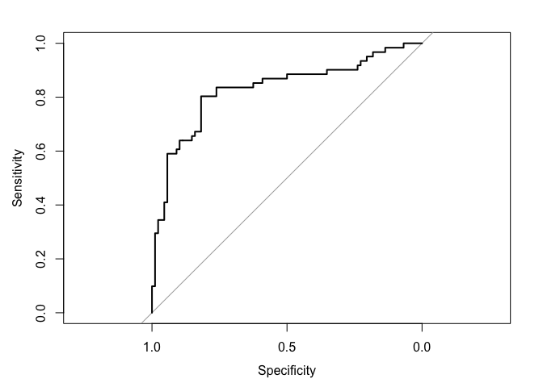

lab05
================
Tima
5/1/2019

This is an [R Markdown](http://rmarkdown.rstudio.com) Notebook. The code is placed in "chunks" to allow clear delimination between text and code. When you execute code within the notebook, the results appear beneath the code. To execute a chunk, click the *Run* button within the chunk or by placing your cursor inside it and pressing *Ctrl+Shift+Enter*.

You can add a new chunk by clicking the *Insert Chunk* button on the toolbar or by pressing *Ctrl+Alt+I*.

When you save the notebook, an HTML file containing the code and output will be saved alongside it (click the *Preview* button or press *Ctrl+Shift+K* to preview the HTML file).

You can do your full assignment in this notebook. Then, please save it as an HTML file when you are done.

In this assignment, you will learn about the various Tree based models. As mentioned, Tree based models are a type of Machine Learning. They come to us from the field of computer science. They have some nice advantages:

-   They provide a (usually) simple and easy to interpret display of the results that mimics human decision making (think decision trees).
-   They are quite adept at detecting the optimum break points for nonlinear variables.
-   They are inherantly good at picking up multi layered "dependencies" that we call interaction terms.
-   Though the original tree is usually not very predictive, when trees are combined with boosting, bagging and decorrelation techniques they often are a top performing technique.

We are now in the world of predictive modelling. Our focus now is brute force prediction. In this world, even minor seeming improvements in predictive accuracy are important: they can translate into lives saved, millions earned, careers transformed. Every decimal counts for the person at the margin.

We will be using the Titanic data.

We are going to see if we can outdo logistic regression results. So we will start with logistic regression as our base model. But this is no "strawman." Logistic regression is a powerful technique that can often rise to the top. This method can be used for any problems that logistic regression takes on. You can use this method to predict any binary outcome.

So lets get started. First, lets load the required libraries and don't forget to set your working directory. To run this code, press the little arrow in the upper right corner. We'll load some tree packages as well as the caret package which is commonly used for cross validation.

``` r
library(Rcpp)
library(tree)
library(randomForest)
library(e1071)
library(caret)
library(pROC)
library(rpart)
options(scipen = 999)
library(rpart.plot)
library(rattle)

logisticPseudoR2s <- function(LogModel) {
    dev <- LogModel$deviance
    nullDev <- LogModel$null.deviance
    modelN <- length(LogModel$fitted.values)
    R.l <- 1 - dev/nullDev
    R.cs <- 1 - exp(-(nullDev - dev)/modelN)
    R.n <- R.cs/(1 - (exp(-(nullDev/modelN))))
    cat("Pseudo R^2 for Logistic Regression\n")
    cat("Hotitanicer and Lemeshow R^2 ", round(R.l, 3), "\n")
    cat("Cox and Snell R^2       ", round(R.cs, 3), "\n")
    cat("Nagelkerke R^2          ", round(R.n, 3), "\n")
}
```

### Loading and cleaning the data

Now you're ready to load the data. It will require some cleaning up (like getting rid of NAs), but I will help you with that in the code.

Be careful to set the proper directory where you saved the titanic data on line *77*

``` r
# First, as always, set your working directory.

# Next, load the data. This can be one of two ways, manually, or running the
# following code.  Note: the following line of code only works if the file
# is located in your working directory.
train_set <- read.csv("/Users/timaalqabandi/Dropbox/NSSR/2019 Spring/Advanced Quant - TA/Labs/lab05/train_set.csv")

# Let's remove NAs. We are also going to copy the dataset and name that new
# copy 'titanic'.
titanic <- train_set
titanic <- na.omit(titanic)
attach(titanic)  # Here, we are 'attaching' the dataset into Rstudio. This means that whenever you want to do something with the data, such as referring to a column you can simply write columnname instead of titanic$columnname. 

# Your data is loaded.  View(titanic)

# Let's create an object, 'Survived_value' and merge it into our dataset.
Survived_value = ifelse(Survived == 0, "No", "Yes")
titanic = data.frame(titanic, Survived_value)
# Your 'titanic' data should include this 'Survived_value' now.
```

### Now lets fire up a logistic regression model.

``` r
# LOGISTIC MODEL -------------------------

# (1) Create Model This model checks for a small child, a female, and the
# fare paid.

titanic_final <- glm(Survived ~ Pclass + Sex + Age + SibSp + Parch + Fare + 
    Embarked, family = binomial, data = titanic)
summary(titanic_final)
```

    ## 
    ## Call:
    ## glm(formula = Survived ~ Pclass + Sex + Age + SibSp + Parch + 
    ##     Fare + Embarked, family = binomial, data = titanic)
    ## 
    ## Deviance Residuals: 
    ##     Min       1Q   Median       3Q      Max  
    ## -2.5837  -0.6695  -0.3952   0.6442   2.3846  
    ## 
    ## Coefficients:
    ##              Estimate Std. Error z value             Pr(>|z|)    
    ## (Intercept)  5.483673   0.702580   7.805  0.00000000000000595 ***
    ## Pclass      -1.214531   0.185243  -6.556  0.00000000005511456 ***
    ## Sexmale     -2.603977   0.247076 -10.539 < 0.0000000000000002 ***
    ## Age         -0.038962   0.009081  -4.290  0.00001783719114240 ***
    ## SibSp       -0.318050   0.139015  -2.288               0.0221 *  
    ## Parch       -0.142080   0.142803  -0.995               0.3198    
    ## Fare        -0.000149   0.002847  -0.052               0.9583    
    ## EmbarkedQ   -0.400534   0.653576  -0.613               0.5400    
    ## EmbarkedS   -0.264843   0.298933  -0.886               0.3756    
    ## ---
    ## Signif. codes:  0 '***' 0.001 '**' 0.01 '*' 0.05 '.' 0.1 ' ' 1
    ## 
    ## (Dispersion parameter for binomial family taken to be 1)
    ## 
    ##     Null deviance: 762.58  on 563  degrees of freedom
    ## Residual deviance: 513.22  on 555  degrees of freedom
    ## AIC: 531.22
    ## 
    ## Number of Fisher Scoring iterations: 5

``` r
# (2) Run Diagnostics

exp(coef(titanic_final))
```

    ##  (Intercept)       Pclass      Sexmale          Age        SibSp 
    ## 240.72921023   0.29684919   0.07397878   0.96178714   0.72756612 
    ##        Parch         Fare    EmbarkedQ    EmbarkedS 
    ##   0.86755140   0.99985103   0.66996193   0.76732669

``` r
logisticPseudoR2s(titanic_final)
```

    ## Pseudo R^2 for Logistic Regression
    ## Hotitanicer and Lemeshow R^2  0.327 
    ## Cox and Snell R^2        0.357 
    ## Nagelkerke R^2           0.482

``` r
# (3) Insert model probability into our dataset

prob_final = predict(titanic_final, type = "response")
titanic$prob_final <- prob_final

quantile(titanic$prob_final)
```

    ##         0%        25%        50%        75%       100% 
    ## 0.01960029 0.12778396 0.32238587 0.68800972 0.97054600

``` r
# (4) Predict 'Survived' or 'Died' based on model

pred_final = rep("No", 564)  # Creates a vector of 564 'Died' elements. We get 564 from our dataset, it just refers to the total number of observations (i.e. rows) we have in the dataset.  
pred_final[titanic$prob_final > 0.5] = "Yes"  # Changes the 'Died' elements to 'Survived' if probability is above 0.5
# pred_final[1:40] # To inspect the first 40 rows of predictions.
titanic$pred_final <- pred_final

table(titanic$pred_final)
```

    ## 
    ##  No Yes 
    ## 355 209

``` r
table(pred_final, titanic$Survived_value)  # Confusion table that compares our prediction to the Survived that was reality
```

    ##           
    ## pred_final  No Yes
    ##        No  288  67
    ##        Yes  46 163

``` r
# Accuracy
table <- table(pred_final, titanic$Survived_value)
Accuracy <- sum(diag(table)/sum(table))
print(paste("Accuracy: ", Accuracy))
```

    ## [1] "Accuracy:  0.799645390070922"

``` r
# Calculate AUC and plot ROC curve
prob_log = predict(titanic_final, type = "response")
auc(titanic$Survived, prob_log)
```

    ## Area under the curve: 0.8532

``` r
plot(roc(titanic$Survived, prob_log))
```


In this space below (before the next code block), report the accuracy of this model and the area under the curve. These are two different criteria. Explain what they tell you. This will be your baseline that we'll try to improve with the tree models. Also, please describe the coeffecients in the model (what significant and what is the nature of the relationships?)

Insert Answer in the space above. Then, lets now move on to the next step. We will build a simple "starter" tree.

``` r
# TREE GROWTH -------------------------

# (1) Starter Tree Let's create a tree using all our data to get our feet
# wet.  This tree will not be tested, since we are leveraging all our data
# to create it.

starter_tree = rpart(Survived_value ~ Pclass + Sex + Age + SibSp + Parch + Fare + 
    Embarked, data = titanic, method = "class")
# summary(starter_tree)

# How many terminal nodes does this tree have?

fancyRpartPlot(starter_tree)
```


``` r
# Evaluate performance of the tree model.

# Insert model probability into our dataset

starter_tree_prob = predict(starter_tree, type = "prob")
titanic$starter_tree_prob <- starter_tree_prob


# Predict 'Survived' or 'Died' based on model

starter_tree_pred = rep("No", 564)  # Creates a vector of 564 'Died' elements. We get 564 from our dataset, it just refers to the total number of observations (i.e. rows) we have in the dataset.  
starter_tree_pred[titanic$prob_final > 0.5] = "Yes"  # Changes the 'Died' elements to 'Survived' if probability is above 0.5
# starter_tree_pred[1:40] # to inspect the first 40 rows of predictions.
titanic$starter_tree_pred <- starter_tree_pred

table(titanic$starter_tree_pred)
```

    ## 
    ##  No Yes 
    ## 355 209

``` r
table(starter_tree_pred, titanic$Survived_value)  # Confusion table that compares our prediction to the Survived that was reality
```

    ##                  
    ## starter_tree_pred  No Yes
    ##               No  288  67
    ##               Yes  46 163

``` r
# Accuracy
table <- table(starter_tree_pred, titanic$Survived_value)
Accuracy <- sum(diag(table)/sum(table))
print(paste("Accuracy: ", Accuracy))
```

    ## [1] "Accuracy:  0.799645390070922"

``` r
# Plotting ROC curve
starter_tree_prob = predict(starter_tree, type = "prob")
auc(titanic$Survived_value, starter_tree_prob[, 2])
```

    ## Area under the curve: 0.8775

``` r
plot(roc(titanic$Survived_value, starter_tree_prob[, 2]))
```


Using the lecture notes and the text, please explain what just happened. How does the tree work? How is it deciding which variables to split on and where to split. Please explain what is happening statistically. What is the significance (if any) of "sex" being the first split variable? For two of the leaves, describe the pathway of who ended up in the leaf. Open the output above in the "R console" view. Try to figure out how to interpret it. Which terminal node had the highest survival rate? Does it make sense based on what you know about the data? Which terminal node had the lowest survival rate?

Answer the question in the space above.

One of the flaws of the "entry level" decision tree is that they tend to "overfit" the data. At an extreme, they can memorize your dataset. In order to properly evaluate the performance of a classification tree on these data, we must estimate the test error rather than simply computing the training error.

To do that, we need to... (1) split observations into a training set and validation set for training, and a testing set to evaluate our model's performance on unseen data, (2) build the tree using the training set (3) evaluate its performance on the validation data, and tweak the model as we see fit, (4) then finally test its performance on our test set.

These steps play out below. As usual, we'll set a "seed" value. This is a way of drawing a random sample but ensuring that we get the same result every time. We do that so that we can replicate our results. We will define a train sample, where we will build our tree. But, critically, we will test the tree on a "fresh" test sample. This is the fundamental takeway from "out of sample prediction" which is one of key key contributions of modern data science.

``` r
# Split train/test first.

# we will put 80% of the data into our training set, and the remaining 20%
# into the test set.
set.seed(100)
trainIndex <- createDataPartition(titanic$Survived_value, p = 0.8, list = FALSE, 
    times = 1)
train_01 <- titanic[trainIndex, ]  # Creating our training set
test <- titanic[-trainIndex, ]  # creating our testing set

## Spliting our train set into a train and validation set.

# We will use 149 observations of the data as a validation set. and the
# remaining 303 observations as the training set.
set.seed(100)
trainIndex <- createDataPartition(train_01$Survived_value, p = 0.6681416, list = FALSE, 
    times = 1)
train_02 <- train_01[trainIndex, ]  # Creating our training set
val <- train_01[-trainIndex, ]  # creating our testing set
```

How many people are in the test sample? Does that make sense??

Answer above

Running our base model
======================

Before we go on to build our new less overfitting tree, we will first need to recreate the logistic model from above. But this time, we are going to test it on our validation set and then evaluate it's performance on the test set. This is because we are going to use this logistic model as a benchmark for comparison.

#### Logistic model version 2

``` r
# (1) Create Model This model checks for a small child, a female, and the
# fare paid.

lgs_regression <- glm(Survived_value ~ Pclass + Sex + Age + SibSp + Parch + 
    Fare + Embarked, family = binomial, data = train_02)
summary(lgs_regression)
```

    ## 
    ## Call:
    ## glm(formula = Survived_value ~ Pclass + Sex + Age + SibSp + Parch + 
    ##     Fare + Embarked, family = binomial, data = train_02)
    ## 
    ## Deviance Residuals: 
    ##     Min       1Q   Median       3Q      Max  
    ## -2.1999  -0.6171  -0.3587   0.5468   2.4878  
    ## 
    ## Coefficients:
    ##              Estimate Std. Error z value             Pr(>|z|)    
    ## (Intercept)  5.921920   1.077561   5.496         0.0000000389 ***
    ## Pclass      -1.376323   0.292336  -4.708         0.0000025014 ***
    ## Sexmale     -3.080084   0.363580  -8.472 < 0.0000000000000002 ***
    ## Age         -0.044565   0.012878  -3.461             0.000539 ***
    ## SibSp       -0.299355   0.201770  -1.484             0.137902    
    ## Parch       -0.083333   0.187085  -0.445             0.656009    
    ## Fare        -0.003493   0.006245  -0.559             0.575944    
    ## EmbarkedQ    1.001291   1.046661   0.957             0.338743    
    ## EmbarkedS    0.272449   0.423629   0.643             0.520140    
    ## ---
    ## Signif. codes:  0 '***' 0.001 '**' 0.01 '*' 0.05 '.' 0.1 ' ' 1
    ## 
    ## (Dispersion parameter for binomial family taken to be 1)
    ## 
    ##     Null deviance: 409.26  on 302  degrees of freedom
    ## Residual deviance: 255.35  on 294  degrees of freedom
    ## AIC: 273.35
    ## 
    ## Number of Fisher Scoring iterations: 5

``` r
# (2) Run Diagnostics

exp(coef(lgs_regression))
```

    ##  (Intercept)       Pclass      Sexmale          Age        SibSp 
    ## 373.12749652   0.25250538   0.04595538   0.95641300   0.74129584 
    ##        Parch         Fare    EmbarkedQ    EmbarkedS 
    ##   0.92004435   0.99651303   2.72179276   1.31317616

``` r
logisticPseudoR2s(lgs_regression)
```

    ## Pseudo R^2 for Logistic Regression
    ## Hotitanicer and Lemeshow R^2  0.376 
    ## Cox and Snell R^2        0.398 
    ## Nagelkerke R^2           0.538

``` r
# (3) Check model's performance on validation data. and insert probabilities
# into our validaiton set.

lgs_reg_prob = predict(lgs_regression, val, type = "response")
val$lgs_reg_prob <- lgs_reg_prob

quantile(val$lgs_reg_prob)
```

    ##         0%        25%        50%        75%       100% 
    ## 0.02485882 0.10632708 0.32199715 0.76784937 0.97617314

``` r
# (4) Predict 'Survived' or 'Died' based on model

lgs_reg_pred = rep("No", 149)  # Creates a vector of 149 'Died' elements. We get 149 from our validation dataset, it just refers to the total number of observations (i.e. rows) we have in the dataset.  
lgs_reg_pred[val$lgs_reg_prob > 0.5] = "Yes"  # Changes the 'Died' elements to 'Survived' if probability is above 0.5
# lgs_reg_pred[1:40] #to check the output for the first 40 rows.
val$lgs_reg_pred <- lgs_reg_pred

table(val$lgs_reg_pred)
```

    ## 
    ##  No Yes 
    ##  87  62

``` r
table(lgs_reg_pred, val$Survived_value)  # Confusion table that compares our prediction to the Survived that was reality
```

    ##             
    ## lgs_reg_pred No Yes
    ##          No  72  15
    ##          Yes 16  46

``` r
# Accuracy
table <- table(lgs_reg_pred, val$Survived_value)
Accuracy <- sum(diag(table)/sum(table))
print(paste("Accuracy: ", Accuracy))
```

    ## [1] "Accuracy:  0.791946308724832"

``` r
# Calculate AUC and plot ROC curve lgs_reg_prob = predict(lgs_regression,
# val, type='response')
auc(val$Survived_value, lgs_reg_prob)
```

    ## Area under the curve: 0.8292

``` r
plot(roc(val$Survived_value, lgs_reg_prob))
```



Now lets look at the performance of the tree we created previously, on our validation data.

``` r
# Create tree from training data (subset = 'train')
tree_train = rpart(Survived_value ~ Pclass + Sex + Age + SibSp + Parch + Fare + 
    Embarked, data = train_02, method = "class")
# summary(tree_train)

# plot the tree
fancyRpartPlot(tree_train)
```


``` r
# Evaluate performance on new data ('test')
train_pred = predict(tree_train, val, type = "class")
confusionMatrix(train_pred, val$Survived_value, positive = "Yes")
```

    ## Confusion Matrix and Statistics
    ## 
    ##           Reference
    ## Prediction No Yes
    ##        No  77  23
    ##        Yes 11  38
    ##                                          
    ##                Accuracy : 0.7718         
    ##                  95% CI : (0.696, 0.8365)
    ##     No Information Rate : 0.5906         
    ##     P-Value [Acc > NIR] : 0.000002439    
    ##                                          
    ##                   Kappa : 0.5134         
    ##  Mcnemar's Test P-Value : 0.05923        
    ##                                          
    ##             Sensitivity : 0.6230         
    ##             Specificity : 0.8750         
    ##          Pos Pred Value : 0.7755         
    ##          Neg Pred Value : 0.7700         
    ##              Prevalence : 0.4094         
    ##          Detection Rate : 0.2550         
    ##    Detection Prevalence : 0.3289         
    ##       Balanced Accuracy : 0.7490         
    ##                                          
    ##        'Positive' Class : Yes            
    ## 

``` r
# Accuracy
table <- table(train_pred, val$Survived_value)
Accuracy <- sum(diag(table)/sum(table))
print(paste("Accuracy: ", Accuracy))
```

    ## [1] "Accuracy:  0.771812080536913"

``` r
# Plotting ROC curve
prob_train_tree = predict(tree_train, newdata = val, type = "prob")
auc(val$Survived_value, prob_train_tree[, 2])
```

    ## Area under the curve: 0.8287

``` r
plot(roc(val$Survived_value, prob_train_tree[, 2]))
```


Now, comment on the overall accuracy of this starter tree? How does it compare to the logistic regression? Comment on some of the other diagnostics. What does the "sensitivity" mean? What about "specificity"? Google to remind your self what these terms mean. See <https://www.theanalysisfactor.com/sensitivity-and-specificity/> or <https://www.med.emory.edu/EMAC/curriculum/diagnosis/sensand.htm>

Answer above

Notice the tree that was produced above. There are many branches and leaves. This is what we'd call a "bushy" tree. It is likely still overfitting the data. Let us therefore "prune" the tree to get a more reliable results Although you may think more nodes is better, that often means overfitting, leading to poor test performance. A smaller tree with fewer splits could lead to better test results. This is achieved by pruning the tree.

To prune this tree, we will use the function printcp() and will look at the `xerror` column specifically. We want the smallest xerror value (which stands for cross-validated error.)

``` r
printcp(tree_train)
```

    ## 
    ## Classification tree:
    ## rpart(formula = Survived_value ~ Pclass + Sex + Age + SibSp + 
    ##     Parch + Fare + Embarked, data = train_02, method = "class")
    ## 
    ## Variables actually used in tree construction:
    ## [1] Age    Fare   Pclass Sex   
    ## 
    ## Root node error: 123/303 = 0.40594
    ## 
    ## n= 303 
    ## 
    ##         CP nsplit rel error  xerror     xstd
    ## 1 0.528455      0   1.00000 1.00000 0.069496
    ## 2 0.024390      1   0.47154 0.47154 0.055676
    ## 3 0.012195      4   0.39837 0.47154 0.055676
    ## 4 0.010000      6   0.37398 0.43089 0.053763

The plot below shows us that error rises as we split the data. And the function below that gives us the number of splits for the smallest xerror.

``` r
plotcp(tree_train)
```


``` r
tree_train$cptable[which.min(tree_train$cptable[, "xerror"]), c("CP", "nsplit")]
```

    ##     CP nsplit 
    ##   0.01   6.00

It just so happens, with our dataset and our dependent variable, that the smallest xerror happens to involve 6 splits. Which is actually the number of splits that our tree was split into.

With that said, however, for learning purposes, I will show you what you would do to prune the tree using the smallest xerror. All you would have to do is runthe chunk below. It does it automatically for us.

``` r
prune_tree_train <- rpart::prune(tree_train, cp = tree_train$cptable[which.min(tree_train$cptable[, 
    "xerror"]), "CP"])

fancyRpartPlot(prune_tree_train, main = "Pruned Classification Tree")  # notice that it just reproduces the same tree we created above.  
```


After pruning a tree, we would check to see if it performed better than the unpruned version. To do this, we would create predictions based on the pruned tree and compare the confusion matrix to the one we created above. (Again, this will not output anything different that the unpruned tree, since they are the same. I just wanted to give you the code in case you wanted to do some exploring of your own.)

``` r
# Evaluate pruned performance on some 'new'' data ('val')

pruned_train_pred = predict(prune_tree_train, val, type = "class")
confusionMatrix(pruned_train_pred, val$Survived_value, positive = "Yes")
```

    ## Confusion Matrix and Statistics
    ## 
    ##           Reference
    ## Prediction No Yes
    ##        No  77  23
    ##        Yes 11  38
    ##                                          
    ##                Accuracy : 0.7718         
    ##                  95% CI : (0.696, 0.8365)
    ##     No Information Rate : 0.5906         
    ##     P-Value [Acc > NIR] : 0.000002439    
    ##                                          
    ##                   Kappa : 0.5134         
    ##  Mcnemar's Test P-Value : 0.05923        
    ##                                          
    ##             Sensitivity : 0.6230         
    ##             Specificity : 0.8750         
    ##          Pos Pred Value : 0.7755         
    ##          Neg Pred Value : 0.7700         
    ##              Prevalence : 0.4094         
    ##          Detection Rate : 0.2550         
    ##    Detection Prevalence : 0.3289         
    ##       Balanced Accuracy : 0.7490         
    ##                                          
    ##        'Positive' Class : Yes            
    ## 

Looking at your text, the notes or the web explain some of the pruning options that we choose above and explain how pruning works.

Answer above.

So far we've seen only minor improvements. The concepts of bagging, boosting and random forests are designed to turn trees from mediocre predictors into top rate algorithms.

BAGGING -------------------------
=================================

Bagging is our introduction to the concept of random forests. To apply bagging to classification/regression trees, we bootstrap the training sets and average the resulting predictions. The code looks very similar to random forests, but we set `mtry` to the number of actual predictors, instead of a subset of predictors (which is what we do in random forests).

We will be using the `caret` package for this. Caret is a really cool easy-to-understand machine learning package on R. You can read more about it here: <http://topepo.github.io/caret/>.

In order to create a bagged model (and for the rest of the ensemble methods to follow), we need to set some parameters to run. One of those is cross-validation. This will help us get better prediction results.

``` r
fitControl <- trainControl(## 5-fold CV
                           method = "repeatedcv",
                           number = 5,
                           ## repeated 5 times
                           repeats = 5)
```

Next, we need to define our X and our Y.

Defining X:

``` r
predictors = c("Pclass", "Sex", "Age", "SibSp", "Parch", "Fare", "Embarked")
x <- train_02[, (names(train_02) %in% predictors)]
y = train_02$Survived_value
```

#### Building our bagged model

``` r
set.seed(1)
bag_model <- caret::train(x, y, method = "rf", trControl = fitControl, tuneGrid = expand.grid(mtry = 7)  # The total number of predictors we put into our model
)
# bag_model

# Let's make predictions with the val set of data.
pred_bag = predict(bag_model, newdata = val)
confusionMatrix(pred_bag, val$Survived_value, positive = "Yes")
```

    ## Confusion Matrix and Statistics
    ## 
    ##           Reference
    ## Prediction No Yes
    ##        No  74  20
    ##        Yes 14  41
    ##                                          
    ##                Accuracy : 0.7718         
    ##                  95% CI : (0.696, 0.8365)
    ##     No Information Rate : 0.5906         
    ##     P-Value [Acc > NIR] : 0.000002439    
    ##                                          
    ##                   Kappa : 0.5209         
    ##  Mcnemar's Test P-Value : 0.3912         
    ##                                          
    ##             Sensitivity : 0.6721         
    ##             Specificity : 0.8409         
    ##          Pos Pred Value : 0.7455         
    ##          Neg Pred Value : 0.7872         
    ##              Prevalence : 0.4094         
    ##          Detection Rate : 0.2752         
    ##    Detection Prevalence : 0.3691         
    ##       Balanced Accuracy : 0.7565         
    ##                                          
    ##        'Positive' Class : Yes            
    ## 

``` r
# Accuracy
table <- table(pred_bag, val$Survived_value)
Accuracy <- sum(diag(table)/sum(table))
print(paste("Accuracy: ", Accuracy))
```

    ## [1] "Accuracy:  0.771812080536913"

``` r
# Plotting ROC curve
prob_bag = predict(bag_model, newdata = val, type = "prob")
auc(val$Survived_value, prob_bag[, 2])
```

    ## Area under the curve: 0.8225

``` r
plot(roc(val$Survived_value, prob_bag[, 2]))
```


``` r
# Did bagging improve the accuracy?
```

Did bagging improve the accuracy?

Answer above.

#### Building a random forest model

To really get a boost, we will run a random forest. The key insight of random forests is similar to the key insight of portfolio diversification theory in finance. By "decorrelating" the decision trees we have a better chance of having a better solution. To accomplish this, random forests combining bagging (that is running lots of trees on bootstrap samples) with a decorrelation. At each branch, a typical random forest will only consider the square root of the variable set. For example, if you have 36 predictors, at each node, the procedure will consider only 6 of the variables for the optimal split. Lets see how this goes:

``` r
# RANDOM FOREST ------------------------- Now we will limit the number of
# predictors allowed using mtry Let's set it to sqrt(7) predictors and
# examine our results.

set.seed(1)
rf_model <- caret::train(x, y, method = "rf", trControl = fitControl, tuneGrid = expand.grid(mtry = sqrt(7))  # The total number of predictors we put into our model
)
# rf_model

# Let's make predictions with the validation set of data.
pred_rf = predict(rf_model, newdata = val)
confusionMatrix(pred_rf, val$Survived_value, positive = "Yes")
```

    ## Confusion Matrix and Statistics
    ## 
    ##           Reference
    ## Prediction No Yes
    ##        No  77  19
    ##        Yes 11  42
    ##                                           
    ##                Accuracy : 0.7987          
    ##                  95% CI : (0.7252, 0.8598)
    ##     No Information Rate : 0.5906          
    ##     P-Value [Acc > NIR] : 0.00000005604   
    ##                                           
    ##                   Kappa : 0.5751          
    ##  Mcnemar's Test P-Value : 0.2012          
    ##                                           
    ##             Sensitivity : 0.6885          
    ##             Specificity : 0.8750          
    ##          Pos Pred Value : 0.7925          
    ##          Neg Pred Value : 0.8021          
    ##              Prevalence : 0.4094          
    ##          Detection Rate : 0.2819          
    ##    Detection Prevalence : 0.3557          
    ##       Balanced Accuracy : 0.7818          
    ##                                           
    ##        'Positive' Class : Yes             
    ## 

``` r
plot(pred_rf, val$Survived_value)
```


``` r
# Accuracy
table <- table(pred_rf, val$Survived_value)
Accuracy <- sum(diag(table)/sum(table))
print(paste("Accuracy: ", Accuracy))
```

    ## [1] "Accuracy:  0.798657718120805"

``` r
# Plotting ROC curve
prob_rf = predict(rf_model, newdata = val, type = "prob")
auc(val$Survived_value, prob_rf[, 2])
```

    ## Area under the curve: 0.8342

``` r
plot(roc(val$Survived_value, prob_rf[, 2]))
```


Did the accuracy improve?? Please explain how bagging, boosting and random forests improve prediction. Use the text and your notes to explain.

Answer above.

We are now into the world of "black box" machine learning algorithms. We get a good prediction, but we are now using hundreds of trees on random subsets of variables to get this improvement. This is the price we pay for better predictions, but it is a big deal. Again, better predictions means fewer children with lead poisoning, fewer people unjustifiably incarcerated or misdiagnosed. But random forests do come with a nice tool for understanding what is driving the predictions. This is called the variable importance measure. We'll run it below.

``` r
# Examine the importance of each variable. What is your analysis?
varImp(rf_model)  # variable importance for random forest model
```

    ## rf variable importance
    ## 
    ##           Overall
    ## Sex      100.0000
    ## Fare      63.4537
    ## Age       58.9782
    ## Pclass    18.6175
    ## SibSp      7.6792
    ## Parch      0.1817
    ## Embarked   0.0000

``` r
varImp(bag_model)  # variable importance for bagged model  
```

    ## rf variable importance
    ## 
    ##          Overall
    ## Sex      100.000
    ## Age       59.810
    ## Fare      54.999
    ## Pclass    24.163
    ## SibSp      9.762
    ## Embarked   3.611
    ## Parch      0.000

Interpret the output above. Any surprises? Do the results seem intutitive? using the book as a guide, explain how the variable importance statisics are derived.

Answer above.

Choose your "best" model and run on the Test data
=================================================

Choose whichever model you prefer best. Note that the term "best" here is used loosely, so feel free to determine how to define it and explain your reasons below.

To illustrate, I chose the random forest model, because of its AUC score.

``` r
test_pred_rf = predict(rf_model, newdata = test)
confusionMatrix(test_pred_rf, test$Survived_value, positive = "Yes")
```

    ## Confusion Matrix and Statistics
    ## 
    ##           Reference
    ## Prediction No Yes
    ##        No  53  15
    ##        Yes 13  31
    ##                                          
    ##                Accuracy : 0.75           
    ##                  95% CI : (0.6593, 0.827)
    ##     No Information Rate : 0.5893         
    ##     P-Value [Acc > NIR] : 0.0002763      
    ##                                          
    ##                   Kappa : 0.4801         
    ##  Mcnemar's Test P-Value : 0.8501067      
    ##                                          
    ##             Sensitivity : 0.6739         
    ##             Specificity : 0.8030         
    ##          Pos Pred Value : 0.7045         
    ##          Neg Pred Value : 0.7794         
    ##              Prevalence : 0.4107         
    ##          Detection Rate : 0.2768         
    ##    Detection Prevalence : 0.3929         
    ##       Balanced Accuracy : 0.7385         
    ##                                          
    ##        'Positive' Class : Yes            
    ## 

``` r
# dev.off();
table(test_pred_rf, test$Survived_value)
```

    ##             
    ## test_pred_rf No Yes
    ##          No  53  15
    ##          Yes 13  31

``` r
# Accuracy
table <- table(test_pred_rf, test$Survived_value)
Accuracy <- sum(diag(table)/sum(table))
print(paste("Accuracy: ", Accuracy))
```

    ## [1] "Accuracy:  0.75"

``` r
# Plotting ROC curve
prob_rf = predict(rf_model, newdata = test, type = "prob")
auc(test$Survived_value, prob_rf[, 2])
```

    ## Area under the curve: 0.7902

``` r
plot(roc(test$Survived_value, prob_rf[, 2]))
```


ADVANCED EXTENSIONS -------------------------
=============================================

1.  change the \# of trees using ntree. First run with 2 trees, then with 25, then with 2500 trees then with 25,000 trees (this will take a few minutes to run depending on the power of your system). What happens to the accuracy at each step?

Report your findings above.

``` r
bag_ext = randomForest(Survived_value ~ Pclass + Sex + Age + SibSp + Parch + 
    Fare + Embarked, data = train_02, mtry = 7, ntree = 25000)  # Adjust this last parameter.

pred_ext_bag = predict(bag_ext, newdata = test)
confusionMatrix(pred_ext_bag, test$Survived_value, positive = "Yes")
```

    ## Confusion Matrix and Statistics
    ## 
    ##           Reference
    ## Prediction No Yes
    ##        No  52  17
    ##        Yes 14  29
    ##                                           
    ##                Accuracy : 0.7232          
    ##                  95% CI : (0.6307, 0.8036)
    ##     No Information Rate : 0.5893          
    ##     P-Value [Acc > NIR] : 0.002246        
    ##                                           
    ##                   Kappa : 0.4225          
    ##  Mcnemar's Test P-Value : 0.719438        
    ##                                           
    ##             Sensitivity : 0.6304          
    ##             Specificity : 0.7879          
    ##          Pos Pred Value : 0.6744          
    ##          Neg Pred Value : 0.7536          
    ##              Prevalence : 0.4107          
    ##          Detection Rate : 0.2589          
    ##    Detection Prevalence : 0.3839          
    ##       Balanced Accuracy : 0.7092          
    ##                                           
    ##        'Positive' Class : Yes             
    ## 

``` r
# dev.off();
table(pred_ext_bag, test$Survived_value)
```

    ##             
    ## pred_ext_bag No Yes
    ##          No  52  17
    ##          Yes 14  29

1.  Change the number of predictors allowed in the random forest growth. Report on whether it changed the prediction accuracy. First use Mtry=4, then 6. Note, if you did the rattle plot above you need to now unintall the rattle package. Why do you think the accuracy is actually better when you try fewer variables? (think about the concept of decorrelation)

Report on your results above

``` r
# How are the results different when mtry is 4?
set.seed(1)
rf_model_4 <- caret::train(x, y, method = "rf", trControl = fitControl, tuneGrid = expand.grid(mtry = 4)  # The total number of predictors we put into our model
)
rf_model_4
```

    ## Random Forest 
    ## 
    ## 303 samples
    ##   7 predictor
    ##   2 classes: 'No', 'Yes' 
    ## 
    ## No pre-processing
    ## Resampling: Cross-Validated (5 fold, repeated 5 times) 
    ## Summary of sample sizes: 242, 243, 243, 242, 242, 242, ... 
    ## Resampling results:
    ## 
    ##   Accuracy   Kappa    
    ##   0.7921858  0.5613851
    ## 
    ## Tuning parameter 'mtry' was held constant at a value of 4

``` r
pred_rf_4 = predict(rf_model_4, newdata = test)
confusionMatrix(pred_rf_4, test$Survived_value, positive = "Yes")
```

    ## Confusion Matrix and Statistics
    ## 
    ##           Reference
    ## Prediction No Yes
    ##        No  53  16
    ##        Yes 13  30
    ##                                           
    ##                Accuracy : 0.7411          
    ##                  95% CI : (0.6497, 0.8192)
    ##     No Information Rate : 0.5893          
    ##     P-Value [Acc > NIR] : 0.0005801       
    ##                                           
    ##                   Kappa : 0.4597          
    ##  Mcnemar's Test P-Value : 0.7103466       
    ##                                           
    ##             Sensitivity : 0.6522          
    ##             Specificity : 0.8030          
    ##          Pos Pred Value : 0.6977          
    ##          Neg Pred Value : 0.7681          
    ##              Prevalence : 0.4107          
    ##          Detection Rate : 0.2679          
    ##    Detection Prevalence : 0.3839          
    ##       Balanced Accuracy : 0.7276          
    ##                                           
    ##        'Positive' Class : Yes             
    ## 

``` r
table <- table(pred_rf_4, test$Survived_value)
Accuracy <- sum(diag(table)/sum(table))
print(paste("Accuracy: ", Accuracy))
```

    ## [1] "Accuracy:  0.741071428571429"

``` r
varImp(rf_model_4)
```

    ## rf variable importance
    ## 
    ##          Overall
    ## Sex      100.000
    ## Fare      65.824
    ## Age       62.372
    ## Pclass    20.382
    ## SibSp      7.721
    ## Embarked   1.398
    ## Parch      0.000

``` r
# How are the results different when mtry is 6?
set.seed(1)
rf_model_6 <- caret::train(x, y, method = "rf", trControl = fitControl, tuneGrid = expand.grid(mtry = 6)  # The total number of predictors we put into our model
)
rf_model_6
```

    ## Random Forest 
    ## 
    ## 303 samples
    ##   7 predictor
    ##   2 classes: 'No', 'Yes' 
    ## 
    ## No pre-processing
    ## Resampling: Cross-Validated (5 fold, repeated 5 times) 
    ## Summary of sample sizes: 242, 243, 243, 242, 242, 242, ... 
    ## Resampling results:
    ## 
    ##   Accuracy  Kappa   
    ##   0.786929  0.552199
    ## 
    ## Tuning parameter 'mtry' was held constant at a value of 6

``` r
pred_rf_6 = predict(rf_model_6, newdata = test)
confusionMatrix(pred_rf_6, test$Survived_value, positive = "Yes")
```

    ## Confusion Matrix and Statistics
    ## 
    ##           Reference
    ## Prediction No Yes
    ##        No  52  17
    ##        Yes 14  29
    ##                                           
    ##                Accuracy : 0.7232          
    ##                  95% CI : (0.6307, 0.8036)
    ##     No Information Rate : 0.5893          
    ##     P-Value [Acc > NIR] : 0.002246        
    ##                                           
    ##                   Kappa : 0.4225          
    ##  Mcnemar's Test P-Value : 0.719438        
    ##                                           
    ##             Sensitivity : 0.6304          
    ##             Specificity : 0.7879          
    ##          Pos Pred Value : 0.6744          
    ##          Neg Pred Value : 0.7536          
    ##              Prevalence : 0.4107          
    ##          Detection Rate : 0.2589          
    ##    Detection Prevalence : 0.3839          
    ##       Balanced Accuracy : 0.7092          
    ##                                           
    ##        'Positive' Class : Yes             
    ## 

``` r
table <- table(pred_rf_6, test$Survived_value)
Accuracy <- sum(diag(table)/sum(table))
print(paste("Accuracy: ", Accuracy))
```

    ## [1] "Accuracy:  0.723214285714286"

``` r
varImp(rf_model_6)
```

    ## rf variable importance
    ## 
    ##          Overall
    ## Sex      100.000
    ## Age       61.665
    ## Fare      60.426
    ## Pclass    21.764
    ## SibSp      8.374
    ## Embarked   2.269
    ## Parch      0.000

1.  We will now try an advanced method called *boosting.* This is a sequential process where the model slowly "hones in" on cases that it is having trouble predicting. Look at the notes and the text and first note if boosting improved things and then explain a little more about how it works. Interpret all of the output.

Summarize above.

``` r
# (3) Boosting

# install.packages('gbm')
library(gbm)
set.seed(1)

boost_model = caret::train(x, y, method = "gbm", trControl = fitControl, tuneGrid = expand.grid(interaction.depth = 3, 
    n.minobsinnode = 10, n.trees = 5000, shrinkage = 0.001), verbose = FALSE)
summary(boost_model)
```


    ##               var    rel.inf
    ## Sex           Sex 47.0878528
    ## Pclass     Pclass 16.9586205
    ## Age           Age 16.5493251
    ## Fare         Fare 14.6027215
    ## SibSp       SibSp  2.6169851
    ## Embarked Embarked  1.3482260
    ## Parch       Parch  0.8362691

``` r
boost_model
```

    ## Stochastic Gradient Boosting 
    ## 
    ## 303 samples
    ##   7 predictor
    ##   2 classes: 'No', 'Yes' 
    ## 
    ## No pre-processing
    ## Resampling: Cross-Validated (5 fold, repeated 5 times) 
    ## Summary of sample sizes: 242, 243, 243, 242, 242, 242, ... 
    ## Resampling results:
    ## 
    ##   Accuracy   Kappa    
    ##   0.8007104  0.5769071
    ## 
    ## Tuning parameter 'n.trees' was held constant at a value of 5000
    ##  3
    ## Tuning parameter 'shrinkage' was held constant at a value of
    ##  0.001
    ## Tuning parameter 'n.minobsinnode' was held constant at a value of 10

``` r
prob_boost <- predict(boost_model, newdata = test, type = "prob")
# prob_boost


HighWelf_boost_results <- rep("No", 112)
HighWelf_boost_results[test$Survived_value == "Yes"] = "Yes"
# HighWelf_boost_results
pred_boost = rep("No", 112)
pred_boost[prob_boost$Yes > 0.5] = "Yes"  # > 0.5 is the threshold. feel free to change and report your findings.
# pred_boost

table(pred_boost, HighWelf_boost_results)
```

    ##           HighWelf_boost_results
    ## pred_boost No Yes
    ##        No  57  17
    ##        Yes  9  29
